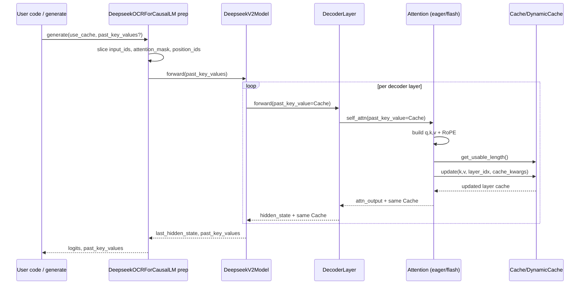

**Purpose**
- Explain how DeepSeek-OCR builds, stores, and reuses the KV cache, and which classes own the lifecycle.

**Key Classes / Responsibilities**
- `transformers.cache_utils.Cache` / `DynamicCache`: owns storage and per-layer `update(...)`, `get_usable_length(...)`, `get_seq_length(...)`, and `to_legacy_cache()` methods. Populated and threaded through `past_key_values` in the forward/generation APIs.
- `DeepseekV2Attention` and `DeepseekV2FlashAttention2`: build K/V per token and call `past_key_value.update(...)` to append to cache (`models/deepseek-ocr/modeling_deepseekv2.py:884-902`, `1019-1042`). Rotary sin/cos are passed via `cache_kwargs`.
- `DeepseekV2Model`: accepts `past_key_values`, converts legacy tuples to `DynamicCache`, queries lengths for masking/position_ids, forwards the cache through layers, and returns the updated cache (`models/deepseek-ocr/modeling_deepseekv2.py:1525-1637`).
- `DeepseekV2ForCausalLM` and `DeepseekOCRForCausalLM`: expose `prepare_inputs_for_generation` that trims `input_ids`/`attention_mask` based on cache length and computes `cache_position` for continued decoding (`models/deepseek-ocr/modeling_deepseekv2.py:1675-1847`, `models/deepseek-ocr/modeling_deepseekocr.py:617-689`).
- `DeepseekOCRModel` wraps the base model but leaves KV handling unchanged; image embeddings are injected before delegating to `super().forward(..., past_key_values=...)` (`models/deepseek-ocr/modeling_deepseekocr.py:403-515`).

**Data Flow (who generates, who uses, who updates)**
- Generation: attention modules (`DeepseekV2Attention` / `DeepseekV2FlashAttention2`) generate K/V tensors every forward. With a cache present they call `Cache.update(...)` to append (`modeling_deepseekv2.py:884-902`, `1019-1042`). Rotary sin/cos are passed inside `cache_kwargs`.
- Carrier: `DeepseekV2Model` holds the cache object, asks it for lengths (`get_usable_length`), injects it into each decoder layer (`past_key_value` arg), and returns the updated cache to the caller (`modeling_deepseekv2.py:1525-1637`).
- Reuse: `DeepseekV2ForCausalLM.prepare_inputs_for_generation` (and the OCR mirror) slice `input_ids`/`attention_mask` based on `past_key_values`, recompute `position_ids`/`cache_position`, and pass the cache back into `DeepseekV2Model` for decode (`modeling_deepseekv2.py:1675-1847`, `modeling_deepseekocr.py:617-689`).
- Wrapper: `DeepseekOCRModel` does image feature injection, then calls `super().forward(..., past_key_values=...)`; it does not alter cache semantics (`modeling_deepseekocr.py:403-515`).

**Lifecycle: Prefill vs Decode**
- Prefill (no cache passed): attention layers generate K/V, `Cache.update` appends them, and the model returns `past_key_values`.
- Decode (cache passed): `prepare_inputs_for_generation` slices `input_ids` to only new tokens, updates `position_ids`/`cache_position`, and forward uses cached K/V to limit recomputation. `get_usable_length` sets the effective KV length for masks before the update.
- FlashAttention2 path stores full `key_states`/`value_states`; MLA eager path stores compressed K/V and positional keys. Both rely on the same `Cache` interface.

**Pseudocode: How KV Cache Is Created, Updated, and Used**

The real implementation is spread across several classes; the pseudocode below shows the *shape* of the logic without matching exact signatures.

1. **Model forward: creating or threading the cache**

```python
def deepseek_ocr_forward(
    input_ids,
    attention_mask,
    images=None,
    past_key_values=None,  # may be None on prefill
    use_cache: bool = False,
    **kwargs,
):
    # 1) Normalize past_key_values into a Cache/DynamicCache object.
    if use_cache:
        if past_key_values is None:
            # Prefill: start from an empty, layer-aware cache object.
            cache = DynamicCache()  # transformers.cache_utils
        elif isinstance(past_key_values, Cache):  # already a cache-like object
            cache = past_key_values
        else:
            # Legacy tuple-of-tuples → DynamicCache
            cache = DynamicCache.from_legacy_cache(past_key_values)
    else:
        cache = None

    # 2) Prepare embeddings (OCR wrapper injects image features here).
    hidden_states = self.embed_inputs(input_ids, images=images, **kwargs)

    # 3) Run decoder layers, threading the same cache instance.
    for layer_idx, decoder_layer in enumerate(self.layers):
        # Each layer sees the *same* cache object, which tracks per-layer K/V.
        hidden_states, cache = decoder_layer(
            hidden_states,
            attention_mask=attention_mask,
            past_key_value=cache if use_cache else None,
            layer_idx=layer_idx,
            use_cache=use_cache,
            **kwargs,
        )

    # 4) Convert back to whatever representation the caller expects.
    if use_cache and cache is not None:
        past_key_values_out = cache.to_legacy_cache()
    else:
        past_key_values_out = None

    return ModelOutput(
        last_hidden_state=hidden_states,
        past_key_values=past_key_values_out,
        # logits, etc…
    )
```

2. **Attention: using and updating the cache per layer**

```python
def deepseek_v2_attention_forward(
    hidden_states,            # [B, T_new, D]
    attention_mask=None,
    past_key_value: Cache | None = None,
    layer_idx: int = 0,
    cache_position=None,      # positions of new tokens
    **cache_kwargs,
):
    # 1) Project to Q, K, V for the *new* tokens.
    #    Shapes (conceptual): [B, T_new, H, d]
    query, key, value = self.project_qkv(hidden_states)

    if past_key_value is not None:
        # 2a) Determine how long the KV cache already is for this layer.
        #     This mirrors Cache.get_usable_length(...).
        kv_len_before = past_key_value.get_usable_length(layer_idx)  # S_prefill + K_cached

        # 2b) Append new K/V to the cache for this layer.
        #     Rotary / MLA-specific data is passed via cache_kwargs.
        past_key_value = past_key_value.update(
            key=key,
            value=value,
            layer_idx=layer_idx,
            cache_kwargs={"cache_position": cache_position, **cache_kwargs},
        )

        # 2c) Retrieve the *full* K/V for attention (old + new).
        key_states, value_states = past_key_value.get_key_value(layer_idx)
        # Effective KV length after update:
        kv_len_after = kv_len_before + key.shape[-2]  # T_new
    else:
        # Prefill without explicit cache object (rare, but conceptually):
        key_states, value_states = key, value
        kv_len_before = key.shape[-2]
        kv_len_after = kv_len_before

    # 3) Run attention over:
    #    - query length == T_new (decode) or S_prefill (prefill)
    #    - KV length == kv_len_before (for masks) / kv_len_after (for memory accounting)
    attn_output = flash_attention(
        query=query,
        key=key_states,
        value=value_states,
        attention_mask=attention_mask,
        kv_seq_len=kv_len_before,  # what masking logic sees
    )

    return attn_output, past_key_value
```

3. **`prepare_inputs_for_generation`: slicing inputs and computing positions**

```python
def prepare_inputs_for_generation(
    self,
    input_ids,
    past_key_values=None,
    attention_mask=None,
    use_cache: bool = True,
    **kwargs,
):
    # 1) If there is a cache, only feed *new* tokens.
    if past_key_values is not None and use_cache:
        # Cache may be a legacy tuple or a Cache/DynamicCache.
        cache = (
            past_key_values
            if isinstance(past_key_values, Cache)
            else DynamicCache.from_legacy_cache(past_key_values)
        )
        # Total sequence length (prefill + previous decode).
        past_len = cache.get_seq_length()  # e.g., S_prefill + K_cached

        # Slice input_ids down to just the new tokens.
        # HF logic is more nuanced (batch-aware); this is conceptual.
        input_ids = input_ids[:, past_len:]

        # 2) Update attention_mask and compute cache positions.
        if attention_mask is not None:
            attention_mask = attention_mask[:, : past_len + input_ids.size(1)]

        # Positions where new tokens will be written in the cache.
        cache_position = torch.arange(
            past_len,
            past_len + input_ids.size(1),
            device=input_ids.device,
        )
    else:
        cache = None
        cache_position = None

    # 3) Return a dict suitable for calling the core model.
    return {
        "input_ids": input_ids,
        "attention_mask": attention_mask,
        "past_key_values": cache,
        "cache_position": cache_position,
        "use_cache": use_cache,
        **kwargs,
    }
```

Taken together:

- **Prefill**:
  - `past_key_values=None` → `DynamicCache()` is created.
  - Attention layers call `get_usable_length()` (length of empty cache), then `update(...)` to append full-context K/V.
  - The model returns `past_key_values` pointing to the populated cache.
- **Decode**:
  - `prepare_inputs_for_generation`:
    - asks the cache for its current length (`get_seq_length()`),
    - slices `input_ids` to only new tokens,
    - sets `cache_position` for where those tokens will land in the cache.
  - During forward, each attention layer:
    - calls `get_usable_length()` to know `S_prefill + K_cached`,
    - runs attention with that KV length,
    - then calls `update(...)` to append K/V for the new tokens.

**Minimal Usage Snippet (prefill then decode)**
```python
# Prefill: build cache
with torch.no_grad(), torch.autocast("cuda", dtype=torch.bfloat16):
    prefill = model(
        input_ids=input_ids.cuda(),              # full prompt incl. <image> tokens
        attention_mask=attn_mask.cuda(),
        images=images,                            # only needed for prefill
        images_seq_mask=images_seq_mask.cuda(),
        images_spatial_crop=images_spatial_crop.cuda(),
        use_cache=True,
        return_dict=True,
    )
past_kv = prefill.past_key_values

# Decode: reuse cache, 1 token at a time
next_ids = input_ids[:, -1:].contiguous().cuda()
for _ in range(16):
    prepared = model.prepare_inputs_for_generation(
        next_ids,
        past_key_values=past_kv,
        attention_mask=attn_mask,
        use_cache=True,
    )
    with torch.no_grad(), torch.autocast("cuda", dtype=torch.bfloat16):
        out = model(**prepared, return_dict=True)
    logits = out.logits[:, -1, :]
    next_token = torch.argmax(logits, dim=-1)
    past_kv = out.past_key_values
    attn_mask = torch.cat([attn_mask, torch.ones_like(next_token[:, None])], dim=1)
    next_ids = next_token[:, None]
```

**Source Links**
- HF cache docs (describes `Cache`/`DynamicCache` semantics): https://huggingface.co/docs/transformers/main/en/kv_cache
- Hugging Face generation internals (cache trimming, position handling): https://huggingface.co/docs/transformers/main/en/generation_strategies#cached-past-key-values

**Mermaid UML – KV Cache Flow**

