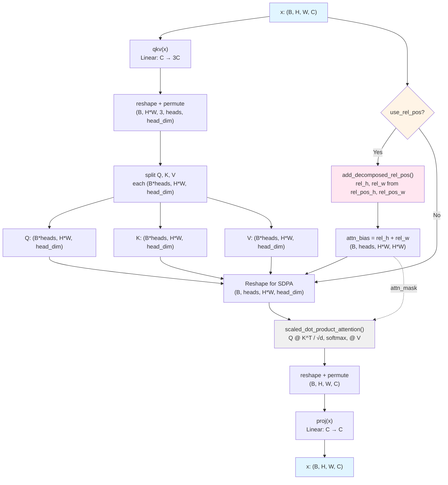

# Attention

## What It Is
`Attention` implements multi-head attention with 2D decomposed relative position embeddings for SAM's ViT encoder. Unlike standard attention, it:

1. **Uses 2D spatial structure**: Inputs are (B, H, W, C) not (B, S, C)
2. **Decomposes relative position bias**: Separate height and width embeddings (2D factorization)
3. **Supports variable resolutions**: Relative position tables are interpolated if input size changes
4. **Uses SDPA backend**: PyTorch's `scaled_dot_product_attention` with optional attention mask

This attention is used in both windowed (14×14) and global (64×64) modes within SAM's `Block` modules.

## Definition
```python
class Attention(nn.Module):
    def __init__(
        self,
        dim: int,
        num_heads: int = 8,
        qkv_bias: bool = True,
        use_rel_pos: bool = False,
        rel_pos_zero_init: bool = True,
        input_size: Optional[Tuple[int, int]] = None,
    ):
        super().__init__()
        self.num_heads = num_heads
        head_dim = dim // num_heads
        self.scale = head_dim**-0.5

        self.qkv = nn.Linear(dim, dim * 3, bias=qkv_bias)
        self.proj = nn.Linear(dim, dim)

        self.use_rel_pos = use_rel_pos
        if self.use_rel_pos:
            assert input_size is not None, "Input size must be provided for rel pos"
            # 2D decomposed relative position embeddings
            self.rel_pos_h = nn.Parameter(torch.zeros(2 * input_size[0] - 1, head_dim))
            self.rel_pos_w = nn.Parameter(torch.zeros(2 * input_size[1] - 1, head_dim))

    def forward(self, x: torch.Tensor) -> torch.Tensor:
        B, H, W, _ = x.shape
        # Project to Q, K, V
        qkv = self.qkv(x).reshape(B, H * W, 3, self.num_heads, -1).permute(2, 0, 3, 1, 4)
        q, k, v = qkv.reshape(3, B * self.num_heads, H * W, -1).unbind(0)

        # Compute 2D decomposed relative position bias
        rel_h, rel_w = None, None
        if self.use_rel_pos:
            rel_h, rel_w = add_decomposed_rel_pos(q, self.rel_pos_h, self.rel_pos_w, (H, W), (H, W))

        # Reshape for SDPA
        q = q.view(B, self.num_heads, H * W, -1)
        k = k.view(B, self.num_heads, H * W, -1)
        v = v.view(B, self.num_heads, H * W, -1)

        # Apply attention with relative position bias
        if self.use_rel_pos:
            rel_h = rel_h.view(B, self.num_heads, rel_h.size(1), rel_h.size(2), rel_h.size(3))
            rel_w = rel_w.view(B, self.num_heads, rel_w.size(1), rel_w.size(2), rel_w.size(3))
            attn_bias = (rel_h + rel_w).view(B, self.num_heads, rel_h.size(2), rel_h.size(3) * rel_w.size(4))
            x = torch.nn.functional.scaled_dot_product_attention(q, k, v, attn_mask=attn_bias)
        else:
            x = torch.nn.functional.scaled_dot_product_attention(q, k, v)

        x = x.view(B, self.num_heads, H, W, -1).permute(0, 2, 3, 1, 4).reshape(B, H, W, -1)
        x = self.proj(x)
        return x
```

## Constructor Information
**Location**: `models/deepseek-ocr/deepencoder.py:780-847`

**SAM-B config**:
- `dim=768`, `num_heads=12`, `head_dim=64`
- `qkv_bias=True`, `use_rel_pos=True`
- `input_size`: `(64, 64)` for global attention, `(14, 14)` for windowed

**Parameters**:
```
qkv: 768 × (768×3) = 768 × 2304 = 1,769,472 params
  bias: 2304 (if qkv_bias=True)
proj: 768 × 768 = 589,824 params
  bias: 768
Total core: 2,360,064 ≈ 2.36M

Relative position embeddings (if use_rel_pos=True):
  Global (64×64):
    rel_pos_h: (2×64-1) × 64 = 127 × 64 = 8,128 params
    rel_pos_w: (2×64-1) × 64 = 127 × 64 = 8,128 params
    Total: 16,256 ≈ 16K ≈ 32 KB at bf16

  Windowed (14×14):
    rel_pos_h: (2×14-1) × 64 = 27 × 64 = 1,728 params
    rel_pos_w: (2×14-1) × 64 = 27 × 64 = 1,728 params
    Total: 3,456 ≈ 3.5K ≈ 7 KB at bf16

Total per attention:
  - Global: 2,376,320 ≈ 2.38M ≈ 4.76 MB at bf16
  - Windowed: 2,363,520 ≈ 2.36M ≈ 4.73 MB at bf16
```

## Module Internals (Mermaid)



## Pseudo Code

```python
def forward(self, x: torch.Tensor) -> torch.Tensor:
    """
    Args:
        x: (B, H, W, C) spatial features
           Global: (1, 64, 64, 768)
           Windowed: (25, 14, 14, 768) for 25 windows

    Returns:
        output: (B, H, W, C) attended features
    """
    B, H, W, _ = x.shape
    S = H * W  # Sequence length (4096 for global, 196 for windowed)

    # 1. Project to Q, K, V
    qkv = self.qkv(x)  # (B, H, W, 3C)
    qkv = qkv.reshape(B, S, 3, self.num_heads, self.head_dim)  # (B, S, 3, 12, 64)
    qkv = qkv.permute(2, 0, 3, 1, 4)  # (3, B, 12, S, 64)

    # Split and reshape for multi-head processing
    q, k, v = qkv.reshape(3, B * self.num_heads, S, self.head_dim).unbind(0)
    # Each: (B*12, S, 64)

    # 2. Compute 2D decomposed relative position bias (if enabled)
    attn_bias = None
    if self.use_rel_pos:
        # Get relative position tables (interpolate if needed)
        # rel_pos_h: (2H-1, head_dim), rel_pos_w: (2W-1, head_dim)
        rel_h, rel_w = add_decomposed_rel_pos(
            q, self.rel_pos_h, self.rel_pos_w, (H, W), (H, W)
        )
        # rel_h: (B*heads, H*W, H, 1) - height bias
        # rel_w: (B*heads, H*W, 1, W) - width bias

        # Combine and reshape for attention mask
        rel_h = rel_h.view(B, self.num_heads, rel_h.size(1), rel_h.size(2), rel_h.size(3))
        rel_w = rel_w.view(B, self.num_heads, rel_w.size(1), rel_w.size(2), rel_w.size(3))
        attn_bias = (rel_h + rel_w).view(B, self.num_heads, S, S)
        # (B, 12, S, S) - added to attention scores

    # 3. Reshape for SDPA
    q = q.view(B, self.num_heads, S, self.head_dim)
    k = k.view(B, self.num_heads, S, self.head_dim)
    v = v.view(B, self.num_heads, S, self.head_dim)

    # 4. Scaled dot-product attention
    # scores = (Q @ K^T) / sqrt(head_dim) + attn_bias
    # attn = softmax(scores, dim=-1)
    # output = attn @ V
    x = torch.nn.functional.scaled_dot_product_attention(
        q, k, v, attn_mask=attn_bias
    )  # (B, 12, S, 64)

    # 5. Reshape to spatial and project
    x = x.view(B, self.num_heads, H, W, self.head_dim)
    x = x.permute(0, 2, 3, 1, 4)  # (B, H, W, 12, 64)
    x = x.reshape(B, H, W, self.dim)  # (B, H, W, 768)

    x = self.proj(x)  # (B, H, W, 768)

    return x
```

## FLOP Count

**Global attention** (B=1, H=64, W=64, S=4096, C=768, heads=12, head_dim=64):

```
1. QKV projection:
   FLOPs = 2 × B × S × C × 3C = 2 × 1 × 4096 × 768 × 2304
         = 14,512,742,400 ≈ 14.51 GFLOPs

2. Relative position bias computation (if use_rel_pos):
   get_rel_pos (height):
     - Interpolation (if needed): negligible for same size
     - Index lookup: memory ops, ~0 FLOPs

   add_decomposed_rel_pos:
     - einsum("bhwc,hkc->bhwk", r_q, Rh):
       FLOPs = B × H × W × head_dim × H × heads
             = 1 × 64 × 64 × 64 × 64 × 12 = 100,663,296 ≈ 0.10 GFLOPs
     - einsum("bhwc,wkc->bhwk", r_q, Rw):
       FLOPs = B × H × W × head_dim × W × heads
             = 1 × 64 × 64 × 64 × 64 × 12 = 100,663,296 ≈ 0.10 GFLOPs
     - Reshapes and views: memory ops, ~0 FLOPs
   Total rel-pos: 0.20 GFLOPs

3. Scaled dot-product attention:
   Q @ K^T:
     FLOPs = 2 × B × heads × S × S × head_dim
           = 2 × 1 × 12 × 4096 × 4096 × 64
           = 25,769,803,776 ≈ 25.77 GFLOPs

   Softmax:
     - Max reduction: B × heads × S × S = ~201 M ops
     - Exp + sum: 2 × B × heads × S × S = ~402 M ops
     Total: ~0.20 GFLOPs

   attn @ V:
     FLOPs = 2 × B × heads × S × S × head_dim
           = 2 × 1 × 12 × 4096 × 4096 × 64
           = 25,769,803,776 ≈ 25.77 GFLOPs

   Total SDPA: 51.74 GFLOPs

4. Output projection:
   FLOPs = 2 × B × S × C × C = 2 × 1 × 4096 × 768 × 768
         = 4,831,838,208 ≈ 4.83 GFLOPs

Total per global attention: 14.51 + 0.20 + 51.74 + 4.83 = 71.28 GFLOPs
```

**Windowed attention** (B=25 windows, H=14, W=14, S=196, C=768, heads=12, head_dim=64):

```
1. QKV projection:
   FLOPs = 2 × 25 × 196 × 768 × 2304
         = 17,418,240,000 ≈ 17.42 GFLOPs
   But this is for all 25 windows; per-window:
         = 696,729,600 ≈ 0.70 GFLOPs

2. Relative position bias (14×14):
   add_decomposed_rel_pos (per window):
     - einsum height: 1 × 14 × 14 × 64 × 14 × 12 = 2,107,392 ≈ 2.11 MFLOPs
     - einsum width: 1 × 14 × 14 × 64 × 14 × 12 = 2,107,392 ≈ 2.11 MFLOPs
   Total rel-pos per window: 4.22 MFLOPs
   All 25 windows: 0.11 GFLOPs

3. SDPA (per window):
   Q @ K^T: 2 × 1 × 12 × 196 × 196 × 64 = 58,982,400 ≈ 0.059 GFLOPs
   Softmax: ~0.5 MFLOPs
   attn @ V: 2 × 1 × 12 × 196 × 196 × 64 = 58,982,400 ≈ 0.059 GFLOPs
   Per window: 0.12 GFLOPs
   All 25 windows: 2.95 GFLOPs

4. Output projection:
   FLOPs = 2 × 25 × 196 × 768 × 768
         = 5,805,670,400 ≈ 5.81 GFLOPs

Total per windowed attention: 17.42 + 0.11 + 2.95 + 5.81 = 26.29 GFLOPs
```

**Efficiency comparison**:
- Global: 71.28 GFLOPs
- Windowed (25 windows of 14×14): 26.29 GFLOPs
- **Speedup: 2.71×** (windowed is 37% of global cost)

The quadratic scaling of attention (O(S²)) means windowing provides dramatic savings: 25×(14²) vs 64² gives 25×196 vs 4096, and (25×196²) << 4096².

## Memory Usage

**Parameters**: 4.76 MB (global) or 4.73 MB (windowed) as computed above

**Activations**:

Global attention (B=1, S=4096):
```
Input: 1 × 64 × 64 × 768 × 2 = 6.29 MB
qkv: 1 × 4096 × 2304 × 2 = 18.87 MB
Q, K, V (each): 1 × 12 × 4096 × 64 × 2 = 6.29 MB × 3 = 18.87 MB
Attention scores (Q@K^T): 1 × 12 × 4096 × 4096 × 4 = 805.31 MB (fp32)
Relative position bias: 1 × 12 × 4096 × 4096 × 4 = 805.31 MB (fp32)
  Note: SDPA may fuse attn_mask addition, reducing peak
Post-softmax attention: 1 × 12 × 4096 × 4096 × 4 = 805.31 MB
Output (attn@V): 1 × 12 × 4096 × 64 × 2 = 6.29 MB
Projected output: 1 × 4096 × 768 × 2 = 6.29 MB

Peak (without flash attention): ~850 MB (attention scores dominate)
Peak (with flash attention): ~50 MB (online softmax, no materialized scores)
```

Windowed attention (B=25, S=196 per window):
```
Input: 25 × 14 × 14 × 768 × 2 = 7.55 MB
qkv: 25 × 196 × 2304 × 2 = 22.58 MB
Q, K, V (each): 25 × 12 × 196 × 64 × 2 = 7.37 MB × 3 = 22.12 MB
Attention scores: 25 × 12 × 196 × 196 × 4 = 46.12 MB (fp32)
Relative position bias: 25 × 12 × 196 × 196 × 4 = 46.12 MB
Post-softmax: 25 × 12 × 196 × 196 × 4 = 46.12 MB
Output: 25 × 12 × 196 × 64 × 2 = 7.37 MB
Projected: 25 × 196 × 768 × 2 = 7.55 MB

Peak (without flash attention): ~90 MB
Peak (with flash attention): ~45 MB
```

**Memory efficiency**: Windowed attention uses ~11% of global attention memory (90 MB vs 850 MB without flash), making it critical for processing high-resolution feature maps.

## Related Modules
- **Used by**: `Block.attn` (all 12 SAM transformer blocks)
- **Related**:
  - `NoTPAttention` - CLIP-L's attention (simpler, no rel-pos, 1D sequence)
  - `DeepseekV2Attention` - LLM attention (MLA, RoPE, different architecture)
- **Helper functions**:
  - `add_decomposed_rel_pos()` - Computes 2D relative position bias
  - `get_rel_pos()` - Extracts/interpolates relative position embeddings
- **Contains**:
  - `nn.Linear` (qkv, proj)
  - `nn.Parameter` (rel_pos_h, rel_pos_w)

## Usage Pattern

```python
# In Block.__init__()
self.attn = Attention(
    dim=768,
    num_heads=12,
    qkv_bias=True,
    use_rel_pos=True,  # Enable 2D relative position bias
    rel_pos_zero_init=True,  # Zero-initialize rel-pos tables
    input_size=(64, 64) if window_size == 0 else (14, 14),  # Depends on window/global
)

# In Block.forward() - global attention
x = self.attn(x)  # (1, 64, 64, 768) → (1, 64, 64, 768)

# In Block.forward() - windowed attention
# After window_partition:
x = self.attn(x)  # (25, 14, 14, 768) → (25, 14, 14, 768)
# Each window processed independently with 14×14 relative positions
```

**2D Relative Position Decomposition**:
```python
# Why decompose into height and width?
# Full 2D: (H×W) × (H×W) position table = 4096 × 4096 = 16M entries per head
# Decomposed: (2H-1) × head_dim + (2W-1) × head_dim
#           = 127 × 64 + 127 × 64 = 16K entries per head
# Reduction: 1000× parameter savings while capturing spatial relationships

# Computation:
# rel_h captures vertical relationships: how far apart in height?
# rel_w captures horizontal relationships: how far apart in width?
# Combined: (rel_h + rel_w) approximates full 2D relative position
```

## References
- 2D Relative Position: "Bottleneck Transformers for Visual Recognition" (Srinivas et al., 2021)
- Decomposed relative position: "MViTv2: Improved Multiscale Vision Transformers" (Li et al., 2022)
- SAM: "Segment Anything" (Kirillov et al., 2023)
- SDPA: PyTorch 2.0+ fused attention kernels
- Flash Attention: "FlashAttention: Fast and Memory-Efficient Exact Attention" (Dao et al., 2022)
