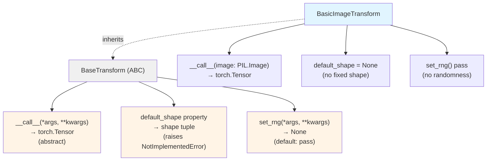

# BaseTransform

## What It Is
`BaseTransform` is an abstract base class (ABC) defining the interface for image transformation pipelines in DeepSeek-OCR. It establishes the contract that all transform implementations must follow, including:

1. **__call__ method**: Transform PIL Image → Tensor
2. **default_shape property**: Expected output shape
3. **set_rng method**: Configurable random number generator for reproducibility

This is **not** an `nn.Module` - it's a pure interface for preprocessing logic, sitting outside the model graph. No learnable parameters, no gradients, just CPU-side image manipulation before model input.

## Definition
```python
from abc import ABC

class BaseTransform(ABC):

    def set_rng(self, *args, **kwargs):
        """Configure random number generator for stochastic transforms."""
        pass

    def __call__(self, *args, **kwargs) -> torch.Tensor:
        """Apply transformation to input image(s)."""
        pass

    @property
    def default_shape(self):
        """Return expected output tensor shape."""
        raise NotImplementedError
```

## Constructor Information
**Location**: `models/deepseek-ocr/modeling_deepseekocr.py:306-316`

**Parameters**: None (abstract base class)

**Concrete implementations**:
- `BasicImageTransform` - PIL Image → normalized Tensor

## Module Internals (Mermaid)



## Pseudo Code

```python
from abc import ABC

class BaseTransform(ABC):
    """
    Abstract interface for image preprocessing transformations.

    Design principles:
    - Separate preprocessing from model (CPU vs GPU)
    - Consistent interface for different transform pipelines
    - Support for deterministic transforms (via set_rng)
    """

    def set_rng(self, *args, **kwargs):
        """
        Optional: Configure RNG for reproducible random transforms.

        Default implementation does nothing (deterministic transforms).
        Override if your transform uses randomness (e.g., augmentation).
        """
        pass

    def __call__(self, *args, **kwargs) -> torch.Tensor:
        """
        Transform input(s) to tensor.

        Typical signature:
            __call__(self, image: PIL.Image) -> torch.Tensor

        Must be implemented by subclasses.
        """
        pass

    @property
    def default_shape(self):
        """
        Expected output tensor shape (if fixed).

        Returns:
            Tuple[int, ...] or None for variable shapes

        Raises:
            NotImplementedError: Must be implemented by subclasses
        """
        raise NotImplementedError
```

## FLOP Count

**Per transform**: **0 FLOPs** (not a neural network operation)

This is a Python interface, not a compute operation. Concrete implementations (like `BasicImageTransform`) may have costs, but those are:
1. **CPU-bound**: Image decoding, resizing, normalization on CPU
2. **Not counted in model FLOPs**: Preprocessing happens before GPU compute
3. **Negligible compared to model**: <1% of total inference time

**Why zero FLOPs?**
- Abstract class with no implementation
- Concrete transform costs documented separately (see `BasicImageTransform`)
- Preprocessing is excluded from model FLOP counts by convention

## Memory Usage

**Parameters**: **0 bytes** (no learnable parameters)

**Activations**: Depends on implementation
- `BasicImageTransform`: Temporary CPU tensors during normalization (~few MB)
- Freed immediately after returning output tensor

**Design note**: Transforms are **stateless** (except for optional RNG state). No persistent memory beyond the transform objects themselves.

## Related Modules
- **Subclasses**:
  - `BasicImageTransform` - Main transform used in DeepSeek-OCR
- **Used by**:
  - `DeepseekOCRForCausalLM.infer()` - Applies transform to preprocessed images
- **Not related to**:
  - `nn.Module` - Different abstraction (no gradients, no GPU operations)
  - `torchvision.transforms.Compose` - Used internally by implementations

## Usage Pattern

```python
# In modeling code (abstract)
class SomeTransform(BaseTransform):
    def __init__(self, ...):
        # Initialize transform pipeline
        pass

    def __call__(self, image: PIL.Image) -> torch.Tensor:
        # Apply transformations
        return transformed_tensor

    @property
    def default_shape(self):
        return (3, 224, 224)  # Example fixed shape

# In DeepseekOCRForCausalLM.infer()
transform = BasicImageTransform(mean=(0.5, 0.5, 0.5), std=(0.5, 0.5, 0.5))

# Transform each preprocessed image patch
for image_patch in preprocessed_images:
    image_tensor = transform(image_patch)  # PIL.Image → torch.Tensor
    # image_tensor: (3, H, W) normalized to [-1, 1]
    batch_tensors.append(image_tensor)

# Stack and move to GPU
batch = torch.stack(batch_tensors).to(device)  # (B, 3, H, W)
```

**Design pattern**:
```python
# Why use ABC instead of just functions?
# 1. Consistent interface across different transform types
# 2. Encapsulation of transform state (e.g., normalization params)
# 3. Easy to swap transforms without changing call sites
# 4. Type checking: isinstance(transform, BaseTransform)

# Example: Switching transforms
if use_augmentation:
    transform = AugmentedTransform(...)
else:
    transform = BasicImageTransform(...)

# Same call signature regardless of implementation
tensor = transform(image)
```

**Interface contract**:
```python
# All BaseTransform subclasses MUST implement:
# 1. __call__() - actual transformation logic
# 2. default_shape - expected output shape (or None)

# All BaseTransform subclasses MAY override:
# 1. set_rng() - if randomness is used

# Guarantees:
# - __call__() always returns torch.Tensor
# - Output tensor is ready for model input (correct dtype, normalized, etc.)
# - No side effects (pure function transformation)
```

## References
- ABC: Python `abc` module for abstract base classes
- Design pattern: Strategy pattern for interchangeable preprocessing pipelines
- Similar to: `torchvision.transforms.Compose`, but with custom interface for OCR needs
