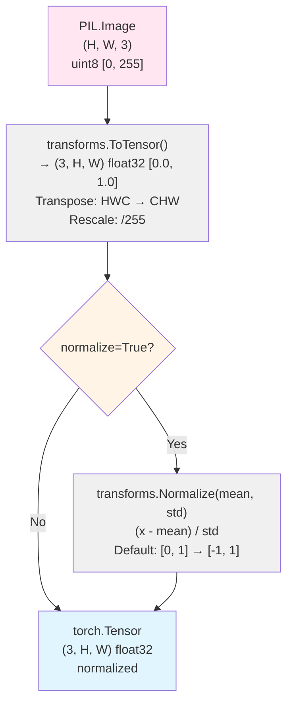

# BasicImageTransform

## What It Is
`BasicImageTransform` is the concrete image preprocessing pipeline used in DeepSeek-OCR's inference path. It converts PIL Images to normalized Tensors:

1. **ToTensor()**: PIL Image (uint8, [0, 255]) → Tensor (float32, [0, 1])
2. **Normalize(mean, std)**: Tensor ([0, 1]) → Normalized Tensor (typically [-1, 1])

Default normalization: `mean=(0.5, 0.5, 0.5)`, `std=(0.5, 0.5, 0.5)` maps [0, 1] → [-1, 1].

This runs **on CPU** before images are batched and moved to GPU. It's a preprocessing step outside the model graph, so it:
- Has **no learnable parameters**
- Incurs **no FLOP cost** (by ML benchmarking convention)
- Executes via `torchvision.transforms.Compose` pipeline

## Definition
```python
from torchvision import transforms

class BasicImageTransform(BaseTransform):
    def __init__(
        self,
        mean: Optional[Tuple[float, float, float]] = (0.5, 0.5, 0.5),
        std: Optional[Tuple[float, float, float]] = (0.5, 0.5, 0.5),
        normalize: bool = True
    ):
        self.mean = mean
        self.std = std

        transform_pipelines = [
            transforms.ToTensor()
        ]

        normalize = normalize_transform(mean, std) if normalize else nn.Identity()
        if normalize is not None:
            transform_pipelines.append(normalize)

        self.transform = transforms.Compose(transform_pipelines)

    def __call__(self, x):
        x = self.transform(x)
        return x
```

**Where `normalize_transform` is**:
```python
def normalize_transform(mean, std):
    return transforms.Normalize(mean=mean, std=std)
```

## Constructor Information
**Location**: `models/deepseek-ocr/modeling_deepseekocr.py:319-341`

**Default config**:
- `mean=(0.5, 0.5, 0.5)` - per-channel means for normalization
- `std=(0.5, 0.5, 0.5)` - per-channel standard deviations
- `normalize=True` - enable normalization (almost always True)

**Parameters**: **0** (no learnable parameters, just preprocessing constants)

**Typical input**: PIL Image (RGB, variable size, uint8)
**Typical output**: Tensor (3, H, W, bf16 after `.to(device, dtype)`)

## Module Internals (Mermaid)



## Pseudo Code

```python
def __init__(self, mean=(0.5, 0.5, 0.5), std=(0.5, 0.5, 0.5), normalize=True):
    """
    Initialize transform pipeline.

    Args:
        mean: Per-channel means for normalization
        std: Per-channel standard deviations
        normalize: If False, skip normalization (just ToTensor)
    """
    self.mean = mean
    self.std = std

    # Build pipeline
    pipeline = [transforms.ToTensor()]  # PIL → Tensor [0, 1]

    if normalize:
        # (x - mean) / std
        # With default mean=0.5, std=0.5: (x - 0.5) / 0.5 = 2x - 1
        # Maps [0, 1] → [-1, 1]
        pipeline.append(transforms.Normalize(mean=mean, std=std))

    self.transform = transforms.Compose(pipeline)

def __call__(self, x: PIL.Image) -> torch.Tensor:
    """
    Transform PIL Image to normalized Tensor.

    Args:
        x: PIL.Image in RGB mode, any size, uint8 [0, 255]

    Returns:
        Tensor (3, H, W) float32, normalized according to mean/std
    """
    # Apply composed pipeline
    x = self.transform(x)  # PIL.Image → torch.Tensor

    return x  # (3, H, W) float32

# Detailed normalization math (default params):
# Input: PIL.Image uint8 [0, 255]
# After ToTensor: float32 [0.0, 1.0]  (x_norm = pixel / 255.0)
# After Normalize with mean=0.5, std=0.5:
#   output[c] = (x_norm[c] - 0.5) / 0.5
#             = 2 * x_norm[c] - 1
#             = 2 * (pixel / 255.0) - 1
# Result: float32 [-1.0, 1.0] where:
#   pixel=0 → -1.0
#   pixel=127/128 → ~0.0
#   pixel=255 → 1.0
```

## FLOP Count

**Per image**: **~0 FLOPs** (excluded from model FLOP counts)

**Why zero?** By ML benchmarking convention, preprocessing on CPU is not counted in model FLOPs:
1. **Not a neural network operation** - no weights, no gradients
2. **CPU-bound** - runs before GPU execution
3. **Negligible compared to model** - <0.1% of total compute time

**Actual compute** (if measured):
```
For H×W RGB image:
  ToTensor rescaling: H × W × 3 divisions by 255 (~10K ops for 672×896)
  Normalize: H × W × 3 × 2 ops (subtract + divide) (~40K ops)
  Total: ~50K CPU ops ≈ 0.00005 GFLOPs

Typical image (672×896): ~0.05 MFLOPs
Compare to model: ~500 GFLOPs for vision encoders
Ratio: 0.00001% (completely negligible)
```

**Latency impact**:
```
Typical performance (single-threaded CPU):
  672×896 image: 1-3 ms (dominated by PIL operations, not arithmetic)
Compare to model inference: 50-200 ms on GPU
Preprocessing: ~1-5% of end-to-end latency
```

## Memory Usage

**Parameters**: **0 bytes** (no learnable weights)

**Temporary allocations** (per image, H=672, W=896):
```
Input PIL Image: H × W × 3 × 1 = 672 × 896 × 3 = 1.81 MB (uint8)

Intermediate (ToTensor output): 3 × H × W × 4 = 3 × 672 × 896 × 4 = 7.24 MB (float32)

Output (Normalize): Same buffer or new allocation = 7.24 MB (float32)

Peak during transform: ~15 MB (input + intermediate + output)
  Note: Typically freed immediately after returning

After batching and dtype conversion to bf16: 3 × H × W × 2 = 3.62 MB per image
```

**Batch processing** (e.g., 20 image patches):
```
Sequential processing: 15 MB peak (reused for each image)
Concurrent processing: 15 MB × 20 = 300 MB peak

After batching: 20 × 3.62 MB = 72.4 MB (bf16 batch tensor)
```

**Design note**: Transforms are **not** persistent - create temporary tensors that are immediately consumed by the model.

## Related Modules
- **Inherits from**: `BaseTransform` (abstract interface)
- **Used by**: `DeepseekOCRForCausalLM.infer()` - transforms all preprocessed image patches
- **Internal dependencies**:
  - `torchvision.transforms.ToTensor` - PIL → Tensor conversion
  - `torchvision.transforms.Normalize` - Channel-wise normalization
  - `torchvision.transforms.Compose` - Pipeline composition
- **Not related to**:
  - Model modules (`nn.Module`) - this is preprocessing, not inference
  - Data augmentation - no randomness, deterministic transform

## Usage Pattern

```python
# In DeepseekOCRForCausalLM.infer()
transform = BasicImageTransform(
    mean=(0.5, 0.5, 0.5),
    std=(0.5, 0.5, 0.5),
    normalize=True
)

# After dynamic_preprocess splits image into patches:
preprocessed_images = dynamic_preprocess(
    image, min_num=1, max_num=12, image_size=1024, use_thumbnail=True
)
# preprocessed_images: List[PIL.Image], e.g., [thumbnail, patch1, patch2, ...]

# Transform each patch
pixel_values = []
for image_patch in preprocessed_images:
    # image_patch: PIL.Image, e.g., 672×896 or 1024×1024
    tensor = transform(image_patch)
    # tensor: (3, H, W) float32, normalized to [-1, 1]
    pixel_values.append(tensor)

# Stack into batch and move to GPU
pixel_values = torch.stack(pixel_values, dim=0)  # (N, 3, H, W) float32
pixel_values = pixel_values.to(device="cuda:0", dtype=torch.bfloat16)
# pixel_values: (N, 3, H, W) bf16 on GPU, ready for vision encoders
```

**Normalization effect**:
```python
# Why mean=0.5, std=0.5?
# Vision encoders (CLIP, SAM) were pretrained with [-1, 1] normalized inputs.

# Example pixel value transformation:
# White pixel (255, 255, 255):
#   After ToTensor: (1.0, 1.0, 1.0)
#   After Normalize: ((1-0.5)/0.5, ...) = (1.0, 1.0, 1.0)

# Gray pixel (128, 128, 128):
#   After ToTensor: (0.502, 0.502, 0.502)
#   After Normalize: ((0.502-0.5)/0.5, ...) ≈ (0.0, 0.0, 0.0)

# Black pixel (0, 0, 0):
#   After ToTensor: (0.0, 0.0, 0.0)
#   After Normalize: ((0-0.5)/0.5, ...) = (-1.0, -1.0, -1.0)

# Range: [-1, 1] with zero-mean at mid-gray
```

**Alternative usage** (no normalization):
```python
# For debugging or custom preprocessing
transform = BasicImageTransform(normalize=False)
tensor = transform(image)  # (3, H, W) float32 [0, 1], no normalization
```

**Comparison with CLIP official preprocessing**:
```python
# CLIP uses similar normalization but different mean/std:
# CLIP: mean=(0.48145466, 0.4578275, 0.40821073)
#       std=(0.26862954, 0.26130258, 0.27577711)
# (ImageNet statistics)

# DeepSeek-OCR: mean=(0.5, 0.5, 0.5), std=(0.5, 0.5, 0.5)
# (Simpler, symmetric [-1, 1] mapping)

# Both are valid; models adapt to their pretraining normalization.
```

## References
- `torchvision.transforms`: https://pytorch.org/vision/stable/transforms.html
- ToTensor implementation: Converts PIL/numpy to Tensor, rescales [0, 255] → [0, 1], transposes HWC → CHW
- Normalize implementation: Per-channel `(x - mean) / std` normalization
- Standard practice: Zero-center and normalize inputs for neural networks (improves training stability)
