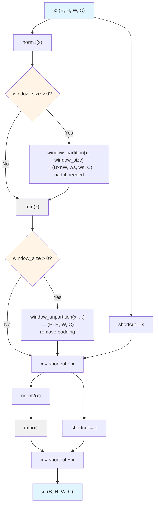

# Block

## What It Is
`Block` is a SAM ViT transformer block with support for both windowed (local) and global attention patterns. It implements pre-norm architecture with residual connections and is used 12 times in the SAM-B encoder with a hybrid attention pattern: 8 layers use 14×14 windowed attention for efficiency, while 4 layers (indices 2, 5, 8, 11) use global attention for long-range dependencies.

Key features:
1. **Pre-norm architecture**: `x + attn(norm(x))` → `x + mlp(norm(x))`
2. **Window/global attention switching**: `window_size=0` for global, `>0` for windowed
3. **Window partition/unpartition**: Automatically handles spatial tiling when `window_size > 0`
4. **Optional relative position embeddings**: Passed through to `Attention` module
5. **Hybrid pattern**: Global attention every 3rd layer, windowed for others

## Definition
```python
class Block(nn.Module):
    def __init__(
        self,
        dim: int,
        num_heads: int,
        mlp_ratio: float = 4.0,
        qkv_bias: bool = True,
        norm_layer: Type[nn.Module] = nn.LayerNorm,
        act_layer: Type[nn.Module] = nn.GELU,
        use_rel_pos: bool = False,
        rel_pos_zero_init: bool = True,
        window_size: int = 0,           # 0 = global, >0 = windowed
        input_size: Optional[Tuple[int, int]] = None,
    ):
        super().__init__()
        self.norm1 = norm_layer(dim)
        self.attn = Attention(
            dim,
            num_heads=num_heads,
            qkv_bias=qkv_bias,
            use_rel_pos=use_rel_pos,
            rel_pos_zero_init=rel_pos_zero_init,
            input_size=input_size if window_size == 0 else (window_size, window_size),
        )
        self.norm2 = norm_layer(dim)
        self.mlp = MLPBlock(embedding_dim=dim, mlp_dim=int(dim * mlp_ratio), act=act_layer)
        self.window_size = window_size

    def forward(self, x: torch.Tensor) -> torch.Tensor:
        shortcut = x
        x = self.norm1(x)
        # Window partition if using windowed attention
        if self.window_size > 0:
            H, W = x.shape[1], x.shape[2]
            x, pad_hw = window_partition(x, self.window_size)
        x = self.attn(x)
        # Reverse window partition
        if self.window_size > 0:
            x = window_unpartition(x, self.window_size, pad_hw, (H, W))
        x = shortcut + x
        x = x + self.mlp(self.norm2(x))
        return x
```

## Constructor Information
**Location**: `models/deepseek-ocr/deepencoder.py:714-777`

**SAM-B config**:
- `dim=768`, `num_heads=12`, `mlp_ratio=4.0`
- Window size: 14 for windowed layers, 0 for global layers
- 12 blocks total with `global_attn_indexes=[2, 5, 8, 11]`
- `use_rel_pos=True` (2D decomposed relative position embeddings)
- `input_size=(64, 64)` for global attention, `(14, 14)` for windowed

**Parameters per block**:
```
norm1 (LayerNorm): 2 × 768 = 1,536
attn (Attention): 4,194,304 (qkv + proj)
  + rel_pos_h, rel_pos_w (if use_rel_pos):
    - Global (64×64): 2 × (2×64-1) × 64 = 16,256
    - Windowed (14×14): 2 × (2×14-1) × 64 = 3,456
norm2 (LayerNorm): 2 × 768 = 1,536
mlp (MLPBlock): 768×3072 + 3072×768 = 4,718,592
Total per block:
  - Windowed: 8,915,968 + 3,456 ≈ 8.92M ≈ 17.84 MB at bf16
  - Global: 8,915,968 + 16,256 ≈ 8.93M ≈ 17.86 MB at bf16
Total for 12 blocks: ~107M params ≈ 214 MB at bf16
```

## Module Internals (Mermaid)



## Pseudo Code

```python
def forward(self, x: torch.Tensor) -> torch.Tensor:
    """
    Args:
        x: (B, H, W, C) = (1, 64, 64, 768) for 1024×1024 image
           or (1, 14, 14, 768) for each window in windowed layers

    Returns:
        output: (B, H, W, C) same shape
    """
    # Pre-norm attention branch
    shortcut = x
    x = self.norm1(x)  # LayerNorm over channel dimension

    # Window partition if using windowed attention
    if self.window_size > 0:
        H, W = x.shape[1], x.shape[2]  # e.g., 64, 64
        # Partition into non-overlapping windows (pad if needed)
        # (B, H, W, C) → (B×nW, ws, ws, C) where nW = (H//ws) × (W//ws)
        # For 64×64 → 14×14 windows: (1, 64, 64, 768) → (25, 14, 14, 768)
        x, pad_hw = window_partition(x, self.window_size)

    # Multi-head attention (operates on windows if windowed, else full spatial)
    x = self.attn(x)

    # Reverse window partition
    if self.window_size > 0:
        # (B×nW, ws, ws, C) → (B, H, W, C) and remove padding
        x = window_unpartition(x, self.window_size, pad_hw, (H, W))

    # First residual connection
    x = shortcut + x

    # Pre-norm MLP branch
    x = x + self.mlp(self.norm2(x))

    return x
```

## FLOP Count

**Global attention** (B=1, H=64, W=64, S=4096, C=768, heads=12, head_dim=64, mlp_dim=3072):

```
norm1: 64 × 64 × 768 = 3.14 MFLOPs (negligible)

Attention (global):
  qkv_proj: 2 × 4096 × 768 × 2304 = 14.51 GFLOPs
  Q@K^T: 2 × 12 × 4096 × 4096 × 64 = 25.77 GFLOPs
  softmax: ~4096 × 4096 × 12 = 0.20 GFLOPs
  attn@V: 2 × 12 × 4096 × 4096 × 64 = 25.77 GFLOPs
  Relative position bias computation:
    - get_rel_pos interpolation: negligible
    - add_decomposed_rel_pos einsum: 2 × 4096 × 127 × 64 × 2 ≈ 0.13 GFLOPs
  proj: 2 × 4096 × 768 × 768 = 4.83 GFLOPs
  Total attention: 71.21 GFLOPs

norm2: 3.14 MFLOPs

MLP:
  lin1: 2 × 4096 × 768 × 3072 = 19.33 GFLOPs
  lin2: 2 × 4096 × 3072 × 768 = 19.33 GFLOPs
  Total MLP: 38.66 GFLOPs

Total per global block: 71.21 + 38.66 = 109.87 GFLOPs
4 global blocks (indices 2, 5, 8, 11): 4 × 109.87 = 439.48 GFLOPs
```

**Windowed attention** (window_size=14, num_windows=25 for 64×64 input):

```
norm1: 64 × 64 × 768 = 3.14 MFLOPs

Window partition: view/permute operations (memory-bound, ~0 FLOPs)

Attention (per window, S_w=14×14=196):
  qkv_proj: 2 × 196 × 768 × 2304 = 0.69 GFLOPs
  Q@K^T: 2 × 12 × 196 × 196 × 64 = 0.06 GFLOPs
  softmax: ~196 × 196 × 12 = 0.46 MFLOPs
  attn@V: 2 × 12 × 196 × 196 × 64 = 0.06 GFLOPs
  Relative position bias (14×14):
    - add_decomposed_rel_pos: 2 × 196 × 27 × 64 × 2 ≈ 1.35 MFLOPs
  proj: 2 × 196 × 768 × 768 = 0.23 GFLOPs
  Total per window: 1.04 GFLOPs

25 windows: 25 × 1.04 = 26.0 GFLOPs

Window unpartition: view/permute operations (~0 FLOPs)

norm2: 3.14 MFLOPs

MLP: 38.66 GFLOPs (same as global, operates on full spatial)

Total per windowed block: 26.0 + 38.66 = 64.66 GFLOPs
8 windowed blocks: 8 × 64.66 = 517.28 GFLOPs
```

**Total for all 12 blocks**: 439.48 + 517.28 = **956.76 GFLOPs** ≈ **0.96 TFLOPs**

**Efficiency note**: Windowed attention reduces attention FLOPs by ~2.7× compared to global (26.0 vs 71.21 GFLOPs), while maintaining MLP cost. This hybrid pattern balances efficiency and receptive field.

## Memory Usage

**Parameters**: 214 MB for 12 blocks (as computed above)

**Activations per block**:

Global attention:
```
norm1 output: 1 × 64 × 64 × 768 × 2 = 6.29 MB
qkv: 1 × 4096 × 2304 × 2 = 18.87 MB
Attention scores: 1 × 12 × 4096 × 4096 × 4 = 805.31 MB (fp32)
  Note: Flash attention reduces this to ~linear memory
Relative position tables:
  rel_pos_h: 127 × 64 × 2 = 16 KB
  rel_pos_w: 127 × 64 × 2 = 16 KB
  Computed bias: 1 × 12 × 4096 × 4096 × 4 = 805.31 MB
proj output: 1 × 4096 × 768 × 2 = 6.29 MB
norm2 output: 6.29 MB
mlp intermediate: 1 × 4096 × 3072 × 2 = 25.17 MB
Peak per global block: ~850 MB (dominated by attention scores)
  With flash attention: ~50 MB
```

Windowed attention:
```
norm1 output: 6.29 MB
Window partitioned: 25 × 196 × 768 × 2 = 7.55 MB (includes padding)
qkv (per window × 25): 25 × 196 × 2304 × 2 = 22.58 MB
Attention scores: 25 × 12 × 196 × 196 × 4 = 46.12 MB (fp32)
  Flash attention: ~2 MB
Relative position tables:
  rel_pos_h: 27 × 64 × 2 = 3.5 KB
  rel_pos_w: 27 × 64 × 2 = 3.5 KB
proj output (windows): 7.55 MB
Unpartitioned: 6.29 MB
norm2 output: 6.29 MB
mlp intermediate: 25.17 MB
Peak per windowed block: ~90 MB
  With flash attention: ~45 MB
```

**Total peak for forward pass** (mixed global/windowed, with flash attention):
```
4 global blocks: 4 × 50 MB = 200 MB
8 windowed blocks: 8 × 45 MB = 360 MB
Total: ~560 MB (overlapping reuse reduces actual to ~200-300 MB)
```

## Related Modules
- **Used by**: `ImageEncoderViT.blocks` (12 instances)
- **Contains**:
  - `Attention` - Multi-head attention with 2D relative position embeddings
  - `MLPBlock` - 2-layer FFN with GELU
  - 2× `nn.LayerNorm` - Pre-norm layers
- **Helper functions**:
  - `window_partition()` - Splits spatial dimensions into windows
  - `window_unpartition()` - Reverses window partitioning
- **Related**:
  - `NoTPTransformerBlock` - Similar pre-norm architecture for CLIP-L
  - Different: CLIP uses global attention only, no windowing

## Usage Pattern

```python
# In ImageEncoderViT.__init__()
self.blocks = nn.ModuleList()
for i in range(depth):  # depth=12
    block = Block(
        dim=embed_dim,           # 768
        num_heads=num_heads,     # 12
        mlp_ratio=4.0,
        qkv_bias=True,
        norm_layer=nn.LayerNorm,
        act_layer=nn.GELU,
        use_rel_pos=use_rel_pos,  # True
        rel_pos_zero_init=True,
        window_size=window_size if i not in global_attn_indexes else 0,  # 14 or 0
        input_size=(img_size // patch_size, img_size // patch_size) if i in global_attn_indexes
                  else (window_size, window_size),  # (64, 64) or (14, 14)
    )
    self.blocks.append(block)

# global_attn_indexes = (2, 5, 8, 11)
# window_size = 14
# Result: Layers 0,1,3,4,6,7,9,10 use 14×14 windows
#         Layers 2,5,8,11 use global 64×64 attention

# In forward():
x = self.patch_embed(x)  # (B, 64, 64, 768)
x = x + self.pos_embed   # Add positional embeddings
for blk in self.blocks:
    x = blk(x)           # (B, 64, 64, 768) throughout
# x maintains spatial structure (B, H, W, C) throughout the encoder
```

**Window attention mechanics**:
```python
# Example for 64×64 input with 14×14 windows:
# Input: (1, 64, 64, 768)
# After window_partition: (25, 14, 14, 768)  # 25 = ceil(64/14)² windows
# Attention operates on each 14×14 window independently
# After window_unpartition: (1, 64, 64, 768)  # Reconstructed

# Benefits:
# - Reduces attention complexity from O(4096²) to O(25 × 196²)
# - 26 GFLOPs vs 71 GFLOPs per attention operation (~2.7× faster)
# - Still captures local dependencies within 14×14 receptive field
# - Global attention layers (every ~3 layers) maintain long-range modeling
```

## References
- SAM: "Segment Anything" (Kirillov et al., 2023)
- Window attention: "Swin Transformer: Hierarchical Vision Transformer using Shifted Windows" (Liu et al., 2021)
- Relative position embeddings: "Bottleneck Transformers for Visual Recognition" (Srinivas et al., 2021)
- Pre-norm: "On Layer Normalization in the Transformer Architecture" (Xiong et al., 2020)
