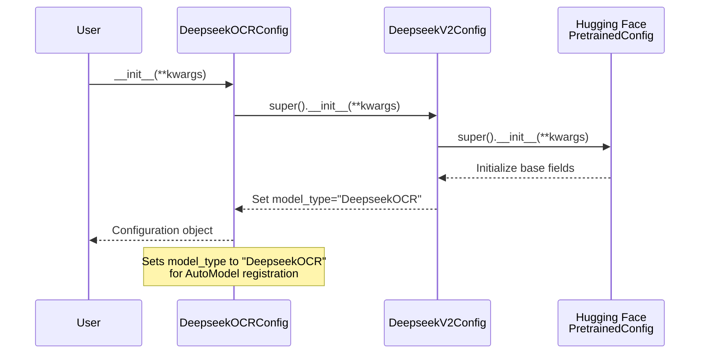

# DeepseekOCRConfig

## What It Is
`DeepseekOCRConfig` is the configuration class for the DeepSeek-OCR model. It extends `DeepseekV2Config` from the base LLM and serves as a marker class to distinguish OCR-specific model configurations. It inherits all configuration parameters from the base DeepSeekV2 transformer.

## Definition
```python
class DeepseekOCRConfig(DeepseekV2Config):
    model_type = "DeepseekOCR"
```

## Constructor Information
**Location**: `models/deepseek-ocr/modeling_deepseekocr.py:351-352`

`DeepseekOCRConfig` does not override `__init__`; construction is delegated to
`DeepseekV2Config.__init__`, so all parameters and defaults come from
`configuration_deepseek_v2.py` and/or `config.json`.

**Key Parameters** (from `DeepseekV2Config` / `config.json`):
- `vocab_size`: Vocabulary size (e.g., 102400 in base DeepseekV2;
  **129280 in DeepSeek-OCR**).
- `hidden_size`: Model embedding dimension (default: 4096 in
  `DeepseekV2Config`; **1280 in DeepSeek-OCR**).
- `num_hidden_layers`: Number of transformer decoder layers
  (default: 30; **12 in DeepSeek-OCR**).
- `num_attention_heads`: Number of attention heads
- `intermediate_size`: MLP intermediate dimension
- `hidden_act`: Activation function (typically "silu")
- `max_position_embeddings`: Maximum sequence length
- `rope_theta`: RoPE base frequency
- `rope_scaling`: RoPE scaling configuration (None, "linear", "dynamic", or "yarn")
- `attention_dropout`: Dropout probability for attention weights
- `rms_norm_eps`: Epsilon for RMSNorm numerical stability
- `use_mla`: Whether to use Multi-head Latent Attention
- `q_lora_rank`, `kv_lora_rank`: Low-rank factors for Q/KV projections
- `qk_rope_head_dim`, `qk_nope_head_dim`, `v_head_dim`: Attention head sub-dimensions
- `n_routed_experts`: Number of routed experts for MoE layers
- `n_shared_experts`: Number of dense shared experts
- `num_experts_per_tok`: Top-k experts selected per token
- `moe_intermediate_size`: Per-expert MLP intermediate dim
- `moe_layer_freq`: Frequency of MoE layers (every N layers)
- `first_k_dense_replace`: First K layers use dense MLP instead of MoE
- `scoring_func`: MoE gating function ("softmax" or "sigmoid")
- `aux_loss_alpha`: Weight for MoE load-balancing auxiliary loss
- `norm_topk_prob`: Whether to normalize top-k expert weights
- `routed_scaling_factor`: Scaling factor for expert outputs
- `topk_method`: Expert selection strategy ("greedy", "group_limited_greedy", "noaux_tc")
- `n_group`, `topk_group`: Expert grouping for group-limited routing
- `_attn_implementation`: Attention backend ("eager" or "flash_attention_2")

## Module Internals



## Key Pseudo Code

```python
class DeepseekOCRConfig(DeepseekV2Config):
    """
    Configuration class for DeepSeek-OCR model.
    Inherits all parameters from DeepseekV2Config.
    """
    model_type = "DeepseekOCR"  # Registered in transformers AutoModel

    # All other parameters inherited from DeepseekV2Config:
    # - LLM parameters (hidden_size, num_layers, vocab_size, etc.)
    # - Attention parameters (q_lora_rank, kv_lora_rank, rope_*, etc.)
    # - MoE parameters (n_routed_experts, num_experts_per_tok, etc.)
    # - Normalization parameters (rms_norm_eps)
    # - Generation parameters (max_position_embeddings)
```

## FLOP Count and Memory Usage Impact

### FLOPs
**Zero FLOPs** – This is a configuration dataclass with no computational operations. All FLOPs come from the model modules that consume this configuration.

### Memory Usage

**Static Memory**:
- **Configuration object**: ~few KB (Python object overhead + stored parameters as scalars/strings)
- **No learned parameters**: Configuration classes don't contain nn.Parameters

**Impact on Model Memory** (via configured parameters):
The configuration determines the model's total memory footprint:

1. **Embedding Table**:
   ```
   Memory = vocab_size × hidden_size × sizeof(dtype)

   Example (base DeepSeek-V2 style):
       102,400 × 4,096 × 2 bytes (bf16) ≈ 800 MB

   Example (DeepSeek-OCR checkpoint):
       129,280 × 1,280 × 2 bytes (bf16) ≈ 330 MB
   ```

2. **Transformer Layers**:
   ```
   Memory_per_layer ≈ (attention_params + mlp_params)
   Total = num_hidden_layers × Memory_per_layer

   Example large config (40 layers, h=1280, MLA + MoE):
   ≈ 40 × (attention + MoE) ≈ several GB

   DeepSeek-OCR checkpoint:
   num_hidden_layers = 12, use_mla = False, n_routed_experts = 64
   → much smaller total transformer parameter memory.
   ```

3. **Vision Encoders** (SAM + CLIP):
   ```
   Additional ~500MB-1GB for vision components
   (not directly configured here, but part of OCR model)
   ```

4. **KV Cache** (during inference):
   ```
   Memory = 2 × num_layers × batch_size × seq_len × num_heads × head_dim × sizeof(dtype)

   Example MLA config (40 layers, seq_len=8192, batch=1, bf16):
   ≈ 2 × 40 × 1 × 8192 × kv_heads × kv_head_dim × 2 bytes
   ≈ several GB depending on kv_lora_rank compression

   For DeepSeek-OCR (MHA, 12 layers, 10 heads), KV cache is smaller; see
   `op-DeepseekV2Attention.md` and `op-DeepseekV2FlashAttention2.md` for MLA vs
   MHA cache formulas.
   ```

**Configuration Keys Affecting Memory**:
- `vocab_size`: Embedding table size
- `num_hidden_layers`: Linear scaling factor for transformer stack
- `hidden_size`: Quadratic impact on attention/MLP weight matrices
- `intermediate_size` / `moe_intermediate_size`: MLP expansion size
- `n_routed_experts`: Multiplies MLP parameter count (offset by sparsity)
- `kv_lora_rank`: Reduces KV cache memory via low-rank compression
- `max_position_embeddings`: Determines maximum KV cache sequence length

**Key Insight**: The config enables low-rank attention (via `q_lora_rank`, `kv_lora_rank`) and sparse MoE (via `num_experts_per_tok` < `n_routed_experts`), which are critical memory optimizations for large-scale multimodal models.

## Related Modules
- **Used by**: `DeepseekOCRModel`, `DeepseekOCRForCausalLM`
- **Inherits from**: `DeepseekV2Config` (`configuration_deepseek_v2.py`)
- **Hugging Face integration**: Registered as `AutoConfig.register("DeepseekOCR", DeepseekOCRConfig)`

## Usage Pattern
```python
# Loaded automatically via transformers
from transformers import AutoConfig, AutoModel

config = AutoConfig.from_pretrained(
    "deepseek-ai/DeepSeek-OCR",
    trust_remote_code=True,
)
# config is a DeepseekOCRConfig/DeepseekV2Config instance with all parameters
# loaded from models/deepseek-ocr/config.json
```
