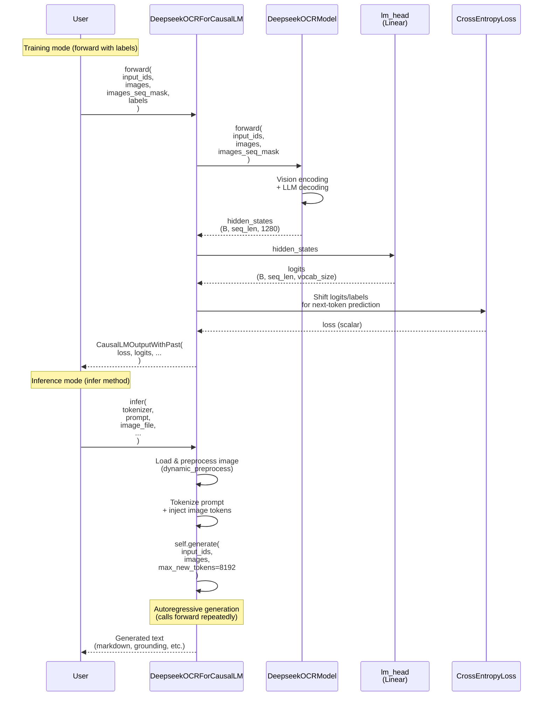

# DeepseekOCRForCausalLM

## What It Is
`DeepseekOCRForCausalLM` is the top-level model class for DeepSeek-OCR with causal language modeling head. It extends `DeepseekV2ForCausalLM` and wraps `DeepseekOCRModel` to provide:
1. **Language modeling head** (`lm_head`) for vocab logits generation
2. **Standard `forward()` method** compatible with Hugging Face trainer
3. **Custom `infer()` method** for end-to-end OCR inference (image preprocessing + generation + post-processing)
4. **Generation utilities** (prepare_inputs_for_generation) for autoregressive decoding

This is the primary interface used for OCR tasks, supporting both training (with labels) and inference (with generation).

## Definition
```python
class DeepseekOCRForCausalLM(DeepseekV2ForCausalLM):
    config_class = DeepseekOCRConfig

    def __init__(self, config):
        super(DeepseekV2ForCausalLM, self).__init__(config)  # Skip parent __init__, go to grandparent
        self.model = DeepseekOCRModel(config)                # OCR-aware model (not base DeepseekV2Model)
        self.vocab_size = config.vocab_size
        self.lm_head = nn.Linear(config.hidden_size, config.vocab_size, bias=False)
        self.post_init()  # Weight initialization
```

## Constructor Information
**Location**: `models/deepseek-ocr/modeling_deepseekocr.py:518-534`

**Signature**:
```python
def __init__(self, config: DeepseekV2Config)
```

**Parameters**:
- `config`: `DeepseekOCRConfig` instance with all model configuration

**Created Components**:
- `self.model`: `DeepseekOCRModel` (transformer with vision encoders)
- `self.vocab_size`: Vocabulary size (from config)
- `self.lm_head`: `nn.Linear(hidden_size=config.hidden_size, vocab_size=config.vocab_size, bias=False)` – maps final hidden states to vocabulary logits

**Key Methods**:
1. **`forward(...)`** (`modeling_deepseekocr.py:540-614`):
   - Standard Hugging Face forward pass
   - Computes loss when labels are provided (training mode)
   - Returns `CausalLMOutputWithPast` with logits, loss, hidden states

2. **`infer(...)`** (`modeling_deepseekocr.py:703-1038`):
   - End-to-end OCR inference pipeline
   - Handles image loading, preprocessing, tiling/cropping, generation, and post-processing
   - Supports grounding (bounding box extraction) and markdown output

3. **`prepare_inputs_for_generation(...)`** (`modeling_deepseekocr.py:617-690`):
   - Prepares inputs for autoregressive generation
   - Manages KV cache, position IDs, and attention masks
   - Passes vision tensors only during first prefill pass

## Module Internals



## Key Pseudo Code

### Standard Forward Pass (Training/Inference)
```python
def forward(
    self,
    input_ids,
    images=None,
    images_seq_mask=None,
    images_spatial_crop=None,
    labels=None,  # For training
    **kwargs
):
    # 1. Pass through DeepseekOCRModel (vision + LLM decoder)
    outputs = self.model(
        input_ids=input_ids,
        images=images,
        images_seq_mask=images_seq_mask,
        images_spatial_crop=images_spatial_crop,
        **kwargs
    )
    hidden_states = outputs[0]  # (B, seq_len, 1280)

    # 2. Project to vocabulary logits
    logits = self.lm_head(hidden_states)  # (B, seq_len, vocab_size)
    logits = logits.float()  # Ensure fp32 for numerical stability

    # 3. Compute loss if labels provided (training mode)
    loss = None
    if labels is not None:
        # Shift for next-token prediction: tokens < n predict n
        shift_logits = logits[..., :-1, :].contiguous()   # (B, seq_len-1, vocab)
        shift_labels = labels[..., 1:].contiguous()       # (B, seq_len-1)

        loss_fct = CrossEntropyLoss()
        loss = loss_fct(
            shift_logits.view(-1, self.vocab_size),
            shift_labels.view(-1)
        )

    return CausalLMOutputWithPast(
        loss=loss,
        logits=logits,
        past_key_values=outputs.past_key_values,
        hidden_states=outputs.hidden_states,
        attentions=outputs.attentions,
    )
```

### End-to-End Inference Pipeline
```python
def infer(
    self,
    tokenizer,
    prompt='',
    image_file='',
    output_path='',
    base_size=1024,      # Full image resolution
    image_size=640,      # Patch resolution
    crop_mode=True,      # Enable dynamic tiling
    **kwargs
):
    # 1. Load and preprocess image
    image = load_image(image_file)  # PIL Image

    # 2. Dynamic tiling (if crop_mode=True)
    if crop_mode and (image.width > 640 or image.height > 640):
        images_crop_raw, (width_crop_num, height_crop_num) = dynamic_preprocess(
            image, min_num=2, max_num=9, image_size=640
        )  # e.g., 2×3 grid → 6 patches
    else:
        width_crop_num, height_crop_num = 1, 1

    # 3. Tokenize prompt and inject image tokens
    text_splits = prompt.split('<image>')
    tokenized_str = []
    images_seq_mask = []

    for text_sep in text_splits[:-1]:
        # Add text tokens
        tokenized_str += text_encode(tokenizer, text_sep)
        images_seq_mask += [False] * len(text_tokens)

        # Add image tokens (for both patches and global view)
        num_patch_tokens = (640//16//4)**2  # 100 tokens per patch
        num_global_tokens = (1024//16//4)**2  # 256 tokens for global view

        if crop_mode and (width_crop_num > 1 or height_crop_num > 1):
            # Patches + newline separators + global + view separator
            image_tokens = ([<img_token>] * num_patch_tokens + [<img_token>]) * (height_crop_num * width_crop_num)
            image_tokens += ([<img_token>] * num_global_tokens + [<img_token>]) * num_global_tokens
            image_tokens += [<img_token>]  # view_seperator
        else:
            # Global view only
            image_tokens = ([<img_token>] * num_global_tokens + [<img_token>]) * num_global_tokens
            image_tokens += [<img_token>]

        tokenized_str += image_tokens
        images_seq_mask += [True] * len(image_tokens)

    # Add final text segment
    tokenized_str += text_encode(tokenizer, text_splits[-1])
    images_seq_mask += [False] * len(final_text_tokens)

    # 4. Prepare image tensors
    image_transform = BasicImageTransform(mean=(0.5,0.5,0.5), std=(0.5,0.5,0.5))

    # Global view (padded to base_size × base_size)
    global_view = ImageOps.pad(image, (base_size, base_size))
    images_ori = image_transform(global_view).to(torch.bfloat16)  # (3, 1024, 1024)

    # Patches
    if crop_mode and len(images_crop_raw) > 0:
        images_crop = torch.stack([image_transform(img) for img in images_crop_raw])  # (P, 3, 640, 640)
    else:
        images_crop = torch.zeros((1, 3, base_size, base_size))  # Dummy tensor

    # 5. Run generation
    with torch.autocast("cuda", dtype=torch.bfloat16):
        with torch.no_grad():
            output_ids = self.generate(
                input_ids=torch.LongTensor(tokenized_str).unsqueeze(0).cuda(),
                images=[(images_crop.cuda(), images_ori.cuda())],
                images_seq_mask=torch.BoolTensor(images_seq_mask).unsqueeze(0).cuda(),
                images_spatial_crop=torch.LongTensor([[width_crop_num, height_crop_num]]),
                temperature=0.0,
                max_new_tokens=8192,
                no_repeat_ngram_size=20,
                use_cache=True
            )

    # 6. Decode and post-process
    outputs = tokenizer.decode(output_ids[0, len(tokenized_str):])
    # Remove EOS token, extract bounding boxes, save results...

    return outputs
```

## FLOP Count and Memory Usage Impact

### FLOPs (per forward pass)

Assume:
- `B` = batch size
- `S` = sequence length (text + image tokens)
- `V` = vocab_size (≈1e5; **129,280 for DeepSeek-OCR**)
- `d_model` = 1280

#### Training Mode (with labels):

1. **DeepseekOCRModel forward**:
   ```
   FLOPs_model = Vision encoding + LLM decoder
               = ~2.5 TFLOPs (vision, see op-DeepseekOCRModel.md)
                 + num_hidden_layers × [attention + MoE] × S tokens
   ```

2. **LM Head projection** (example vocab size):
   ```
   FLOPs_lm_head = 2 × B × S × d_model × V
                 = 2 × 1 × 8192 × 1280 × 102400   # replace 102400 with 129280 for the actual DeepSeek-OCR checkpoint
                 ≈ 2.15 TFLOPs
   ```

3. **CrossEntropyLoss**:
   ```
   FLOPs_loss = B × (S-1) × V  (softmax + log + gather)
              ≈ 1 × 8191 × 102400 ≈ 0.84 GFLOPs   # slightly higher for V=129280
   ```

**Total (training, single forward, example config)**:
```
≈ Vision (2.5T) + LLM decoder (varies by S) + LM head (2.15T) + Loss (0.84G)
≈ Vision (2.5T) + LM head (~2.15T) + Loss (0.84G) + LLM decoder FLOPs
```

#### Inference Mode (generate):

During autoregressive generation:
- **Prefill pass** (first forward):
  ```
  FLOPs = Vision (2.5T) + LLM decoder (prefill, S tokens) + LM head (2.15T)
  ```

- **Decode pass** (each subsequent token):
  ```
  FLOPs_per_token = LLM decoder (1 token, using KV cache) + LM head (1 token)
                  ≈ num_hidden_layers × [MoE + Attention with cache]
                    + 2 × B × S × d_model × V
                  ≈ [varies by MoE] + 0.26 GFLOPs (LM head for V≈1e5)
  ```

- **Total generation** (N=8192 new tokens):
  ```
  FLOPs_gen = Prefill + N × FLOPs_per_token
            ≈ (2.5T + LLM_prefill + 2.15T) + 8192 × (LLM_decode + 0.26G)
  ```

**Key Insight**: For a vocab size on the order of 1e5 (102400–129280), the LM
head projection (1280 → V) accounts for ~2 TFLOPs per forward pass, which is
non-trivial but still smaller than vision encoding or LLM decoder compute.

### Memory Usage

#### Parameters:

1. **DeepseekOCRModel**:
   ```
   Vision encoders: ~393M parameters (SAM + CLIP + projector)
   LLM decoder: ~varies (embeddings + config.num_hidden_layers layers with MoE)
   See op-DeepseekOCRModel.md / op-DeepseekV2Model.md for breakdowns
   ```

2. **LM Head** (example V=102400):
   ```
   lm_head: 1280 × 102400 = 131.072M parameters  (≈165M for V=129280)
   At bf16: 131M × 2 bytes ≈ 262 MB (≈330 MB for V=129280)
   ```

**Total model parameters**: ~(393M + LLM_decoder + 131M)

#### Activations (during forward):

1. **Hidden States** (from model):
   ```
   Memory = B × S × d_model × sizeof(bf16)
   Example (S=8192, B=1): 1 × 8192 × 1280 × 2 bytes ≈ 21 MB
   ```

2. **Logits** (from lm_head):
   ```
   Memory = B × S × V × sizeof(fp32)  # fp32 for numerical stability
   Example (S=8192, B=1): 1 × 8192 × 102400 × 4 bytes ≈ 3.3 GB
   ```

3. **Loss Computation** (temporary):
   ```
   Shifted logits/labels: B × (S-1) × V × fp32 ≈ 3.3 GB
   Loss gradient: Minimal (scalar)
   ```

**Peak Activation Memory** (training, single batch):
```
≈ Vision activations (67 MB)
  + LLM activations (KV cache + intermediate layers)
  + Logits (3.3 GB)
  + Optimizer states (if training)
```

**Memory Optimization for Inference**:
- Logits can be computed per-token during generation (1 × 1 × 102400 × 4 bytes ≈ 400 KB per decode step)
- KV cache dominates memory during long-context generation
- Vision encoders run only once during prefill

#### Generation-Specific Memory:

During `infer()` method:
1. **Image Preprocessing**:
   ```
   PIL images (CPU): Variable (depends on resolution)
   Tensor patches: P × 3 × 640 × 640 × bf16 ≈ P × 2.5 MB
   Tensor global: 1 × 3 × 1024 × 1024 × bf16 ≈ 6.3 MB
   ```

2. **Input IDs & Masks**:
   ```
   input_ids: S × int64 ≈ 8192 × 8 bytes ≈ 64 KB
   images_seq_mask: S × bool ≈ 8192 bytes ≈ 8 KB
   ```

3. **Generated Token IDs** (accumulated):
   ```
   output_ids: (S + N) × int64
   Example: (512 + 8192) × 8 bytes ≈ 70 KB
   ```

**Key Insight**: Logit tensor (3.3 GB for full sequence) is the largest single activation. During generation, computing logits one token at a time drastically reduces peak memory.

## Related Modules
- **Used by**: User scripts (`scripts/deepseek-ocr-infer-one.py`)
- **Inherits from**: `DeepseekV2ForCausalLM` (`modeling_deepseekv2.py:1640`)
- **Wraps**: `DeepseekOCRModel`
- **Consumes**: `DeepseekOCRConfig`

## Usage Pattern

### Loading Pre-trained Model
```python
from transformers import AutoModel, AutoTokenizer

model = AutoModel.from_pretrained(
    "deepseek-ai/DeepSeek-OCR",
    trust_remote_code=True,
    _attn_implementation="flash_attention_2",
    torch_dtype=torch.bfloat16
).cuda()

tokenizer = AutoTokenizer.from_pretrained("deepseek-ai/DeepSeek-OCR")
```

### Inference (Custom `infer()` Method)
```python
outputs = model.infer(
    tokenizer=tokenizer,
    prompt="<image>\nExtract all text from this document.",
    image_file="document.jpg",
    output_path="./output",
    base_size=1024,
    image_size=640,
    crop_mode=True,
    save_results=True
)
print(outputs)  # Generated markdown text
```

### Training (Standard `forward()`)
```python
from transformers import Trainer, TrainingArguments

trainer = Trainer(
    model=model,
    args=TrainingArguments(...),
    train_dataset=train_dataset,
    # ...
)
trainer.train()
```

### Generation (Hugging Face API)
```python
with torch.autocast("cuda", dtype=torch.bfloat16):
    output_ids = model.generate(
        input_ids=input_ids,
        images=[(patches, full_img)],
        images_seq_mask=images_seq_mask,
        images_spatial_crop=crop_dims,
        max_new_tokens=8192,
        temperature=0.0,
        use_cache=True
    )
```
