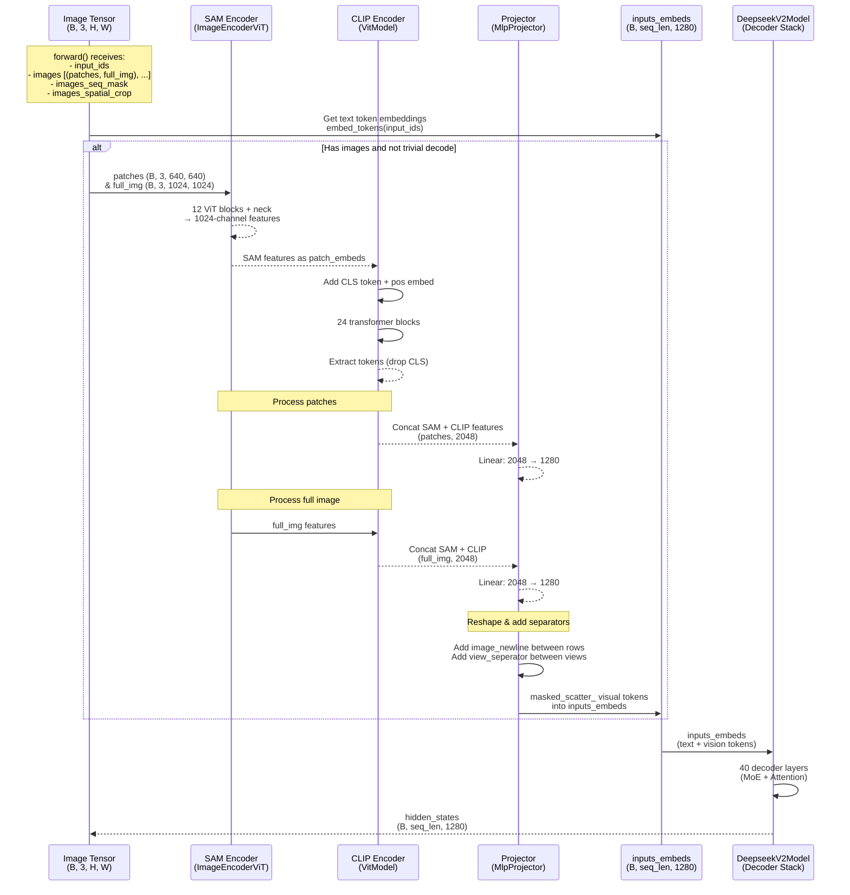

# DeepseekOCRModel

## What It Is
`DeepseekOCRModel` is the core transformer model for DeepSeek-OCR. It extends `DeepseekV2Model` (the base LLM decoder) with vision encoding capabilities by adding:
1. **SAM-style vision encoder** (`ImageEncoderViT`) for high-resolution spatial features
2. **CLIP-style vision encoder** (`VitModel`) for semantic features
3. **Multimodal projector** (`MlpProjector`) to map concatenated vision features into LLM embedding space
4. **Learned separator tokens** (`image_newline`, `view_seperator`) for spatial layout encoding

The model processes images through dual vision encoders, projects their features, and injects them into the LLM's token embedding sequence before passing through the decoder stack.

## Definition
```python
class DeepseekOCRModel(DeepseekV2Model):
    config_class = DeepseekOCRConfig

    def __init__(self, config: DeepseekV2Config):
        super(DeepseekOCRModel, self).__init__(config)

        self.sam_model = build_sam_vit_b()          # SAM encoder (ImageEncoderViT)
        self.vision_model = build_clip_l()          # CLIP encoder (VitModel)
        n_embed = 1280                              # LLM embedding dimension
        self.projector = MlpProjector(Dict(
            projector_type="linear",
            input_dim=2048,                         # Concatenated SAM(1024) + CLIP(1024)
            n_embed=n_embed
        ))
        embed_std = 1 / torch.sqrt(torch.tensor(n_embed, dtype=torch.float32))
        self.image_newline = nn.Parameter(torch.randn(n_embed) * embed_std)
        self.view_seperator = nn.Parameter(torch.randn(n_embed) * embed_std)
```

## Constructor Information
**Location**: `models/deepseek-ocr/modeling_deepseekocr.py:354-368`

**Signature**:
```python
def __init__(self, config: DeepseekV2Config)
```

**Parameters**:
- `config`: `DeepseekV2Config` instance with all LLM configuration parameters

**Created Components**:
1. **Inherited from DeepseekV2Model**:
   - `self.embed_tokens`: Token embedding lookup (vocab_size → hidden_size)
   - `self.layers`: ModuleList of `DeepseekV2DecoderLayer` (transformer blocks)
   - `self.norm`: Final RMSNorm layer

2. **New Vision Components**:
   - `self.sam_model`: `ImageEncoderViT` (SAM-B architecture):
     - 12 transformer blocks, 768d, 12 heads
     - Outputs 1024-channel feature maps via convolutional neck
   - `self.vision_model`: `VitModel` (CLIP-Large architecture):
     - 24 transformer blocks, 1024d, 16 heads
     - Processes SAM features as patch embeddings
   - `self.projector`: `MlpProjector`:
     - Linear projection: 2048d → 1280d
     - Maps concatenated SAM+CLIP features to LLM embedding space
   - `self.image_newline`: Learnable 1280d separator token (inserted between spatial rows)
   - `self.view_seperator`: Learnable 1280d separator token (inserted between global/local views)

## Module Internals



## Key Pseudo Code

```python
def forward(
    self,
    input_ids,
    images=None,                # List of (patches_tensor, full_img_tensor) tuples
    images_seq_mask=None,       # Bool mask: True for image token positions
    images_spatial_crop=None,   # (width_crop_num, height_crop_num) per image
    **kwargs
):
    # 1. Get text token embeddings
    inputs_embeds = self.embed_tokens(input_ids)  # (B, seq_len, 1280)

    # 2. Process images if present (skip during decode-only generation)
    if self.sam_model is not None and not_trivial_decode(images):
        for (patches, full_img), crop_shape, mask in zip(images, images_spatial_crop, images_seq_mask):
            # Process tiled patches (if cropping enabled)
            if patches.sum() != 0:
                sam_features_patches = self.sam_model(patches)        # (P, 1024, H', W')
                clip_features_patches = self.vision_model(patches, sam_features_patches)  # (P, N, 1024)
                local_features = torch.cat([clip_features_patches[:, 1:],
                                           sam_features_patches.flatten(2).permute(0,2,1)],
                                          dim=-1)  # (P, N, 2048)
                local_features = self.projector(local_features)       # (P, N, 1280)

                # Reshape into spatial grid: (height_crop_num * h, width_crop_num * w, 1280)
                # Add image_newline tokens between rows

            # Process full image (global view)
            sam_features_global = self.sam_model(full_img)           # (1, 1024, H', W')
            clip_features_global = self.vision_model(full_img, sam_features_global)  # (1, N, 1024)
            global_features = torch.cat([clip_features_global[:, 1:],
                                        sam_features_global.flatten(2).permute(0,2,1)],
                                       dim=-1)  # (1, N, 2048)
            global_features = self.projector(global_features)        # (1, N, 1280)

            # Add image_newline between rows, view_seperator between views
            combined_features = torch.cat([local_features, global_features,
                                          self.view_seperator], dim=0)

            # 3. Inject visual tokens into text embedding sequence
            inputs_embeds[batch_idx].masked_scatter_(mask.unsqueeze(-1), combined_features)

    # 4. Pass through LLM decoder
    return super().forward(
        input_ids=None,
        inputs_embeds=inputs_embeds,
        **kwargs
    )
```

## FLOP Count and Memory Usage Impact

### FLOPs (per forward pass)

Assume:
- `B` = batch size
- `S` = sequence length (text + image tokens)
- `P` = number of image patches (e.g., 6 for 2×3 tiling)
- `h_img` = 1024 (SAM output resolution), `w_img` = 1024
- `h_patch` = 640 (patch resolution), `w_patch` = 640
- `d_sam` = 1024 (SAM feature channels)
- `d_clip` = 1024 (CLIP feature channels)
- `d_model` = 1280 (LLM embedding dimension)

#### Vision Encoding (per image):

1. **SAM Encoder** (ImageEncoderViT):
   ```
   FLOPs_sam = 12 blocks × (attention + MLP) for (H_patch, W_patch) = (64, 64)
            ≈ 12 × [2 × 64² × 768² (attn QKV) + 2 × 64² × 768 × 3072 (MLP)]
            ≈ 12 × [2 × 4096 × 589824 + 2 × 4096 × 2359296]
            ≈ 12 × [4.8G + 19.3G] ≈ 290 GFLOPs per image

   For patches: P × 290 GFLOPs (e.g., 6 patches = 1.74 TFLOPs)
   For full image: 1 × 290 GFLOPs
   ```

2. **CLIP Encoder** (VitModel):
   ```
   FLOPs_clip = 24 blocks × (attention + MLP) for N tokens ≈ 256
             ≈ 24 × [2 × 256 × 1024² (attn) + 2 × 256 × 1024 × 4096 (MLP)]
             ≈ 24 × [0.54G + 2.15G] ≈ 64.5 GFLOPs per image

   For patches: P × 64.5 GFLOPs
   For full image: 1 × 64.5 GFLOPs
   ```

3. **Projector** (MlpProjector):
   ```
   FLOPs_proj = 2 × N_tokens × 2048 × 1280
              = 2 × 256 × 2048 × 1280 ≈ 1.34 GFLOPs per image

   For patches: P × 1.34 GFLOPs
   For full image: 1 × 1.34 GFLOPs
   ```

**Total Vision FLOPs per image** (with P=6 patches):
```
= (6 + 1) × (290 + 64.5 + 1.34) GFLOPs
= 7 × 355.84 GFLOPs
≈ 2.49 TFLOPs
```

#### LLM Decoder (inherited from DeepseekV2Model):
```
FLOPs_llm ≈ 40 layers × [attention + MoE] × S tokens
          ≈ varies by sequence length and MoE sparsity
          (See op-DeepseekV2Model.md for full breakdown)
```

**Key Insight**: Vision encoding is a one-time cost during prefill. For a document image with 6 patches, vision accounts for ~2.5 TFLOPs, while the LLM decoder dominates the total compute (especially during long-context OCR generation).

### Memory Usage

#### Parameters:

1. **Vision Encoders**:
   ```
   SAM: ~90M parameters (12 layers × 768d)
   CLIP: ~300M parameters (24 layers × 1024d)
   Projector: 2048 × 1280 = 2.6M parameters
   Separators: 2 × 1280 = 2560 parameters

   Total vision: ~393M parameters
   At bf16: 393M × 2 bytes ≈ 786 MB
   ```

2. **LLM Decoder** (inherited):
   ```
   See op-DeepseekV2Model.md for full breakdown
   (includes token embeddings, 40 decoder layers with MoE)
   ```

#### Activations (during forward pass):

1. **Vision Activations** (per image, batch=1):
   ```
   SAM intermediate: (P+1) × 1024 × 64 × 64 × bf16 ≈ 7 × 8.4 MB ≈ 59 MB
   CLIP intermediate: (P+1) × 1024 × 256 × bf16 ≈ 7 × 0.5 MB ≈ 3.5 MB
   Projected features: (P+1) × 256 × 1280 × bf16 ≈ 7 × 0.66 MB ≈ 4.6 MB

   Peak vision activation: ~67 MB per image
   ```

2. **Combined Embeddings** (`inputs_embeds`):
   ```
   Memory = B × S × d_model × sizeof(bf16)
   Example (S=8192, B=1): 1 × 8192 × 1280 × 2 bytes ≈ 21 MB
   ```

3. **LLM Activations**:
   ```
   Dominated by decoder layer activations and KV cache
   (See op-DeepseekV2Model.md)
   ```

**Memory Optimization**:
- Vision encoders run in `torch.no_grad()` context (lines 416-417) to avoid storing intermediate activations for backprop during inference
- SAM and CLIP features are discarded after projection, not cached
- Only final projected features are injected into LLM embeddings

## Related Modules
- **Used by**: `DeepseekOCRForCausalLM.model`
- **Inherits from**: `DeepseekV2Model` (`modeling_deepseekv2.py:1452`)
- **Vision components**: `ImageEncoderViT` (SAM), `VitModel` (CLIP), `MlpProjector`
- **Consumes**: `DeepseekOCRConfig`

## Usage Pattern
```python
from modeling_deepseekocr import DeepseekOCRModel, DeepseekOCRConfig

config = DeepseekOCRConfig.from_pretrained("deepseek-ai/DeepSeek-OCR")
model = DeepseekOCRModel(config)

# Forward pass
outputs = model(
    input_ids=input_ids,                    # Text token IDs
    images=[(patches, full_img)],          # List of (patches, full_img) tensors
    images_seq_mask=images_seq_mask,       # Bool mask for image token positions
    images_spatial_crop=[(2, 3)],          # Crop grid dimensions
)
hidden_states = outputs.last_hidden_state  # (B, seq_len, 1280)
```
