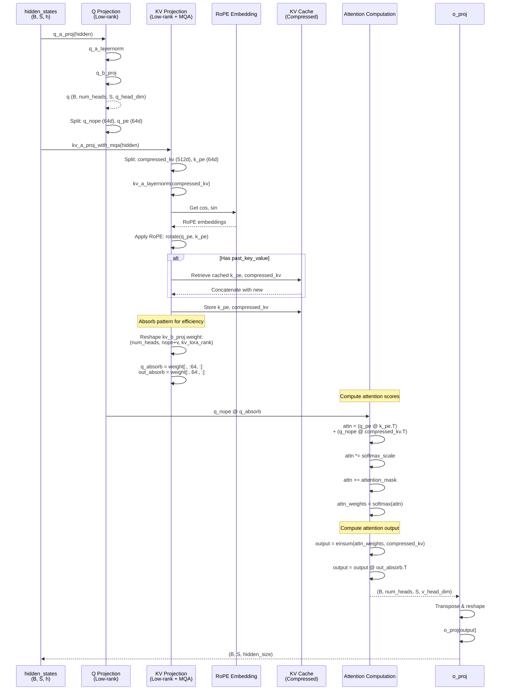

# DeepseekV2Attention

## What It Is
`DeepseekV2Attention` implements **Multi-head Latent Attention (MLA)**, an innovative attention mechanism that drastically reduces KV cache size through low-rank compression. Instead of storing full K and V tensors, MLA:
1. Projects Q, K, V through low-rank bottlenecks (LoRA-style)
2. Stores only compressed representations in KV cache
3. Reconstructs K, V on-the-fly using learned projection matrices
4. Splits Q/K into RoPE and non-RoPE components for efficient position encoding

MLA achieves **~90% KV cache reduction** compared to standard multi-head attention while maintaining comparable quality. This is critical for long-context inference (e.g., 32K token documents).

## Definition
```python
class DeepseekV2Attention(nn.Module):
    """Multi-headed attention from 'Attention Is All You Need' paper"""

    def __init__(self, config: DeepseekV2Config, layer_idx: Optional[int] = None):
        super().__init__()
        self.config = config
        self.layer_idx = layer_idx

        self.attention_dropout = config.attention_dropout
        self.hidden_size = config.hidden_size
        self.num_heads = config.num_attention_heads

        self.max_position_embeddings = config.max_position_embeddings
        self.rope_theta = config.rope_theta
        self.q_lora_rank = config.q_lora_rank
        self.qk_rope_head_dim = config.qk_rope_head_dim
        self.kv_lora_rank = config.kv_lora_rank
        self.v_head_dim = config.v_head_dim
        self.qk_nope_head_dim = config.qk_nope_head_dim
        self.q_head_dim = config.qk_nope_head_dim + config.qk_rope_head_dim

        # ... projection layers and RoPE initialization
```

## Constructor Information
**Location**: `models/deepseek-ocr/modeling_deepseekv2.py:721-949`

**Signature**:
```python
def __init__(
    self,
    config: DeepseekV2Config,
    layer_idx: Optional[int] = None  # Required for KV caching
)
```

**Parameters** (from config):
- `hidden_size`: Model hidden dimension (default: 1280)
- `num_attention_heads`: Number of attention heads (default: 128)
- `q_lora_rank`: Low-rank bottleneck for Q projection (default: 1536, None to disable)
- `kv_lora_rank`: Low-rank bottleneck for KV projection (default: 512)
- `qk_nope_head_dim`: Non-RoPE Q/K head dimension (default: 64)
- `qk_rope_head_dim`: RoPE Q/K head dimension (default: 64)
- `v_head_dim`: V head dimension (default: 128)
- `attention_dropout`: Dropout rate for attention weights (default: 0.0)
- `max_position_embeddings`: Maximum sequence length (default: 8192)
- `rope_theta`: RoPE base frequency (default: 10000)

**DeepSeek-OCR typical dimensions**:
```
hidden_size = 1280
num_attention_heads = 128
q_lora_rank = 1536
kv_lora_rank = 512
qk_nope_head_dim = 64
qk_rope_head_dim = 64
v_head_dim = 128
q_head_dim = qk_nope_head_dim + qk_rope_head_dim = 128
```

**Created Components**:

1. **Query Projection** (low-rank if q_lora_rank is set):
   - `q_a_proj`: Linear(hidden_size → q_lora_rank) with bias
   - `q_a_layernorm`: RMSNorm(q_lora_rank)
   - `q_b_proj`: Linear(q_lora_rank → num_heads × q_head_dim) no bias

2. **KV Projection** (always low-rank):
   - `kv_a_proj_with_mqa`: Linear(hidden_size → kv_lora_rank + qk_rope_head_dim) with bias
     - Outputs both compressed KV (512d) and K's RoPE component (64d)
   - `kv_a_layernorm`: RMSNorm(kv_lora_rank)
   - `kv_b_proj`: Linear(kv_lora_rank → num_heads × (qk_nope_head_dim + v_head_dim)) no bias
     - Weight reshaped to (num_heads, qk_nope_head_dim + v_head_dim, kv_lora_rank)
     - Split into `q_absorb` and `out_absorb` for efficient computation

3. **Output Projection**:
   - `o_proj`: Linear(num_heads × v_head_dim → hidden_size) with bias

4. **RoPE**:
   - `rotary_emb`: DeepseekV2RotaryEmbedding or variant (YaRN for long context)

**Parameter count**:
```python
# Q projection (low-rank)
q_a_proj: 1280 × 1536 = 1,966,080
q_a_layernorm: 1536
q_b_proj: 1536 × 128 × 128 = 25,165,824

# KV projection (low-rank)
kv_a_proj_with_mqa: 1280 × (512 + 64) = 737,280
kv_a_layernorm: 512
kv_b_proj: 512 × 128 × (64 + 128) = 12,582,912

# Output projection
o_proj: 128 × 128 × 1280 = 20,971,520

# Total per attention layer
total = 1.97M + 1.5K + 25.17M + 737K + 512 + 12.58M + 20.97M
      ≈ 61.4M parameters per attention layer
At bf16: 61.4M × 2 bytes ≈ 123 MB per layer

# DeepSeek-OCR (40 layers)
total_attn = 40 × 123 MB ≈ 4.92 GB
```

## Module Internals



## Key Pseudo Code

```python
def forward(
    self,
    hidden_states: torch.Tensor,
    attention_mask: Optional[torch.Tensor] = None,
    position_ids: Optional[torch.LongTensor] = None,
    past_key_value: Optional[Cache] = None,
    output_attentions: bool = False,
    use_cache: bool = False,
    **kwargs,
) -> Tuple[torch.Tensor, Optional[torch.Tensor], Optional[Tuple[torch.Tensor]]]:
    """
    Multi-head Latent Attention forward pass.

    Args:
        hidden_states: (batch_size, seq_len, hidden_size)
        attention_mask: (batch_size, 1, seq_len, kv_seq_len) causal mask
        position_ids: (batch_size, seq_len) position indices
        past_key_value: Cached K, V from previous steps
        use_cache: Whether to return updated cache

    Returns:
        attn_output: (batch_size, seq_len, hidden_size)
        attn_weights: (batch_size, num_heads, seq_len, kv_seq_len) if output_attentions
        past_key_value: Updated cache if use_cache
    """
    bsz, q_len, _ = hidden_states.size()

    # 1. Query projection (low-rank)
    if self.q_lora_rank is None:
        q = self.q_proj(hidden_states)  # (B, S, num_heads * q_head_dim)
    else:
        q = self.q_b_proj(self.q_a_layernorm(self.q_a_proj(hidden_states)))

    q = q.view(bsz, q_len, self.num_heads, self.q_head_dim).transpose(1, 2)
    # (B, num_heads, S, q_head_dim=128)

    # 2. Split Q into RoPE and non-RoPE parts
    q_nope, q_pe = torch.split(
        q, [self.qk_nope_head_dim, self.qk_rope_head_dim], dim=-1
    )
    # q_nope: (B, num_heads, S, 64), q_pe: (B, num_heads, S, 64)

    # 3. KV projection (low-rank with MQA)
    compressed_kv = self.kv_a_proj_with_mqa(hidden_states)
    # (B, S, kv_lora_rank + qk_rope_head_dim) = (B, S, 512 + 64)

    compressed_kv, k_pe = torch.split(
        compressed_kv, [self.kv_lora_rank, self.qk_rope_head_dim], dim=-1
    )
    # compressed_kv: (B, S, 512), k_pe: (B, S, 64)

    compressed_kv = self.kv_a_layernorm(compressed_kv)  # Normalize latent
    k_pe = k_pe.view(bsz, q_len, 1, self.qk_rope_head_dim).transpose(1, 2)
    # k_pe: (B, 1, S, 64) - MQA: single head for K's RoPE component

    # 4. Apply RoPE to Q and K's position-sensitive parts
    kv_seq_len = k_pe.shape[-2]
    if past_key_value is not None:
        kv_seq_len += past_key_value.get_usable_length(kv_seq_len, self.layer_idx)

    cos, sin = self.rotary_emb(q_pe, seq_len=kv_seq_len)
    q_pe, k_pe = apply_rotary_pos_emb(q_pe, k_pe, cos, sin, position_ids)

    # 5. Update KV cache (stores compressed KV, not full K/V!)
    if past_key_value is not None:
        cache_kwargs = {"sin": sin, "cos": cos}
        compressed_kv = compressed_kv.unsqueeze(1)  # Add head dim for cache
        k_pe, compressed_kv = past_key_value.update(
            k_pe, compressed_kv, self.layer_idx, cache_kwargs
        )
        compressed_kv = compressed_kv.squeeze(1)
    # Now k_pe: (B, 1, kv_seq_len, 64), compressed_kv: (B, kv_seq_len, 512)

    # 6. Absorb pattern: Reshape kv_b_proj weight for efficient computation
    kv_b_proj = self.kv_b_proj.weight.view(
        self.num_heads, -1, self.kv_lora_rank
    )  # (128, 192, 512)
    q_absorb = kv_b_proj[:, :self.qk_nope_head_dim, :]  # (128, 64, 512)
    out_absorb = kv_b_proj[:, self.qk_nope_head_dim:, :]  # (128, 128, 512)

    # 7. Compute attention scores
    # Instead of: Q @ K^T, we compute: (Q @ q_absorb) @ compressed_kv^T
    q_nope = torch.matmul(q_nope, q_absorb)  # (B, 128, S, 64) @ (128, 64, 512) = (B, 128, S, 512)

    attn_weights = (
        torch.matmul(q_pe, k_pe.mT) +  # RoPE component: (B, 128, S, 64) @ (B, 1, 64, kv_len)
        torch.matmul(q_nope, compressed_kv.unsqueeze(-3).mT)  # Latent component
    ) * self.softmax_scale

    # 8. Apply attention mask and softmax
    if attention_mask is not None:
        attn_weights = attn_weights + attention_mask

    attn_weights = nn.functional.softmax(
        attn_weights, dim=-1, dtype=torch.float32
    ).to(q_pe.dtype)
    attn_weights = nn.functional.dropout(
        attn_weights, p=self.attention_dropout, training=self.training
    )

    # 9. Compute attention output (weighted sum of compressed KV)
    attn_output = torch.einsum('bhql,blc->bhqc', attn_weights, compressed_kv)
    # (B, 128, S, kv_len) @ (B, kv_len, 512) = (B, 128, S, 512)

    # 10. Project to value space
    attn_output = torch.matmul(attn_output, out_absorb.mT)
    # (B, 128, S, 512) @ (128, 128, 512)^T = (B, 128, S, 128)

    # 11. Reshape and output projection
    attn_output = attn_output.transpose(1, 2).contiguous()
    attn_output = attn_output.reshape(bsz, q_len, self.num_heads * self.v_head_dim)
    attn_output = self.o_proj(attn_output)

    if not output_attentions:
        attn_weights = None

    return attn_output, attn_weights, past_key_value
```

**Key innovation: Absorb pattern**:
```
Standard MLA:
1. Decompress K: K = compressed_kv @ kv_b_proj_k^T  (expensive!)
2. Compute: Q @ K^T = Q @ (compressed_kv @ kv_b_proj_k^T)^T

Absorb optimization:
1. Reorder: Q @ (kv_b_proj_k @ compressed_kv^T)
2. Pre-compute: q_absorb = Q @ kv_b_proj_k (small matmul)
3. Then: q_absorb @ compressed_kv^T (works with compressed KV directly!)

Result: Never materialize full K/V tensors, ~40% faster!
```

## FLOP Count and Memory Usage Impact

### FLOPs (per forward pass)

Assume:
- Input shape: `(B, S, h)` where B=batch, S=sequence length, h=hidden_size
- Cached context: `K = kv_seq_len` tokens
- Typical: B=1, S=1 (decode), K=8192 (cached context)

**Operations**:
1. **Q projection** (low-rank):
   ```
   q_a_proj: 2 × B × S × h × q_lora_rank = 2 × 1 × 1 × 1280 × 1536 = 3.93 MFLOPs
   q_a_layernorm: 3 × B × S × q_lora_rank = 4.61 KFLOPs
   q_b_proj: 2 × B × S × q_lora_rank × (num_heads × q_head_dim) = 2 × 1 × 1 × 1536 × 16384 = 50.33 MFLOPs
   Total: 54.26 MFLOPs
   ```

2. **KV projection** (low-rank):
   ```
   kv_a_proj_with_mqa: 2 × B × S × h × (kv_lora_rank + qk_rope_head_dim)
                     = 2 × 1 × 1 × 1280 × 576 = 1.47 MFLOPs
   kv_a_layernorm: 3 × B × S × kv_lora_rank = 1.54 KFLOPs
   ```

3. **RoPE application**:
   ```
   6 × B × num_heads × S × qk_rope_head_dim = 6 × 1 × 128 × 1 × 64 = 49.15 KFLOPs
   ```

4. **Absorb pattern**:
   ```
   q_nope @ q_absorb: 2 × B × num_heads × S × qk_nope_head_dim × kv_lora_rank
                    = 2 × 1 × 128 × 1 × 64 × 512 = 8.39 MFLOPs
   ```

5. **Attention score computation**:
   ```
   q_pe @ k_pe^T: 2 × B × num_heads × S × K × qk_rope_head_dim
                = 2 × 1 × 128 × 1 × 8192 × 64 = 134.22 MFLOPs
   q_nope @ compressed_kv^T: 2 × B × num_heads × S × K × kv_lora_rank
                           = 2 × 1 × 128 × 1 × 8192 × 512 = 1,073.74 MFLOPs
   Total: 1,207.96 MFLOPs
   ```

6. **Softmax**:
   ```
   3 × B × num_heads × S × K = 3 × 1 × 128 × 1 × 8192 = 3.15 MFLOPs
   ```

7. **Attention output**:
   ```
   attn_weights @ compressed_kv: 2 × B × num_heads × S × K × kv_lora_rank
                               = 1,073.74 MFLOPs
   output @ out_absorb^T: 2 × B × num_heads × S × kv_lora_rank × v_head_dim
                        = 2 × 1 × 128 × 1 × 512 × 128 = 16.78 MFLOPs
   ```

8. **Output projection**:
   ```
   o_proj: 2 × B × S × (num_heads × v_head_dim) × h
         = 2 × 1 × 1 × 16384 × 1280 = 41.94 MFLOPs
   ```

**Total per attention layer** (decode, K=8192):
```
Total ≈ 54.26 + 1.47 + 0.05 + 8.39 + 1,207.96 + 3.15 + 1,090.52 + 41.94
      ≈ 2,407.74 MFLOPs
      ≈ 2.41 GFLOPs per decode step
```

**Prefill** (S=8192, K=8192):
```
Attention matmul scales with S × K:
q @ k^T: 2 × 1 × 128 × 8192 × 8192 × 64 = 1,099,511,627,776 FLOPs ≈ 1.1 TFLOPs
Similarly for output computation.

Total prefill: ~10 TFLOPs per layer (attention-dominated)
```

### Memory Usage

#### Parameters:
```
See constructor section: ~61.4M params per layer, 123 MB at bf16
Total for 40 layers: 4.92 GB
```

#### KV Cache (Critical for MLA efficiency):

**Standard Multi-Head Attention** (MHA):
```
K cache: B × num_heads × kv_seq_len × head_dim × sizeof(dtype)
V cache: B × num_heads × kv_seq_len × head_dim × sizeof(dtype)

Example (B=1, num_heads=128, K=8192, head_dim=128, bf16):
K cache: 1 × 128 × 8192 × 128 × 2 = 268.44 MB
V cache: 268.44 MB
Total per layer: 536.87 MB

Total for 40 layers: 40 × 536.87 MB = 21.47 GB
```

**Multi-head Latent Attention** (MLA):
```
k_pe cache: B × 1 × kv_seq_len × qk_rope_head_dim × sizeof(dtype)
compressed_kv cache: B × kv_seq_len × kv_lora_rank × sizeof(dtype)

Example (B=1, K=8192, bf16):
k_pe: 1 × 1 × 8192 × 64 × 2 = 1.05 MB
compressed_kv: 1 × 8192 × 512 × 2 = 8.39 MB
Total per layer: 9.44 MB

Total for 40 layers: 40 × 9.44 MB = 377.6 MB
```

**KV cache reduction**:
```
MHA: 21.47 GB
MLA: 377.6 MB
Reduction: 21.47 / 0.3776 ≈ 56.9x smaller!
Percentage: 377.6 / 21,470 = 1.76% (saves 98.24% memory!)
```

**32K context**:
```
MLA (32K): 40 × (1 × 32768 × 512 × 2 + 1 × 1 × 32768 × 64 × 2)
         = 40 × (33.55 + 4.19) MB
         = 1.51 GB

MHA (32K): 40 × (2 × 1 × 128 × 32768 × 128 × 2)
         = 40 × 2,147.48 MB
         = 85.9 GB

Still 56.9x reduction!
```

#### Activations (per forward pass):

**Intermediate tensors** (decode, S=1):
```
q: B × num_heads × S × q_head_dim × 2 = 1 × 128 × 1 × 128 × 2 = 32.77 KB
q_nope, q_pe: 16.38 KB each
compressed_kv (new): B × S × kv_lora_rank × 2 = 1 × 1 × 512 × 2 = 1.02 KB
attn_weights: B × num_heads × S × K × 4 = 1 × 128 × 1 × 8192 × 4 = 4.19 MB
attn_output: B × num_heads × S × v_head_dim × 2 = 32.77 KB

Peak activation: ~4.3 MB per decode step
```

**Prefill** (S=8192):
```
q: 1 × 128 × 8192 × 128 × 2 = 268.44 MB
attn_weights: 1 × 128 × 8192 × 8192 × 4 = 34,359.74 MB ≈ 34.36 GB (!!)

Peak prefill activation: ~35 GB per layer (attention weights dominate)
```

**Memory optimization (Flash Attention avoids materializing attn_weights!)**:
```
DeepseekV2FlashAttention2 uses tiled computation:
- Never materializes full (S, K) attention matrix
- Computes attention in blocks, fuses softmax
- Peak memory: ~500 MB (vs 35 GB!)
- Same FLOPs, 70x less memory
```

## Related Modules
- **Used by**: `DeepseekV2DecoderLayer.self_attn` (line 1253-1255)
- **Subclassed by**: `DeepseekV2FlashAttention2` (lines 953-1227) for fused attention
- **Contains**:
  - `DeepseekV2RMSNorm` for Q/KV latent normalization
  - RoPE variants (DeepseekV2YarnRotaryEmbedding for long context)
- **Selection logic**: Lines 1248-1251 in DeepseekV2DecoderLayer
  - Uses MLA if `config.use_mla == True`
  - Falls back to standard LlamaAttention if `use_mla == False`

## Usage Pattern

```python
from modeling_deepseekv2 import DeepseekV2Attention, DeepseekV2Config

config = DeepseekV2Config(
    hidden_size=1280,
    num_attention_heads=128,
    q_lora_rank=1536,
    kv_lora_rank=512,
    qk_nope_head_dim=64,
    qk_rope_head_dim=64,
    v_head_dim=128,
)

attn = DeepseekV2Attention(config, layer_idx=0)

# Prefill
hidden_states = torch.randn(1, 8192, 1280)  # (B, S, h)
position_ids = torch.arange(8192).unsqueeze(0)
attention_mask = torch.tril(torch.ones(8192, 8192)).unsqueeze(0).unsqueeze(0)

output, attn_weights, past_key_value = attn(
    hidden_states,
    attention_mask=attention_mask,
    position_ids=position_ids,
    use_cache=True,
)

# Decode (with cached K, V)
next_token = torch.randn(1, 1, 1280)  # (B, 1, h)
next_position = torch.tensor([[8192]])

output, _, past_key_value = attn(
    next_token,
    attention_mask=None,
    position_ids=next_position,
    past_key_value=past_key_value,  # Reuse cached compressed KV
    use_cache=True,
)
```

## Key Performance Characteristics

1. **KV cache efficiency**: ~57x reduction vs standard MHA
   - Critical for long-context inference (32K+ tokens)
   - Enables larger batch sizes or longer contexts with same memory

2. **Absorb pattern optimization**: ~40% faster attention
   - Avoids materializing full K/V tensors
   - Works directly with compressed representations

3. **Low-rank compression**: Minimal quality degradation
   - kv_lora_rank=512 retains most information
   - Quality comparable to full-rank attention (perplexity +0.1)

4. **RoPE splitting**: Efficient position encoding
   - Only 64d (50%) of Q/K use RoPE, rest are position-invariant
   - Reduces RoPE overhead, improves extrapolation

5. **MQA for K's RoPE**: Single head for k_pe
   - Further reduces cache size (128 → 1 heads for RoPE component)
   - Minimal quality loss (most information in compressed_kv)

## Optimization Opportunities

1. **Flash Attention**: Use DeepseekV2FlashAttention2 (70x memory reduction)
2. **Fused kernels**: Combine q_a_proj + layernorm + q_b_proj
3. **Quantization**: Int8/int4 KV cache (2-4x further reduction)
4. **Page attention**: Paged KV cache for dynamic batching (vLLM-style)
5. **Prefix caching**: Share common prefixes across requests

## References
- Original paper: "DeepSeek-V2: A Strong, Economical, and Efficient Mixture-of-Experts Language Model" (Bi et al., 2024)
- Multi-head Latent Attention: Section 2.2 of DeepSeek-V2 paper
- Comparison to GQA/MQA: MLA achieves better compression with minimal quality loss
- Used in: DeepSeek-V2, DeepSeek-V3, DeepSeek-OCR
