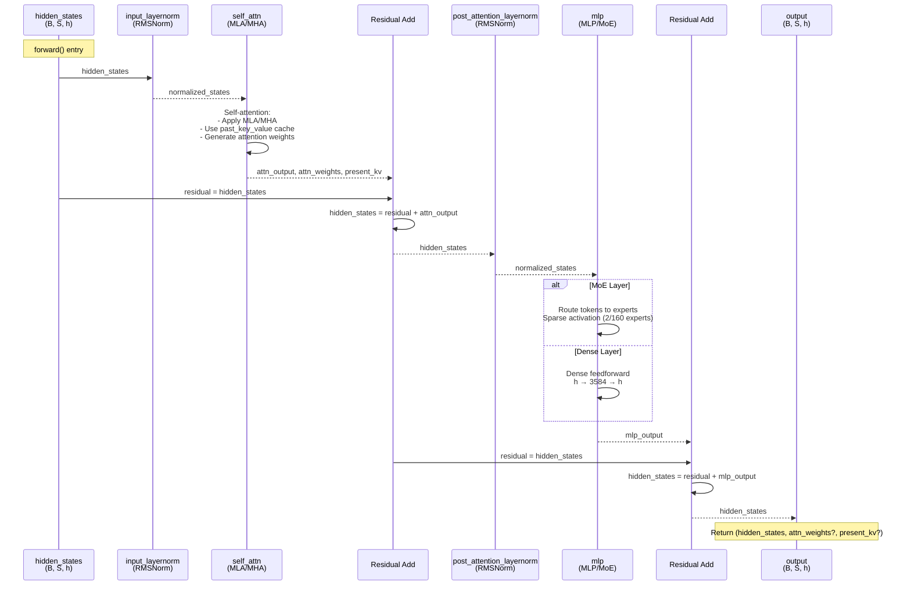

# DeepseekV2DecoderLayer

## What It Is
`DeepseekV2DecoderLayer` is a single transformer decoder block that combines:
1. **Multi-head Latent Attention (MLA)** or standard Multi-Head Attention (MHA) for self-attention
2. **Pre-norm architecture** with RMSNorm applied before both attention and MLP/MoE
3. **Mixture-of-Experts (MoE)** or dense MLP based on layer position
4. **Residual connections** after both attention and feedforward components

This is the fundamental building block of the DeepSeek-style decoder. It is
instantiated `config.num_hidden_layers` times to form the transformer stack
(12 layers in the shipped DeepSeek-OCR checkpoint). Each layer processes
hidden states through attention (capturing token dependencies) and feedforward
(applying non-linear transformations).

## Definition
```python
class DeepseekV2DecoderLayer(nn.Module):
    def __init__(self, config: DeepseekV2Config, layer_idx: int):
        super().__init__()
        self.hidden_size = config.hidden_size

        # Select attention implementation (MLA vs MHA, eager vs flash)
        if config.use_mla:
            attn_implementation = "mla_" + config._attn_implementation
        else:
            attn_implementation = "mha_" + config._attn_implementation

        self.self_attn = ATTENTION_CLASSES[attn_implementation](
            config=config, layer_idx=layer_idx
        )

        # Select MLP or MoE based on layer position
        self.mlp = (
            DeepseekV2MoE(config)
            if (
                config.n_routed_experts is not None
                and layer_idx >= config.first_k_dense_replace
                and layer_idx % config.moe_layer_freq == 0
            )
            else DeepseekV2MLP(config)
        )

        self.input_layernorm = DeepseekV2RMSNorm(
            config.hidden_size, eps=config.rms_norm_eps
        )
        self.post_attention_layernorm = DeepseekV2RMSNorm(
            config.hidden_size, eps=config.rms_norm_eps
        )
```

## Constructor Information
**Location**: `models/deepseek-ocr/modeling_deepseekv2.py:1242-1271`

**Signature**:
```python
def __init__(self, config: DeepseekV2Config, layer_idx: int)
```

**Parameters**:
- `config`: DeepseekV2Config object containing all hyperparameters.
- `layer_idx`: Zero-based layer index, used both for KV-cache indexing and to
  decide whether this layer uses dense MLP or MoE.

**Key config parameters**:
- `hidden_size`: Hidden dimension (e.g., 4096 in `DeepseekV2Config` defaults,
  1280 in DeepSeek-OCR).
- `use_mla`: Whether to use Multi-head Latent Attention
  (`True` by default in `DeepseekV2Config`, but `False` in the
  DeepSeek-OCR checkpoint, which uses standard LLaMA attention).
- `_attn_implementation`: `"eager"` or `"flash_attention_2"`.
- `n_routed_experts`: Number of MoE experts (e.g., 64 in DeepSeek-OCR;
  `None` disables MoE).
- `first_k_dense_replace`: First k layers use dense MLP (default: 1).
- `moe_layer_freq`: Use MoE every k layers (default: 1, meaning all layers
  after `first_k_dense_replace`).
- `rms_norm_eps`: Epsilon for RMSNorm (default: 1e-6).

**Layer configuration examples**:
```
# Generic MLA+MoE config (DeepSeek-V2-style)
first_k_dense_replace = 1
moe_layer_freq        = 1
n_routed_experts      = 160
num_hidden_layers     = 40
→ Layer 0      : Dense MLP
→ Layers 1..39 : MoE

# DeepSeek-OCR checkpoint (models/deepseek-ocr/config.json)
first_k_dense_replace = 1
moe_layer_freq        = 1
n_routed_experts      = 64
num_hidden_layers     = 12
use_mla               = False  # uses LLaMA attention, not MLA
→ Layer 0      : Dense MLP
→ Layers 1..11 : MoE
```

**Created Components**:

1. **self.self_attn**: Attention module
   - `DeepseekV2Attention` (MLA) or `DeepseekV2FlashAttention2` (MLA + fused)
     when `config.use_mla=True`.
   - `LlamaAttention` / `LlamaFlashAttention2` when `config.use_mla=False`
     (this is what DeepSeek-OCR uses by default).
   - See `op-DeepseekV2Attention.md` and `op-LlamaFlashAttention2.md` for
     details and parameter counts.

2. **self.mlp**: Feedforward module
   - `DeepseekV2MLP` for dense layers.
   - `DeepseekV2MoE` for sparse layers when MoE is enabled.
   - See `op-DeepseekV2MLP.md` and `op-DeepseekV2MoE.md` for formulas.

3. **self.input_layernorm**: Pre-attention RMSNorm
   - Parameters: 1,280 (hidden_size)

4. **self.post_attention_layernorm**: Pre-MLP RMSNorm
   - Parameters: 1,280

> The parameter and FLOP numbers in this file are based on a specific
> **40‑layer MLA + MoE** example (1 dense + 39 MoE layers, 160 experts), which
> is useful as a worked example but does **not** match the DeepSeek-OCR
> checkpoint. For OCR (12 layers, MHA, 64 routed experts), use the formulas in
> this file and in the MLP/MoE docs to recompute the true values.

## Module Internals



## Key Pseudo Code

```python
def forward(
    self,
    hidden_states: torch.Tensor,
    attention_mask: Optional[torch.Tensor] = None,
    position_ids: Optional[torch.LongTensor] = None,
    past_key_value: Optional[Tuple[torch.Tensor]] = None,
    output_attentions: Optional[bool] = False,
    use_cache: Optional[bool] = False,
    **kwargs,
) -> Tuple[torch.FloatTensor, Optional[Tuple[torch.FloatTensor, torch.FloatTensor]]]:
    """
    Single decoder layer forward pass implementing pre-norm transformer architecture.

    Args:
        hidden_states: (batch, seq_len, hidden_size) input tensor
        attention_mask: (batch, 1, seq_len, kv_seq_len) causal attention mask
        position_ids: (batch, seq_len) position indices for RoPE
        past_key_value: Cached K, V from previous decoding steps
        output_attentions: Whether to return attention weights
        use_cache: Whether to return updated KV cache

    Returns:
        outputs: Tuple of (hidden_states, attn_weights?, present_key_value?)
    """
    # 1. Save residual for first residual connection
    residual = hidden_states

    # 2. Pre-norm: Normalize before attention (pre-norm architecture)
    hidden_states = self.input_layernorm(hidden_states)

    # 3. Self-attention
    hidden_states, self_attn_weights, present_key_value = self.self_attn(
        hidden_states=hidden_states,
        attention_mask=attention_mask,
        position_ids=position_ids,
        past_key_value=past_key_value,
        output_attentions=output_attentions,
        use_cache=use_cache,
        **kwargs,
    )

    # 4. First residual connection
    hidden_states = residual + hidden_states

    # 5. Save residual for second residual connection
    residual = hidden_states

    # 6. Pre-norm: Normalize before feedforward
    hidden_states = self.post_attention_layernorm(hidden_states)

    # 7. Feedforward (MLP or MoE)
    hidden_states = self.mlp(hidden_states)

    # 8. Second residual connection
    hidden_states = residual + hidden_states

    # 9. Prepare outputs
    outputs = (hidden_states,)

    if output_attentions:
        outputs += (self_attn_weights,)

    if use_cache:
        outputs += (present_key_value,)

    return outputs
```

**Architecture pattern: Pre-norm vs Post-norm**:
```
Pre-norm (DeepSeek-OCR):
x → Norm → Attn → Add(x, attn_out) → Norm → FFN → Add(prev, ffn_out)

Post-norm (original Transformer):
x → Attn → Add(x, attn_out) → Norm → FFN → Add(prev, ffn_out) → Norm

Pre-norm advantages:
- More stable training (gradients don't explode in deep networks)
- Enables training very deep models (100+ layers)
- No warmup needed for learning rate
```

## FLOP Count and Memory Usage Impact

### FLOPs (per forward pass)

Assume:
- Input shape: `(B, S, h)` where B=batch, S=sequence length, h=hidden_size
- Typical decode: B=1, S=1, cached_context=K=8192
- Typical prefill: B=1, S=8192, K=8192

**Operations per layer**:

1. **input_layernorm** (RMSNorm):
   ```
   FLOPs ≈ 3 × B × S × h
   Decode: 3 × 1 × 1 × 1280 ≈ 3.84 KFLOPs
   Prefill: 3 × 1 × 8192 × 1280 ≈ 31.5 MFLOPs
   ```

2. **self_attn** (MLA):
   ```
   See op-DeepseekV2Attention.md for detailed breakdown
   Decode: ~2.41 GFLOPs
   Prefill: ~10 TFLOPs
   ```

3. **post_attention_layernorm** (RMSNorm):
   ```
   Same as input_layernorm
   Decode: 3.84 KFLOPs
   Prefill: 31.5 MFLOPs
   ```

4. **mlp** (Dense or MoE):
   ```
   Dense MLP (layer 0):
     Decode: ~32.5 MFLOPs
     Prefill: ~266 GFLOPs

   MoE (layers 1-39):
     Decode: ~360 GFLOPs
     Prefill: ~2.95 TFLOPs
   ```

**Total per layer**:
```
Dense layer (layer 0):
  Decode: 3.84K + 2.41G + 3.84K + 32.5M ≈ 2.44 GFLOPs
  Prefill: 31.5M + 10T + 31.5M + 266G ≈ 10.27 TFLOPs

MoE layer (layers 1-39):
  Decode: 3.84K + 2.41G + 3.84K + 360G ≈ 362.4 GFLOPs
  Prefill: 31.5M + 10T + 31.5M + 2.95T ≈ 12.95 TFLOPs
```

> The FLOP figures above assume the same 40‑layer MLA + MoE example. For a
> different configuration, scale by `config.num_hidden_layers` and adjust the
> MoE part using the formulas in `op-DeepseekV2MoE.md`.

### Memory Usage

#### Parameters:
See constructor section and the per‑module docs (`DeepseekV2Attention`,
`DeepseekV2MLP`, `DeepseekV2MoE`). Total memory scales linearly with
`config.num_hidden_layers` and depends strongly on whether MLA + MoE are
enabled.

#### Activations (per forward pass):

**Decode** (S=1, K=8192):
```
Input: B × S × h × 2 = 1 × 1 × 1280 × 2 = 2.56 KB
norm1_output: 2.56 KB
attn_output: 2.56 KB
attn intermediate: ~4.3 MB (see op-DeepseekV2Attention.md)
norm2_output: 2.56 KB
mlp_output: 2.56 KB
mlp intermediate (MoE): ~143 MB (see op-DeepseekV2MoE.md)

Peak per layer: ~143 MB (MoE dominates)
```

**Prefill** (S=8192):
```
Input: 1 × 8192 × 1280 × 2 = 21 MB
Attention intermediate (with Flash Attention): ~500 MB
MLP intermediate (MoE): ~165 MB

Peak per layer: ~686 MB
```

> The stacked activation numbers (e.g., 40 × 143 MB) again correspond to the
> 40‑layer example. For DeepSeek-OCR, replace 40 with 12 and adjust attention /
> MoE choices according to its config.

#### KV Cache (critical for autoregressive decoding):
- With MLA (`DeepseekV2Attention`): each layer stores compressed KV caches;
  see `op-DeepseekV2Attention.md` for exact formulas (e.g., ~9.44 MB per layer
  at 8K context in the example config).
- With standard MHA (`LlamaAttention` / `LlamaFlashAttention2`), each layer
  stores full K/V; see `op-LlamaFlashAttention2.md` for approximate sizes.

## Related Modules
- **Used by**: `DeepseekV2Model.layers` (line 1468-1472) - stacked 40 times
- **Contains**:
  - `DeepseekV2Attention` or `DeepseekV2FlashAttention2` for self-attention
  - `DeepseekV2MLP` for dense feedforward (layer 0)
  - `DeepseekV2MoE` for sparse feedforward (layers 1-39)
  - `DeepseekV2RMSNorm` for normalization (2 instances)
- **Selection logic**:
  - Attention: `ATTENTION_CLASSES[attn_implementation]` based on `use_mla` and `_attn_implementation`
  - MLP/MoE: Layer index determines dense (0) vs MoE (1-39)

## Usage Pattern

```python
from modeling_deepseekv2 import DeepseekV2DecoderLayer, DeepseekV2Config

config = DeepseekV2Config(
    hidden_size=1280,
    num_attention_heads=128,
    use_mla=True,
    n_routed_experts=160,
    first_k_dense_replace=1,
    moe_layer_freq=1,
)

# Dense layer (first layer)
layer_0 = DeepseekV2DecoderLayer(config, layer_idx=0)
# Will use DeepseekV2MLP (dense)

# MoE layer (subsequent layers)
layer_1 = DeepseekV2DecoderLayer(config, layer_idx=1)
# Will use DeepseekV2MoE (sparse)

# Prefill (first forward pass)
hidden_states = torch.randn(1, 8192, 1280, dtype=torch.bfloat16)
position_ids = torch.arange(8192).unsqueeze(0)
attention_mask = torch.tril(torch.ones(8192, 8192)).unsqueeze(0).unsqueeze(0)

outputs = layer_0(
    hidden_states=hidden_states,
    attention_mask=attention_mask,
    position_ids=position_ids,
    use_cache=True,
)

hidden_states, attn_weights, past_key_value = outputs

# Decode (subsequent tokens)
next_token = torch.randn(1, 1, 1280, dtype=torch.bfloat16)
next_position = torch.tensor([[8192]])

outputs = layer_0(
    hidden_states=next_token,
    position_ids=next_position,
    past_key_value=past_key_value,  # Reuse cached K, V
    use_cache=True,
)
```

## Key Performance Characteristics

1. **Pre-norm stability**: Enables training of 40-layer deep networks without gradient issues
2. **MLA efficiency**: ~57x KV cache reduction vs standard attention
3. **MoE sparsity**: 80x parameter efficiency (2/160 experts active per token)
4. **Flash Attention**: 70x memory reduction during prefill
5. **Hybrid architecture**: Dense first layer + MoE for rest balances quality and efficiency

## Optimization Opportunities

1. **Fused kernels**: Combine norm + attention/MLP in single kernel (reduce memory bandwidth)
2. **Expert parallelism**: Distribute MoE experts across GPUs
3. **Gradient checkpointing**: Reduce activation memory during training
4. **Quantization**: Int8/int4 for MLP/MoE weights (memory-bound inference)
5. **KV cache compression**: Further compress cached K, V (e.g., quantization, eviction)

## References
- Pre-norm architecture: "On Layer Normalization in the Transformer Architecture" (Xiong et al., 2020)
- Residual connections: "Deep Residual Learning for Image Recognition" (He et al., 2015)
- Multi-head Latent Attention: DeepSeek-V2 paper (Bi et al., 2024)
- Mixture-of-Experts: DeepSeek-MoE paper (Dai et al., 2024)
- Used in: DeepSeek-V2, DeepSeek-V3, DeepSeek-OCR
