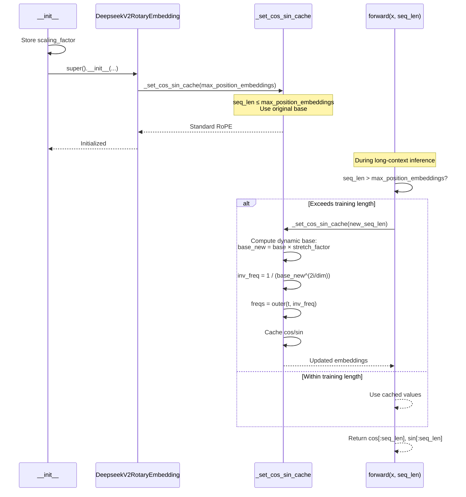

# DeepseekV2DynamicNTKScalingRotaryEmbedding

## What It Is
`DeepseekV2DynamicNTKScalingRotaryEmbedding` extends RoPE's context length through **dynamic NTK-aware (Neural Tangent Kernel) interpolation**. Unlike linear scaling which uniformly compresses positions, dynamic NTK adjusts the RoPE base frequency θ based on the sequence length, effectively "stretching" the embedding space while preserving relative position information.

This method, credited to Reddit users /u/bloc97 and /u/emozilla, provides better quality than linear scaling for large context extensions (4x-8x) by adapting the frequency spectrum dynamically.

## Definition
```python
class DeepseekV2DynamicNTKScalingRotaryEmbedding(DeepseekV2RotaryEmbedding):
    """DeepseekV2RotaryEmbedding extended with Dynamic NTK scaling."""

    def __init__(
        self,
        dim: int,
        max_position_embeddings: int = 2048,
        base: float = 10000,
        device=None,
        scaling_factor: float = 1.0,
    ):
        self.scaling_factor = scaling_factor
        super().__init__(dim, max_position_embeddings, base, device)

    def _set_cos_sin_cache(self, seq_len, device, dtype):
        self.max_seq_len_cached = seq_len

        # Dynamic base adjustment when seq_len exceeds training length
        if seq_len > self.max_position_embeddings:
            base = self.base * (
                (self.scaling_factor * seq_len / self.max_position_embeddings)
                - (self.scaling_factor - 1)
            ) ** (self.dim / (self.dim - 2))
            inv_freq = 1.0 / (
                base ** (torch.arange(0, self.dim, 2).float().to(device) / self.dim)
            )
            self.register_buffer("inv_freq", inv_freq, persistent=False)

        t = torch.arange(self.max_seq_len_cached, device=device, dtype=self.inv_freq.dtype)
        freqs = torch.outer(t, self.inv_freq)
        emb = torch.cat((freqs, freqs), dim=-1)
        self.register_buffer("cos_cached", emb.cos().to(dtype), persistent=False)
        self.register_buffer("sin_cached", emb.sin().to(dtype), persistent=False)
```

## Constructor Information
**Location**: `models/deepseek-ocr/modeling_deepseekv2.py:189-225`

**Signature**:
```python
def __init__(
    self,
    dim: int,
    max_position_embeddings: int = 2048,
    base: float = 10000,
    device=None,
    scaling_factor: float = 1.0,
)
```

**Parameters**:
- `dim`: Rotary embedding dimension (e.g., 64)
- `max_position_embeddings`: Training context length (e.g., 2048)
- `base`: Original RoPE base frequency θ (default: 10000)
- `device`: Device for buffer allocation
- `scaling_factor`: Target extension ratio (e.g., 2.0 for 2x extension)

**Created Components**:
- `self.scaling_factor`: Stored scaling factor
- Inherits from parent:
  - `self.dim`, `self.max_position_embeddings`, `self.base`
  - `self.inv_freq`: **Dynamically adjusted** when seq_len > max_position_embeddings
  - `self.cos_cached`, `self.sin_cached`: Precomputed cos/sin tensors

**Key Behavior**:
- When `seq_len ≤ max_position_embeddings`: Behaves like standard RoPE
- When `seq_len > max_position_embeddings`: Recomputes `inv_freq` with larger base

## Module Internals



## Key Pseudo Code

```python
def _set_cos_sin_cache(self, seq_len, device, dtype):
    """
    Precompute cos/sin with dynamic base adjustment.
    """
    self.max_seq_len_cached = seq_len

    # 1. Dynamic base adjustment (KEY FEATURE)
    if seq_len > self.max_position_embeddings:
        # Compute stretch factor
        alpha = (self.scaling_factor * seq_len / self.max_position_embeddings) - (self.scaling_factor - 1)

        # Adjust base frequency with NTK-aware exponent
        base_new = self.base * (alpha ** (self.dim / (self.dim - 2)))

        # Recompute inverse frequencies
        inv_freq = 1.0 / (
            base_new ** (torch.arange(0, self.dim, 2).float().to(device) / self.dim)
        )
        self.register_buffer("inv_freq", inv_freq, persistent=False)

    # 2. Generate position indices (standard)
    t = torch.arange(seq_len, device=device, dtype=self.inv_freq.dtype)

    # 3. Compute frequencies
    freqs = torch.outer(t, self.inv_freq)  # (seq_len, dim/2)

    # 4. Duplicate and cache
    emb = torch.cat((freqs, freqs), dim=-1)  # (seq_len, dim)
    self.register_buffer("cos_cached", emb.cos().to(dtype), persistent=False)
    self.register_buffer("sin_cached", emb.sin().to(dtype), persistent=False)
```

**Mathematical Formulation**:

Standard RoPE:
```
θ_i = base^(2i/dim)  for i in [0, dim/2)
freqs[m, i] = m / θ_i
```

Dynamic NTK Scaling:
```
When seq_len > max_position_embeddings:

  α = (s × L / L_train) - (s - 1)
  where s = scaling_factor, L = seq_len, L_train = max_position_embeddings

  base_new = base × α^(dim / (dim - 2))

  θ_i_new = base_new^(2i/dim)
  freqs[m, i] = m / θ_i_new

Effect: Lower frequencies (low i) get larger θ (more stretching)
        Higher frequencies (high i) get less stretching
        Preserves fine-grained position info while extending context
```

**Intuition**:
- **NTK exponent** `dim/(dim-2)` ensures frequency spectrum adapts non-uniformly
  - Low frequencies (capturing long-range dependencies) stretch more
  - High frequencies (capturing local patterns) stretch less
- **Example** (dim=64, base=10000, seq_len=8192, max_pos=2048, scaling_factor=2.0):
  ```
  α = (2.0 × 8192 / 2048) - (2.0 - 1) = 8 - 1 = 7
  base_new = 10000 × 7^(64/62) ≈ 10000 × 7.23 ≈ 72300

  θ_0 (lowest freq): 72300^(0) = 1 → stretches most
  θ_31 (highest freq): 72300^(62/64) ≈ 64000 → stretches moderately
  ```

## FLOP Count and Memory Usage Impact

### FLOPs

**Cache Computation** (when seq_len > max_position_embeddings):

Assume:
- `seq_len` = L (e.g., 8192)
- `dim` = d (e.g., 64)
- `max_position_embeddings` = L_train (e.g., 2048)

```
1. Compute alpha:
   FLOPs = 4 (arithmetic ops)

2. Compute base_new = base × alpha^(dim/(dim-2)):
   FLOPs = 2 (exponentiation + multiplication)

3. Compute inv_freq:
   - arange: 0 FLOPs (memory allocation)
   - Division: d/2 FLOPs
   - Exponentiation: d/2 FLOPs
   - Division (1.0 / ...): d/2 FLOPs
   Total: 1.5×d FLOPs

4. torch.outer(t, inv_freq):
   FLOPs = L × (d/2)

5. torch.cat, cos, sin:
   FLOPs = 2×L×d (transcendental functions)

Total cache computation (long context):
FLOPs ≈ 4 + 2 + 1.5×d + L×(d/2) + 2×L×d
      ≈ 2.5×L×d + 1.5×d + 6

Example (L=8192, d=64):
FLOPs ≈ 2.5 × 8192 × 64 + 1.5 × 64 + 6 ≈ 1.31 MFLOPs
```

**Cache Computation** (when seq_len ≤ max_position_embeddings):
```
FLOPs ≈ 2.5×L×d (same as base RoPE, no base adjustment)
```

**Runtime** (forward pass):
```
FLOPs = 2 (buffer slicing, negligible)
```

**Comparison to Other Methods**:
```
Dynamic NTK: 2.5×L×d + 1.5×d (extra ~100 FLOPs for base computation)
Linear Scaling: 2.5×L×d + L (extra L FLOPs for division)
Base RoPE: 2.5×L×d

Additional cost: <0.01% (negligible)
```

### Memory Usage

#### Parameters:
```
No learnable parameters
```

#### Cached Buffers:

```
inv_freq: (dim/2,) × fp32 = (32,) × 4 bytes = 128 bytes
  (Note: Gets recomputed when seq_len changes beyond max_position_embeddings)

cos_cached: (max_seq_len, dim) × dtype
sin_cached: (max_seq_len, dim) × dtype

Example (seq_len=8192, dim=64, bf16):
cos_cached: 8192 × 64 × 2 = 1 MB
sin_cached: 8192 × 64 × 2 = 1 MB

Total: ~2 MB per RoPE instance
```

**Dynamic Behavior**:
- Cache grows with `seq_len`: Memory = `2 × seq_len × dim × sizeof(dtype)`.
- For very long contexts (e.g., 128K), memory can be significant:
  ```
  128K context: 2 × 131072 × 64 × 2 bytes = 32 MB
  ```
- Total memory scales linearly with the number of decoder layers that use this
  embedding. If every layer uses Dynamic NTK scaling, total RoPE buffer memory
  is approximately `32 MB × num_hidden_layers` for a 128K context.

> The DeepSeek-OCR checkpoint ships with `rope_scaling = null`, so this
> Dynamic NTK variant is not active by default; it is available for extended
> context experiments via configuration.

#### Temporary Activations:

Same as linear scaling (~3 MB during cache computation, transient)

## Related Modules
- **Parent class**: `DeepseekV2RotaryEmbedding`
- **Used by**: `DeepseekV2Attention._init_rope()` when `config.rope_scaling["type"] == "dynamic"`
- **Alternative implementations**:
  - `DeepseekV2LinearScalingRotaryEmbedding` (simpler, lower quality)
  - `DeepseekV2YarnRotaryEmbedding` (higher quality, more complex)
- **Applied in**: `apply_rotary_pos_emb()`

## Usage Pattern

```python
from modeling_deepseekv2 import DeepseekV2DynamicNTKScalingRotaryEmbedding

# Configuration
config = {
    "qk_rope_head_dim": 64,
    "max_position_embeddings": 2048,  # Training length
    "rope_theta": 10000,
    "rope_scaling": {
        "type": "dynamic",
        "factor": 4.0  # Target 4x extension (2048 → 8192)
    }
}

# Instantiate
rotary_emb = DeepseekV2DynamicNTKScalingRotaryEmbedding(
    dim=config["qk_rope_head_dim"],
    max_position_embeddings=config["max_position_embeddings"],
    base=config["rope_theta"],
    scaling_factor=config["rope_scaling"]["factor"]
)

# Scenario 1: Short context (within training length)
cos_short, sin_short = rotary_emb(q, seq_len=1024)
# Uses original base, standard RoPE

# Scenario 2: Long context (exceeds training length)
cos_long, sin_long = rotary_emb(q, seq_len=8192)
# Triggers base adjustment: base_new ≈ 72300
# Returns embeddings for 8192 positions
```

**Configuration Example (config.json)**:
```json
{
  "rope_scaling": {
    "type": "dynamic",
    "factor": 4.0
  },
  "max_position_embeddings": 2048,
  "rope_theta": 10000
}
```

## Key Performance Characteristics

1. **Context Extension Quality**:
   - 2x-4x: Excellent, <2% perplexity increase
   - 4x-8x: Good, 2-5% perplexity increase
   - >8x: Moderate degradation, use YaRN for better results

2. **Computational Overhead**:
   - Same as base RoPE (~1.3 MFLOPs for 8K context)
   - Base recomputation happens only once per new seq_len

3. **Memory Overhead**:
   - Same as base RoPE (~2 MB for 8K, 32 MB for 128K)
   - Cache memory scales linearly with max sequence length

4. **Adaptive Behavior**:
   - Short sequences: Zero overhead (uses original RoPE)
   - Long sequences: Automatically adjusts base
   - No manual tuning required per sequence length

5. **Trade-offs**:
   - ✅ Better quality than linear scaling for large extensions
   - ✅ Automatic adaptation to sequence length
   - ✅ Negligible computational overhead
   - ✅ Preserves fine-grained position information
   - ❌ Slightly more complex than linear scaling
   - ❌ Cache recomputed when exceeding previous max_seq_len

6. **When to Use**:
   - Need 4x-8x context extension
   - Quality matters more than simplicity
   - Variable sequence lengths (benefits from adaptive behavior)
   - Prefer over linear scaling for production deployments

## References
- Original proposal: Reddit users /u/bloc97 and /u/emozilla (2023)
- Theory: Neural Tangent Kernel (NTK) interpolation
- Popularized by: LLaMA community, adopted by many open-source LLMs
- Paper: "Extending Context is Hard...but not Impossible" (bloc97, 2023)
- Used in: vLLM, LLaMA.cpp, Hugging Face transformers (as "dynamic" rope_scaling)
