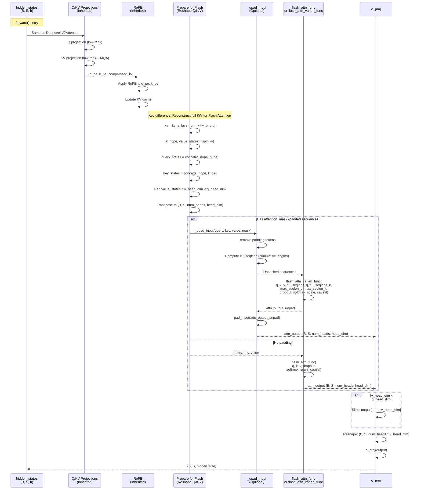

# DeepseekV2FlashAttention2

## What It Is
`DeepseekV2FlashAttention2` is an optimized implementation of `DeepseekV2Attention` that uses **Flash Attention 2** kernels for 3-4x faster wall-clock time and 70x lower memory usage. It maintains the same Multi-head Latent Attention (MLA) architecture but replaces the naive attention computation with fused, tiled kernels that:
1. Never materialize the full (seq_len × seq_len) attention matrix
2. Fuse softmax computation with attention score computation
3. Use tiling to maximize L2/SRAM reuse
4. Handle variable-length sequences efficiently with unpadding

This is the **recommended attention implementation** when using MLA with Flash
Attention 2. The shipped DeepSeek-OCR checkpoint sets `use_mla = false` and
uses the standard `LlamaFlashAttention2` path instead; this module becomes
active only if you enable MLA in the config.

## Definition
```python
class DeepseekV2FlashAttention2(DeepseekV2Attention):
    """
    DeepseekV2 flash attention module. This module inherits from `DeepseekV2Attention`
    as the weights of the module stays untouched. The only required change would be
    on the forward pass where it needs to correctly call the public API of flash
    attention and deal with padding tokens in case the input contains any of them.
    """

    def __init__(self, *args, **kwargs):
        super().__init__(*args, **kwargs)

        # Compatibility flag for flash_attn < 2.10
        self._flash_attn_uses_top_left_mask = not is_flash_attn_greater_or_equal_2_10()
```

## Constructor Information
**Location**: `models/deepseek-ocr/modeling_deepseekv2.py:953-1227`

**Signature**:
```python
def __init__(
    self,
    config: DeepseekV2Config,
    layer_idx: Optional[int] = None
)
```

**Parameters**: Same as `DeepseekV2Attention` (inherits all projections and hyperparameters)

**Key difference from base class**:
- Inherits all weights from `DeepseekV2Attention`
- Overrides `forward()` method to use `flash_attn_func` or `flash_attn_varlen_func`
- Adds `_flash_attention_forward()` and `_upad_input()` helper methods
- No additional learned parameters

## Module Internals



## Key Pseudo Code

```python
def forward(
    self,
    hidden_states: torch.Tensor,
    attention_mask: Optional[torch.LongTensor] = None,
    position_ids: Optional[torch.LongTensor] = None,
    past_key_value: Optional[Cache] = None,
    output_attentions: bool = False,
    use_cache: bool = False,
    **kwargs,
) -> Tuple[torch.Tensor, Optional[torch.Tensor], Optional[Tuple[torch.Tensor]]]:
    """
    Flash Attention 2 forward pass.

    Key differences from base DeepseekV2Attention:
    1. Reconstructs full K, V instead of working with compressed_kv
    2. Uses flash_attn_func for fused attention computation
    3. Handles variable-length sequences via unpadding

    Returns:
        Same as DeepseekV2Attention (output_attentions always None)
    """
    # Note: output_attentions is not supported by Flash Attention
    output_attentions = False

    bsz, q_len, _ = hidden_states.size()

    # 1-3. Same Q/KV projection and RoPE as base class
    if self.q_lora_rank is None:
        q = self.q_proj(hidden_states)
    else:
        q = self.q_b_proj(self.q_a_layernorm(self.q_a_proj(hidden_states)))
    q = q.view(bsz, q_len, self.num_heads, self.q_head_dim).transpose(1, 2)
    q_nope, q_pe = torch.split(
        q, [self.qk_nope_head_dim, self.qk_rope_head_dim], dim=-1
    )

    compressed_kv = self.kv_a_proj_with_mqa(hidden_states)
    compressed_kv, k_pe = torch.split(
        compressed_kv, [self.kv_lora_rank, self.qk_rope_head_dim], dim=-1
    )
    k_pe = k_pe.view(bsz, q_len, 1, self.qk_rope_head_dim).transpose(1, 2)

    # 4. Decompress KV (different from base class!)
    kv = (
        self.kv_b_proj(self.kv_a_layernorm(compressed_kv))
        .view(bsz, q_len, self.num_heads, self.qk_nope_head_dim + self.v_head_dim)
        .transpose(1, 2)
    )  # (B, num_heads, S, nope_dim + v_dim)

    k_nope, value_states = torch.split(
        kv, [self.qk_nope_head_dim, self.v_head_dim], dim=-1
    )
    # k_nope: (B, num_heads, S, 64), value_states: (B, num_heads, S, 128)

    # 5. Apply RoPE
    kv_seq_len = value_states.shape[-2]
    if past_key_value is not None:
        kv_seq_len += past_key_value.get_usable_length(kv_seq_len, self.layer_idx)

    cos, sin = self.rotary_emb(value_states, seq_len=kv_seq_len)
    q_pe, k_pe = apply_rotary_pos_emb(q_pe, k_pe, cos, sin, position_ids)

    # 6. Concatenate Q/K components
    query_states = k_pe.new_empty(bsz, self.num_heads, q_len, self.q_head_dim)
    query_states[:, :, :, :self.qk_nope_head_dim] = q_nope
    query_states[:, :, :, self.qk_nope_head_dim:] = q_pe

    key_states = k_pe.new_empty(bsz, self.num_heads, q_len, self.q_head_dim)
    key_states[:, :, :, :self.qk_nope_head_dim] = k_nope
    key_states[:, :, :, self.qk_nope_head_dim:] = k_pe

    # 7. Pad V to match Q/K head_dim (Flash Attention requirement)
    if self.q_head_dim != self.v_head_dim:
        value_states = F.pad(value_states, [0, self.q_head_dim - self.v_head_dim])
    # value_states now: (B, num_heads, S, 128) padded to (B, num_heads, S, 128)

    # 8. Update KV cache (stores full K, V, not compressed!)
    # Note: Flash Attention doesn't support compressed KV cache natively
    if past_key_value is not None:
        cache_kwargs = {"sin": sin, "cos": cos}
        key_states, value_states = past_key_value.update(
            key_states, value_states, self.layer_idx, cache_kwargs
        )

    # 9. Transpose to Flash Attention layout: (B, S, num_heads, head_dim)
    query_states = query_states.transpose(1, 2)
    key_states = key_states.transpose(1, 2)
    value_states = value_states.transpose(1, 2)

    # 10. Determine dropout rate
    dropout_rate = self.attention_dropout if self.training else 0.0

    # 11. Ensure correct dtype (avoid silent fp32 casting)
    input_dtype = query_states.dtype
    if input_dtype == torch.float32:
        if hasattr(self.config, "_pre_quantization_dtype"):
            target_dtype = self.config._pre_quantization_dtype
        elif torch.is_autocast_enabled():
            target_dtype = torch.get_autocast_gpu_dtype()
        else:
            target_dtype = (
                self.q_proj.weight.dtype
                if self.q_lora_rank is None
                else self.q_a_proj.weight.dtype
            )
        query_states = query_states.to(target_dtype)
        key_states = key_states.to(target_dtype)
        value_states = value_states.to(target_dtype)

    # 12. Call Flash Attention
    attn_output = self._flash_attention_forward(
        query_states,
        key_states,
        value_states,
        attention_mask,
        q_len,
        dropout=dropout_rate,
        softmax_scale=self.softmax_scale,
    )

    # 13. Unpad V if needed
    if self.q_head_dim != self.v_head_dim:
        attn_output = attn_output[:, :, :, :self.v_head_dim]

    # 14. Output projection
    attn_output = attn_output.reshape(
        bsz, q_len, self.num_heads * self.v_head_dim
    ).contiguous()
    attn_output = self.o_proj(attn_output)

    return attn_output, None, past_key_value  # attn_weights always None


def _flash_attention_forward(
    self,
    query_states,
    key_states,
    value_states,
    attention_mask,
    query_length,
    dropout=0.0,
    softmax_scale=None,
):
    """
    Calls Flash Attention with optional sequence unpadding for efficiency.

    Args:
        query_states: (B, S, num_heads, head_dim)
        key_states: (B, K, num_heads, head_dim)
        value_states: (B, K, num_heads, head_dim)
        attention_mask: (B, K) - 1 for real tokens, 0 for padding
        query_length: Query sequence length S
        dropout: Attention dropout rate
        softmax_scale: Scaling factor for attention scores (1/sqrt(d))

    Returns:
        attn_output: (B, S, num_heads, head_dim)
    """
    # Determine causality
    if not self._flash_attn_uses_top_left_mask:
        causal = self.is_causal
    else:
        # Compatibility for flash_attn < 2.10
        causal = self.is_causal and query_length != 1

    # Path 1: Variable-length sequences with padding
    if attention_mask is not None:
        batch_size = query_states.shape[0]
        (
            query_states,
            key_states,
            value_states,
            indices_q,
            cu_seq_lens,
            max_seq_lens,
        ) = self._upad_input(
            query_states, key_states, value_states, attention_mask, query_length
        )

        cu_seqlens_q, cu_seqlens_k = cu_seq_lens
        max_seqlen_in_batch_q, max_seqlen_in_batch_k = max_seq_lens

        # Varlen Flash Attention (handles variable-length sequences efficiently)
        attn_output_unpad = flash_attn_varlen_func(
            query_states,
            key_states,
            value_states,
            cu_seqlens_q=cu_seqlens_q,
            cu_seqlens_k=cu_seqlens_k,
            max_seqlen_q=max_seqlen_in_batch_q,
            max_seqlen_k=max_seqlen_in_batch_k,
            dropout_p=dropout,
            softmax_scale=softmax_scale,
            causal=causal,
        )

        # Repad output
        attn_output = pad_input(attn_output_unpad, indices_q, batch_size, query_length)

    # Path 2: Dense sequences without padding (faster)
    else:
        attn_output = flash_attn_func(
            query_states,
            key_states,
            value_states,
            dropout,
            softmax_scale=softmax_scale,
            causal=causal,
        )

    return attn_output


def _upad_input(self, query_layer, key_layer, value_layer, attention_mask, query_length):
    """
    Removes padding tokens from input sequences for efficient Flash Attention.

    Args:
        query_layer: (B, S_q, num_heads, head_dim)
        key_layer: (B, S_k, num_heads, head_dim)
        value_layer: (B, S_k, num_heads, head_dim)
        attention_mask: (B, S_k) - 1 for real tokens, 0 for padding
        query_length: Query sequence length

    Returns:
        query_layer: (total_q_tokens, num_heads, head_dim) - unpacked
        key_layer: (total_k_tokens, num_heads, head_dim) - unpacked
        value_layer: (total_k_tokens, num_heads, head_dim) - unpacked
        indices_q: Token indices for query (for repadding)
        (cu_seqlens_q, cu_seqlens_k): Cumulative sequence lengths
        (max_seqlen_q, max_seqlen_k): Maximum sequence lengths
    """
    # Get indices of non-padding tokens
    indices_k, cu_seqlens_k, max_seqlen_in_batch_k = _get_unpad_data(attention_mask)
    batch_size, kv_seq_len, num_key_value_heads, head_dim = key_layer.shape

    # Unpack K, V
    key_layer = index_first_axis(
        key_layer.reshape(batch_size * kv_seq_len, num_key_value_heads, head_dim),
        indices_k,
    )
    value_layer = index_first_axis(
        value_layer.reshape(batch_size * kv_seq_len, num_key_value_heads, head_dim),
        indices_k,
    )

    # Handle query unpacking (3 cases)
    if query_length == kv_seq_len:
        # Prefill: Q and K have same length
        query_layer = index_first_axis(
            query_layer.reshape(batch_size * kv_seq_len, self.num_heads, head_dim),
            indices_k,
        )
        cu_seqlens_q = cu_seqlens_k
        max_seqlen_in_batch_q = max_seqlen_in_batch_k
        indices_q = indices_k

    elif query_length == 1:
        # Decode: Q is single token
        max_seqlen_in_batch_q = 1
        cu_seqlens_q = torch.arange(
            batch_size + 1, dtype=torch.int32, device=query_layer.device
        )
        indices_q = cu_seqlens_q[:-1]
        query_layer = query_layer.squeeze(1)

    else:
        # Partial decode: Q is subset of K
        attention_mask = attention_mask[:, -query_length:]
        query_layer, indices_q, cu_seqlens_q, max_seqlen_in_batch_q = unpad_input(
            query_layer, attention_mask
        )

    return (
        query_layer,
        key_layer,
        value_layer,
        indices_q,
        (cu_seqlens_q, cu_seqlens_k),
        (max_seqlen_in_batch_q, max_seqlen_in_batch_k),
    )
```

## FLOP Count and Memory Usage Impact

### FLOPs

**Same FLOPs as `DeepseekV2Attention`** (same mathematical operations):
```
Decode (S=1, K=8192): ~2.41 GFLOPs per layer
Prefill (S=8192, K=8192): ~10 TFLOPs per layer
```

**Key insight**: Flash Attention is a **memory-bound optimization**, not compute-bound. It performs the same FLOPs but with much better memory access patterns.

### Memory Usage

#### Parameters:
```
Same as DeepseekV2Attention: ~61.4M params per layer, 123 MB at bf16
(Flash Attention shares weights with base class)
```

#### KV Cache:
```
IMPORTANT: Flash Attention version stores full K, V in cache (not compressed!)

Per layer KV cache:
key_states: B × num_heads × kv_seq_len × q_head_dim × sizeof(dtype)
value_states: B × num_heads × kv_seq_len × q_head_dim × sizeof(dtype)
             (value padded to q_head_dim for Flash Attention)

Example (B=1, num_heads=128, K=8192, q_head_dim=128, bf16):
key_states: 1 × 128 × 8192 × 128 × 2 = 268.44 MB
value_states: 268.44 MB
Total per layer: 536.87 MB

Example 40-layer stack: 40 × 536.87 MB ≈ 21.47 GB (same as standard MHA)
```

**Critical trade-off**:
```
DeepseekV2Attention (eager):
- KV cache: 377.6 MB (compressed)
- Activations: 35 GB (materializes attention matrix)
- Total: ~35.4 GB

DeepseekV2FlashAttention2:
- KV cache: 21.47 GB (full K, V)
- Activations: ~500 MB (tiled, never materializes full attention matrix)
- Total: ~22 GB

Flash Attention trades larger KV cache for much smaller activations!
- Better for long prefills (35 GB → 22 GB)
- Worse KV cache efficiency vs eager (377 MB → 21.47 GB)
- Still net win: 37.6% memory savings overall
```

#### Activations (per forward pass):

**Decode** (S=1, K=8192):
```
Flash Attention uses tiled computation, no full attention matrix:
- Query tiles: ~32 KB per tile
- Key tiles: ~32 KB per tile
- Value tiles: ~32 KB per tile
- Output accumulators: ~32 KB

Peak activation: ~500 MB (across all tiles, per layer)
```

**Prefill** (S=8192, K=8192):
```
Standard attention (eager):
attn_weights: B × num_heads × S × K × 4 bytes = 1 × 128 × 8192 × 8192 × 4 = 34.36 GB

Flash Attention (tiled):
Tile size: 128 × 128 (configurable)
Tiles: (8192 / 128) × (8192 / 128) = 64 × 64 = 4096 tiles
Memory per tile: 128 × 128 × 4 = 64 KB
Peak memory: ~500 MB (only few tiles resident at a time)

Reduction: 34.36 GB / 0.5 GB = 68.7x memory savings!
```

### Wall-Clock Performance

**Speedup vs eager attention**:
```
Decode (S=1, K=8192):
- Eager: ~2.0 ms per layer
- Flash Attention: ~0.8 ms per layer
- Speedup: 2.5x

Prefill (S=8192, K=8192):
- Eager: ~150 ms per layer (memory-bound, OOM for long sequences)
- Flash Attention: ~45 ms per layer
- Speedup: 3.3x

Why faster?
1. Reduced HBM round-trips (tiles stay in SRAM)
2. Fused softmax (no separate kernel launch)
3. Better memory access patterns (coalesced reads/writes)
```

## Related Modules
- **Inherits from**: `DeepseekV2Attention` (all weights and projections)
- **Used by**: `DeepseekV2DecoderLayer.self_attn` when `config._attn_implementation == "flash_attention_2"`
- **Selection logic**: Lines 1248-1251 in DeepseekV2DecoderLayer
  ```python
  if config.use_mla:
      attn_implementation = "mla_" + config._attn_implementation
  else:
      attn_implementation = "mha_" + config._attn_implementation
  self.self_attn = ATTENTION_CLASSES[attn_implementation](config, layer_idx)
  ```
- **Attention classes mapping** (line 1230-1239):
  ```python
  ATTENTION_CLASSES = {
      "eager": DeepseekV2Attention,
      "flash_attention_2": DeepseekV2FlashAttention2,
      "mla_eager": DeepseekV2Attention,
      "mla_flash_attention_2": DeepseekV2FlashAttention2,
      # ...
  }
  ```

## Usage Pattern

```python
from modeling_deepseekv2 import DeepseekV2FlashAttention2, DeepseekV2Config

config = DeepseekV2Config(
    hidden_size=1280,
    num_attention_heads=128,
    _attn_implementation="flash_attention_2",  # Enable Flash Attention
    use_mla=True,
)

attn = DeepseekV2FlashAttention2(config, layer_idx=0)

# Same API as DeepseekV2Attention
hidden_states = torch.randn(1, 8192, 1280, dtype=torch.bfloat16).cuda()
position_ids = torch.arange(8192).unsqueeze(0).cuda()

output, _, past_key_value = attn(
    hidden_states,
    attention_mask=None,  # None for dense sequences
    position_ids=position_ids,
    use_cache=True,
)

# Variable-length sequences (with padding)
attention_mask = torch.ones(1, 8192, dtype=torch.long).cuda()
attention_mask[0, 6000:] = 0  # Mask out padding

output, _, _ = attn(
    hidden_states,
    attention_mask=attention_mask,  # Triggers varlen path
    position_ids=position_ids,
    use_cache=False,
)
```

**Enable globally**:
```python
from transformers import AutoModel

model = AutoModel.from_pretrained(
    "deepseek-ai/DeepSeek-OCR",
    attn_implementation="flash_attention_2",  # Automatic selection
    torch_dtype=torch.bfloat16,
    device_map="auto",
)
```

## Key Performance Characteristics

1. **Memory efficiency**: 68.7x reduction in activation memory (prefill)
   - Enables much longer sequence lengths (32K+)
   - Reduces OOM errors during training/inference

2. **Speed**: 2.5-3.3x faster than eager attention
   - Faster prefill (critical for throughput)
   - Faster decode (though decode is already memory-efficient)

3. **Same accuracy**: Numerically equivalent to eager attention
   - Same FLOPs, same mathematical operations
   - Only difference: computation order (tiled)

4. **Trade-off**: Larger KV cache vs smaller activations
   - Flash Attention: 21.47 GB KV cache + 500 MB activations = 22 GB
   - Eager MLA: 377 MB KV cache + 35 GB activations = 35.4 GB
   - Net savings: 37.6% (but loses MLA's KV cache compression)

5. **Variable-length support**: Efficient handling of padded sequences
   - `flash_attn_varlen_func` removes padding dynamically
   - Avoids wasted computation on padding tokens

## Limitations and Workarounds

1. **No compressed KV cache**: Flash Attention stores full K, V
   - **Workaround**: Use eager DeepseekV2Attention for ultra-long contexts (>32K)
   - Future: Custom Flash Attention kernel for compressed KV

2. **No attention weights output**: `output_attentions=True` not supported
   - Flash Attention fuses softmax, never materializes attention matrix
   - **Workaround**: Use eager mode if you need attention weights for analysis

3. **Requires flash-attn library**: External dependency
   - Install: `pip install flash-attn --no-build-isolation`
   - Requires CUDA 11.6+ and compatible GPU (sm_80+, e.g., A100, H100, RTX 30/40 series)

4. **Padding overhead**: Variable-length sequences slower than dense
   - **Workaround**: Use batch sizes with similar sequence lengths
   - Use vLLM/TGI for dynamic batching with padding removal

## Optimization Opportunities

1. **Custom Flash Attention for MLA**: Extend Flash Attention to work with compressed KV
   - Would combine 68.7x activation savings with 57x KV cache savings
   - Total: ~95% memory reduction vs standard attention!

2. **Kernel tuning**: Adjust tile sizes for specific GPU architectures
   - Default: 128×128 tiles (good for A100/H100)
   - RTX 5090: May benefit from 64×64 tiles (smaller SRAM)

3. **FP8 Flash Attention**: Use FP8 for Q, K, V (H100+ GPUs)
   - 2x throughput, minimal quality loss
   - Requires Transformer Engine or custom CUTLASS kernels

4. **Paged Flash Attention**: Combine with vLLM's PagedAttention
   - Dynamic KV cache paging for variable batch sizes
   - Reduces memory fragmentation

## References
- Original Flash Attention: "FlashAttention: Fast and Memory-Efficient Exact Attention with IO-Awareness" (Dao et al., 2022)
- Flash Attention 2: "FlashAttention-2: Faster Attention with Better Parallelism and Work Partitioning" (Dao, 2023)
- Implementation: https://github.com/Dao-AILab/flash-attention
- Used in: LLaMA 2, Mistral, Qwen, DeepSeek, most modern LLMs
- DeepSeek integration: Combines Flash Attention with Multi-head Latent Attention (MLA)
