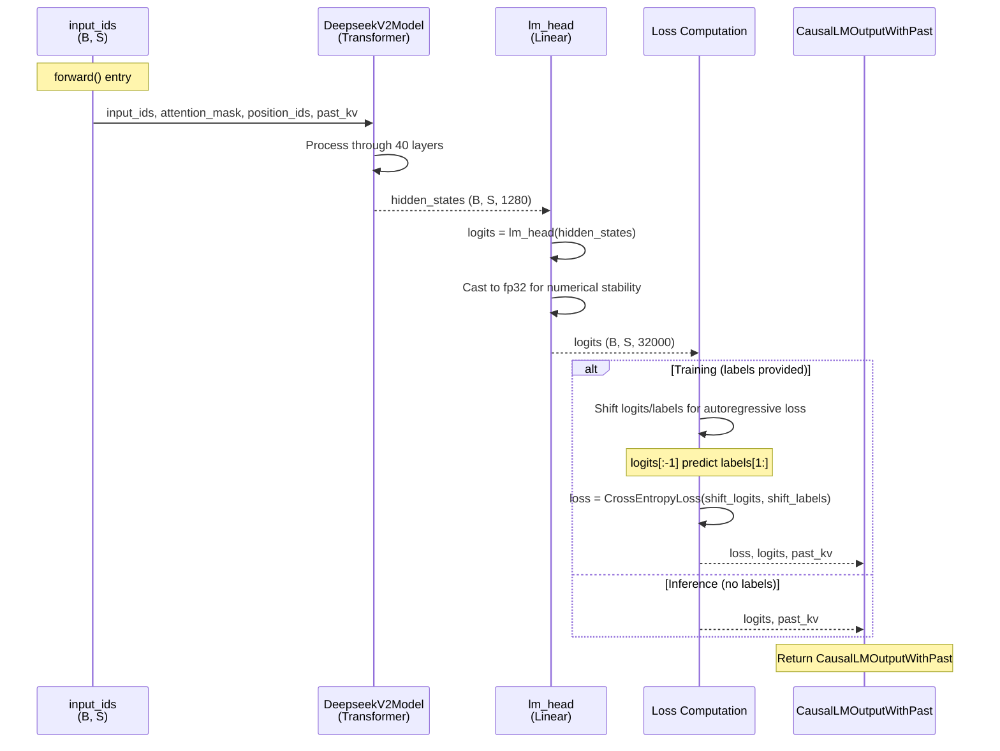

# DeepseekV2ForCausalLM

## What It Is
`DeepseekV2ForCausalLM` is the complete causal language model for DeepSeek-OCR, adding a language modeling head on top of `DeepseekV2Model`. It combines:
1. **DeepseekV2Model** - the full transformer decoder (40 layers, embeddings, final norm)
2. **Language modeling head** (`lm_head`) - linear projection from hidden states to vocabulary logits
3. **Cross-entropy loss** for training (with label shifting for autoregressive objective)
4. **Generation utilities** - `prepare_inputs_for_generation` for autoregressive decoding

This is the primary interface for text generation tasks. It takes token IDs as input and produces next-token predictions as output.

## Definition
```python
class DeepseekV2ForCausalLM(DeepseekV2PreTrainedModel):
    _tied_weights_keys = ["lm_head.weight"]

    def __init__(self, config):
        super().__init__(config)
        self.model = DeepseekV2Model(config)
        self.vocab_size = config.vocab_size
        self.lm_head = nn.Linear(config.hidden_size, config.vocab_size, bias=False)
        self.post_init()
```

## Constructor Information
**Location**: `models/deepseek-ocr/modeling_deepseekv2.py:1640-1650`

**Signature**:
```python
def __init__(self, config: DeepseekV2Config)
```

**Parameters** (from config):
- `vocab_size`: Vocabulary size (default: 32000)
- `hidden_size`: Model hidden dimension (default: 1280)
- All other params inherited by `DeepseekV2Model`

**Created Components**:

1. **self.model**: Full transformer decoder
   - `DeepseekV2Model(config)`
   - Parameters: 36.64B (see op-DeepseekV2Model.md)
   - At bf16: 73.15 GB

2. **self.lm_head**: Language modeling head
   - `nn.Linear(hidden_size, vocab_size, bias=False)`
   - Shape: `(1280, 32000)`
   - Parameters: 1,280 × 32,000 = 40,960,000 ≈ 40.96M
   - At bf16: 82 MB

**Parameter tying**:
```python
# lm_head.weight is often tied to model.embed_tokens.weight
# This reduces parameters by 40.96M and improves performance
# Controlled by config.tie_word_embeddings (default: False for DeepSeek-OCR)
```

**Total parameters**:
```python
model: 36.64B
lm_head: 40.96M
Total: 36.68B parameters

At bf16: 36.68B × 2 bytes ≈ 73.36 GB
```

## Module Internals



## Key Pseudo Code

```python
def forward(
    self,
    input_ids: torch.LongTensor = None,
    attention_mask: Optional[torch.Tensor] = None,
    position_ids: Optional[torch.LongTensor] = None,
    past_key_values: Optional[List[torch.FloatTensor]] = None,
    inputs_embeds: Optional[torch.FloatTensor] = None,
    labels: Optional[torch.LongTensor] = None,
    use_cache: Optional[bool] = None,
    output_attentions: Optional[bool] = None,
    output_hidden_states: Optional[bool] = None,
    return_dict: Optional[bool] = None,
    cache_position: Optional[torch.LongTensor] = None
) -> Union[Tuple, CausalLMOutputWithPast]:
    """
    Causal language modeling forward pass.

    Args:
        input_ids: (batch, seq_len) input token IDs
        attention_mask: (batch, seq_len) mask for padding
        position_ids: (batch, seq_len) position indices
        past_key_values: Cached K, V from previous steps
        inputs_embeds: (batch, seq_len, hidden_size) alternative to input_ids
        labels: (batch, seq_len) target token IDs for training (shifted internally)
        use_cache: Whether to return KV cache
        output_attentions: Whether to return attention weights
        output_hidden_states: Whether to return all hidden states
        return_dict: Whether to return CausalLMOutputWithPast

    Returns:
        CausalLMOutputWithPast with:
            loss: Cross-entropy loss if labels provided
            logits: (batch, seq_len, vocab_size) next-token probabilities
            past_key_values: Updated KV cache
            hidden_states: All layer outputs if requested
            attentions: All attention weights if requested
    """
    # 1. Pass through transformer decoder
    outputs = self.model(
        input_ids=input_ids,
        attention_mask=attention_mask,
        position_ids=position_ids,
        past_key_values=past_key_values,
        inputs_embeds=inputs_embeds,
        use_cache=use_cache,
        output_attentions=output_attentions,
        output_hidden_states=output_hidden_states,
        return_dict=return_dict,
        cache_position=cache_position
    )

    hidden_states = outputs[0]  # (B, S, 1280)

    # 2. Project to vocabulary logits
    logits = self.lm_head(hidden_states)  # (B, S, 32000)
    logits = logits.float()  # Cast to fp32 for numerical stability

    # 3. Compute loss if labels provided (training)
    loss = None
    if labels is not None:
        # Shift labels: predict token i+1 from context [0:i]
        # logits[:-1] predict labels[1:]
        shift_logits = logits[..., :-1, :].contiguous()  # (B, S-1, V)
        shift_labels = labels[..., 1:].contiguous()      # (B, S-1)

        # Flatten for cross-entropy
        loss_fct = CrossEntropyLoss()
        shift_logits = shift_logits.view(-1, self.config.vocab_size)  # (B*(S-1), V)
        shift_labels = shift_labels.view(-1)                           # (B*(S-1),)

        # Enable model parallelism
        shift_labels = shift_labels.to(shift_logits.device)
        loss = loss_fct(shift_logits, shift_labels)

    # 4. Return outputs
    if not return_dict:
        output = (logits,) + outputs[1:]
        return (loss,) + output if loss is not None else output

    return CausalLMOutputWithPast(
        loss=loss,
        logits=logits,
        past_key_values=outputs.past_key_values,
        hidden_states=outputs.hidden_states,
        attentions=outputs.attentions,
    )


def prepare_inputs_for_generation(
    self,
    input_ids,
    past_key_values=None,
    attention_mask=None,
    inputs_embeds=None,
    **kwargs,
):
    """
    Prepare inputs for autoregressive generation (called by .generate()).

    Handles:
    - Slicing input_ids to only unprocessed tokens (uses past_length from cache)
    - Generating position_ids dynamically
    - Managing cache_position for static caching

    Args:
        input_ids: (batch, seq_len) current token IDs
        past_key_values: KV cache from previous steps
        attention_mask: (batch, total_seq_len) cumulative mask
        inputs_embeds: Pre-computed embeddings (only used in first step)

    Returns:
        dict with:
            input_ids or inputs_embeds: Only new tokens to process
            attention_mask: Full mask (includes past)
            position_ids: Position indices for new tokens
            past_key_values: Cache to pass to forward
            cache_position: Absolute position in sequence
    """
    past_length = 0
    if past_key_values is not None:
        if isinstance(past_key_values, Cache):
            cache_length = past_key_values.get_seq_length()
            past_length = past_key_values.seen_tokens
            max_cache_length = past_key_values.get_max_length()
        else:
            cache_length = past_length = past_key_values[0][0].shape[2]
            max_cache_length = None

        # Keep only unprocessed tokens
        if attention_mask is not None and attention_mask.shape[1] > input_ids.shape[1]:
            input_ids = input_ids[:, -(attention_mask.shape[1] - past_length):]
        elif past_length < input_ids.shape[1]:
            input_ids = input_ids[:, past_length:]

        # Crop attention mask if exceeding max cache length
        if (
            max_cache_length is not None
            and attention_mask is not None
            and cache_length + input_ids.shape[1] > max_cache_length
        ):
            attention_mask = attention_mask[:, -max_cache_length:]

    # Generate position_ids dynamically
    position_ids = kwargs.get("position_ids", None)
    if attention_mask is not None and position_ids is None:
        position_ids = attention_mask.long().cumsum(-1) - 1
        position_ids.masked_fill_(attention_mask == 0, 1)
        if past_key_values:
            position_ids = position_ids[:, -input_ids.shape[1]:]

    # Handle static cache
    if self.generation_config.cache_implementation == "static":
        cache_position = kwargs.get("cache_position", None)
        if cache_position is None:
            past_length = 0
        else:
            past_length = cache_position[-1] + 1
        input_ids = input_ids[:, past_length:]
        position_ids = position_ids[:, past_length:]

    cache_position = torch.arange(
        past_length, past_length + position_ids.shape[-1], device=position_ids.device
    )

    # Use inputs_embeds only in first generation step
    if inputs_embeds is not None and past_key_values is None:
        model_inputs = {"inputs_embeds": inputs_embeds}
    else:
        model_inputs = {"input_ids": input_ids.contiguous()}

    model_inputs.update(
        {
            "position_ids": position_ids,
            "past_key_values": past_key_values,
            "use_cache": kwargs.get("use_cache"),
            "attention_mask": attention_mask,
            "cache_position": cache_position,
        }
    )
    return model_inputs
```

## FLOP Count and Memory Usage Impact

### FLOPs (per forward pass)

Assume:
- Input shape: `(B, S)` where B=batch, S=sequence length
- Typical decode: B=1, S=1, cached_context=K=8192
- Typical prefill: B=1, S=8192

**Operations**:

1. **DeepseekV2Model** (transformer):
   ```
   See op-DeepseekV2Model.md for detailed breakdown
   Decode: 14.13 TFLOPs
   Prefill: 515 TFLOPs
   ```

2. **lm_head** (vocabulary projection):
   ```
   FLOPs = 2 × B × S × hidden_size × vocab_size
   Decode: 2 × 1 × 1 × 1280 × 32000 = 81.92 MFLOPs
   Prefill: 2 × 1 × 8192 × 1280 × 32000 = 671.09 GFLOPs
   ```

**Total**:
```
Decode: 14.13 TFLOPs + 81.92 MFLOPs ≈ 14.13 TFLOPs (lm_head negligible)
Prefill: 515 TFLOPs + 671 GFLOPs ≈ 515.67 TFLOPs

Time per decode (RTX 4090, 330 TFLOPS bf16):
  14.13 TFLOPs / 330 TFLOPS ≈ 43 ms (theoretical, 100% MFU)
  Actual: ~80-100 ms (50-60% MFU, memory-bound)

Throughput: ~10-12 tokens/second (single batch, greedy decoding)
```

### Memory Usage

#### Parameters:
```
model: 73.15 GB
lm_head: 82 MB
Total: 73.23 GB at bf16
```

#### Activations (per forward pass):

**Decode** (S=1, K=8192):
```
Model activations: 5.72 GB (see op-DeepseekV2Model.md)
lm_head input: 1 × 1 × 1280 × 2 = 2.56 KB
lm_head output (logits): 1 × 1 × 32000 × 4 = 128 KB (fp32)
Total: ~5.72 GB
```

**Prefill** (S=8192):
```
Model activations: ~10-12 GB (with Flash Attention)
lm_head input: 1 × 8192 × 1280 × 2 = 21 MB
lm_head output (logits): 1 × 8192 × 32000 × 4 = 1.05 GB (fp32)
Total: ~12-14 GB
```

#### KV Cache:
```
Per layer: 9.44 MB (K=8192)
Total for 40 layers: 377.6 MB
(Same as DeepseekV2Model, lm_head doesn't add to cache)
```

#### Total inference memory (decode, K=8192):
```
Model parameters: 73.23 GB
Activations: 5.72 GB
KV cache: 377.6 MB
Total: ~79 GB

Fits on single A100 80GB or H100 80GB!
```

## Related Modules
- **Used by**:
  - `DeepseekOCRModel` - wraps this for multi-modal OCR tasks
  - Inference pipelines for text generation
- **Contains**:
  - `DeepseekV2Model` - full transformer decoder
  - `nn.Linear` - lm_head for vocabulary projection
- **Generation methods**: Inherits from `GenerationMixin`:
  - `generate()` - high-level generation API
  - `greedy_search()`, `sample()`, `beam_search()` - decoding strategies

## Usage Pattern

```python
from modeling_deepseekv2 import DeepseekV2ForCausalLM
from transformers import AutoTokenizer

# Load model and tokenizer
model = DeepseekV2ForCausalLM.from_pretrained("path/to/deepseek-ocr")
tokenizer = AutoTokenizer.from_pretrained("path/to/deepseek-ocr")

# Training example
input_text = "The quick brown fox jumps over the lazy dog."
inputs = tokenizer(input_text, return_tensors="pt")
labels = inputs["input_ids"].clone()

outputs = model(
    input_ids=inputs["input_ids"],
    attention_mask=inputs["attention_mask"],
    labels=labels,  # Triggers loss computation
)

loss = outputs.loss  # Cross-entropy loss
logits = outputs.logits  # (1, seq_len, 32000)

# Backprop and optimize
loss.backward()
optimizer.step()

# Inference example (manual decoding)
prompt = "Once upon a time"
input_ids = tokenizer.encode(prompt, return_tensors="pt")

# Prefill
outputs = model(input_ids=input_ids, use_cache=True)
past_key_values = outputs.past_key_values
next_token_logits = outputs.logits[:, -1, :]  # (1, 32000)

# Decode
for _ in range(50):  # Generate 50 tokens
    next_token_id = torch.argmax(next_token_logits, dim=-1, keepdim=True)  # (1, 1)
    input_ids = torch.cat([input_ids, next_token_id], dim=1)

    outputs = model(
        input_ids=next_token_id,
        past_key_values=past_key_values,
        use_cache=True,
    )
    past_key_values = outputs.past_key_values
    next_token_logits = outputs.logits[:, -1, :]

generated_text = tokenizer.decode(input_ids[0])

# High-level generation API
output_ids = model.generate(
    input_ids=tokenizer.encode(prompt, return_tensors="pt"),
    max_new_tokens=50,
    do_sample=True,
    top_p=0.9,
    temperature=0.7,
)
generated_text = tokenizer.decode(output_ids[0])
```

## Key Performance Characteristics

1. **Efficient inference**: KV caching reduces decode FLOPs by ~8000x (8K context)
2. **Memory efficient**: MLA reduces KV cache by 57x vs standard attention
3. **Numerically stable**: Upcasts logits to fp32 before loss computation
4. **Generation ready**: Built-in support for greedy, sampling, beam search
5. **Flexible inputs**: Supports both input_ids and pre-computed inputs_embeds

## Optimization Opportunities

1. **Speculative decoding**: Draft model generates candidates, verify with main model
2. **Continuous batching**: Dynamic batching of requests with different lengths
3. **KV cache quantization**: Int8/int4 cache (2-4x further reduction)
4. **Logit processor fusion**: Fuse temperature scaling, top-p/top-k into generation
5. **Multi-token prediction**: Predict multiple future tokens per forward pass

## References
- Causal language modeling: "Language Models are Unsupervised Multitask Learners" (Radford et al., 2019)
- Autoregressive decoding: "Attention Is All You Need" (Vaswani et al., 2017)
- KV caching: Standard technique for efficient autoregressive generation
- Used in: DeepSeek-V2, DeepSeek-V3, DeepSeek-OCR, most modern LLMs
