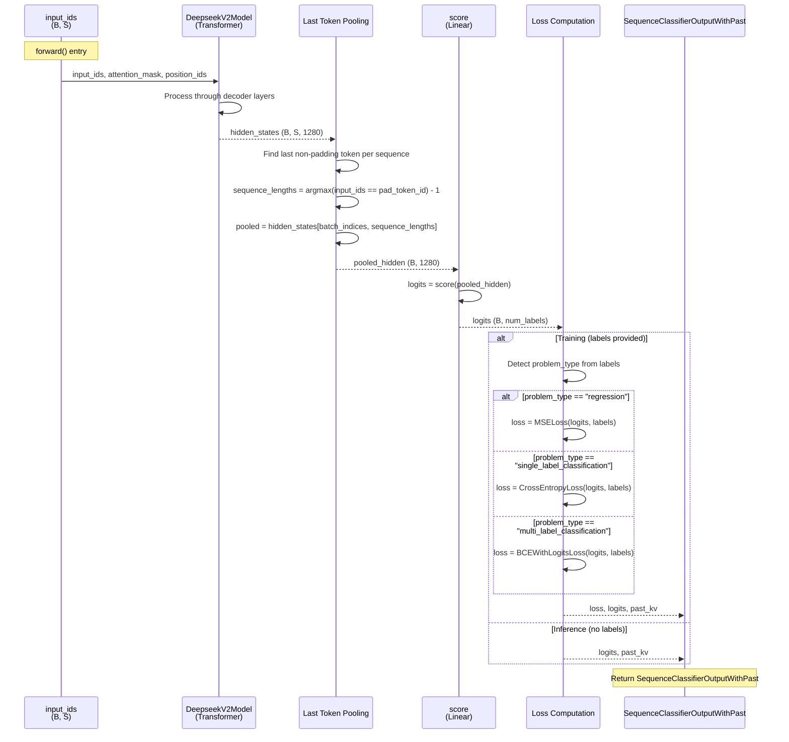

# DeepseekV2ForSequenceClassification

## What It Is
`DeepseekV2ForSequenceClassification` is a sequence classification variant of the DeepseekV2 decoder, designed for tasks like sentiment analysis, document classification, and text categorization. It combines:
1. **DeepseekV2Model** - the full transformer decoder (`config.num_hidden_layers` layers)
2. **Classification head** (`score`) - linear projection from hidden states to class logits
3. **Flexible loss functions** - MSE for regression, cross-entropy for classification, BCE for multi-label
4. **Last-token pooling** - uses the hidden state of the last non-padding token for classification

This model is NOT used in the OCR inference pipeline (which uses `DeepseekV2ForCausalLM`), but is part of the model family for potential fine-tuning on downstream classification tasks.

## Definition
```python
class DeepseekV2ForSequenceClassification(DeepseekV2PreTrainedModel):
    def __init__(self, config):
        super().__init__(config)
        self.num_labels = config.num_labels
        self.model = DeepseekV2Model(config)
        self.score = nn.Linear(config.hidden_size, self.num_labels, bias=False)
        self.post_init()
```

## Constructor Information
**Location**: `models/deepseek-ocr/modeling_deepseekv2.py:1878-1886`

**Signature**:
```python
def __init__(self, config: DeepseekV2Config)
```

**Parameters** (from config):
- `num_labels`: Number of classification labels (default: 2 for binary classification)
- `hidden_size`: Model hidden dimension
- `pad_token_id`: Padding token ID for sequence length determination
- `problem_type`: "regression", "single_label_classification", or "multi_label_classification" (auto-detected if None)
- All other params inherited by `DeepseekV2Model`

**Created Components**:

1. **self.model**: Full transformer decoder
   - `DeepseekV2Model(config)`
   - Parameter count depends on the same configuration as in
     `op-DeepseekV2Model.md` (number of layers, MLA vs MHA, MoE, etc.).

2. **self.score**: Classification head
   - `nn.Linear(hidden_size, num_labels, bias=False)`
   - Shape: `(1280, num_labels)`
   - Parameters: 1,280 × num_labels
   - For binary classification (2 labels): 2,560 params ≈ 2.56K
   - At bf16: 5.12 KB

## Module Internals



## Key Pseudo Code

```python
def forward(
    self,
    input_ids: torch.LongTensor = None,
    attention_mask: Optional[torch.Tensor] = None,
    position_ids: Optional[torch.LongTensor] = None,
    past_key_values: Optional[List[torch.FloatTensor]] = None,
    inputs_embeds: Optional[torch.FloatTensor] = None,
    labels: Optional[torch.LongTensor] = None,
    use_cache: Optional[bool] = None,
    output_attentions: Optional[bool] = None,
    output_hidden_states: Optional[bool] = None,
    return_dict: Optional[bool] = None,
) -> Union[Tuple, SequenceClassifierOutputWithPast]:
    """
    Sequence classification forward pass.

    Args:
        input_ids: (batch, seq_len) input token IDs
        attention_mask: (batch, seq_len) mask for padding
        position_ids: (batch, seq_len) position indices
        past_key_values: Cached K, V (usually not used for classification)
        inputs_embeds: (batch, seq_len, hidden_size) alternative to input_ids
        labels: (batch,) target labels for training
            - For regression: float labels
            - For single-label: long labels in [0, num_labels-1]
            - For multi-label: float labels (binary per label)
        use_cache: Whether to return KV cache
        output_attentions: Whether to return attention weights
        output_hidden_states: Whether to return all hidden states
        return_dict: Whether to return SequenceClassifierOutputWithPast

    Returns:
        SequenceClassifierOutputWithPast with:
            loss: Task-specific loss if labels provided
            logits: (batch, num_labels) classification logits
            past_key_values: KV cache if use_cache=True
            hidden_states: All layer outputs if requested
            attentions: All attention weights if requested
    """
    # 1. Pass through transformer decoder
    transformer_outputs = self.model(
        input_ids,
        attention_mask=attention_mask,
        position_ids=position_ids,
        past_key_values=past_key_values,
        inputs_embeds=inputs_embeds,
        use_cache=use_cache,
        output_attentions=output_attentions,
        output_hidden_states=output_hidden_states,
        return_dict=return_dict,
    )

    hidden_states = transformer_outputs[0]  # (B, S, 1280)

    # 2. Project all positions to label space
    logits = self.score(hidden_states)  # (B, S, num_labels)

    # 3. Determine batch size
    if input_ids is not None:
        batch_size = input_ids.shape[0]
    else:
        batch_size = inputs_embeds.shape[0]

    # 4. Find sequence lengths (last non-padding token index)
    if self.config.pad_token_id is None and batch_size != 1:
        raise ValueError("Cannot handle batch sizes > 1 if no padding token is defined.")

    if self.config.pad_token_id is None:
        sequence_lengths = -1  # Use last token
    else:
        if input_ids is not None:
            # Find first padding token, subtract 1 to get last real token
            sequence_lengths = (
                torch.eq(input_ids, self.config.pad_token_id).int().argmax(-1) - 1
            ).to(logits.device)
        else:
            sequence_lengths = -1

    # 5. Pool: Extract logits at last non-padding position
    pooled_logits = logits[
        torch.arange(batch_size, device=logits.device), sequence_lengths
    ]  # (B, num_labels)

    # 6. Compute loss if labels provided
    loss = None
    if labels is not None:
        labels = labels.to(logits.device)

        # Auto-detect problem type from labels
        if self.config.problem_type is None:
            if self.num_labels == 1:
                self.config.problem_type = "regression"
            elif self.num_labels > 1 and (
                labels.dtype == torch.long or labels.dtype == torch.int
            ):
                self.config.problem_type = "single_label_classification"
            else:
                self.config.problem_type = "multi_label_classification"

        # Compute appropriate loss
        if self.config.problem_type == "regression":
            loss_fct = MSELoss()
            if self.num_labels == 1:
                loss = loss_fct(pooled_logits.squeeze(), labels.squeeze())
            else:
                loss = loss_fct(pooled_logits, labels)

        elif self.config.problem_type == "single_label_classification":
            loss_fct = CrossEntropyLoss()
            loss = loss_fct(
                pooled_logits.view(-1, self.num_labels), labels.view(-1)
            )

        elif self.config.problem_type == "multi_label_classification":
            loss_fct = BCEWithLogitsLoss()
            loss = loss_fct(pooled_logits, labels)

    # 7. Return outputs
    if not return_dict:
        output = (pooled_logits,) + transformer_outputs[1:]
        return ((loss,) + output) if loss is not None else output

    return SequenceClassifierOutputWithPast(
        loss=loss,
        logits=pooled_logits,
        past_key_values=transformer_outputs.past_key_values,
        hidden_states=transformer_outputs.hidden_states,
        attentions=transformer_outputs.attentions,
    )
```

**Last-token pooling strategy**:
```
Standard approach for decoder-only models:
- Cannot use first token (no [CLS] token in GPT-style models)
- Last token sees full context through causal attention
- Handles variable-length sequences via sequence_lengths

Example with padding:
  input_ids = [101, 234, 567, 890, 0, 0]  # pad_token_id = 0
  sequence_lengths = argmax([0, 0, 0, 0, 1, 1]) - 1 = 4 - 1 = 3
  pooled_hidden = hidden_states[:, 3, :]  # Use token at index 3 (890)
```

## FLOP Count and Memory Usage Impact

### FLOPs (per forward pass)

Assume:
- Input shape: `(B, S)` where B=batch, S=sequence length
- Typical classification: B=32, S=512 (document classification)
- num_labels: 2 (binary classification)

**Operations**:

1. **DeepseekV2Model** (transformer):
   ```
   See op-DeepseekV2Model.md for detailed breakdown
   Per sample: ~10-50 TFLOPs (depending on sequence length)
   Batch of 32: 320-1600 TFLOPs
   ```

2. **score** (classification head):
   ```
   Applied to all tokens: 2 × B × S × hidden_size × num_labels
   = 2 × 32 × 512 × 1280 × 2
   = 83.89 MFLOPs (negligible)

   Pooling: 0 FLOPs (indexing operation)
   ```

**Total** (batch of 32, seq_len=512):
```
Transformer: ~500 TFLOPs
Classification head: 84 MFLOPs
Total: ~500 TFLOPs (head is negligible)

Time per batch (RTX 4090, 330 TFLOPS bf16):
  500 TFLOPs / 330 TFLOPS ≈ 1.5 seconds (theoretical)
  Actual: ~2-3 seconds (50-60% MFU)

Throughput: ~10-15 samples/second
```

### Memory Usage

#### Parameters:
```
model: 73.15 GB
score: 5.12 KB (2 labels)
Total: 73.15 GB at bf16
```

#### Activations (per forward pass):

**Single sample** (S=512):
```
Model activations: ~1-2 GB (depends on layer, see op-DeepseekV2Model.md)
score input: 1 × 512 × 1280 × 2 = 1.31 MB
score output (logits): 1 × 512 × 2 × 4 = 4.10 KB
pooled_logits: 1 × 2 × 4 = 8 bytes
Total: ~1-2 GB (model dominates)
```

**Batch of 32** (S=512):
```
Model activations: ~32-64 GB (scales with batch size)
Logits: 32 × 512 × 2 × 4 = 131 KB
Pooled logits: 32 × 2 × 4 = 256 bytes
Total: ~32-64 GB

With gradient checkpointing (training):
Reduces to ~2-4 GB (recompute activations during backward)
```

#### KV Cache:
```
Usually not used for classification (single forward pass).
If use_cache=True, KV cache memory scales with num_hidden_layers and context
length K (see op-DeepseekV2Model.md for MLA vs MHA cache formulas). The
“377.6 MB (K=512, 40 layers)” figure in older drafts referred to a specific
40‑layer MLA example.
```

#### Total training memory (batch=32, seq=512):
```
Model parameters: 73.15 GB
Activations (with gradient checkpointing): ~4 GB
Gradients: 73.15 GB (same size as parameters)
Optimizer states (AdamW): 146.3 GB (2× parameters for momentum/variance)
Total: ~296 GB

Requires multi-GPU training (4-8× A100 80GB)
```

## Related Modules
- **Used by**: Fine-tuning pipelines for document/text classification
- **Contains**:
  - `DeepseekV2Model` - full transformer decoder
  - `nn.Linear` - score head for classification
- **Training utilities**: Compatible with Hugging Face Trainer

## Usage Pattern

```python
from modeling_deepseekv2 import DeepseekV2ForSequenceClassification, DeepseekV2Config
from transformers import AutoTokenizer

# Binary sentiment classification
config = DeepseekV2Config(
    num_labels=2,  # Negative, Positive
    problem_type="single_label_classification",
)
model = DeepseekV2ForSequenceClassification(config)
tokenizer = AutoTokenizer.from_pretrained("path/to/deepseek-ocr")

# Training example
texts = [
    "This product is amazing!",
    "Terrible experience, would not recommend.",
]
labels = torch.tensor([1, 0])  # Positive, Negative

inputs = tokenizer(texts, padding=True, truncation=True, return_tensors="pt")

outputs = model(
    input_ids=inputs["input_ids"],
    attention_mask=inputs["attention_mask"],
    labels=labels,
)

loss = outputs.loss  # Cross-entropy loss
logits = outputs.logits  # (2, 2) - probabilities for each class

# Inference example
text = "I love this product!"
inputs = tokenizer(text, return_tensors="pt")

with torch.no_grad():
    outputs = model(
        input_ids=inputs["input_ids"],
        attention_mask=inputs["attention_mask"],
    )

logits = outputs.logits  # (1, 2)
predicted_class = torch.argmax(logits, dim=-1)  # 1 (Positive)
probabilities = torch.softmax(logits, dim=-1)  # [0.12, 0.88]

# Multi-label classification (e.g., topic tagging)
config = DeepseekV2Config(
    num_labels=5,  # Tech, Sports, Politics, Entertainment, Science
    problem_type="multi_label_classification",
)
model = DeepseekV2ForSequenceClassification(config)

labels = torch.tensor([[1, 0, 1, 0, 0]])  # Tech and Politics
outputs = model(input_ids=inputs["input_ids"], labels=labels)
loss = outputs.loss  # BCEWithLogitsLoss
```

## Key Performance Characteristics

1. **Last-token pooling**: Natural for decoder-only models (vs [CLS] token in encoders)
2. **Flexible loss**: Auto-detects regression vs classification from labels
3. **Variable-length handling**: Uses sequence_lengths to handle padding
4. **Large model**: 36.64B params may be overkill for simple classification (consider distillation)
5. **Memory intensive**: Requires multi-GPU training for typical batch sizes

## Optimization Opportunities

1. **LoRA/QLoRA fine-tuning**: Freeze base model, train small adapter layers (~1% params)
2. **Gradient checkpointing**: Reduce activation memory by 8-16x
3. **Mixed precision**: Use bf16/fp16 for forward/backward, fp32 for optimizer
4. **Sequence packing**: Pack multiple short sequences into single batch item
5. **Prompt tuning**: Prepend learnable prompt tokens instead of fine-tuning full model

## References
- Sequence classification: Standard task for text classification
- Last-token pooling: "Language Models are Unsupervised Multitask Learners" (Radford et al., 2019)
- Multi-task learning: "Exploring the Limits of Transfer Learning" (Raffel et al., 2019)
- Used in: Fine-tuning DeepSeek models for downstream classification tasks
