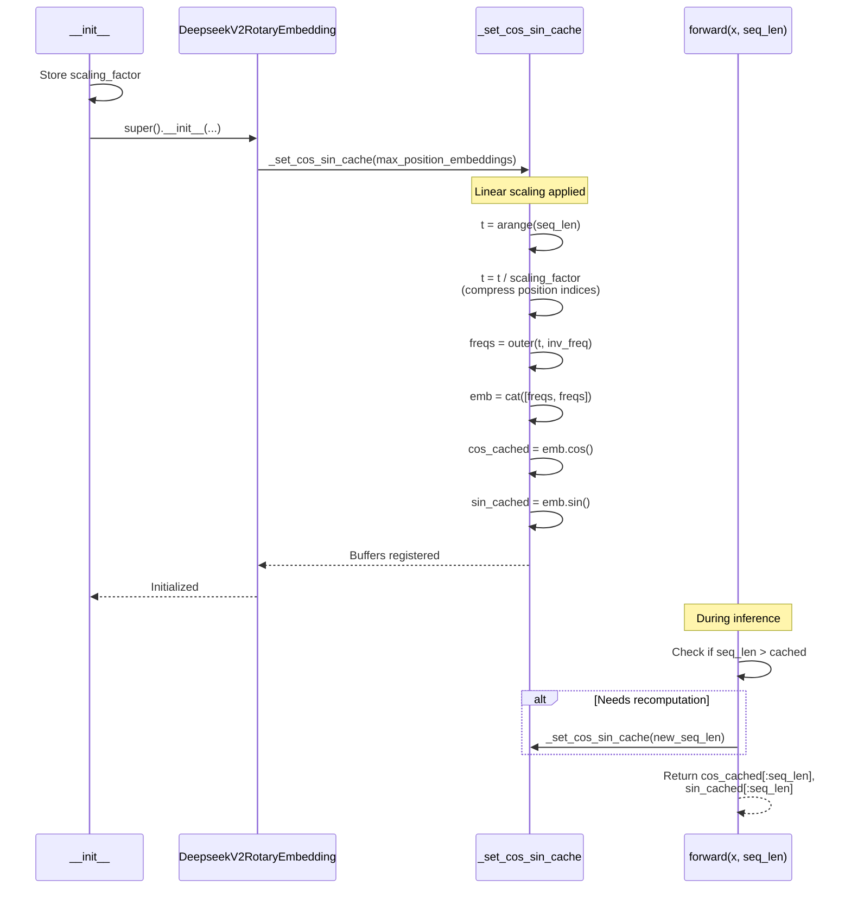

# DeepseekV2LinearScalingRotaryEmbedding

## What It Is
`DeepseekV2LinearScalingRotaryEmbedding` is a variant of Rotary Position Embedding (RoPE) that extends the model's effective context length through linear scaling. It divides position indices by a scaling factor before computing rotary embeddings, allowing the model to process longer sequences than it was originally trained on without retraining.

This is the simplest RoPE extension method, credited to Reddit user /u/kaiokendev, and is effective for moderate context length extensions (e.g., 2x-4x the original training length).

## Definition
```python
class DeepseekV2LinearScalingRotaryEmbedding(DeepseekV2RotaryEmbedding):
    """DeepseekV2RotaryEmbedding extended with linear scaling."""

    def __init__(
        self,
        dim: int,
        max_position_embeddings: int = 2048,
        base: float = 10000,
        device=None,
        scaling_factor: float = 1.0,
    ):
        self.scaling_factor = scaling_factor
        super().__init__(dim, max_position_embeddings, base, device)

    def _set_cos_sin_cache(self, seq_len, device, dtype):
        self.max_seq_len_cached = seq_len
        t = torch.arange(self.max_seq_len_cached, device=device, dtype=self.inv_freq.dtype)
        t = t / self.scaling_factor  # Linear scaling applied here

        freqs = torch.outer(t, self.inv_freq)
        emb = torch.cat((freqs, freqs), dim=-1)
        self.register_buffer("cos_cached", emb.cos().to(dtype), persistent=False)
        self.register_buffer("sin_cached", emb.sin().to(dtype), persistent=False)
```

## Constructor Information
**Location**: `models/deepseek-ocr/modeling_deepseekv2.py:160-186`

**Signature**:
```python
def __init__(
    self,
    dim: int,
    max_position_embeddings: int = 2048,
    base: float = 10000,
    device=None,
    scaling_factor: float = 1.0,
)
```

**Parameters**:
- `dim`: Rotary embedding dimension (typically `qk_rope_head_dim`, e.g., 64)
- `max_position_embeddings`: Maximum sequence length for precomputed cache (e.g., 8192)
- `base`: RoPE base frequency θ (default: 10000)
- `device`: Device for buffer allocation (CPU/CUDA)
- `scaling_factor`: Linear scaling factor for context extension (e.g., 2.0 for 2x extension)

**Created Components**:
- `self.scaling_factor`: Stored scaling factor
- Inherits from parent:
  - `self.dim`, `self.max_position_embeddings`, `self.base`
  - `self.inv_freq`: Inverse frequencies (1 / (base^(2i/dim))) for i in [0, dim/2)
  - `self.cos_cached`, `self.sin_cached`: Precomputed cos/sin tensors

## Module Internals



## Key Pseudo Code

```python
def _set_cos_sin_cache(self, seq_len, device, dtype):
    """
    Precompute cos/sin tensors with linear scaling.
    Called during __init__ and when seq_len exceeds cache.
    """
    self.max_seq_len_cached = seq_len

    # 1. Generate position indices
    t = torch.arange(seq_len, device=device, dtype=self.inv_freq.dtype)  # [0, 1, 2, ..., seq_len-1]

    # 2. Apply linear scaling (KEY DIFFERENCE from base RoPE)
    t = t / self.scaling_factor  # Compress positions: [0, 0.5, 1.0, 1.5, ...] if scaling_factor=2.0

    # 3. Compute frequencies
    freqs = torch.outer(t, self.inv_freq)  # (seq_len, dim/2)

    # 4. Duplicate for complex rotation
    emb = torch.cat((freqs, freqs), dim=-1)  # (seq_len, dim)

    # 5. Cache cos/sin
    self.register_buffer("cos_cached", emb.cos().to(dtype), persistent=False)
    self.register_buffer("sin_cached", emb.sin().to(dtype), persistent=False)

def forward(self, x, seq_len=None):
    """
    Returns cos/sin for positions [0, seq_len).
    Recomputes cache if seq_len exceeds current cache.
    """
    if self.max_seq_len_cached is None or seq_len > self.max_seq_len_cached:
        self._set_cos_sin_cache(seq_len=seq_len, device=x.device, dtype=x.dtype)

    return (
        self.cos_cached[:seq_len].to(dtype=x.dtype),
        self.sin_cached[:seq_len].to(dtype=x.dtype),
    )
```

**Mathematical Formulation**:

Standard RoPE:
```
θ_i = base^(-2i/dim)  for i in [0, dim/2)
freqs[m, i] = m × θ_i  where m = position index

cos(freqs[m, i]) = cos(m × θ_i)
sin(freqs[m, i]) = sin(m × θ_i)
```

Linear Scaling RoPE:
```
freqs[m, i] = (m / scaling_factor) × θ_i

cos(freqs[m, i]) = cos((m / s) × θ_i)
sin(freqs[m, i]) = sin((m / s) × θ_i)

Effect: Positions are "compressed" by factor s, making m=4096 appear as m=2048 to the model (if s=2.0)
```

**Intuition**:
- If model trained on sequences up to 2048 tokens (m ∈ [0, 2048))
- With scaling_factor=2.0, can extrapolate to 4096 tokens
- Position 4096 gets embeddings similar to position 2048 (within training distribution)
- Trade-off: Reduced position resolution (adjacent tokens closer in embedding space)

## FLOP Count and Memory Usage Impact

### FLOPs

**Cache Computation** (one-time cost per sequence length):

Assume:
- `seq_len` = L (e.g., 8192)
- `dim` = d (e.g., 64 for a typical MLA configuration; the DeepSeek-OCR checkpoint sets `qk_rope_head_dim = 0` and does not use this class by default)

```
1. Division: t / scaling_factor
   FLOPs = L (element-wise division)

2. torch.outer(t, inv_freq):
   FLOPs = L × (d/2) (outer product)

3. torch.cat((freqs, freqs)):
   FLOPs = 0 (memory copy, no arithmetic)

4. emb.cos() and emb.sin():
   FLOPs = 2 × L × d (transcendental functions, approximate)

Total cache computation:
FLOPs ≈ L + L×(d/2) + 2×L×d
      ≈ 2.5×L×d

Example (L=8192, d=64):
FLOPs ≈ 2.5 × 8192 × 64 ≈ 1.3 MFLOPs
```

**Runtime** (forward pass):
```
FLOPs = 2 (buffer slicing + dtype conversion, negligible)
```

**Comparison to Base RoPE**:
```
LinearScaling: 2.5×L×d (extra L FLOPs for division)
Base RoPE:     2.5×L×d (same, division is negligible overhead)

Additional cost: ~0.4% (L / (L + L×(d/2) + 2×L×d))
```

### Memory Usage

#### Parameters:
```
No learnable parameters (all computations use cached buffers)
```

#### Cached Buffers:

```
inv_freq: (dim/2,) × fp32 = (32,) × 4 bytes = 128 bytes
cos_cached: (max_seq_len, dim) × dtype = (8192, 64) × 2 bytes (bf16) = 1 MB
sin_cached: (8192, 64) × 2 bytes = 1 MB

Total per RoPE instance: ~2 MB (dominated by cos/sin caches)
```

**In DeepSeek-style models**:
- When `config.rope_scaling["type"] == "linear"`, each `DeepseekV2Attention`
  instance constructs its own `DeepseekV2LinearScalingRotaryEmbedding`, so total
  RoPE buffer memory is `~2 MB × num_hidden_layers` for 8K context and
  `dim=64`.
- The DeepSeek-OCR checkpoint sets `rope_scaling = null`, so this subclass is
  **not used by default**; it becomes active only if you enable linear
  scaling in the config.

#### Temporary Activations (during cache computation):

```
t: (seq_len,) × fp32 = 8192 × 4 bytes = 32 KB
freqs: (seq_len, dim/2) × fp32 = 8192 × 32 × 4 = 1 MB
emb: (seq_len, dim) × fp32 = 8192 × 64 × 4 = 2 MB

Peak during _set_cos_sin_cache: ~3 MB (transient, freed after caching)
```

#### Runtime Memory (forward pass):

```
Sliced cos/sin returned: 2 × (actual_seq_len, dim) × dtype

Example (seq_len=8192, bf16):
Memory = 2 × 8192 × 64 × 2 bytes = 2 MB (returned, not stored)
```

## Related Modules
- **Parent class**: `DeepseekV2RotaryEmbedding` (modeling_deepseekv2.py:116)
- **Used by**: `DeepseekV2Attention._init_rope()` when `config.rope_scaling["type"] == "linear"`
- **Alternative implementations**:
  - `DeepseekV2DynamicNTKScalingRotaryEmbedding` (dynamic base adjustment)
  - `DeepseekV2YarnRotaryEmbedding` (YaRN interpolation)
- **Applied in**: `apply_rotary_pos_emb()` helper function

## Usage Pattern

```python
from modeling_deepseekv2 import DeepseekV2LinearScalingRotaryEmbedding

# Configuration
config = {
    "qk_rope_head_dim": 64,
    "max_position_embeddings": 8192,
    "rope_theta": 10000,
    "rope_scaling": {
        "type": "linear",
        "factor": 2.0  # 2x context extension
    }
}

# Instantiate
rotary_emb = DeepseekV2LinearScalingRotaryEmbedding(
    dim=config["qk_rope_head_dim"],
    max_position_embeddings=config["max_position_embeddings"],
    base=config["rope_theta"],
    scaling_factor=config["rope_scaling"]["factor"]
)

# Use in attention
q = torch.randn(1, 16, 8192, 64, dtype=torch.bfloat16, device='cuda')  # (B, num_heads, seq_len, head_dim)
k = torch.randn(1, 16, 8192, 64, dtype=torch.bfloat16, device='cuda')

cos, sin = rotary_emb(q, seq_len=8192)
# cos, sin: (8192, 64) in bf16

# Apply rotary embeddings (see apply_rotary_pos_emb for full implementation)
q_embed = (q * cos) + (rotate_half(q) * sin)
k_embed = (k * cos) + (rotate_half(k) * sin)
```

**Configuration Example (config.json)**:
```json
{
  "rope_scaling": {
    "type": "linear",
    "factor": 2.0
  },
  "max_position_embeddings": 8192,
  "rope_theta": 10000
}
```

## Key Performance Characteristics

1. **Context Extension**: Allows 2x-4x context length with minimal degradation
   - Training length: 2048 → Inference length: 4096 (with factor=2.0)
   - Beyond 4x, quality degrades (use YaRN or dynamic NTK instead)

2. **Computational Overhead**: Negligible (~0.4% extra FLOPs for division)

3. **Memory Overhead**: Same as base RoPE (~2 MB for 8K context)

4. **Perplexity Impact**:
   - Within 2x: <5% perplexity increase
   - 2x-4x: 5-15% perplexity increase
   - >4x: Significant degradation

5. **Trade-offs**:
   - ✅ Simple, no retraining required
   - ✅ Negligible compute/memory overhead
   - ✅ Effective for moderate extensions
   - ❌ Position resolution reduced (adjacent tokens less distinguishable)
   - ❌ Limited to ~4x extension before quality degrades

6. **When to Use**:
   - Model trained on 2K-4K context, need 4K-8K inference
   - Prefer simplicity over optimal quality
   - Baseline for comparing other scaling methods

## References
- Original proposal: Reddit user /u/kaiokendev (2023)
- Popularized by: LLaMA context extension experiments
- Alternatives: Dynamic NTK (better quality), YaRN (best quality for large extensions)
- Used in: Many open-source LLM deployments (LLaMA.cpp, vLLM, etc.)
