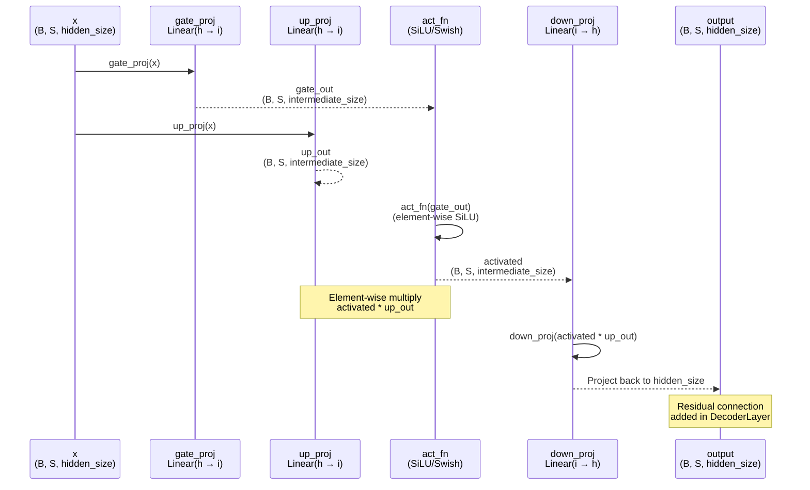

# DeepseekV2MLP

## What It Is
`DeepseekV2MLP` implements the SwiGLU (Swish-Gated Linear Unit) feedforward network used in DeepSeek-OCR's transformer layers. This is the standard MLP component that appears in:
1. **Dense layers**: Every transformer layer before `first_k_dense_replace` (typically first 1-2 layers)
2. **MoE expert networks**: Each expert in `DeepseekV2MoE` is a `DeepseekV2MLP` instance
3. **Shared experts**: Optional shared experts in MoE layers

SwiGLU uses gating to selectively pass information, providing better performance than standard ReLU/GELU MLPs with similar parameter counts.

## Definition
```python
class DeepseekV2MLP(nn.Module):
    def __init__(self, config, hidden_size=None, intermediate_size=None):
        super().__init__()
        self.config = config
        self.hidden_size = config.hidden_size if hidden_size is None else hidden_size
        self.intermediate_size = (
            config.intermediate_size if intermediate_size is None else intermediate_size
        )

        self.gate_proj = nn.Linear(self.hidden_size, self.intermediate_size, bias=False)
        self.up_proj = nn.Linear(self.hidden_size, self.intermediate_size, bias=False)
        self.down_proj = nn.Linear(self.intermediate_size, self.hidden_size, bias=False)
        self.act_fn = ACT2FN[config.hidden_act]

    def forward(self, x):
        down_proj = self.down_proj(self.act_fn(self.gate_proj(x)) * self.up_proj(x))
        return down_proj
```

## Constructor Information
**Location**: `models/deepseek-ocr/modeling_deepseekv2.py:381-397`

**Signature**:
```python
def __init__(
    self,
    config: DeepseekV2Config,
    hidden_size: Optional[int] = None,      # Override hidden_size (default: config.hidden_size)
    intermediate_size: Optional[int] = None, # Override intermediate_size (default: config.intermediate_size)
)
```

**Parameters**:
- `config`: DeepseekV2Config instance.
- `hidden_size`: Input/output dimension (default: `config.hidden_size`).
- `intermediate_size`: Hidden dimension of MLP (default:
  `config.intermediate_size` for dense layers,
  `config.moe_intermediate_size` for MoE experts).

**Example configurations**:
- Generic 1280‑dim dense MLP (used in earlier design docs):
  - `hidden_size = 1280`, `intermediate_size = 3584`.
- Generic 1280‑dim MoE expert:
  - `hidden_size = 1280`, `intermediate_size = 1408`.
- DeepSeek-OCR checkpoint (`models/deepseek-ocr/config.json`):
  - `hidden_size = 1280`
  - `intermediate_size = 6848` (dense MLP)
  - `moe_intermediate_size = 896` (per‑expert MLP)
  - `n_shared_experts = 2` (shared branch uses `2 × moe_intermediate_size`).

**Learned Parameters**:
- `gate_proj.weight`: Shape `(intermediate_size, hidden_size)`, no bias
- `up_proj.weight`: Shape `(intermediate_size, hidden_size)`, no bias
- `down_proj.weight`: Shape `(hidden_size, intermediate_size)`, no bias

**Parameter count**:
```python
params = 2 × (hidden_size × intermediate_size) + (intermediate_size × hidden_size)
       = 3 × hidden_size × intermediate_size

# Dense MLP (1280 × 3584):
params = 3 × 1280 × 3584 = 13.76M parameters

# MoE expert MLP (1280 × 1408):
params = 3 × 1280 × 1408 = 5.41M parameters per expert
```

## Module Internals



## Key Pseudo Code

```python
def forward(self, x: torch.Tensor) -> torch.Tensor:
    """
    SwiGLU feedforward network.

    Args:
        x: Input tensor of shape (batch, seq_len, hidden_size)

    Returns:
        Output tensor of shape (batch, seq_len, hidden_size)

    Formula:
        SwiGLU(x) = (SiLU(W_gate × x) ⊙ (W_up × x)) × W_down
        where ⊙ is element-wise multiplication
    """
    # 1. Gate projection: Learn what to activate
    gate = self.gate_proj(x)  # (B, S, hidden_size) → (B, S, intermediate_size)

    # 2. Up projection: Transform input to intermediate space
    up = self.up_proj(x)      # (B, S, hidden_size) → (B, S, intermediate_size)

    # 3. Apply activation to gate
    activated = self.act_fn(gate)  # SiLU(gate), element-wise

    # 4. Gated multiplication
    gated = activated * up  # Element-wise multiply, (B, S, intermediate_size)

    # 5. Down projection: Project back to hidden_size
    output = self.down_proj(gated)  # (B, S, intermediate_size) → (B, S, hidden_size)

    return output


# Activation function (SiLU/Swish)
def silu(x):
    """
    SiLU (Sigmoid Linear Unit), also known as Swish.
    Smooth, non-monotonic activation with gradient everywhere.

    Formula: SiLU(x) = x × σ(x) = x / (1 + e^(-x))
    """
    return x * torch.sigmoid(x)
```

**Mathematical Formulation**:
```
SwiGLU(x) = (SiLU(W_gate @ x) ⊙ (W_up @ x)) @ W_down^T

where:
  W_gate: (intermediate_size, hidden_size)
  W_up: (intermediate_size, hidden_size)
  W_down: (hidden_size, intermediate_size)
  SiLU(x) = x × sigmoid(x)
  ⊙: element-wise multiplication

Comparison to standard FFN:
  Standard FFN: FFN(x) = W_2 @ ReLU(W_1 @ x)
  SwiGLU:       SwiGLU(x) = W_down @ (SiLU(W_gate @ x) ⊙ (W_up @ x))

SwiGLU advantages:
  - Gating mechanism provides selective information flow
  - SiLU is smoother than ReLU (better gradients)
  - ~5-10% better performance than ReLU/GELU with same param count
```

## FLOP Count and Memory Usage Impact

### FLOPs (per forward pass)

Assume:
- Input shape: `(B, S, h)` where B=batch, S=sequence length, h=hidden_size
- Intermediate dimension: `i = intermediate_size`

**Operations**:
1. **gate_proj**: Matrix multiply `(B×S, h) @ (h, i)^T`
   - FLOPs: `2 × B × S × h × i`
2. **up_proj**: Matrix multiply `(B×S, h) @ (h, i)^T`
   - FLOPs: `2 × B × S × h × i`
3. **act_fn (SiLU)**: Element-wise `x × sigmoid(x)`
   - FLOPs: `3 × B × S × i` (sigmoid + multiply, approx)
4. **Gated multiply**: Element-wise multiply
   - FLOPs: `B × S × i`
5. **down_proj**: Matrix multiply `(B×S, i) @ (i, h)^T`
   - FLOPs: `2 × B × S × i × h`

**Total FLOPs**:
```
FLOPs ≈ 2×B×S×h×i + 2×B×S×h×i + 3×B×S×i + B×S×i + 2×B×S×i×h
      ≈ 6 × B × S × h × i  (dominant terms)

Example (B=1, S=8192, h=1280, i=3584, dense MLP):
FLOPs ≈ 6 × 1 × 8192 × 1280 × 3584
      ≈ 227,131,351,040 FLOPs
      ≈ 227 GFLOPs per MLP layer

Example (B=1, S=8192, h=1280, i=1408, MoE expert):
FLOPs ≈ 6 × 1 × 8192 × 1280 × 1408
      ≈ 89,262,653,440 FLOPs
      ≈ 89 GFLOPs per expert
```

**Per-model impact (example)**:
```
Example 40-layer config (2 dense + 38 MoE layers, top-2 routing):
- Dense layers: 2 layers × 227 GFLOPs = 454 GFLOPs
- MoE layers: 38 layers × 2 experts × 89 GFLOPs = 6,764 GFLOPs

Total MLP compute: ~7.2 TFLOPs per forward pass (B=1, S=8192)

For the DeepSeek-OCR checkpoint (12 layers, 11 MoE layers, 64 experts with
top‑6 routing and moe_intermediate_size=896), MLP FLOPs are substantially
smaller; reuse the formulas above with the OCR config values.
```

**Comparison to standard FFN**:
```
Standard FFN: FFN(x) = W_2 @ ReLU(W_1 @ x)
  - 2 matrices: (h, 4h) and (4h, h)
  - FLOPs: 2×B×S×h×4h + 2×B×S×4h×h = 16 × B × S × h²

SwiGLU (with i = 8h/3 for similar params):
  - 3 matrices: (h, 8h/3) × 2 + (8h/3, h)
  - FLOPs: 3 × 2×B×S×h×8h/3 = 16 × B × S × h²

Same FLOPs for similar parameter count, but SwiGLU gives better quality!
```

### Memory Usage

#### Parameters:
```
gate_proj: intermediate_size × hidden_size × sizeof(dtype)
up_proj:   intermediate_size × hidden_size × sizeof(dtype)
down_proj: hidden_size × intermediate_size × sizeof(dtype)

Total params: 3 × intermediate_size × hidden_size

Example (h=1280, i=3584, bf16):
gate_proj: 3584 × 1280 × 2 = 9.18 MB
up_proj:   3584 × 1280 × 2 = 9.18 MB
down_proj: 1280 × 3584 × 2 = 9.18 MB
Total: 27.52 MB per dense MLP

Example (h=1280, i=1408, bf16, MoE expert):
Total: 3 × 1408 × 1280 × 2 = 10.81 MB per expert
```

**Total in DeepSeek-OCR**:
```
Dense MLPs: 2 layers × 27.52 MB = 55 MB
MoE experts: 38 layers × 160 experts × 10.81 MB = 65,675 MB ≈ 64 GB
Shared experts: 38 layers × 2 shared × 10.81 MB = 822 MB

Total MLP parameters: ~65 GB (dominates model memory!)
```

#### Activations (per forward pass):

**Intermediate tensors**:
1. `gate_out`: B × S × i × sizeof(dtype)
2. `up_out`: B × S × i × sizeof(dtype)
3. `activated`: B × S × i × sizeof(dtype) (can be in-place)
4. `gated`: B × S × i × sizeof(dtype) (can be in-place)
5. `output`: B × S × h × sizeof(dtype)

**Example (B=1, S=8192, h=1280, i=3584, bf16)**:
```
gate_out: 1 × 8192 × 3584 × 2 = 58.72 MB
up_out: 58.72 MB
activated: 58.72 MB (can reuse gate_out buffer)
gated: 58.72 MB (can reuse up_out buffer)
output: 1 × 8192 × 1280 × 2 = 21 MB

Peak memory (no in-place ops): ~176 MB per MLP call
Peak memory (with in-place ops): ~118 MB per MLP call
```

#### Gradient Memory (training):

For each MLP:
```
Parameter gradients:
- d(loss)/d(gate_proj.weight): i × h × sizeof(dtype) = 9.18 MB (dense)
- d(loss)/d(up_proj.weight): 9.18 MB
- d(loss)/d(down_proj.weight): 9.18 MB
Total: 27.52 MB per dense MLP

Activation gradients:
- d(loss)/d(x): B × S × h × sizeof(dtype) = 21 MB (flows backward)

Optimizer states (AdamW, fp32):
- Each weight has: grad (bf16) + momentum (fp32) + variance (fp32)
- Overhead per param: 2 + 4 + 4 = 10 bytes
- Total optimizer memory: 3 × i × h × 10 bytes = 137.6 MB per dense MLP
```

## Related Modules
- **Used by**:
  - `DeepseekV2DecoderLayer.mlp` (for dense layers, line 1264)
  - `DeepseekV2MoE.experts` (each expert is a DeepseekV2MLP, line 591-597)
  - `DeepseekV2MoE.shared_experts` (combined shared expert MLP, line 600-604)
- **Activation function**: `ACT2FN["silu"]` from `transformers.activations`
- **Related patterns**: LLaMA FFN, GPT FFN (SwiGLU variant used in modern LLMs)

## Usage Pattern

```python
from modeling_deepseekv2 import DeepseekV2MLP, DeepseekV2Config

config = DeepseekV2Config()

# Dense MLP (standard transformer layer)
dense_mlp = DeepseekV2MLP(config)
# Uses config.hidden_size=1280, config.intermediate_size=3584

# MoE expert MLP (smaller intermediate size)
expert_mlp = DeepseekV2MLP(config, intermediate_size=config.moe_intermediate_size)
# Uses config.hidden_size=1280, config.moe_intermediate_size=1408

# Shared experts (larger intermediate size)
if config.n_shared_experts is not None:
    shared_intermediate = config.moe_intermediate_size * config.n_shared_experts
    shared_mlp = DeepseekV2MLP(config, intermediate_size=shared_intermediate)
    # Uses config.hidden_size=1280, intermediate_size=1408×2=2816

# Forward pass
x = torch.randn(1, 8192, 1280)  # (batch, seq_len, hidden_size)
output = dense_mlp(x)           # (1, 8192, 1280)
```

**In decoder layer**:
```python
class DeepseekV2DecoderLayer(nn.Module):
    def __init__(self, config, layer_idx):
        super().__init__()
        # ...
        # Choose between dense MLP or MoE
        if is_moe_layer(layer_idx):
            self.mlp = DeepseekV2MoE(config)  # Contains multiple DeepseekV2MLPs
        else:
            self.mlp = DeepseekV2MLP(config)  # Single dense MLP

    def forward(self, hidden_states, ...):
        # Self-attention
        residual = hidden_states
        hidden_states = self.input_layernorm(hidden_states)
        hidden_states, ... = self.self_attn(hidden_states, ...)
        hidden_states = residual + hidden_states

        # MLP with residual connection
        residual = hidden_states
        hidden_states = self.post_attention_layernorm(hidden_states)
        hidden_states = self.mlp(hidden_states)
        hidden_states = residual + hidden_states  # Post-norm residual

        return hidden_states
```

## Key Performance Characteristics

1. **Compute-intensive**: MLP accounts for ~70% of transformer layer FLOPs
   - 2 large matmuls (up/gate) + 1 large matmul (down)
   - Dominated by GEMM operations, GPU-friendly

2. **Memory-bound during inference**: Parameter reads dominate
   - 3 weight matrices must be loaded from HBM
   - ~27 MB per dense MLP, ~11 MB per expert
   - MoE sparsity helps: only load active experts

3. **Activation memory scales with sequence length**:
   - ~118 MB peak for S=8192
   - Linear scaling with batch size and sequence length
   - Gradient checkpointing can reduce memory in training

4. **SwiGLU vs standard FFN**:
   - Same FLOPs for similar param count
   - 5-10% better quality (perplexity, downstream tasks)
   - Smooth gradients (SiLU vs ReLU)

5. **MoE efficiency**:
   - Expert MLP uses smaller intermediate_size (1408 vs 3584)
   - Only top-k experts activated per token (k=2 typically)
   - Effective compute: 2/160 of total expert parameters per token

## Optimization Opportunities

1. **Fused kernels**: Combine gate_proj + up_proj into single GEMM
2. **Activation fusion**: Fuse SiLU + multiply into single kernel
3. **Weight compression**: Quantize to int8/int4 (reduces memory bandwidth)
4. **Expert caching** (MoE): Keep frequently-used experts in cache
5. **Flash FFN**: Tiled computation to reduce HBM round-trips

## References
- Original SwiGLU paper: "GLU Variants Improve Transformer" (Shazeer, 2020)
- Used in: LLaMA, PaLM, DeepSeek, many modern LLMs
- Activation functions: SiLU (Swish) introduced in "Swish: A Self-Gated Activation Function" (Ramachandran et al., 2017)
