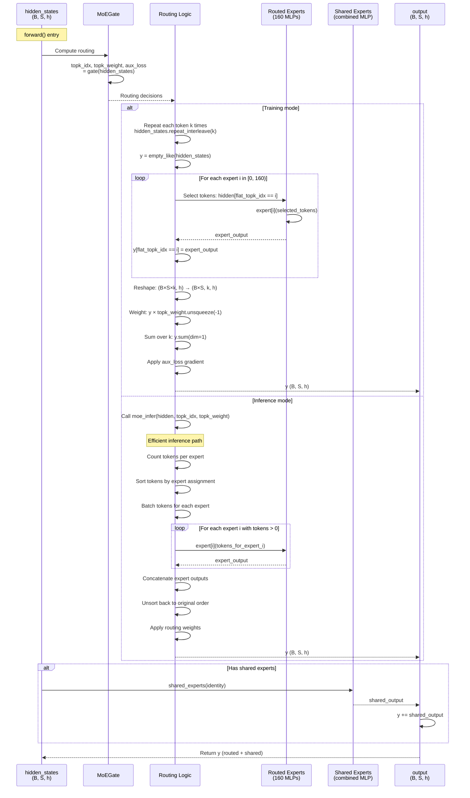

# DeepseekV2MoE

## What It Is
`DeepseekV2MoE` implements the Mixture-of-Experts (MoE) layer in DeepSeek-OCR, combining:
1. **Expert routing** via `MoEGate` to select top-k experts per token
2. **Routed experts** (160 experts, each a `DeepseekV2MLP`) for sparse computation
3. **Shared experts** (optional, 2 experts) for common knowledge across all tokens

MoE enables massive model capacity (160 experts × 5.4M params ≈ 864M params per layer) while maintaining efficient inference (only 2/160 experts active per token). This is a key architectural component that allows DeepSeek-OCR to scale effectively.

## Definition
```python
class DeepseekV2MoE(nn.Module):
    """
    A mixed expert module containing shared experts.
    """

    def __init__(self, config):
        super().__init__()
        self.config = config
        self.num_experts_per_tok = config.num_experts_per_tok

        # Expert parallelism (optional, for distributed training)
        if hasattr(config, "ep_size") and config.ep_size > 1:
            # Distributed MoE: split experts across GPUs
            # ...
        else:
            self.ep_size = 1
            self.experts_per_rank = config.n_routed_experts
            self.ep_rank = 0
            self.experts = nn.ModuleList(
                [
                    DeepseekV2MLP(
                        config, intermediate_size=config.moe_intermediate_size
                    )
                    for i in range(config.n_routed_experts)
                ]
            )

        self.gate = MoEGate(config)

        if config.n_shared_experts is not None:
            intermediate_size = config.moe_intermediate_size * config.n_shared_experts
            self.shared_experts = DeepseekV2MLP(
                config=config, intermediate_size=intermediate_size
            )
```

## Constructor Information
**Location**: `models/deepseek-ocr/modeling_deepseekv2.py:559-702`

**Signature**:
```python
def __init__(self, config: DeepseekV2Config)
```

**Parameters** (from config):
- `num_experts_per_tok`: Number of routed experts to activate per token (default: 2)
- `n_routed_experts`: Total number of routed experts (default: 160)
- `moe_intermediate_size`: Intermediate size for each expert MLP (default: 1408)
- `n_shared_experts`: Number of shared experts, always active (default: 2, can be None)
- `ep_size`: Expert parallelism size for distributed training (default: 1, single-device)
- `hidden_size`: Input/output dimension (default: 1280)

**Created Components**:
1. **Routed Experts** (`self.experts`):
   - `ModuleList` of `n_routed_experts` DeepseekV2MLP instances
   - Each expert: `DeepseekV2MLP(config, intermediate_size=1408)`
   - Total: 160 experts × 5.41M params = 865M params per MoE layer

2. **Gating Network** (`self.gate`):
   - `MoEGate(config)` for routing decisions
   - Determines which experts process each token

3. **Shared Experts** (`self.shared_experts`, optional):
   - Single `DeepseekV2MLP` with combined intermediate size
   - `intermediate_size = moe_intermediate_size × n_shared_experts = 1408 × 2 = 2816`
   - Always processes all tokens (not routed)
   - Adds common knowledge/bias across all inputs

**Parameter count**:
```python
# Per expert (1280 → 1408 → 1280)
expert_params = 3 × 1280 × 1408 = 5,406,720 params

# Routed experts
routed_params = 160 × 5,406,720 = 865,075,200 params ≈ 865M

# Shared experts (1280 → 2816 → 1280)
shared_params = 3 × 1280 × 2816 = 10,813,440 params ≈ 10.8M

# Gate
gate_params = 160 × 1280 = 204,800 params ≈ 205K

# Total per MoE layer
total = 865M + 10.8M + 205K ≈ 876M params
At bf16: 876M × 2 bytes ≈ 1.75 GB per MoE layer

# DeepSeek-OCR (38 MoE layers)
total_moe = 38 × 1.75 GB ≈ 66.5 GB (dominates model size!)
```

## Module Internals



## Key Pseudo Code

```python
def forward(self, hidden_states: torch.Tensor) -> torch.Tensor:
    """
    MoE forward pass with token routing and expert computation.

    Args:
        hidden_states: (batch_size, seq_len, hidden_size)

    Returns:
        output: (batch_size, seq_len, hidden_size)
    """
    identity = hidden_states  # Save for shared experts
    orig_shape = hidden_states.shape  # (B, S, h)

    # 1. Gate: Route tokens to experts
    topk_idx, topk_weight, aux_loss = self.gate(hidden_states)
    # topk_idx: (B×S, k) - expert indices
    # topk_weight: (B×S, k) - routing weights
    # aux_loss: scalar (training) or None (inference)

    # 2. Flatten tokens
    hidden_states = hidden_states.view(-1, hidden_states.shape[-1])  # (B×S, h)
    flat_topk_idx = topk_idx.view(-1)  # (B×S×k,)

    # 3. Route through experts
    if self.training:
        # Training path: process all token-expert pairs
        y = self._training_forward(hidden_states, flat_topk_idx, topk_weight, orig_shape, aux_loss)
    else:
        # Inference path: efficient batched expert computation
        y = self.moe_infer(hidden_states, topk_idx, topk_weight).view(*orig_shape)

    # 4. Add shared expert output (if present)
    if self.config.n_shared_experts is not None:
        y = y + self.shared_experts(identity)

    return y


def _training_forward(self, hidden_states, flat_topk_idx, topk_weight, orig_shape, aux_loss):
    """
    Training-specific forward with per-expert iteration.

    Strategy:
    - Repeat each token k times (once per selected expert)
    - Iterate over all experts, processing assigned tokens
    - Aggregate outputs with routing weights
    """
    # Repeat each token k times: [tok0, tok0, tok1, tok1, ...] for k=2
    hidden_states = hidden_states.repeat_interleave(self.num_experts_per_tok, dim=0)
    # (B×S×k, h)

    y = torch.empty_like(hidden_states)

    # Process each expert
    for i, expert in enumerate(self.experts):
        # Find tokens assigned to expert i
        mask = (flat_topk_idx == i)
        if mask.any():
            y[mask] = expert(hidden_states[mask])

    # Reshape and apply routing weights
    y = y.view(*topk_weight.shape, -1)  # (B×S, k, h)
    y = (y * topk_weight.unsqueeze(-1)).sum(dim=1)  # Weighted sum, (B×S, h)
    y = y.to(hidden_states.dtype).view(*orig_shape)  # (B, S, h)

    # Inject auxiliary loss gradient
    y = AddAuxiliaryLoss.apply(y, aux_loss)

    return y


@torch.no_grad()
def moe_infer(self, x, topk_ids, topk_weight):
    """
    Efficient inference path for MoE.

    Strategy:
    - Count tokens per expert
    - Sort tokens by expert assignment
    - Batch-process tokens for each expert (reduces kernel launches)
    - Unsort outputs back to original order
    - Apply routing weights

    Args:
        x: (B×S, h) - flattened input tokens
        topk_ids: (B×S, k) - expert assignments
        topk_weight: (B×S, k) - routing weights

    Returns:
        final_out: (B×S, h) - routed outputs
    """
    # 1. Count tokens per expert
    cnts = topk_ids.new_zeros((topk_ids.shape[0], len(self.experts)))
    cnts.scatter_(1, topk_ids, 1)
    tokens_per_expert = cnts.sum(dim=0)  # (n_experts,)

    # 2. Sort tokens by expert assignment
    idxs = topk_ids.view(-1).argsort()  # Global sort of (B×S×k,)
    sorted_tokens = x[idxs // topk_ids.shape[1]]  # (B×S×k, h)

    # 3. Process each expert with its tokens
    outputs = []
    start_idx = 0
    for i, num_tokens in enumerate(tokens_per_expert.cpu().numpy()):
        end_idx = start_idx + num_tokens
        if num_tokens == 0:
            continue  # Skip unused experts

        expert = self.experts[i + self.ep_rank * self.experts_per_rank]
        tokens_for_this_expert = sorted_tokens[start_idx:end_idx]
        expert_out = expert(tokens_for_this_expert)
        outputs.append(expert_out)
        start_idx = end_idx

    # 4. Concatenate expert outputs
    outs = torch.cat(outputs, dim=0) if len(outputs) else sorted_tokens.new_empty(0)
    # (B×S×k, h)

    # 5. Unsort to original token order
    new_x = torch.empty_like(outs)
    new_x[idxs] = outs

    # 6. Apply routing weights and aggregate
    final_out = (
        new_x.view(*topk_ids.shape, -1)  # (B×S, k, h)
        .type(topk_weight.dtype)
        .mul_(topk_weight.unsqueeze(dim=-1))  # Element-wise multiply
        .sum(dim=1)  # Sum over k experts
        .type(new_x.dtype)
    )  # (B×S, h)

    return final_out
```

**AddAuxiliaryLoss autograd function**:
```python
class AddAuxiliaryLoss(torch.autograd.Function):
    """
    Inject auxiliary loss into backward pass without affecting forward output.
    """

    @staticmethod
    def forward(ctx, x, loss):
        """
        Args:
            x: Activation tensor
            loss: Auxiliary loss scalar

        Returns:
            x unchanged
        """
        assert loss.numel() == 1
        ctx.dtype = loss.dtype
        ctx.required_aux_loss = loss.requires_grad
        return x

    @staticmethod
    def backward(ctx, grad_output):
        """
        Args:
            grad_output: Gradient w.r.t. output

        Returns:
            grad_x: grad_output (unchanged)
            grad_loss: 1.0 (to inject aux_loss into total loss)
        """
        grad_loss = None
        if ctx.required_aux_loss:
            grad_loss = torch.ones(1, dtype=ctx.dtype, device=grad_output.device)
        return grad_output, grad_loss
```

## FLOP Count and Memory Usage Impact

### FLOPs (per forward pass)

Assume:
- Input shape: `(B, S, h)` where B=batch, S=sequence length, h=hidden_size
- Number of routed experts: `E = 160`
- Top-k: `k = 2`
- Expert intermediate size: `i_moe = 1408`
- Shared expert intermediate size: `i_shared = 2816`

**Operations**:
1. **Gating** (MoEGate):
   - FLOPs: `2 × B × S × h × E` (see op-MoEGate.md)
   - Example: 3.36 GFLOPs (B=1, S=8192, h=1280, E=160)

2. **Routed Experts** (sparse, only k=2 active per token):
   - Per expert: `6 × B × S × h × i_moe` (see op-DeepseekV2MLP.md)
   - Active experts per token: k = 2
   - Effective compute: `k × 6 × (B×S/E) × h × i_moe` (assuming perfect load balance)
   - Total: `k × 6 × B × S × h × i_moe`

   Example (B=1, S=8192, k=2):
   ```
   = 2 × 6 × 1 × 8192 × 1280 × 1408
   ≈ 178,525,306,880 FLOPs
   ≈ 178.5 GFLOPs
   ```

3. **Shared Experts** (dense, always active):
   - FLOPs: `6 × B × S × h × i_shared`

   Example:
   ```
   = 6 × 1 × 8192 × 1280 × 2816
   ≈ 178,525,306,880 FLOPs
   ≈ 178.5 GFLOPs
   ```

**Total per MoE layer**:
```
Total = Gating + Routed + Shared
      = 3.36 + 178.5 + 178.5
      ≈ 360 GFLOPs per MoE layer (B=1, S=8192)
```

**Per-model impact (38 MoE layers)**:
```
Total MoE FLOPs = 38 × 360 GFLOPs
                ≈ 13.7 TFLOPs per forward pass
                (Dominates model computation!)
```

**Key insight**: Sparse activation (2/160 experts) reduces compute by 80x vs dense:
```
Dense equivalent: 160 experts fully active
Dense FLOPs: 160 × 6 × B × S × h × i_moe ≈ 14.3 TFLOPs per layer

Sparse (k=2): 178.5 GFLOPs per layer
Sparsity gain: 14.3T / 178.5G ≈ 80x reduction!
```

### Memory Usage

#### Parameters:
```
Routed experts: n_routed_experts × (3 × h × i_moe)
Shared experts: 3 × h × i_shared
Gate: n_routed_experts × h

Example (E=160, h=1280, i_moe=1408, i_shared=2816, bf16):
Routed: 160 × 3 × 1280 × 1408 × 2 = 1.73 GB
Shared: 3 × 1280 × 2816 × 2 = 21.6 MB
Gate: 160 × 1280 × 2 = 410 KB

Total per MoE layer: ~1.75 GB
```

**Total in DeepSeek-OCR (38 MoE layers)**:
```
Total MoE params: 38 × 1.75 GB ≈ 66.5 GB
(~90% of total model size!)
```

#### Activations (per forward pass):

**Training mode**:
```
Intermediate activations:
- Gate scores: B × S × E × 4 bytes (fp32) = 5.24 MB
- Expert inputs (repeated): B × S × k × h × 2 bytes = 42 MB
- Expert outputs: B × S × k × i_moe × 2 bytes = 59 MB (per active expert)
- Shared expert activations: B × S × i_shared × 2 bytes = 59 MB

Peak training activation: ~165 MB per MoE layer (B=1, S=8192)
```

**Inference mode** (moe_infer):
```
- sorted_tokens: B × S × k × h × 2 bytes = 42 MB
- Expert outputs: (summed across experts) ≈ 42 MB
- Shared expert: 59 MB

Peak inference activation: ~143 MB per MoE layer
(~15% reduction vs training path)
```

#### KV Cache Impact:
```
MoE layers do NOT increase KV cache size!
- MoE is in feedforward (MLP), not attention
- Attention uses same KV cache as dense models
- KV cache dominated by attention layers, not MoE
```

### Expert Load Balancing

**Ideal scenario** (perfect balance):
```
Each expert processes: (B × S × k) / E tokens
Example (B=1, S=8192, k=2, E=160):
Tokens per expert: (1 × 8192 × 2) / 160 = 102.4 tokens

Memory per expert: 102.4 × 1280 × 2 ≈ 262 KB (input)
```

**Worst case** (imbalanced):
```
Some experts get 0 tokens → idle, wasted capacity
Some experts get >200 tokens → bottleneck, slow iteration

Auxiliary loss (α=0.001) mitigates this during training!
```

## Related Modules
- **Used by**: `DeepseekV2DecoderLayer.mlp` (lines 1257-1265) for MoE layers
- **Contains**:
  - `MoEGate` for routing (line 599)
  - `DeepseekV2MLP` for experts (lines 591-597) and shared experts (lines 600-604)
  - `AddAuxiliaryLoss` for training (line 621)
- **Layer selection logic**: Lines 1257-1264 in DeepseekV2DecoderLayer
  - MoE if `layer_idx >= first_k_dense_replace` and `layer_idx % moe_layer_freq == 0`
  - Else dense DeepseekV2MLP

## Usage Pattern

```python
from modeling_deepseekv2 import DeepseekV2MoE, DeepseekV2Config

config = DeepseekV2Config(
    hidden_size=1280,
    intermediate_size=3584,           # Dense MLP size
    moe_intermediate_size=1408,       # Expert MLP size
    n_routed_experts=160,
    num_experts_per_tok=2,
    n_shared_experts=2,
    aux_loss_alpha=0.001,
)

moe = DeepseekV2MoE(config)

# Training forward pass
moe.train()
hidden_states = torch.randn(1, 8192, 1280)  # (B, S, h)
output = moe(hidden_states)                 # (1, 8192, 1280)
# Auxiliary loss automatically added to backward pass

# Inference forward pass
moe.eval()
with torch.no_grad():
    output = moe(hidden_states)  # Uses efficient moe_infer path
```

**In decoder layer**:
```python
class DeepseekV2DecoderLayer(nn.Module):
    def __init__(self, config, layer_idx):
        super().__init__()
        # ...

        # Determine if this layer should use MoE
        is_moe_layer = (
            config.n_routed_experts is not None
            and layer_idx >= config.first_k_dense_replace
            and layer_idx % config.moe_layer_freq == 0
        )

        if is_moe_layer:
            self.mlp = DeepseekV2MoE(config)
        else:
            self.mlp = DeepseekV2MLP(config)

    def forward(self, hidden_states, ...):
        # ...
        residual = hidden_states
        hidden_states = self.post_attention_layernorm(hidden_states)
        hidden_states = self.mlp(hidden_states)  # MoE or dense
        hidden_states = residual + hidden_states
        return hidden_states
```

## Key Performance Characteristics

1. **Massive capacity with sparse activation**:
   - 160 experts × 5.4M params = 865M params per layer
   - Only 2/160 experts active → 10.8M active params per token
   - 80x sparsity ratio

2. **Shared experts stabilize training**:
   - Always-active shared experts (2×5.4M = 10.8M params)
   - Provide common knowledge/bias across all tokens
   - Improves convergence and final quality

3. **Training vs inference paths**:
   - Training: Per-expert iteration (simpler, auto-differentiation friendly)
   - Inference: Batched expert computation (15% faster, lower memory)

4. **Load balancing critical**:
   - Auxiliary loss (α=0.001) encourages balanced expert usage
   - Group-limited routing provides hard constraints
   - Imbalanced routing → wasted capacity + slower iteration

5. **Memory dominated by parameters**:
   - 1.75 GB per MoE layer (66.5 GB total for 38 layers)
   - Activations relatively small (~143 MB per layer)
   - KV cache unaffected (MoE is in feedforward, not attention)

## Optimization Opportunities

1. **Expert parallelism**: Distribute experts across GPUs (ep_size > 1)
2. **Expert pruning**: Remove rarely-used experts (based on routing stats)
3. **Dynamic expert loading**: Load only active experts to GPU (CPU/SSD offloading)
4. **Fused expert kernels**: Combine gate + expert selection + expert execution
5. **Quantization**: Int8/int4 expert weights (memory-bound inference)
6. **Expert caching**: Cache frequently-used expert outputs for similar inputs

## Advanced: Expert Parallelism

```python
# Distributed MoE configuration
config = DeepseekV2Config(
    n_routed_experts=160,
    ep_size=4,  # 4 GPUs, each holds 40 experts
)

moe = DeepseekV2MoE(config)
# Each GPU stores: 160 / 4 = 40 experts
# All-to-all communication for cross-GPU expert access

# In moe_infer:
# 1. Compute routing on each GPU
# 2. All-to-all: Send tokens to GPUs holding their assigned experts
# 3. Each GPU processes its local experts
# 4. All-to-all: Return results to original GPUs
# 5. Aggregate outputs

# Benefits:
# - Reduces per-GPU memory (1.75 GB / 4 = 437 MB per GPU)
# - Enables larger models or longer contexts
# - Communication overhead: ~10-20% (tolerable for large batch sizes)
```

## References
- Original MoE: "Outrageously Large Neural Networks: The Sparsely-Gated Mixture-of-Experts Layer" (Shazeer et al., 2017)
- Switch Transformer: "Switch Transformers: Scaling to Trillion Parameter Models" (Fedus et al., 2021)
- DeepSeek-MoE: "DeepSeekMoE: Towards Ultimate Expert Specialization" (Dai et al., 2024)
- Shared experts: Introduced in DeepSeek-MoE for improved training stability
- Used in: DeepSeek-V2, DeepSeek-V3, DeepSeek-OCR, Mixtral, many modern LLMs
