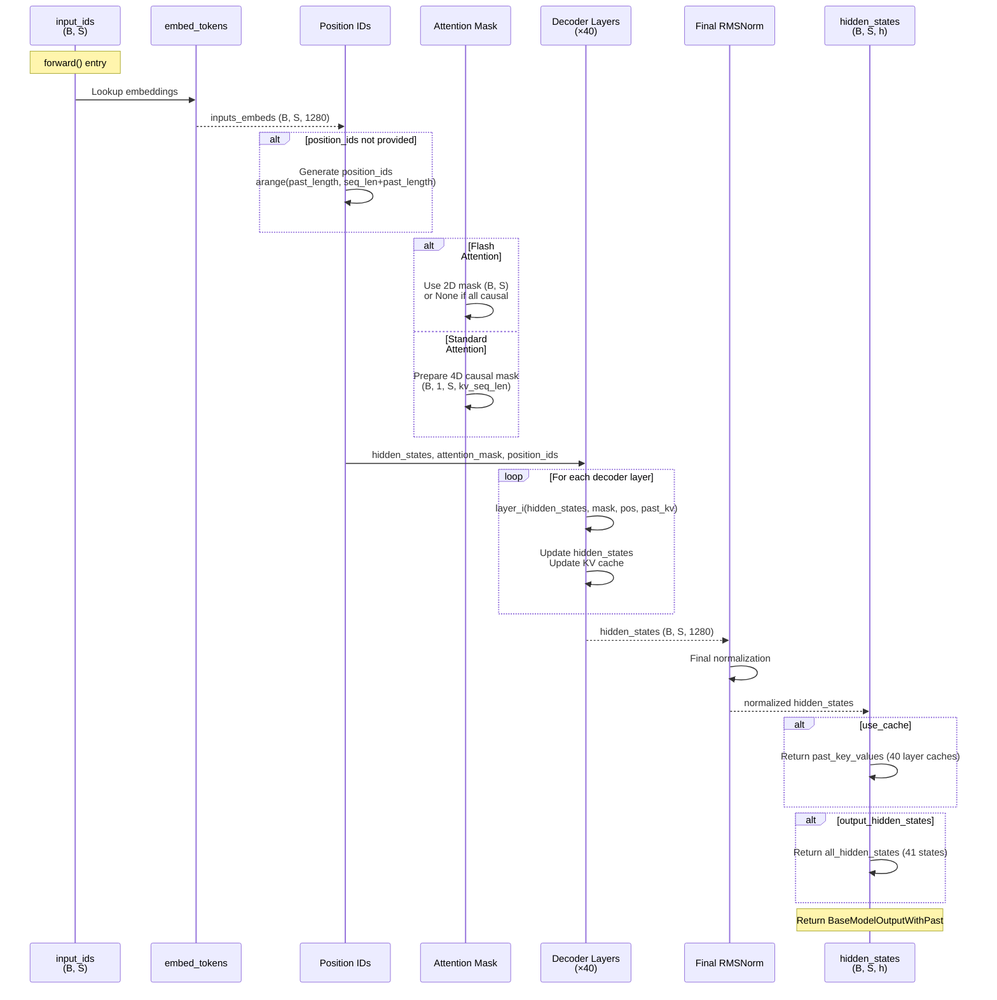

# DeepseekV2Model

## What It Is
`DeepseekV2Model` is the complete decoder-only transformer stack for DeepSeek-style LLMs. In DeepSeek-OCR it is used as
the language backbone and is wrapped by `DeepseekOCRModel` / `DeepseekOCRForCausalLM`. It combines:
1. **Token embedding layer** to convert input IDs to vectors
2. **config.num_hidden_layers decoder layers** (`DeepseekV2DecoderLayer`) stacked sequentially
3. **Final RMSNorm** for output normalization
4. **KV cache management** for efficient autoregressive generation
5. **Attention mask handling** (causal masking for autoregression)

This is the core transformer that processes text tokens (including OCR-generated text embeddings from vision) and produces contextualized hidden states. It does NOT include the LM head for next-token prediction - that's added by `DeepseekV2ForCausalLM`.

## Definition
```python
class DeepseekV2Model(DeepseekV2PreTrainedModel):
    """
    Transformer decoder consisting of *config.num_hidden_layers* layers.
    Each layer is a DeepseekV2DecoderLayer.
    """

    def __init__(self, config: DeepseekV2Config):
        super().__init__(config)
        self.padding_idx = config.pad_token_id
        self.vocab_size = config.vocab_size

        self.embed_tokens = nn.Embedding(
            config.vocab_size, config.hidden_size, self.padding_idx
        )
        self.layers = nn.ModuleList(
            [
                DeepseekV2DecoderLayer(config, layer_idx)
                for layer_idx in range(config.num_hidden_layers)
            ]
        )
        self._use_flash_attention_2 = config._attn_implementation == "flash_attention_2"
        self.norm = DeepseekV2RMSNorm(config.hidden_size, eps=config.rms_norm_eps)

        self.gradient_checkpointing = False
        self.post_init()
```

## Constructor Information
**Location**: `models/deepseek-ocr/modeling_deepseekv2.py:1452-1480`

**Signature**:
```python
def __init__(self, config: DeepseekV2Config)
```

**Parameters** (from config):
- `vocab_size`: Vocabulary size (e.g., 102400 in `DeepseekV2Config` defaults,
  129280 in the DeepSeek-OCR checkpoint).
- `hidden_size`: Model hidden dimension (default: 4096 in `DeepseekV2Config`;
  1280 in DeepSeek-OCR).
- `num_hidden_layers`: Number of transformer layers (e.g., 30 by default in
  `DeepseekV2Config`, 12 in DeepSeek-OCR).
- `pad_token_id`: Padding token ID.
- `_attn_implementation`: "eager" or "flash_attention_2"
- `rms_norm_eps`: Epsilon for final RMSNorm (default: 1e-6)

**Created Components**:

1. **self.embed_tokens**: Token embedding table
   - `nn.Embedding(vocab_size, hidden_size, padding_idx)`
   - Shape and parameter count depend on `vocab_size` and `hidden_size`.
     - Example (generic LLM): `vocab_size=102400`, `hidden_size=4096`
       → 419,430,400 params.
     - Example (DeepSeek-OCR checkpoint): `vocab_size=129280`,
       `hidden_size=1280` → 165,478,400 params.

2. **self.layers**: Stack of decoder layers
   - `ModuleList` of `config.num_hidden_layers` `DeepseekV2DecoderLayer`
     instances.
   - Actual per-layer parameter count depends on:
     - attention implementation (`use_mla` vs MHA, eager vs flash),
     - MoE configuration (`n_routed_experts`, `num_experts_per_tok`,
       `moe_intermediate_size`),
     - `hidden_size` / `intermediate_size`.
   - See `op-DeepseekV2DecoderLayer.md`, `op-DeepseekV2Attention.md`,
     `op-DeepseekV2MoE.md`, and `op-DeepseekV2MLP.md` for formulas.

3. **self.norm**: Final output normalization
   - `DeepseekV2RMSNorm(hidden_size)`
   - Parameters: `hidden_size` (e.g., 4096 or 1280).

> Historical note: some earlier drafts approximated a **40‑layer MLA + MoE**
> configuration at ~36.6B parameters (~73 GB at bf16). That configuration is
> **not** the one used by DeepSeek-OCR (12 layers, MHA, 64 routed experts); use
> the per‑module formulas to compute exact counts for a given config.

## Module Internals



## Key Pseudo Code

```python
def forward(
    self,
    input_ids: torch.LongTensor = None,
    attention_mask: Optional[torch.Tensor] = None,
    position_ids: Optional[torch.LongTensor] = None,
    past_key_values: Optional[List[torch.FloatTensor]] = None,
    inputs_embeds: Optional[torch.FloatTensor] = None,
    use_cache: Optional[bool] = None,
    output_attentions: Optional[bool] = None,
    output_hidden_states: Optional[bool] = None,
    return_dict: Optional[bool] = None,
    cache_position: Optional[torch.LongTensor] = None
) -> Union[Tuple, BaseModelOutputWithPast]:
    """
    Full transformer decoder forward pass.

    Args:
        input_ids: (batch, seq_len) input token IDs
        attention_mask: (batch, seq_len) mask for padding tokens
        position_ids: (batch, seq_len) position indices for RoPE
        past_key_values: Cached K, V from previous decoding steps (DynamicCache or list)
        inputs_embeds: (batch, seq_len, hidden_size) pre-computed embeddings (alternative to input_ids)
        use_cache: Whether to return KV cache for next step
        output_attentions: Whether to return attention weights
        output_hidden_states: Whether to return all intermediate hidden states
        return_dict: Whether to return BaseModelOutputWithPast

    Returns:
        BaseModelOutputWithPast with:
            last_hidden_state: (batch, seq_len, hidden_size)
            past_key_values: Updated KV cache
            hidden_states: All layer outputs if output_hidden_states=True
            attentions: All attention weights if output_attentions=True
    """
    # 1. Validate inputs
    if input_ids is not None and inputs_embeds is not None:
        raise ValueError("Cannot specify both input_ids and inputs_embeds")
    elif input_ids is not None:
        batch_size, seq_length = input_ids.shape[:2]
    elif inputs_embeds is not None:
        batch_size, seq_length = inputs_embeds.shape[:2]
    else:
        raise ValueError("Must specify either input_ids or inputs_embeds")

    # 2. Gradient checkpointing compatibility
    if self.gradient_checkpointing and self.training:
        if use_cache:
            use_cache = False  # Incompatible with gradient checkpointing

    # 3. Handle KV cache
    past_key_values_length = 0
    if use_cache:
        # Convert legacy cache format to DynamicCache
        use_legacy_cache = not isinstance(past_key_values, Cache)
        if use_legacy_cache:
            past_key_values = DynamicCache.from_legacy_cache(past_key_values)
        past_key_values_length = past_key_values.get_usable_length(seq_length)

    # 4. Generate position IDs if not provided
    if position_ids is None:
        device = input_ids.device if input_ids is not None else inputs_embeds.device
        position_ids = torch.arange(
            past_key_values_length,
            seq_length + past_key_values_length,
            dtype=torch.long,
            device=device,
        )
        position_ids = position_ids.unsqueeze(0)  # (1, seq_len)

    # 5. Embed tokens
    if inputs_embeds is None:
        inputs_embeds = self.embed_tokens(input_ids)  # (B, S, 1280)

    # 6. Prepare attention mask
    if self._use_flash_attention_2:
        # Flash attention uses 2D mask (or None for all-causal)
        attention_mask = (
            attention_mask
            if (attention_mask is not None and 0 in attention_mask)
            else None
        )
    else:
        # Standard attention needs 4D causal mask
        attention_mask = _prepare_4d_causal_attention_mask(
            attention_mask,
            (batch_size, seq_length),
            inputs_embeds,
            past_key_values_length,
        )

    # 7. Initialize outputs
    hidden_states = inputs_embeds
    all_hidden_states = () if output_hidden_states else None
    all_self_attns = () if output_attentions else None
    next_decoder_cache = None

    # 8. Pass through all decoder layers
    for decoder_layer in self.layers:
        if output_hidden_states:
            all_hidden_states += (hidden_states,)

        if self.gradient_checkpointing and self.training:
            # Recompute activations during backward pass
            layer_outputs = self._gradient_checkpointing_func(
                decoder_layer.__call__,
                hidden_states,
                attention_mask,
                position_ids,
                past_key_values,
                output_attentions,
                use_cache,
            )
        else:
            layer_outputs = decoder_layer(
                hidden_states,
                attention_mask=attention_mask,
                position_ids=position_ids,
                past_key_value=past_key_values,
                output_attentions=output_attentions,
                use_cache=use_cache,
            )

        hidden_states = layer_outputs[0]

        if use_cache:
            next_decoder_cache = layer_outputs[2 if output_attentions else 1]

        if output_attentions:
            all_self_attns += (layer_outputs[1],)

    # 9. Final normalization
    hidden_states = self.norm(hidden_states)

    # 10. Add final hidden state
    if output_hidden_states:
        all_hidden_states += (hidden_states,)

    # 11. Convert cache back to legacy format if needed
    next_cache = None
    if use_cache:
        next_cache = (
            next_decoder_cache.to_legacy_cache()
            if use_legacy_cache
            else next_decoder_cache
        )

    # 12. Return outputs
    if not return_dict:
        return tuple(
            v
            for v in [hidden_states, next_cache, all_hidden_states, all_self_attns]
            if v is not None
        )

    return BaseModelOutputWithPast(
        last_hidden_state=hidden_states,
        past_key_values=next_cache,
        hidden_states=all_hidden_states,
        attentions=all_self_attns,
    )
```

## FLOP Count and Memory Usage Impact

### FLOPs (per forward pass)

Assume:
- Input shape: `(B, S)` where B=batch, S=sequence length
- Cached context: `K` tokens

**Operations**:

1. **Token embedding**: 0 FLOPs (lookup operation).

2. **Decoder layers**:
   - FLOPs scale linearly with `config.num_hidden_layers`.
   - See `op-DeepseekV2DecoderLayer.md` for per‑layer formulas (attention +
     MLP/MoE) for both **prefill** (`S` large, `K≈S`) and **decode**
     (`S≈1`, `K` large).

3. **Final RMSNorm**:
   ```
   FLOPs ≈ 3 × B × S × hidden_size
   Example (B=1, S=8192, hidden_size=1280):
       ≈ 31.5 MFLOPs
   ```

### Memory Usage

#### Parameters:
- **Embedding table**: `vocab_size × hidden_size × sizeof(dtype)`.
- **Decoder stack**: `num_hidden_layers × (attention + MLP/MoE params)`.
- **Final norm**: `hidden_size` parameters.

The exact numbers depend on configuration. For example:
- A large 40‑layer MLA+MoE configuration (historical example) can reach
  ~36.6B parameters (~73 GB at bf16).
- The shipped DeepSeek-OCR checkpoint (12 layers, MHA, 64 routed experts)
  is much smaller; see `op-DeepseekV2MoE.md` and `op-DeepseekV2MLP.md` for
  formulas.

#### Activations and KV cache:
- Activations scale with `B × S × hidden_size × num_hidden_layers`, plus
  attention‑specific terms (see `op-DeepseekV2DecoderLayer.md`).
- KV cache size scales with `num_hidden_layers × K` and depends on whether
  MLA (compressed cache) or standard MHA (full K/V) is used; see
  `op-DeepseekV2Attention.md` and `op-DeepseekV2FlashAttention2.md`.

## Related Modules
- **Used by**:
  - `DeepseekV2ForCausalLM.model` - adds LM head for generation
  - `DeepseekV2ForSequenceClassification.model` - adds classification head
  - `DeepseekOCRModel` - integrates vision encoders and projector before
    delegating to this decoder
- **Contains**:
  - `nn.Embedding` for token embeddings
  - 40 × `DeepseekV2DecoderLayer` for transformer layers
  - `DeepseekV2RMSNorm` for final normalization
- **Cache management**: Uses `DynamicCache` from transformers for efficient KV caching

## Usage Pattern

```python
from modeling_deepseekv2 import DeepseekV2Model, DeepseekV2Config

config = DeepseekV2Config(
    vocab_size=129280,
    hidden_size=1280,
    num_hidden_layers=12,
    use_mla=False,          # DeepSeek-OCR uses MHA by default
    n_routed_experts=64,
)

model = DeepseekV2Model(config)

# Prefill
input_ids = torch.randint(0, 32000, (1, 8192))  # (B, S)
position_ids = torch.arange(8192).unsqueeze(0)

outputs = model(
    input_ids=input_ids,
    position_ids=position_ids,
    use_cache=True,
)

hidden_states = outputs.last_hidden_state  # (1, 8192, 1280)
past_key_values = outputs.past_key_values  # KV cache for all decoder layers

# Decode
next_token_id = torch.tensor([[12345]])  # (1, 1)
next_position = torch.tensor([[8192]])

outputs = model(
    input_ids=next_token_id,
    position_ids=next_position,
    past_key_values=past_key_values,  # Reuse cached K, V
    use_cache=True,
)

next_hidden_states = outputs.last_hidden_state  # (1, 1, 1280)
updated_past_key_values = outputs.past_key_values
```

## Key Performance Characteristics

1. **Efficient KV caching**: 377 MB for 8K context (57x smaller than standard attention)
2. **MoE sparsity**: Only 2/160 experts active per token (80x parameter efficiency)
3. **Flash Attention**: 70x memory reduction during prefill
4. **Gradient checkpointing**: Reduces training memory for deep stacks
5. **Pre-norm stability**: Enables stable training of deep decoder stacks

## Optimization Opportunities

1. **Continuous batching**: Process multiple requests with different sequence lengths
2. **Speculative decoding**: Generate multiple tokens per forward pass
3. **KV cache quantization**: Int8/int4 KV cache (2-4x further reduction)
4. **Pipeline parallelism**: Split decoder layers across multiple GPUs
5. **Expert parallelism**: Distribute MoE experts across GPUs

## References
- Original transformer: "Attention Is All You Need" (Vaswani et al., 2017)
- Pre-norm architecture: "On Layer Normalization in the Transformer Architecture" (Xiong et al., 2020)
- Multi-head Latent Attention: DeepSeek-V2 paper (Bi et al., 2024)
- Mixture-of-Experts: DeepSeek-MoE paper (Dai et al., 2024)
- Used in: DeepSeek-V2, DeepSeek-V3, DeepSeek-OCR
