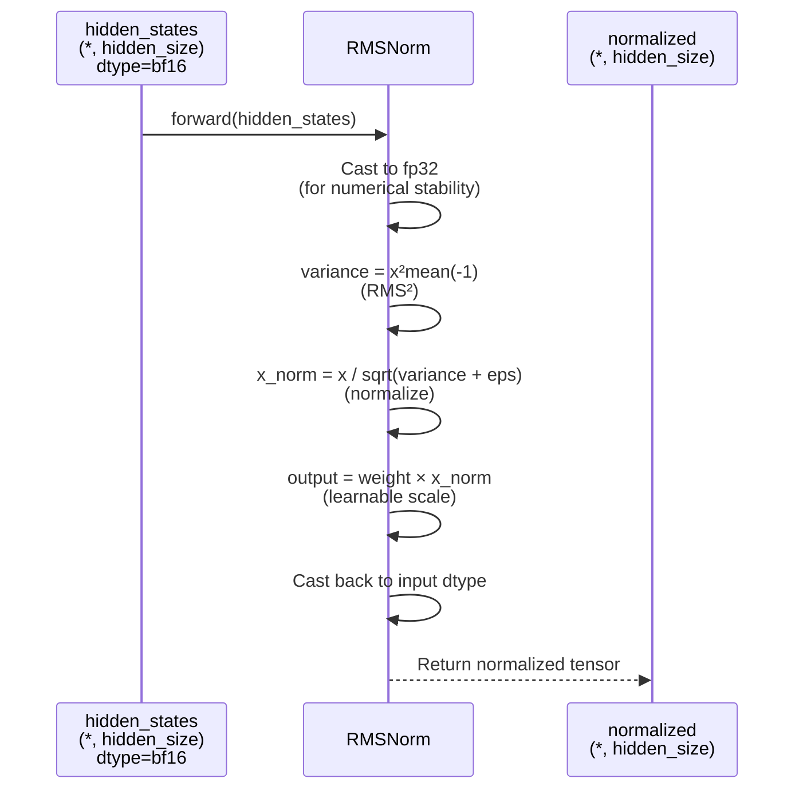

# DeepseekV2RMSNorm

## What It Is
`DeepseekV2RMSNorm` (Root Mean Square Layer Normalization) is a normalization module used throughout DeepSeek-OCR's transformer layers. It's a variant of LayerNorm that normalizes activations using only the root mean square (RMS) statistic, without centering (no mean subtraction). This simplifies computation while maintaining training stability.

RMSNorm is equivalent to T5's LayerNorm implementation and is commonly used in modern large language models (LLaMA, Mistral, etc.) for efficiency.

## Definition
```python
class DeepseekV2RMSNorm(nn.Module):
    def __init__(self, hidden_size, eps=1e-6):
        super().__init__()
        self.weight = nn.Parameter(torch.ones(hidden_size))
        self.variance_epsilon = eps

    def forward(self, hidden_states):
        input_dtype = hidden_states.dtype
        hidden_states = hidden_states.to(torch.float32)
        variance = hidden_states.pow(2).mean(-1, keepdim=True)
        hidden_states = hidden_states * torch.rsqrt(variance + self.variance_epsilon)
        return self.weight * hidden_states.to(input_dtype)
```

## Constructor Information
**Location**: `models/deepseek-ocr/modeling_deepseekv2.py:94-108`

**Signature**:
```python
def __init__(self, hidden_size: int, eps: float = 1e-6)
```

**Parameters**:
- `hidden_size`: Dimension of the last axis to be normalized (typically model hidden size, e.g., 1280)
- `eps`: Numerical epsilon added to variance for stability (default: 1e-6)

**Learned Parameters**:
- `self.weight`: Learnable scale parameter of shape `(hidden_size,)`, initialized to ones
- Total parameters: `hidden_size` (e.g., 1280 parameters per RMSNorm layer)

## Module Internals



## Key Pseudo Code

```python
def forward(self, hidden_states: torch.Tensor) -> torch.Tensor:
    """
    Args:
        hidden_states: Input tensor of shape (batch, seq_len, hidden_size)
                       or any shape ending with hidden_size

    Returns:
        Normalized tensor of same shape as input
    """
    input_dtype = hidden_states.dtype  # Save original dtype (bf16/fp16)

    # 1. Upcast to fp32 for numerical stability
    hidden_states = hidden_states.to(torch.float32)

    # 2. Compute variance (RMS²) along last dimension
    variance = hidden_states.pow(2).mean(-1, keepdim=True)  # (*, 1)

    # 3. Normalize by RMS
    hidden_states = hidden_states * torch.rsqrt(variance + self.variance_epsilon)
    # Equivalent to: hidden_states / sqrt(variance + eps)

    # 4. Apply learnable scale
    output = self.weight * hidden_states

    # 5. Cast back to original dtype
    return output.to(input_dtype)
```

**Mathematical Formulation**:
```
RMSNorm(x) = (x / RMS(x)) × weight

where:
  RMS(x) = sqrt(mean(x²) + ε)
  weight: learnable scale parameter (one per dimension)
```

**Difference from Standard LayerNorm**:
```
LayerNorm(x) = ((x - mean(x)) / std(x)) × weight + bias
RMSNorm(x)   = (x / RMS(x)) × weight

RMSNorm advantages:
- No mean computation/subtraction (fewer ops)
- No bias term (fewer parameters)
- ~15-20% faster than LayerNorm
```

## FLOP Count and Memory Usage Impact

### FLOPs (per forward pass)

Assume:
- Input shape: `(B, S, d)` where B=batch, S=sequence length, d=hidden_size
- Total elements: `N = B × S × d`

**Operations**:
1. **Cast to fp32**: 0 FLOPs (type conversion)
2. **Compute x²**: N FLOPs (element-wise square)
3. **Mean along last dim**: d FLOPs per (B, S) element = B × S FLOPs
4. **Rsqrt (1/sqrt(variance + eps))**: B × S FLOPs (reciprocal square root)
5. **Multiply by rsqrt**: N FLOPs (element-wise multiply)
6. **Multiply by weight**: N FLOPs (element-wise multiply with broadcast)
7. **Cast back**: 0 FLOPs

**Total**:
```
FLOPs ≈ N + (B×S) + (B×S) + N + N
      ≈ 3N + 2×B×S
      ≈ 3 × B × S × d  (dominant term)

Example (B=1, S=8192, d=1280):
FLOPs ≈ 3 × 1 × 8192 × 1280 ≈ 31.5 MFLOPs
```

**Comparison to Standard LayerNorm**:
```
LayerNorm: ~5N FLOPs (mean, variance, subtract, divide, scale, shift)
RMSNorm:   ~3N FLOPs (variance, divide, scale)
Speedup:   ~1.67x theoretical (40% fewer ops)
```

### Memory Usage

#### Parameters:
```
weight: hidden_size elements × sizeof(dtype)

Example (d=1280, bf16):
Memory = 1280 × 2 bytes = 2.56 KB per RMSNorm layer
```

**Total in DeepSeek-OCR**:
- Each decoder layer has **2 RMSNorm layers** (pre-attention + post-attention)
- 40 decoder layers → 80 RMSNorm instances
- 1 final norm layer
- **Total: 81 RMSNorm layers**

```
Total RMSNorm parameters = 81 × 1280 = 103,680 parameters
At bf16: 103,680 × 2 bytes ≈ 203 KB
```

#### Activations (per forward pass):

**Intermediate tensors** (worst case, no in-place ops):
1. `fp32_input`: B × S × d × 4 bytes (fp32 copy)
2. `variance`: B × S × 1 × 4 bytes
3. `normalized`: B × S × d × 4 bytes (fp32)
4. `output`: B × S × d × 2 bytes (bf16)

**Example (B=1, S=8192, d=1280)**:
```
fp32_input: 1 × 8192 × 1280 × 4 = 42 MB
variance: 1 × 8192 × 4 = 32 KB
normalized: 42 MB
output: 21 MB

Peak: ~42 MB (fp32 intermediate) per RMSNorm call
```

**Memory Optimization**:
- PyTorch can perform many operations in-place (e.g., multiply, rsqrt)
- Actual peak memory is closer to 1-2× input size (21-42 MB per call)
- Gradient checkpointing can reduce activation memory during backprop

#### Gradient Memory (training):

For each RMSNorm layer:
```
Gradients:
- d(loss)/d(weight): hidden_size × sizeof(dtype) ≈ 2.56 KB
- d(loss)/d(input): B × S × d × sizeof(dtype) ≈ 21 MB (same as input)

Optimizer states (AdamW):
- weight.grad: 2.56 KB
- weight.momentum: 4 bytes × hidden_size ≈ 5.12 KB (fp32)
- weight.variance: 5.12 KB (fp32)

Total per RMSNorm: ~13 KB (parameters + optimizer states)
```

**Total across all 81 RMSNorms**:
```
Parameters: 203 KB
Optimizer states: 81 × 10 KB ≈ 810 KB
Total: ~1 MB (negligible in context of multi-billion parameter model)
```

## Related Modules
- **Used by**:
  - `DeepseekV2DecoderLayer`: `input_layernorm`, `post_attention_layernorm`
  - `DeepseekV2Model`: `norm` (final layer norm)
  - `DeepseekV2Attention`: `q_a_layernorm`, `kv_a_layernorm` (for low-rank projections)

- **Registered in**: `transformers.ALL_LAYERNORM_LAYERS` (line 111)

## Usage Pattern

```python
from modeling_deepseekv2 import DeepseekV2RMSNorm

# Inside a transformer layer
class MyLayer(nn.Module):
    def __init__(self, hidden_size=1280):
        super().__init__()
        self.norm = DeepseekV2RMSNorm(hidden_size, eps=1e-6)
        self.mlp = nn.Linear(hidden_size, hidden_size)

    def forward(self, x):
        # Pre-norm architecture
        normalized = self.norm(x)  # RMSNorm
        output = self.mlp(normalized)
        return x + output  # Residual connection
```

## Key Performance Characteristics

1. **Numerical Stability**: Upcasting to fp32 prevents underflow/overflow in variance computation, critical for bf16 training
2. **Memory Efficiency**: No bias term saves hidden_size parameters per layer
3. **Compute Efficiency**: ~40% fewer FLOPs than standard LayerNorm
4. **Gradient Flow**: Maintains similar gradient properties to LayerNorm, supporting stable deep network training
5. **Compatibility**: Drop-in replacement for LayerNorm in most modern LLM architectures

## References
- Original paper: "Root Mean Square Layer Normalization" (Zhang & Sennrich, 2019)
- Popularized by: T5, LLaMA, Mistral, DeepSeek models
- Similar to: T5LayerNorm, LlamaRMSNorm
