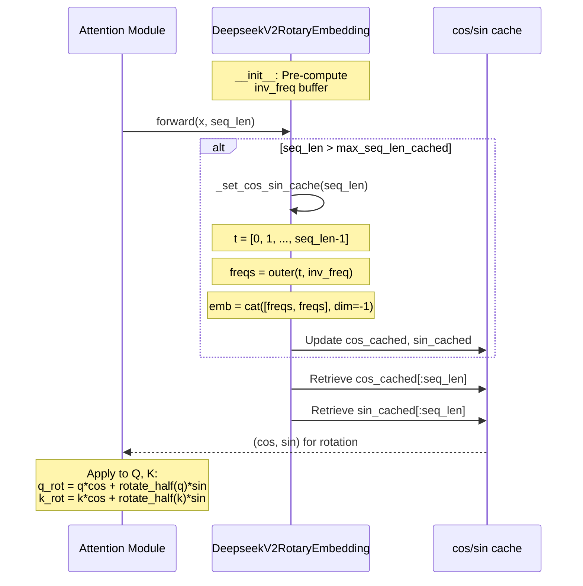

# DeepseekV2RotaryEmbedding

## What It Is
`DeepseekV2RotaryEmbedding` implements Rotary Position Embedding (RoPE), a relative positional encoding method that encodes position information by rotating query and key vectors in attention. RoPE naturally incorporates relative position information through rotation, enabling better length extrapolation and computational efficiency compared to absolute position embeddings.

This is the base implementation used when no context-length scaling is required.

## Definition
```python
class DeepseekV2RotaryEmbedding(nn.Module):
    def __init__(self, dim, max_position_embeddings=2048, base=10000, device=None):
        super().__init__()

        self.dim = dim
        self.max_position_embeddings = max_position_embeddings
        self.base = base
        inv_freq = 1.0 / (
            self.base ** (torch.arange(0, self.dim, 2).float().to(device) / self.dim)
        )
        self.register_buffer("inv_freq", inv_freq, persistent=False)

        self._set_cos_sin_cache(
            seq_len=max_position_embeddings,
            device=self.inv_freq.device,
            dtype=torch.get_default_dtype(),
        )
        self.max_seq_len_cached = None

    def forward(self, x, seq_len=None):
        if self.max_seq_len_cached is None or seq_len > self.max_seq_len_cached:
            self._set_cos_sin_cache(seq_len=seq_len, device=x.device, dtype=x.dtype)

        return (
            self.cos_cached[:seq_len].to(dtype=x.dtype),
            self.sin_cached[:seq_len].to(dtype=x.dtype),
        )
```

## Constructor Information
**Location**: `models/deepseek-ocr/modeling_deepseekv2.py:116-156`

**Signature**:
```python
def __init__(
    self,
    dim: int,                       # Rotary embedding dimension (head_dim for RoPE)
    max_position_embeddings: int = 2048,  # Maximum sequence length to pre-cache
    base: float = 10000,            # RoPE base frequency
    device=None,                    # Device for buffer allocation
)
```

**Parameters**:
- `dim`: Dimension of rotary embeddings (typically `qk_rope_head_dim`, e.g., 64)
- `max_position_embeddings`: Maximum sequence length for pre-computed cache (default: 2048)
- `base`: Base value for inverse frequency calculation (default: 10000, standard RoPE)
- `device`: Optional device for initial buffer placement

**Created Components**:
- `self.inv_freq`: Registered buffer containing inverse frequencies for rotation angles
  - Shape: `(dim // 2,)`
  - Computed as: `1.0 / (base ** (torch.arange(0, dim, 2) / dim))`
  - Not persisted in state dict (persistent=False for memory efficiency)
- `self.cos_cached`: Cached cosine values for positions [0, max_position_embeddings)
  - Shape: `(max_position_embeddings, dim)`
- `self.sin_cached`: Cached sine values for positions [0, max_position_embeddings)
  - Shape: `(max_position_embeddings, dim)`

## Module Internals



## Key Pseudo Code

```python
def __init__(self, dim, max_position_embeddings=2048, base=10000, device=None):
    """
    Initialize RoPE with pre-computed frequency table.

    Args:
        dim: Rotary dimension (must be even)
        max_position_embeddings: Max sequence length
        base: Frequency base (10000 for standard RoPE)
    """
    self.dim = dim
    self.base = base

    # Compute inverse frequencies for rotation angles
    # inv_freq[i] = 1 / (base ** (2*i / dim)) for i in [0, dim/2)
    inv_freq = 1.0 / (base ** (torch.arange(0, dim, 2).float() / dim))
    self.register_buffer("inv_freq", inv_freq, persistent=False)

    # Pre-cache cos/sin for max_position_embeddings positions
    self._set_cos_sin_cache(max_position_embeddings, device, dtype)


def _set_cos_sin_cache(self, seq_len, device, dtype):
    """
    Pre-compute and cache cos/sin values for positions [0, seq_len).

    Math:
        t = [0, 1, 2, ..., seq_len-1]
        freqs[t, i] = t * inv_freq[i]
        emb[t] = [freqs[t], freqs[t]]  # duplicate to match dim
        cos_cached[t] = cos(emb[t])
        sin_cached[t] = sin(emb[t])
    """
    self.max_seq_len_cached = seq_len
    t = torch.arange(seq_len, device=device, dtype=inv_freq.dtype)  # [seq_len]

    # Outer product: freqs[t, i] = t * inv_freq[i]
    freqs = torch.outer(t, self.inv_freq)  # [seq_len, dim/2]

    # Duplicate to full dim (concatenate along last axis)
    emb = torch.cat((freqs, freqs), dim=-1)  # [seq_len, dim]

    # Cache cos and sin
    self.register_buffer("cos_cached", emb.cos().to(dtype), persistent=False)
    self.register_buffer("sin_cached", emb.sin().to(dtype), persistent=False)


def forward(self, x, seq_len=None):
    """
    Retrieve cached cos/sin for sequence length seq_len.

    Args:
        x: Input tensor (used only for device/dtype, shape: [bs, num_heads, seq_len, head_dim])
        seq_len: Sequence length to retrieve

    Returns:
        cos: [seq_len, dim], cosine values
        sin: [seq_len, dim], sine values
    """
    # Dynamically expand cache if needed
    if seq_len > self.max_seq_len_cached:
        self._set_cos_sin_cache(seq_len, x.device, x.dtype)

    # Return sliced cache
    return (
        self.cos_cached[:seq_len].to(dtype=x.dtype),
        self.sin_cached[:seq_len].to(dtype=x.dtype),
    )
```

**Apply rotation** (in attention module):
```python
def apply_rotary_pos_emb(q, k, cos, sin, position_ids):
    """
    Apply RoPE to query and key tensors.

    Args:
        q: [batch, num_heads, seq_len, head_dim]
        k: [batch, num_heads, seq_len, head_dim]
        cos: [seq_len, head_dim]
        sin: [seq_len, head_dim]
        position_ids: [batch, seq_len]

    Returns:
        q_embed, k_embed: Rotated query and key tensors
    """
    # Select cos/sin for specific positions
    cos = cos[position_ids].unsqueeze(1)  # [batch, 1, seq_len, head_dim]
    sin = sin[position_ids].unsqueeze(1)

    # Rotate: q_rot = q*cos + rotate_half(q)*sin
    q_embed = (q * cos) + (rotate_half(q) * sin)
    k_embed = (k * cos) + (rotate_half(k) * sin)

    return q_embed, k_embed
```

## FLOP Count and Memory Usage Impact

### FLOPs

**Initialization** (_set_cos_sin_cache):
```
Operations:
1. torch.arange: O(seq_len) negligible
2. torch.outer: seq_len × (dim/2) = seq_len × dim/2 FLOPs
3. torch.cat: 0 FLOPs (memory copy)
4. cos/sin: 2 × seq_len × dim transcendental ops

Total init: ~2 × seq_len × dim FLOPs

Example (seq_len=8192, dim=64):
≈ 2 × 8192 × 64 ≈ 1.05 MFLOPs (one-time cost)
```

**Forward pass**:
```
Operations:
1. Slice cos_cached[:seq_len]: 0 FLOPs (indexing)
2. Slice sin_cached[:seq_len]: 0 FLOPs
3. .to(dtype): 0 FLOPs (type cast)

Forward FLOPs: ~0 (cache lookup only)
```

**Application** (apply_rotary_pos_emb, per attention head):
```
Assume: q, k have shape [B, H, S, D] where D=head_dim

Operations per tensor (q or k):
1. cos[position_ids]: S × D memory lookups (0 compute)
2. q * cos: B × H × S × D FLOPs (element-wise multiply)
3. rotate_half(q): 0 FLOPs (view/reshape)
4. rotate_half(q) * sin: B × H × S × D FLOPs
5. Addition: B × H × S × D FLOPs

Total per tensor: 3 × B × H × S × D FLOPs
Total for Q and K: 6 × B × H × S × D FLOPs

Example (B=1, H=128 heads, S=8192, D=64):
= 6 × 1 × 128 × 8192 × 64
= 402,653,184 FLOPs
≈ 403 MFLOPs per attention layer
```

**Per-layer impact**:
- RoPE application: ~400 MFLOPs (B=1, S=8192, 128 heads)
- Negligible compared to attention QKV projection (~10 GFLOPs) and matmul (~100 GFLOPs)

### Memory Usage

#### Parameters:
```
Buffers (non-persistent):
- inv_freq: dim/2 × 4 bytes (fp32) = 64/2 × 4 = 128 bytes
- cos_cached: max_seq_len × dim × 2 bytes (bf16)
- sin_cached: max_seq_len × dim × 2 bytes (bf16)

Example (max_seq_len=8192, dim=64, bf16):
inv_freq: 128 bytes
cos_cached: 8192 × 64 × 2 = 1,048,576 bytes ≈ 1 MB
sin_cached: 8192 × 64 × 2 = 1,048,576 bytes ≈ 1 MB

Total per RoPE module: ~2 MB
```

**Per model**:
- For a model with `L` decoder layers (and one RoPE instance per attention
  module), total RoPE buffer memory is approximately `L × 2 MB` for
  `max_position_embeddings=8192` and `dim=64`.
- In the DeepSeek-OCR checkpoint, `config.num_hidden_layers = 12` and
  `rope_scaling = None`, so total RoPE buffer memory is on the order of
  `12 × 2 MB ≈ 24 MB`.

**Dynamic expansion**:
- If sequence length exceeds `max_seq_len_cached`, cache is regenerated on-the-fly
- New cache size: `new_seq_len × dim × 2 × 2` (cos + sin)
- Example for 16K context: 16384 × 64 × 2 × 2 = 4 MB per RoPE → 160 MB total

#### Activations (per forward pass):
```
Returned tensors:
- cos: seq_len × dim × sizeof(dtype)
- sin: seq_len × dim × sizeof(dtype)

Example (seq_len=8192, dim=64, bf16):
cos: 8192 × 64 × 2 = 1 MB
sin: 8192 × 64 × 2 = 1 MB

Total activations per layer: 2 MB
```

**Key insight**: RoPE caches are **shared across batch dimension**, so memory cost is independent of batch size, making it highly efficient for large batches.

#### Gradient Memory (training):
```
RoPE has no learnable parameters → no gradients to store

However, gradients flow through rotation operation:
- d(loss)/d(q): [B, H, S, D] × sizeof(dtype)
- d(loss)/d(k): [B, H, S, D] × sizeof(dtype)

Example (B=1, H=128, S=8192, D=64, bf16):
Each gradient: 1 × 128 × 8192 × 64 × 2 = 101 MB
Total (q + k): 202 MB per layer
```

## Related Modules
- **Used by**:
  - `DeepseekV2Attention._init_rope()` (lines 791-841)
  - `DeepseekV2FlashAttention2` (inherits from DeepseekV2Attention)
- **Subclassed by**:
  - `DeepseekV2LinearScalingRotaryEmbedding` (linear context extension)
  - `DeepseekV2DynamicNTKScalingRotaryEmbedding` (dynamic NTK scaling)
  - `DeepseekV2YarnRotaryEmbedding` (YaRN scaling for long contexts)
- **Applied via**: `apply_rotary_pos_emb()` function (lines 341-378)

## Usage Pattern
```python
from modeling_deepseekv2 import DeepseekV2RotaryEmbedding

# Inside attention module
class MyAttention(nn.Module):
    def __init__(self, config):
        super().__init__()
        self.head_dim = 64
        self.rotary_emb = DeepseekV2RotaryEmbedding(
            dim=self.head_dim,           # Usually qk_rope_head_dim
            max_position_embeddings=8192,
            base=10000,
        )

    def forward(self, hidden_states, position_ids):
        # Project to Q, K, V
        q = self.q_proj(hidden_states)  # [B, S, num_heads * head_dim]
        k = self.k_proj(hidden_states)

        # Reshape for multi-head attention
        q = q.view(B, S, num_heads, head_dim).transpose(1, 2)  # [B, num_heads, S, head_dim]
        k = k.view(B, S, num_heads, head_dim).transpose(1, 2)

        # Get RoPE embeddings
        cos, sin = self.rotary_emb(q, seq_len=S)  # [S, head_dim]

        # Apply rotation
        q, k = apply_rotary_pos_emb(q, k, cos, sin, position_ids)

        # Continue with attention...
```

## Key Characteristics

1. **Relative Position Encoding**: RoPE naturally encodes relative distances through rotation, eliminating the need for explicit relative position biases
2. **Length Extrapolation**: Can generalize to sequences longer than training length (with scaling variants)
3. **Computational Efficiency**: O(1) cache lookup per forward pass, amortizing the O(S×D) cos/sin computation
4. **Memory Efficient**: Shared cache across batch dimension
5. **No Learnable Parameters**: Entirely deterministic based on position indices

## References
- Original paper: "RoFormer: Enhanced Transformer with Rotary Position Embedding" (Su et al., 2021)
- Used in: GPT-NeoX, LLaMA, Mistral, DeepSeek, many modern LLMs
