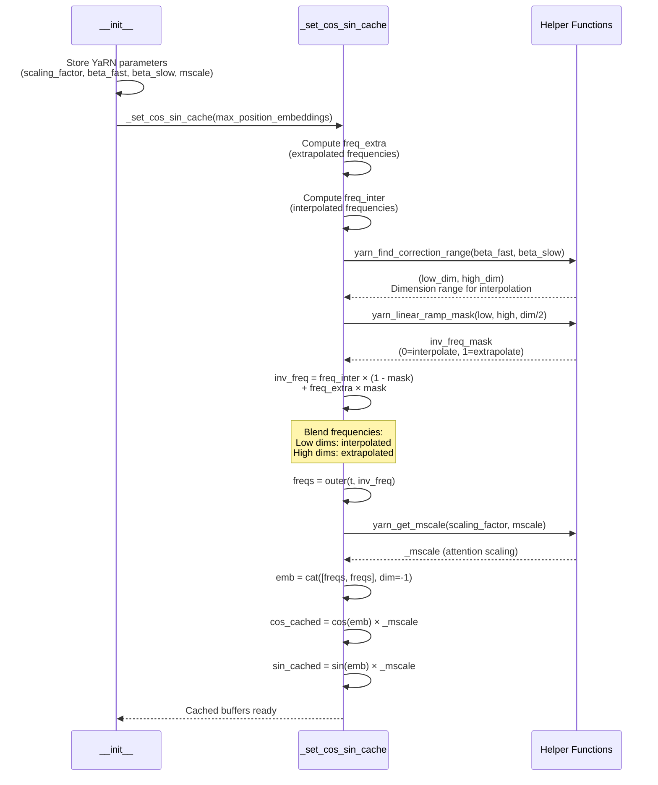

# DeepseekV2YarnRotaryEmbedding

## What It Is
`DeepseekV2YarnRotaryEmbedding` implements YaRN (Yet another RoPE extensioN method), an advanced RoPE scaling technique for context length extension beyond training limits. YaRN is the most sophisticated RoPE extension method, designed for scenarios requiring >8x context extension (e.g., extending from 4K to 32K+ tokens).

YaRN combines three techniques:
1. **Frequency interpolation**: Interpolates high-frequency components to reduce aliasing
2. **Attention scaling (mscale)**: Adjusts attention scores to account for longer contexts
3. **Dimension-aware ramping**: Different frequency bands are scaled differently based on their sensitivity to position

This is the default RoPE variant used in DeepSeek-OCR for handling long document contexts.

## Definition
```python
class DeepseekV2YarnRotaryEmbedding(DeepseekV2RotaryEmbedding):
    def __init__(
        self,
        dim,
        max_position_embeddings=2048,
        base=10000,
        device=None,
        scaling_factor=1.0,
        original_max_position_embeddings=4096,
        beta_fast=32,
        beta_slow=1,
        mscale=1,
        mscale_all_dim=0,
    ):
        self.scaling_factor = scaling_factor
        self.original_max_position_embeddings = original_max_position_embeddings
        self.beta_fast = beta_fast
        self.beta_slow = beta_slow
        self.mscale = mscale
        self.mscale_all_dim = mscale_all_dim
        super().__init__(dim, max_position_embeddings, base, device)
```

## Constructor Information
**Location**: `models/deepseek-ocr/modeling_deepseekv2.py:264-330`

**Signature**:
```python
def __init__(
    self,
    dim: int,                                   # Rotary embedding dimension
    max_position_embeddings: int = 2048,        # Extended max sequence length
    base: float = 10000,                        # RoPE base frequency
    device = None,                              # Device for buffer allocation
    scaling_factor: float = 1.0,                # Overall scaling factor (new_len / old_len)
    original_max_position_embeddings: int = 4096,  # Original training length
    beta_fast: float = 32,                      # Fast frequency threshold (Hz)
    beta_slow: float = 1,                       # Slow frequency threshold (Hz)
    mscale: float = 1,                          # Attention scaling coefficient
    mscale_all_dim: float = 0,                  # All-dimension scaling coefficient
)
```

**Parameters**:
- `dim`: Dimension of rotary embeddings (typically `qk_rope_head_dim`, e.g., 64)
- `max_position_embeddings`: Extended context length (e.g., 32768 for 8x extension)
- `base`: Base value for frequency calculation (default: 10000)
- `scaling_factor`: Ratio of new length to original length (e.g., 8.0 for 8x extension)
- `original_max_position_embeddings`: Context length model was trained on (e.g., 4096)
- `beta_fast`: Frequency threshold (Hz) above which no interpolation occurs (default: 32)
  - Higher frequencies encode fine-grained positional differences, should not be interpolated
- `beta_slow`: Frequency threshold (Hz) below which full interpolation occurs (default: 1)
  - Lower frequencies encode coarse positional differences, can be heavily interpolated
- `mscale`: Attention scaling coefficient (default: 1.0)
  - Adjusts attention scores to compensate for position embedding magnitude changes
- `mscale_all_dim`: Dimension-specific scaling factor (default: 0)
  - Controls whether all dimensions use same mscale or dimension-specific scaling

**Created Components**:
- `self.inv_freq`: Interpolated inverse frequency buffer
  - Shape: `(dim // 2,)`
  - Computed by blending `freq_inter` (interpolated) and `freq_extra` (extrapolated) based on frequency band
- `self.cos_cached`: Cached cosine values with mscale applied
  - Shape: `(max_position_embeddings, dim)`
- `self.sin_cached`: Cached sine values with mscale applied
  - Shape: `(max_position_embeddings, dim)`

## Module Internals



## Key Pseudo Code

```python
def _set_cos_sin_cache(self, seq_len, device, dtype):
    """
    YaRN-aware cache computation with frequency interpolation and attention scaling.

    Math:
        1. Compute two frequency sets:
           - freq_extra: 1 / (base^(i/dim))           [extrapolated, no scaling]
           - freq_inter: 1 / (scaling_factor × base^(i/dim))  [interpolated]

        2. Find correction range based on beta thresholds:
           - Low frequencies (< beta_slow Hz): full interpolation
           - High frequencies (> beta_fast Hz): no interpolation (extrapolation)
           - Middle frequencies: linear ramp between the two

        3. Blend frequencies using ramp mask:
           inv_freq = freq_inter × (1 - mask) + freq_extra × mask

        4. Apply attention scaling (mscale) to cos/sin outputs
    """
    self.max_seq_len_cached = seq_len
    dim = self.dim

    # 1. Compute extrapolated frequencies (no scaling)
    freq_extra = 1.0 / (
        self.base ** (torch.arange(0, dim, 2, dtype=torch.float32, device=device) / dim)
    )  # [dim/2]

    # 2. Compute interpolated frequencies (with scaling_factor)
    freq_inter = 1.0 / (
        self.scaling_factor * self.base ** (
            torch.arange(0, dim, 2, dtype=torch.float32, device=device) / dim
        )
    )  # [dim/2]

    # 3. Find dimension range for interpolation based on frequency thresholds
    low, high = yarn_find_correction_range(
        self.beta_fast,
        self.beta_slow,
        dim,
        self.base,
        self.original_max_position_embeddings,
    )
    # Returns dimension indices: [low, high] should use interpolation

    # 4. Create linear ramp mask: 0 at low (interpolate), 1 at high (extrapolate)
    inv_freq_mask = 1.0 - yarn_linear_ramp_mask(low, high, dim // 2).to(
        device=device, dtype=torch.float32
    )  # [dim/2]

    # 5. Blend frequencies
    inv_freq = freq_inter * (1 - inv_freq_mask) + freq_extra * inv_freq_mask
    self.register_buffer("inv_freq", inv_freq, persistent=False)

    # 6. Compute position-frequency outer product
    t = torch.arange(seq_len, device=device, dtype=torch.float32)
    freqs = torch.outer(t, inv_freq)  # [seq_len, dim/2]

    # 7. Compute attention scaling factor
    _mscale = float(
        yarn_get_mscale(self.scaling_factor, self.mscale)
        / yarn_get_mscale(self.scaling_factor, self.mscale_all_dim)
    )

    # 8. Apply scaling to cos/sin
    emb = torch.cat((freqs, freqs), dim=-1)  # [seq_len, dim]
    self.register_buffer(
        "cos_cached", (emb.cos() * _mscale).to(dtype), persistent=False
    )
    self.register_buffer(
        "sin_cached", (emb.sin() * _mscale).to(dtype), persistent=False
    )


# Helper function implementations

def yarn_find_correction_dim(num_rotations, dim, base=10000, max_position_embeddings=2048):
    """
    Inverse formula to find dimension index from rotation frequency.

    Given target frequency (Hz): num_rotations / (2π × max_position_embeddings)
    Solve for dimension i where: freq[i] = 1 / (base^(i/dim))

    Returns:
        Dimension index i where frequency equals num_rotations
    """
    return (dim * math.log(max_position_embeddings / (num_rotations * 2 * math.pi))) / (
        2 * math.log(base)
    )


def yarn_find_correction_range(low_rot, high_rot, dim, base=10000, max_position_embeddings=2048):
    """
    Find dimension range [low, high] for interpolation based on frequency thresholds.

    Args:
        low_rot: beta_slow (Hz), dimensions with freq < low_rot fully interpolated
        high_rot: beta_fast (Hz), dimensions with freq > high_rot not interpolated

    Returns:
        (low, high): Dimension indices defining interpolation range
    """
    low = math.floor(yarn_find_correction_dim(low_rot, dim, base, max_position_embeddings))
    high = math.ceil(yarn_find_correction_dim(high_rot, dim, base, max_position_embeddings))
    return max(low, 0), min(high, dim - 1)  # Clamp to valid range


def yarn_get_mscale(scale=1, mscale=1):
    """
    Compute attention scaling factor to compensate for position embedding magnitude change.

    When context length increases, the magnitude of position embeddings can drift,
    affecting attention score distributions. mscale corrects this.

    Args:
        scale: Context length scaling factor (new_len / old_len)
        mscale: Scaling coefficient (typically 1.0)

    Returns:
        Multiplicative factor for cos/sin values
    """
    if scale <= 1:
        return 1.0
    return 0.1 * mscale * math.log(scale) + 1.0


def yarn_linear_ramp_mask(min, max, dim):
    """
    Create linear ramp from 0 to 1 over dimension range [min, max].

    Returns:
        Tensor of shape (dim,) with values:
        - 0 at dimension min (full interpolation)
        - 1 at dimension max (no interpolation/full extrapolation)
        - Linear interpolation in between
    """
    if min == max:
        max += 0.001  # Prevent singularity

    linear_func = (torch.arange(dim, dtype=torch.float32) - min) / (max - min)
    ramp_func = torch.clamp(linear_func, 0, 1)
    return ramp_func
```

## FLOP Count and Memory Usage Impact

### FLOPs

**Initialization** (_set_cos_sin_cache):
```
Operations:
1. freq_extra computation: dim/2 exponentiations + divisions ≈ dim FLOPs
2. freq_inter computation: dim/2 exponentiations + divisions ≈ dim FLOPs
3. yarn_find_correction_range: O(1) math operations, negligible
4. yarn_linear_ramp_mask: dim/2 FLOPs (linear interpolation)
5. inv_freq blending: 3 × dim/2 FLOPs (multiply, add)
6. torch.outer: seq_len × dim/2 FLOPs
7. yarn_get_mscale: O(1) log computation, negligible
8. cos/sin + mscale: 3 × seq_len × dim FLOPs (cos, sin, multiply)

Total init: ~(2 + 0.5 + 1.5 + 0.5 + 3) × seq_len × dim ≈ 7.5 × seq_len × dim FLOPs

Example (seq_len=32768, dim=64):
≈ 7.5 × 32768 × 64 ≈ 15.7 MFLOPs (one-time cost)
```

**Forward pass**:
```
Same as base DeepseekV2RotaryEmbedding: ~0 FLOPs (cache lookup only)
```

**Comparison to base RoPE**:
```
Base RoPE init: ~2 × seq_len × dim FLOPs
YaRN init:      ~7.5 × seq_len × dim FLOPs
Overhead:       ~3.75x (but amortized over many forward passes)
```

### Memory Usage

#### Parameters:
```
Buffers (non-persistent):
- inv_freq: dim/2 × 4 bytes (fp32) = 128 bytes (dim=64)
- cos_cached: max_seq_len × dim × 2 bytes (bf16)
- sin_cached: max_seq_len × dim × 2 bytes (bf16)

Example (max_seq_len=32768, dim=64, bf16):
inv_freq: 128 bytes
cos_cached: 32768 × 64 × 2 = 4,194,304 bytes ≈ 4 MB
sin_cached: 32768 × 64 × 2 = 4,194,304 bytes ≈ 4 MB

Total per YaRN RoPE module: ~8 MB (4x larger than base RoPE with 8192 context)
```

**Per model**:
- DeepSeek-OCR with 32K context: 40 layers × 8 MB = **320 MB** (vs 80 MB for 8K context)
- Memory scales linearly with extended context length

#### YaRN-specific Overhead:
```
Additional intermediate tensors during initialization:
- freq_extra: dim/2 × 4 bytes = 128 bytes
- freq_inter: dim/2 × 4 bytes = 128 bytes
- inv_freq_mask: dim/2 × 4 bytes = 128 bytes
- ramp_func: dim/2 × 4 bytes = 128 bytes

Total overhead: ~512 bytes (negligible, discarded after init)
```

### Performance Characteristics

**Context Extension Efficiency**:
```
Scaling Factor    Original    Extended    Memory     Recommended
1x (no scale)     4K          4K          80 MB      Not needed
2x                4K          8K          160 MB     Use Linear or YaRN
4x                4K          16K         320 MB     Use Dynamic NTK or YaRN
8x                4K          32K         640 MB     Use YaRN (best quality)
16x+              4K          64K+        1.28 GB    YaRN required
```

**YaRN Advantages over other methods**:
1. **Quality**: Best perplexity retention at >8x extension
2. **Stability**: mscale prevents attention score drift
3. **Flexibility**: beta_fast/beta_slow tunable per use case
4. **No retraining**: Works with pre-trained weights

## Related Modules
- **Used by**:
  - `DeepseekV2Attention._init_rope()` (lines 821-839) when `rope_scaling.type == "yarn"`
  - `DeepseekV2FlashAttention2` (inherits rope initialization)
- **Inherits from**: `DeepseekV2RotaryEmbedding` (base class)
- **Sibling classes**:
  - `DeepseekV2LinearScalingRotaryEmbedding` (simple linear interpolation)
  - `DeepseekV2DynamicNTKScalingRotaryEmbedding` (dynamic base adjustment)
- **Helper functions**:
  - `yarn_find_correction_dim()` (line 228-233)
  - `yarn_find_correction_range()` (line 237-246)
  - `yarn_get_mscale()` (line 249-252)
  - `yarn_linear_ramp_mask()` (line 255-261)

## Usage Pattern
```python
from modeling_deepseekv2 import DeepseekV2YarnRotaryEmbedding

# Inside attention module with long context support
class MyLongContextAttention(nn.Module):
    def __init__(self, config):
        super().__init__()
        self.head_dim = 64

        # YaRN for 8x context extension (4K → 32K)
        self.rotary_emb = DeepseekV2YarnRotaryEmbedding(
            dim=self.head_dim,
            max_position_embeddings=32768,      # Extended length
            base=10000,
            scaling_factor=8.0,                 # 32K / 4K = 8x
            original_max_position_embeddings=4096,  # Training length
            beta_fast=32,                       # High-freq threshold
            beta_slow=1,                        # Low-freq threshold
            mscale=1.0,                         # Attention scaling
            mscale_all_dim=0,                   # Dimension-specific scaling
        )

    def forward(self, hidden_states, position_ids):
        # Use same as base RoPE
        q, k = self.q_proj(hidden_states), self.k_proj(hidden_states)
        cos, sin = self.rotary_emb(q, seq_len=hidden_states.shape[1])
        q, k = apply_rotary_pos_emb(q, k, cos, sin, position_ids)
        # Continue with attention...
```

**Config usage** (from `config.json`):
```json
{
  "rope_scaling": {
    "type": "yarn",
    "factor": 8.0,
    "original_max_position_embeddings": 4096,
    "beta_fast": 32,
    "beta_slow": 1,
    "mscale": 1.0,
    "mscale_all_dim": 0
  }
}
```

## Key Performance Characteristics

1. **Best-in-class context extension**: Maintains perplexity better than linear/NTK scaling at >8x extension
2. **Frequency-aware**: Preserves high-frequency components (fine positional info) while interpolating low frequencies
3. **Attention-scale corrected**: mscale prevents attention entropy drift in long contexts
4. **Compute overhead**: ~3.75x slower initialization vs base RoPE, but amortized over many forward passes
5. **Memory overhead**: Proportional to extended context length (e.g., 8x context = 8x memory)
6. **No training required**: Works out-of-the-box with pre-trained models

## Mathematical Foundation

**Frequency decomposition**:
```
RoPE embeddings: emb[pos, dim] = cos(pos × freq[dim]), sin(pos × freq[dim])

Where freq[i] = 1 / (base^(i/d)) for i ∈ [0, d)

YaRN insight: Different frequency bands encode different positional scales:
- Low frequencies (i ≈ 0): Encode coarse position (1K-10K token distances)
  → Can be safely interpolated for extension
- High frequencies (i ≈ d): Encode fine position (1-10 token distances)
  → Must NOT be interpolated (causes aliasing)

YaRN solution: Interpolate low-freq, extrapolate high-freq, linear ramp in between
```

**Attention scaling derivation**:
```
Extending context changes RoPE embedding magnitudes, affecting attention scores:
attn_score = Q · K^T / sqrt(d)

With YaRN: ||Q_rope|| and ||K_rope|| can drift from original distribution
mscale = 0.1 × log(scaling_factor) + 1.0 compensates for this drift

Applied as: cos_yarn = cos(emb) × mscale, sin_yarn = sin(emb) × mscale
```

## References
- Original paper: "YaRN: Efficient Context Window Extension of Large Language Models" (Peng et al., 2023)
- Used in: DeepSeek-OCR, Llama-2-Long, Mistral-Long, many long-context models
- Comparison: Outperforms Linear Interpolation, NTK-Aware, and RoPE-ABF at 8x+ extension
