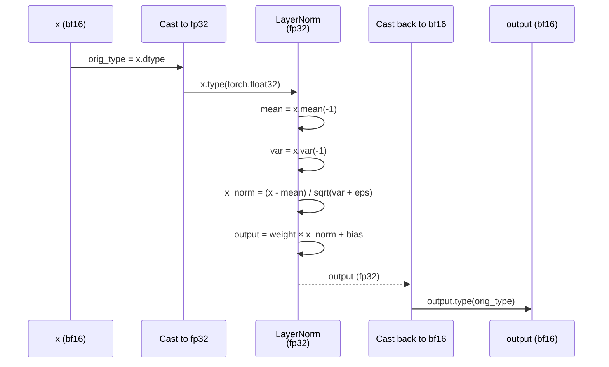

# LayerNormfp32

## What It Is
`LayerNormfp32` is a wrapper around PyTorch's `LayerNorm` that forces computation in fp32 precision, preventing numerical instability when using bf16/fp16 data types. It temporarily upcasts inputs to fp32, applies LayerNorm, then downcasts back to the original dtype.

This is critical for vision encoders (CLIP) where bf16 can cause NaN/Inf in normalization statistics due to reduced precision (bf16 has smaller dynamic range than fp16).

## Definition
```python
class LayerNormfp32(torch.nn.LayerNorm):
    """Subclass torch's LayerNorm to handle fp16/bf16."""

    def forward(self, x: torch.Tensor):
        orig_type = x.dtype
        ret = super().forward(x.type(torch.float32))
        return ret.type(orig_type)
```

## Constructor Information
**Location**: `models/deepseek-ocr/deepencoder.py:190-196`

**Signature**: Inherits from `torch.nn.LayerNorm`:
```python
def __init__(self, normalized_shape, eps=1e-5, elementwise_affine=True)
```

**Parameters**: Same as `torch.nn.LayerNorm`
- `normalized_shape`: Dimension(s) to normalize (e.g., 1024 for CLIP)
- `eps`: Epsilon for numerical stability (default: 1e-5)
- `elementwise_affine`: Whether to learn scale/shift parameters (default: True)

**DeepSeek-OCR usage**: CLIP's `pre_layernorm` uses `LayerNormfp32(1024)`

**Parameters**: `2 × normalized_shape` (weight + bias) = 2 × 1024 = 2,048 params ≈ 4 KB at bf16

## Module Internals



## Key Pseudo Code

```python
def forward(self, x: torch.Tensor) -> torch.Tensor:
    """
    Args:
        x: Input tensor of any dtype (bf16, fp16, fp32)

    Returns:
        Normalized tensor of same dtype as input
    """
    orig_type = x.dtype  # Save original dtype

    # Upcast to fp32 for stable computation
    x_fp32 = x.type(torch.float32)

    # Apply LayerNorm in fp32 (prevents NaN with bf16 inputs)
    output_fp32 = super().forward(x_fp32)  # Standard LayerNorm

    # Downcast back to original dtype
    return output_fp32.type(orig_type)
```

## FLOP Count and Memory Usage Impact

### FLOPs (per forward pass)

Assume: Input `(B, S, d)` where d=1024 (CLIP hidden size)

**Operations**:
1. Mean computation: `B × S` FLOPs
2. Variance computation: `2 × B × S × d` FLOPs
3. Normalization: `3 × B × S × d` FLOPs
4. Scale and shift: `2 × B × S × d` FLOPs

**Total**: `~5 × B × S × d` FLOPs

Example (B=1, S=577, d=1024):
```
5 × 1 × 577 × 1024 ≈ 2.95 MFLOPs
```

### Memory Usage

**Parameters**: `2 × d = 2 × 1024 = 2,048` params ≈ 4 KB at bf16

**Activations**:
```
Input (bf16): B × S × d × 2 bytes
Cast to fp32: B × S × d × 4 bytes (2x memory!)
Output (bf16): B × S × d × 2 bytes

Peak: ~4x input size during computation (fp32 intermediate)

Example (B=1, S=577, d=1024):
Input: 1.18 MB
fp32 intermediate: 2.36 MB
Peak: ~3.5 MB
```

## Related Modules
- **Used by**: `VitModel.pre_layrnorm` (CLIP final norm)
- **Alternative**: Standard `LayerNorm` (unsafe with bf16)
- **Similar to**: `DeepseekV2RMSNorm` (also upcasts to fp32)

## Usage Pattern

```python
from deepencoder import LayerNormfp32

# CLIP pre-layernorm
pre_layernorm = LayerNormfp32(1024, eps=1e-5)

# Forward pass with bf16 input
x = torch.randn(1, 577, 1024, dtype=torch.bfloat16)
normalized = pre_layernorm(x)  # Computes in fp32, returns bf16
```

## Key Performance Characteristics

1. **Numerical stability**: Prevents NaN/Inf with bf16 inputs
2. **Memory overhead**: 2x memory during computation (fp32 intermediate)
3. **Performance impact**: ~10-20% slower than bf16 LayerNorm (cast overhead)
4. **Quality critical**: Essential for stable CLIP training/inference

## Optimization Opportunities

1. **Fused kernel**: Fuse cast + LayerNorm + cast into single kernel
2. **Mixed precision**: Use fp16 instead of fp32 (narrower range but faster)
3. **RMSNorm**: Switch to RMSNorm (simpler, no mean subtraction)

## References
- LayerNorm: "Layer Normalization" (Ba et al., 2016)
- Mixed precision: "Mixed Precision Training" (Micikevicius et al., 2017)
- Used in: CLIP, ViT, many vision transformers with bf16/fp16
