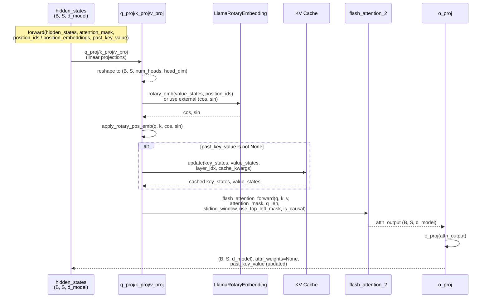

# LlamaFlashAttention2

## What It Is
`LlamaFlashAttention2` is a high‑performance attention module used in LLaMA‑style decoder blocks. It inherits all
weights and configuration from `LlamaAttention` but replaces the standard scaled dot‑product attention path with
FlashAttention v2 kernels. The key idea is to compute attention in tiled chunks that never materialize the full
`(seq_len × seq_len)` score matrix in memory, dramatically reducing memory traffic while keeping the same semantics.

Within DeepSeek‑OCR, `LlamaFlashAttention2` represents the **standard multi‑head attention (MHA)** path used for
non‑MLA attention (e.g., when using conventional LLaMA‑like decoder stacks instead of DeepseekV2’s MLA). Analytically,
it behaves like standard MHA with RoPE, but with different implementation details that change wall‑clock time and
peak memory—not FLOP complexity.

Compared to eager `LlamaAttention`:
- FLOP count is almost identical (same Q/K/V projections and attention math),
- peak activation memory and bandwidth are much lower (no explicit S×S score tensor),
- GPU utilization is higher due to fused kernels and better tiling.

## Definition
```python
class LlamaFlashAttention2(LlamaAttention):
    """
    Llama flash attention module. This module inherits from `LlamaAttention` as the weights of the module stays
    untouched. The only required change would be on the forward pass where it needs to correctly call the public API of
    flash attention and deal with padding tokens in case the input contains any of them.
    """

    def __init__(self, *args, **kwargs):
        super().__init__(*args, **kwargs)

        # flash_attn<2.1 generates top-left aligned causal mask, while what is needed here is bottom-right
        # alignment (default for flash_attn>=2.1). This flag controls which mask convention to use.
        self._flash_attn_uses_top_left_mask = not is_flash_attn_greater_or_equal_2_10()

    def forward(
        self,
        hidden_states: torch.Tensor,
        attention_mask: Optional[torch.LongTensor] = None,
        position_ids: Optional[torch.LongTensor] = None,
        past_key_value: Optional[Cache] = None,
        output_attentions: bool = False,
        use_cache: bool = False,
        cache_position: Optional[torch.LongTensor] = None,
        position_embeddings: Optional[Tuple[torch.Tensor, torch.Tensor]] = None,
    ) -> Tuple[torch.Tensor, Optional[torch.Tensor], Optional[Tuple[torch.Tensor]]]:
        ...
```

## Constructor Information
**Location**: `transformers/models/llama/modeling_llama.py:400-460`

**Signature**:
```python
def __init__(self, *args, **kwargs)
```

`LlamaFlashAttention2` does not introduce new constructor arguments; it reuses the full `LlamaAttention` signature and
configuration. Typical configuration in DeepSeek‑OCR‑style models:

- `hidden_size`: model hidden dimension (e.g., 4096)
- `num_attention_heads`: number of query heads (e.g., 32)
- `num_key_value_heads`: number of KV heads (e.g., 8 for GQA)
- `max_position_embeddings`: maximum context length (e.g., 8192)
- `rope_scaling`: optional dict configuring RoPE type (default, linear, dynamic, yarn, …)
- `attention_dropout`: dropout applied inside attention (usually 0 for inference)

**Created / Inherited Components** (from `LlamaAttention`):
- `q_proj`: Linear(`hidden_size → hidden_size`) with bias
- `k_proj`: Linear(`hidden_size → hidden_size`) with bias (key/value heads may be sharded)
- `v_proj`: Linear(`hidden_size → hidden_size`) with bias
- `o_proj`: Linear(`hidden_size → hidden_size`) with bias
- `rotary_emb`: `LlamaRotaryEmbedding` (or variant) used to generate `(cos, sin)` RoPE tensors
- `num_heads`, `num_key_value_heads`, `head_dim`: structural hyperparameters
- `_flash_attn_uses_top_left_mask`: bool flag controlling mask convention for flash‑attn kernels

No additional parameters are introduced by `LlamaFlashAttention2`; the module only changes how attention is computed.

## Module Internals



## Key Pseudo Code

```python
def forward(
    self,
    hidden_states: torch.Tensor,
    attention_mask: Optional[torch.LongTensor] = None,
    position_ids: Optional[torch.LongTensor] = None,
    past_key_value: Optional[Cache] = None,
    output_attentions: bool = False,
    use_cache: bool = False,
    cache_position: Optional[torch.LongTensor] = None,
    position_embeddings: Optional[Tuple[torch.Tensor, torch.Tensor]] = None,
) -> Tuple[torch.Tensor, Optional[torch.Tensor], Optional[Tuple[torch.Tensor]]]:
    """
    Flash Attention 2 implementation for LLaMA.

    Args:
        hidden_states: (B, S, d_model) input tokens.
        attention_mask: Optional mask broadcastable to (B, 1, S, S) or a packed format.
        position_ids: Deprecated; used to derive RoPE positions when position_embeddings is None.
        past_key_value: KV cache for autoregressive decoding.
        cache_position: Positions used by static cache (not used with FlashAttention2 caches).
        position_embeddings: Optional (cos, sin) tensors generated externally by LlamaRotaryEmbedding.
    """
    if isinstance(past_key_value, StaticCache):
        raise ValueError("FlashAttention2 is incompatible with StaticCache; use sdpa instead.")

    output_attentions = False  # FlashAttention2 path does not return per‑head weights

    bsz, q_len, _ = hidden_states.size()

    # 1. Project Q, K, V
    query_states = self.q_proj(hidden_states)
    key_states = self.k_proj(hidden_states)
    value_states = self.v_proj(hidden_states)

    # 2. Reshape to (B, S, num_heads, head_dim) then transpose heads
    query_states = query_states.view(bsz, q_len, self.num_heads, self.head_dim).transpose(1, 2)
    key_states = key_states.view(bsz, q_len, self.num_key_value_heads, self.head_dim).transpose(1, 2)
    value_states = value_states.view(bsz, q_len, self.num_key_value_heads, self.head_dim).transpose(1, 2)

    # 3. RoPE: compute or consume (cos, sin)
    if position_embeddings is None:
        cos, sin = self.rotary_emb(value_states, position_ids)
    else:
        cos, sin = position_embeddings
    query_states, key_states = apply_rotary_pos_emb(query_states, key_states, cos, sin)

    # 4. Update KV cache (for decoding)
    if past_key_value is not None:
        cache_kwargs = {"sin": sin, "cos": cos, "cache_position": cache_position}
        key_states, value_states = past_key_value.update(
            key_states, value_states, self.layer_idx, cache_kwargs
        )

    # 5. Layout adjustments for FlashAttention2
    query_states = query_states.transpose(1, 2)  # (B, S, H, Dh)
    key_states = key_states.transpose(1, 2)
    value_states = value_states.transpose(1, 2)

    # 6. Dtype fixups for autocast / quantization
    input_dtype = query_states.dtype
    if input_dtype == torch.float32:
        if torch.is_autocast_enabled():
            target_dtype = torch.get_autocast_gpu_dtype()
        elif hasattr(self.config, "_pre_quantization_dtype"):
            target_dtype = self.config._pre_quantization_dtype
        else:
            target_dtype = self.q_proj.weight.dtype
        query_states = query_states.to(target_dtype)
        key_states = key_states.to(target_dtype)
        value_states = value_states.to(target_dtype)

    # 7. FlashAttention2 core
    dropout_rate = self.attention_dropout if self.training else 0.0
    attn_output = _flash_attention_forward(
        query_states,
        key_states,
        value_states,
        attention_mask,
        q_len,
        position_ids=position_ids,
        dropout=dropout_rate,
        sliding_window=getattr(self, "sliding_window", None),
        use_top_left_mask=self._flash_attn_uses_top_left_mask,
        is_causal=self.is_causal,
    )

    # 8. Output projection
    attn_output = attn_output.reshape(bsz, q_len, -1).contiguous()
    attn_output = self.o_proj(attn_output)

    return attn_output, None, past_key_value
```

## FLOP Count and Memory Usage Impact

### FLOPs (per forward pass, per layer)

Assume:
- `B` = batch size
- `S` = sequence length
- `H` = num_heads
- `H_kv` = num_key_value_heads (GQA)
- `d` = head_dim (`hidden_size / H`)
- `d_model` = hidden_size (`H × d`)

Key operations:

1. **Q/K/V projections**:
   ```text
   FLOPs_q = 2 × B × S × d_model × d_model
   FLOPs_k = 2 × B × S × d_model × d_model
   FLOPs_v = 2 × B × S × d_model × d_model
   FLOPs_qkv ≈ 6 × B × S × d_model²
   ```

2. **Attention core (FlashAttention2)**:
   - Conceptually equivalent to standard MHA:
     ```text
     FLOPs_scores ≈ 2 × B × H × S² × d   # Q @ Kᵀ
     FLOPs_softmax ≈ 5 × B × H × S²      # softmax + scaling
     FLOPs_weighted_sum ≈ 2 × B × H × S² × d   # Attn @ V
     FLOPs_attn_total ≈ 4 × B × H × S² × d  (dominant term)
     ```
   - FlashAttention2 fuses these operations and tiles across S; FLOP count is similar, but memory traffic is much lower.

3. **Output projection**:
   ```text
   FLOPs_out = 2 × B × S × d_model × d_model
   ```

**Total FLOPs (dominant terms)**:
```text
FLOPs_total ≈ 8 × B × S × d_model² + 4 × B × H × S² × d
```

For a typical LLaMA block (B=1, S=8192, d_model=4096, H=32, d=128), the attention part dominates with tens of TFLOPs.
FlashAttention2 keeps the same asymptotic cost but reduces constant factors and memory stalls.

### Memory Usage

**Parameters** (same as `LlamaAttention`):
- Q/K/V/O projections: `4 × d_model × d_model` weights (+ biases), typically hundreds of millions of parameters for
  large models.

**Activations**:
- Q/K/V: `(B, S, H, d)` and `(B, S, H_kv, d)` tensors.
- FlashAttention2 tiles over S and never materializes a full `(B, H, S, S)` score matrix; instead it streams blocks
  through shared memory, reducing peak activation memory by ~an order of magnitude vs naive attention for large S.

**KV Cache** (autoregressive decoding):
- Cached K/V: `(B, H_kv, S_total, d)` each, where `S_total` is cumulative sequence length.
- `LlamaFlashAttention2` reuses the same cache layout as `LlamaAttention`; the choice of FlashAttention affects compute
  layout, not cache semantics.

## Related Modules
- **Inherits from**:
  - `LlamaAttention`: base LLaMA attention implementation.
- **Uses / Depends on**:
  - `LlamaRotaryEmbedding`: generates RoPE `(cos, sin)` tensors.
  - `apply_rotary_pos_emb`: applies RoPE to Q/K.
  - FlashAttention2 kernels via `_flash_attention_forward`.
- **Used by**:
  - LLaMA‑family decoder blocks when `attn_implementation="flash_attention_2"`.
  - DeepSeek‑style analytic layers (`LlamaFlashAttention2(BaseLayer)`) as the semantic reference.
- **Alternatives**:
  - `LlamaAttention` with SDPA (`attn_implementation="sdpa"`).
  - DeepSeek‑specific `DeepseekV2FlashAttention2` (MLA + FlashAttention2).

## Usage Pattern

```python
from transformers import LlamaConfig, LlamaForCausalLM
from transformers.models.llama.modeling_llama import LlamaFlashAttention2

config = LlamaConfig(
    hidden_size=4096,
    num_attention_heads=32,
    num_key_value_heads=8,
    max_position_embeddings=8192,
    attn_implementation="flash_attention_2",
)

model = LlamaForCausalLM(config)

# The model will internally construct LlamaFlashAttention2 layers for attention
x = torch.randn(1, 512, config.hidden_size, device="cuda", dtype=torch.bfloat16)
out = model.model.layers[0].self_attn(
    hidden_states=x,
    attention_mask=None,
    position_ids=torch.arange(512, device=x.device)[None, :],
)
hidden_out, _, _ = out
print(hidden_out.shape)  # (1, 512, 4096)
```

