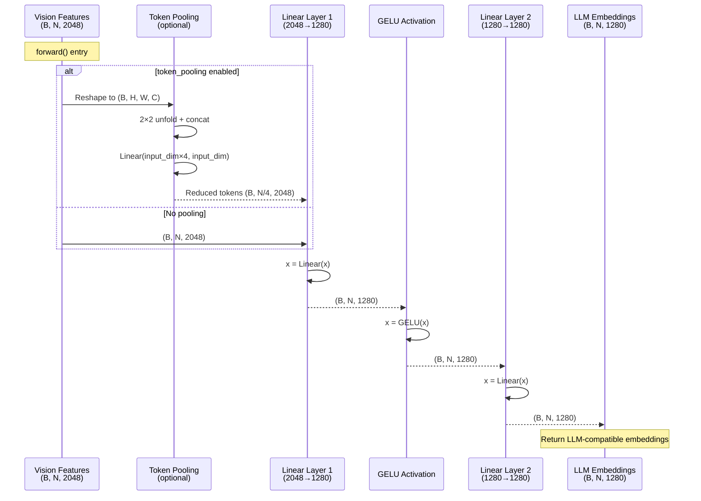

# MlpProjector

## What It Is
`MlpProjector` is the vision-to-language projection module that maps vision encoder features to the LLM's input space. It supports multiple architectures:
1. **Identity** - pass-through (for debugging)
2. **Linear** - single linear layer
3. **MLP with GELU** - multi-layer perceptron with non-linearity
4. **Downsampling variants** - 2×2 spatial pooling to reduce token count
5. **Hybrid split** - separate pathways for high/low resolution features

In DeepSeek-OCR, this projects concatenated SAM (1024d) + CLIP (1024d) = 2048d vision features to 1280d LLM embeddings, reducing the 577 vision tokens (24×24+1 CLS) to a manageable sequence for the decoder.

## Definition
```python
class MlpProjector(nn.Module):
    def __init__(self, cfg):
        super().__init__()
        self.cfg = cfg

        if cfg.projector_type == "identity":
            modules = nn.Identity()
        elif cfg.projector_type == "linear":
            modules = nn.Linear(cfg.input_dim, cfg.n_embed)
        elif cfg.projector_type == "mlp_gelu":
            mlp_depth = cfg.get("depth", 1)
            modules = [nn.Linear(cfg.input_dim, cfg.n_embed)]
            for _ in range(1, mlp_depth):
                modules.append(nn.GELU())
                modules.append(nn.Linear(cfg.n_embed, cfg.n_embed))
            modules = nn.Sequential(*modules)
        elif cfg.projector_type == "downsample_mlp_gelu":
            # 4-to-1 spatial pooling + MLP
            # ...
        # ... other variants

        if cfg.get("token_pooling", False):
            self.token_pooling_layer = nn.Linear(cfg.input_dim * 4, cfg.input_dim)

        self.layers = modules
```

## Constructor Information
**Location**: `models/deepseek-ocr/deepencoder.py:20-108`

**Signature**:
```python
def __init__(self, cfg: EasyDict)
```

**Parameters** (from cfg):
- `projector_type`: Architecture type ("identity", "linear", "mlp_gelu", "downsample_mlp_gelu", etc.)
- `input_dim`: Input feature dimension (2048 for SAM+CLIP concat)
- `n_embed`: Output embedding dimension (1280 for LLM)
- `depth`: Number of MLP layers (default: 1)
- `mlp_ratio`: Hidden dimension multiplier (default: 1)
- `downsample_ratio`: Spatial downsampling factor (e.g., 2 for 2×2 pooling)
- `token_pooling`: Whether to apply 2×2 token pooling (default: False)

**DeepSeek-OCR typical configuration**:
```python
cfg = EasyDict(
    projector_type="mlp_gelu",
    input_dim=2048,  # 1024 (SAM) + 1024 (CLIP)
    n_embed=1280,    # LLM hidden size
    depth=2,         # 2-layer MLP
)
```

**Created Components (mlp_gelu, depth=2)**:
```python
self.layers = nn.Sequential(
    nn.Linear(2048, 1280),  # Input projection
    nn.GELU(),              # Activation
    nn.Linear(1280, 1280),  # Hidden layer
)
```

**Parameter count**:
```python
# For mlp_gelu, depth=2
layer1: 2048 × 1280 = 2,621,440
layer2: 1280 × 1280 = 1,638,400
Total: 4,259,840 ≈ 4.26M parameters

At bf16: 4.26M × 2 bytes ≈ 8.52 MB
```

## Module Internals



## Key Pseudo Code

```python
def forward(self, x: torch.Tensor) -> torch.Tensor:
    """
    Project vision features to LLM embedding space.

    Args:
        x: Vision features
            - Standard: (batch, num_tokens, input_dim) e.g., (1, 577, 2048)
            - With pooling: (batch, H×W, input_dim) where H=W=sqrt(num_tokens-1)

    Returns:
        projected: LLM embeddings (batch, num_tokens, n_embed) e.g., (1, 577, 1280)
    """
    # 1. Optional token pooling (2×2 spatial reduction)
    if self.cfg.get("token_pooling", False):
        batch_size, wxh, channels = x.shape
        w = h = int(wxh**0.5)  # Assume square grid (e.g., 24×24)

        # Reshape to spatial: (B, C, H, W)
        x = x.view(batch_size, w, h, channels).permute(0, 3, 1, 2)

        # Extract 2×2 patches: unfold(dim, size, stride)
        patches = x.unfold(2, 2, 2).unfold(3, 2, 2)
        # Shape: (B, C, H/2, W/2, 2, 2)

        batch_size, channels, h_patches, w_patches, _, _ = patches.size()

        # Flatten patches in channel dim: (B, C, H/2*W/2, 4)
        patches = patches.contiguous().view(batch_size, channels, h_patches * w_patches, -1)

        # Rearrange: (B, H/2*W/2, C, 4) → (B, H/2*W/2, C*4)
        patches = patches.permute(0, 2, 1, 3).contiguous()
        patches = patches.view(batch_size, h_patches * w_patches, channels * 4)

        # Pool via linear: (C*4) → C
        x = self.token_pooling_layer(patches)
        # Now: (B, H/2*W/2, input_dim) = (B, 144, 2048) for 24×24 input

    # 2. Optional feature fusion (if dual-resolution input)
    if self.cfg.get("conv_fusion_high_low_features", False):
        # x = [high_res, low_res] with shape (B, 2, num_tokens, input_dim)
        x = self.fusion_layer(x[:, 0]) + x[:, 1]

    # 3. Hybrid split projection (separate paths for high/low res)
    if self.cfg.projector_type == 'low_high_hybrid_split_mlp_gelu':
        high_x, low_x = x[0], x[1]
        high_x = self.high_up_proj(high_x)  # (B, N, n_embed//2)
        low_x = self.low_up_proj(low_x)     # (B, N, n_embed//2)
        x = torch.concat([high_x, low_x], dim=-1)  # (B, N, n_embed)

    # 4. Downsampling (4-to-1 spatial pooling)
    if self.cfg.projector_type in ['downsample_mlp_gelu', 'normlayer_downsample_mlp_gelu']:
        bs, hw, input_dim = x.shape
        h = w = int(hw ** 0.5)

        # Compute padding to make divisible by downsample_ratio
        if h % self.cfg.downsample_ratio:
            pad = self.cfg.downsample_ratio - h % self.cfg.downsample_ratio
        else:
            pad = 0

        # Reshape to spatial and pad
        x = x.reshape(bs, h, w, input_dim)
        if pad > 0:
            x = F.pad(x, (0, 0, 0, pad, 0, pad), "constant", 0)

        # 4-to-1 pooling via unfold
        x = x.permute(0, 3, 1, 2)  # (B, C, H, W)
        x = F.unfold(x, kernel_size=self.cfg.downsample_ratio, stride=self.cfg.downsample_ratio, padding=0)
        # Shape: (B, C*ratio^2, H*W/ratio^2)
        x = x.permute(0, 2, 1)  # (B, H*W/ratio^2, C*ratio^2)

    # 5. Apply MLP layers
    return self.layers(x)


@staticmethod
def get_flops_per_sample(cfg):
    """
    Compute FLOPs for a single sample (one image).

    Returns:
        fwd_flops: Forward pass FLOPs per sample
        Total FLOPs = fwd_flops × 3 (forward + backward)
    """
    if cfg.projector_type == "linear":
        fwd = 2 * cfg.input_dim * cfg.n_embed

    elif "mlp_gelu" in cfg.projector_type:
        mlp_depth = cfg.get("depth", 1)
        downsample_ratio = cfg.get("downsample_ratio", 1)
        input_dim = sum(cfg.input_dim) if isinstance(cfg.input_dim, list) else cfg.input_dim
        input_dim = input_dim * downsample_ratio * downsample_ratio

        # First layer: input_dim → n_embed
        # Subsequent layers: n_embed → n_embed
        fwd = 2 * input_dim * cfg.n_embed + (mlp_depth - 1) * 2 * cfg.n_embed * cfg.n_embed
    else:
        fwd = 0

    return fwd * 3  # Forward + backward (approximate)
```

## FLOP Count and Memory Usage Impact

### FLOPs (per forward pass)

Assume:
- Input shape: `(B, N, input_dim)` where B=batch, N=num_tokens (577), input_dim=2048
- Output: `(B, N, n_embed)` where n_embed=1280
- Config: mlp_gelu, depth=2

**Operations**:

1. **Linear layer 1**: `2 × B × N × input_dim × n_embed`
   ```
   = 2 × 1 × 577 × 2048 × 1280
   = 3,015,639,040 FLOPs
   ≈ 3.02 GFLOPs
   ```

2. **GELU activation**: `~8 × B × N × n_embed` (tanh approximation)
   ```
   = 8 × 1 × 577 × 1280
   = 5,914,880 FLOPs
   ≈ 5.91 MFLOPs
   ```

3. **Linear layer 2**: `2 × B × N × n_embed × n_embed`
   ```
   = 2 × 1 × 577 × 1280 × 1280
   = 1,894,891,520 FLOPs
   ≈ 1.89 GFLOPs
   ```

**Total per image**:
```
Total = 3.02 + 0.006 + 1.89 ≈ 4.92 GFLOPs

With token_pooling (2×2, reduces N from 577 to 144):
Total = (3.02 + 1.89) × (144/577) ≈ 1.23 GFLOPs
```

**Compared to vision encoders**:
```
SAM encoder: ~80 GFLOPs
CLIP encoder: ~120 GFLOPs
MlpProjector: ~5 GFLOPs (2.5% of vision compute)

Projector is lightweight!
```

### Memory Usage

#### Parameters:
```
For mlp_gelu, depth=2:
layer1: 2048 × 1280 = 2.62M params
layer2: 1280 × 1280 = 1.64M params
Total: 4.26M params

At bf16: 4.26M × 2 bytes ≈ 8.52 MB
```

#### Activations (per forward pass):

**Input**:
```
Vision features: B × N × input_dim × 2 bytes
= 1 × 577 × 2048 × 2
= 2.36 MB
```

**Intermediate**:
```
After layer1: 1 × 577 × 1280 × 2 = 1.48 MB
After GELU: 1.48 MB (in-place)
After layer2: 1.48 MB

Peak activation: ~2.36 MB (input) + 1.48 MB (output) = 3.84 MB
```

**With token_pooling**:
```
Pooled tokens: 1 × 144 × 2048 × 2 = 589 KB
After projection: 1 × 144 × 1280 × 2 = 369 KB
Peak: ~958 KB (4x reduction!)
```

#### Total memory (inference):
```
Parameters: 8.52 MB
Activations: 3.84 MB
Total: ~12.4 MB (negligible compared to LLM's 79 GB!)
```

## Related Modules
- **Used by**: `DeepseekOCRModel.vision_tower_high.projector` and `vision_tower_low.projector`
- **Input from**: Concatenated SAM + CLIP features (2048d)
- **Output to**: `DeepseekV2ForCausalLM` as `inputs_embeds`
- **Alternative**: `LayerNormfp32` + Linear (simpler, used in some configs)

## Usage Pattern

```python
from deepencoder import MlpProjector
from easydict import EasyDict as adict

# Standard 2-layer MLP projector
cfg = adict(
    projector_type="mlp_gelu",
    input_dim=2048,  # SAM (1024) + CLIP (1024)
    n_embed=1280,    # LLM hidden size
    depth=2,
)

projector = MlpProjector(cfg)

# Vision features from encoders
sam_features = torch.randn(1, 577, 1024)  # SAM-B output
clip_features = torch.randn(1, 577, 1024)  # CLIP-L output

# Concatenate along feature dim
vision_features = torch.cat([sam_features, clip_features], dim=-1)
# Shape: (1, 577, 2048)

# Project to LLM space
llm_embeddings = projector(vision_features)
# Shape: (1, 577, 1280)

# Now compatible with DeepseekV2ForCausalLM
outputs = language_model(inputs_embeds=llm_embeddings, ...)
```

## Key Performance Characteristics

1. **Lightweight**: Only 4.26M params (~0.01% of total model)
2. **Fast**: 4.92 GFLOPs (~2.5% of vision encoder compute)
3. **Memory efficient**: 3.84 MB activations (negligible)
4. **Flexible**: Supports many architectures (linear, MLP, downsampling, hybrid)
5. **Optional pooling**: Can reduce token count by 4x (577 → 144 tokens)

## Optimization Opportunities

1. **Fused kernels**: Fuse Linear + GELU into single kernel
2. **Quantization**: Int8 weights (minimal quality loss for small MLP)
3. **Adaptive pooling**: Learn which tokens to pool (vs uniform 2×2)
4. **Cross-attention**: Replace projection with cross-attention (more expressive)
5. **Token compression**: Use learned pooling (e.g., Perceiver-style)

## References
- MLP projection: Common in vision-language models (BLIP, LLaVA, etc.)
- GELU activation: "Gaussian Error Linear Units (GELUs)" (Hendrycks & Gimpel, 2016)
- Token pooling: Reduces computational cost in long-sequence transformers
- Used in: DeepSeek-OCR, LLaVA, Qwen-VL, many multimodal LLMs
