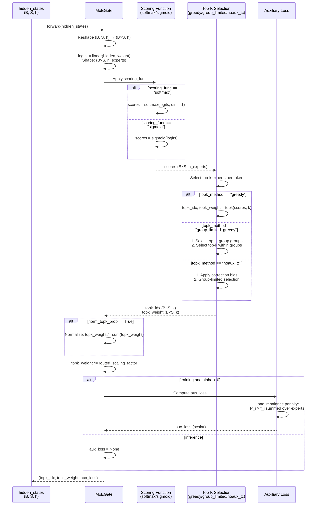

# MoEGate

## What It Is
`MoEGate` implements the expert routing mechanism for DeepSeek-OCR's Mixture-of-Experts (MoE) layers. It determines which experts should process each token by:
1. Computing expert affinity scores for each token
2. Selecting top-k experts per token (typically k=2)
3. Normalizing routing weights
4. Computing auxiliary load-balancing loss during training

The gate is critical for MoE efficiency and quality, balancing between expert specialization and load distribution.

## Definition
```python
class MoEGate(nn.Module):
    def __init__(self, config):
        super().__init__()
        self.config = config
        self.top_k = config.num_experts_per_tok
        self.n_routed_experts = config.n_routed_experts
        self.routed_scaling_factor = config.routed_scaling_factor
        self.scoring_func = config.scoring_func
        self.alpha = config.aux_loss_alpha
        self.seq_aux = config.seq_aux
        self.topk_method = config.topk_method
        self.n_group = config.n_group
        self.topk_group = config.topk_group

        # topk selection algorithm
        self.norm_topk_prob = config.norm_topk_prob
        self.gating_dim = config.hidden_size
        self.weight = nn.Parameter(
            torch.empty((self.n_routed_experts, self.gating_dim))
        )
        if self.topk_method == "noaux_tc":
            self.e_score_correction_bias = nn.Parameter(
                torch.empty((self.n_routed_experts))
            )
        self.reset_parameters()
```

## Constructor Information
**Location**: `models/deepseek-ocr/modeling_deepseekv2.py:400-535`

**Signature**:
```python
def __init__(self, config: DeepseekV2Config)
```

**Parameters** (from config):
- `num_experts_per_tok` (top_k): Number of experts to activate per token (default: 2)
- `n_routed_experts`: Total number of routed experts (default: 160)
- `routed_scaling_factor`: Scaling factor for routing weights (default: 1.0)
- `scoring_func`: Scoring function type, "softmax" or "sigmoid" (default: "softmax")
- `aux_loss_alpha` (alpha): Weight for auxiliary load-balancing loss (default: 0.001)
- `seq_aux`: Whether to compute sequence-level auxiliary loss (default: True)
- `topk_method`: Top-k selection algorithm: "greedy", "group_limited_greedy", or "noaux_tc" (default: "greedy")
- `n_group`: Number of expert groups for group_limited_greedy (default: None)
- `topk_group`: Number of groups to select in group_limited_greedy (default: None)
- `norm_topk_prob`: Whether to normalize top-k probabilities to sum to 1 (default: True)
- `hidden_size` (gating_dim): Input dimension for gating (default: 1280)

**Learned Parameters**:
- `self.weight`: Gating weight matrix, shape `(n_routed_experts, gating_dim)`
  - Each row is an expert's scoring vector
  - Example: `(160, 1280)` = 204,800 parameters
- `self.e_score_correction_bias`: (Optional) Expert score correction bias, shape `(n_routed_experts,)`
  - Only used when `topk_method == "noaux_tc"` (inference-only mode)

**Parameter count**:
```python
params = n_routed_experts × gating_dim

Example (160 experts, 1280 hidden_size):
params = 160 × 1280 = 204,800 parameters
At bf16: 204,800 × 2 bytes = 410 KB per MoEGate
```

## Module Internals



## Key Pseudo Code

```python
def forward(self, hidden_states: torch.Tensor) -> Tuple[torch.Tensor, torch.Tensor, Optional[torch.Tensor]]:
    """
    Route tokens to top-k experts.

    Args:
        hidden_states: (batch_size, seq_len, hidden_size)

    Returns:
        topk_idx: (batch_size × seq_len, top_k) - Expert indices for each token
        topk_weight: (batch_size × seq_len, top_k) - Routing weights for each token
        aux_loss: Scalar auxiliary loss for load balancing (training only)
    """
    bsz, seq_len, h = hidden_states.shape

    # 1. Flatten batch and sequence dimensions
    hidden_states = hidden_states.view(-1, h)  # (B×S, h)

    # 2. Compute expert affinity scores
    logits = F.linear(
        hidden_states.type(torch.float32),
        self.weight.type(torch.float32),
        None
    )  # (B×S, n_experts)

    # 3. Apply scoring function
    if self.scoring_func == "softmax":
        scores = logits.softmax(dim=-1, dtype=torch.float32)  # Normalize across experts
    elif self.scoring_func == "sigmoid":
        scores = logits.sigmoid()  # Independent expert probabilities
    else:
        raise NotImplementedError(f"Unsupported scoring function: {self.scoring_func}")

    # 4. Select top-k experts per token
    if self.topk_method == "greedy":
        # Simple top-k selection
        topk_weight, topk_idx = torch.topk(scores, k=self.top_k, dim=-1, sorted=False)

    elif self.topk_method == "group_limited_greedy":
        # Two-stage selection: group-level then within-group
        # Step 1: Group experts and find top group scores
        group_scores = scores.view(bsz * seq_len, self.n_group, -1).max(dim=-1).values
        # (B×S, n_group)

        # Step 2: Select top-k_group groups
        group_idx = torch.topk(group_scores, k=self.topk_group, dim=-1, sorted=False)[1]
        # (B×S, topk_group)

        # Step 3: Create mask for selected groups
        group_mask = torch.zeros_like(group_scores)
        group_mask.scatter_(1, group_idx, 1)  # (B×S, n_group)

        # Step 4: Expand mask to expert level
        score_mask = (
            group_mask.unsqueeze(-1)
            .expand(bsz * seq_len, self.n_group, self.n_routed_experts // self.n_group)
            .reshape(bsz * seq_len, -1)
        )  # (B×S, n_experts)

        # Step 5: Mask out non-selected groups and pick top-k
        tmp_scores = scores.masked_fill(~score_mask.bool(), 0.0)
        topk_weight, topk_idx = torch.topk(tmp_scores, k=self.top_k, dim=-1, sorted=False)

    elif self.topk_method == "noaux_tc":
        # Training-free topk with correction bias (inference only)
        assert not self.training
        scores_for_choice = scores.view(bsz * seq_len, -1) + self.e_score_correction_bias.unsqueeze(0)
        # Apply group_limited_greedy logic with corrected scores
        # (similar to above, with bias-corrected scores)
        # ...
        topk_weight = scores.gather(1, topk_idx)  # Get original scores, not corrected

    # 5. Normalize top-k weights (optional)
    if self.top_k > 1 and self.norm_topk_prob:
        denominator = topk_weight.sum(dim=-1, keepdim=True) + 1e-20
        topk_weight = topk_weight / denominator * self.routed_scaling_factor
    else:
        topk_weight = topk_weight * self.routed_scaling_factor

    # 6. Compute auxiliary loss for load balancing (training only)
    aux_loss = None
    if self.training and self.alpha > 0.0:
        topk_idx_for_aux_loss = topk_idx.view(bsz, -1)  # (B, S×k)

        if self.seq_aux:
            # Sequence-level auxiliary loss
            scores_for_seq_aux = scores.view(bsz, seq_len, -1)
            ce = torch.zeros(bsz, self.n_routed_experts, device=hidden_states.device)
            ce.scatter_add_(
                1,
                topk_idx_for_aux_loss,
                torch.ones(bsz, seq_len * self.top_k, device=hidden_states.device),
            ).div_(seq_len * self.top_k / self.n_routed_experts)
            # ce: expert usage count per sequence, normalized

            aux_loss = (ce * scores_for_seq_aux.mean(dim=1)).sum(dim=1).mean() * self.alpha
        else:
            # Global auxiliary loss
            mask_ce = F.one_hot(
                topk_idx_for_aux_loss.view(-1), num_classes=self.n_routed_experts
            )
            ce = mask_ce.float().mean(0)  # Expert usage frequency
            Pi = scores.mean(0)  # Average expert scores
            fi = ce * self.n_routed_experts  # Load factor per expert
            aux_loss = (Pi * fi).sum() * self.alpha

    return topk_idx, topk_weight, aux_loss
```

**Auxiliary Loss Explanation**:
```
Goal: Encourage balanced expert utilization during training

Load balancing loss: L_aux = α × Σ_i (P_i × f_i)

where:
  P_i: Average routing probability to expert i (mean gating score)
  f_i: Fraction of tokens routed to expert i (expert load)
  α: Auxiliary loss coefficient (e.g., 0.001)

Intuition:
  - If expert i has high P_i (model wants to use it) AND high f_i (it's used),
    the product is large, increasing loss
  - Penalty encourages model to:
    1. Lower P_i for overused experts (reduce routing probability)
    2. Lower f_i for high-probability experts (spread load)
  - Result: More balanced expert usage without sacrificing quality
```

## FLOP Count and Memory Usage Impact

### FLOPs (per forward pass)

Assume:
- Input shape: `(B, S, h)` where B=batch, S=sequence length, h=hidden_size
- Number of experts: `E = n_routed_experts`
- Top-k: `k = num_experts_per_tok`

**Operations**:
1. **Linear projection**: `(B×S, h) @ (h, E)^T`
   - FLOPs: `2 × B × S × h × E`
2. **Scoring function** (softmax):
   - Exp: `B × S × E` FLOPs
   - Sum + divide: `2 × B × S × E` FLOPs
   - Total: `3 × B × S × E` FLOPs
3. **Top-k selection**:
   - Heap-based or sorting: `O(B × S × E × log(k))`, approximated as `B × S × E` for small k
4. **Normalization** (if enabled):
   - Sum + divide: `2 × B × S × k` FLOPs (negligible)
5. **Auxiliary loss** (training):
   - Scatter + reductions: `O(B × S × k)` (negligible)

**Total FLOPs**:
```
FLOPs ≈ 2×B×S×h×E + 3×B×S×E + B×S×E
      ≈ 2×B×S×h×E + 4×B×S×E
      ≈ 2 × B × S × (h × E + 2 × E)

Example (B=1, S=8192, h=1280, E=160):
FLOPs ≈ 2 × 1 × 8192 × (1280 × 160 + 2 × 160)
      ≈ 2 × 8192 × (204,800 + 320)
      ≈ 3,359,416,320 FLOPs
      ≈ 3.36 GFLOPs per MoEGate call
```

**Per-model impact**:
```
DeepSeek-OCR (38 MoE layers):
Total gating FLOPs: 38 × 3.36 GFLOPs ≈ 128 GFLOPs per forward pass

Negligible compared to expert computation (~7 TFLOPs)!
```

### Memory Usage

#### Parameters:
```
weight: n_routed_experts × gating_dim × sizeof(dtype)
e_score_correction_bias (optional): n_routed_experts × sizeof(dtype)

Example (E=160, h=1280, bf16):
weight: 160 × 1280 × 2 = 409,600 bytes ≈ 410 KB
bias (if noaux_tc): 160 × 2 = 320 bytes

Total per MoEGate: ~410 KB
```

**Total in DeepSeek-OCR**:
```
38 MoE layers × 410 KB ≈ 15.6 MB (negligible)
```

#### Activations (per forward pass):

**Intermediate tensors**:
1. `logits`: B × S × E × 4 bytes (fp32)
2. `scores`: B × S × E × 4 bytes (fp32)
3. `topk_idx`: B × S × k × 4 bytes (int32)
4. `topk_weight`: B × S × k × 4 bytes (fp32)

**Example (B=1, S=8192, E=160, k=2)**:
```
logits: 1 × 8192 × 160 × 4 = 5.24 MB
scores: 5.24 MB (can reuse logits buffer)
topk_idx: 1 × 8192 × 2 × 4 = 65.5 KB
topk_weight: 65.5 KB

Peak memory: ~5.37 MB per MoEGate call
```

**Gradient Memory** (training):
```
Parameter gradients:
- d(loss)/d(weight): E × h × sizeof(dtype) = 410 KB

Auxiliary loss gradients:
- Flow through scatter_add and reductions (no storage)

Optimizer states (AdamW):
- weight: 410 KB (bf16)
- momentum: E × h × 4 bytes = 820 KB (fp32)
- variance: 820 KB (fp32)
Total: 2.05 MB per MoEGate

Total for 38 gates: 38 × 2.05 MB ≈ 78 MB (negligible)
```

## Related Modules
- **Used by**: `DeepseekV2MoE.gate` (line 599)
- **Consumes**: `hidden_states` from decoder layer
- **Produces**: Routing decisions for `DeepseekV2MoE.forward()` and `DeepseekV2MoE.moe_infer()`
- **Loss integration**: `AddAuxiliaryLoss` autograd function (lines 538-556)

## Usage Pattern

```python
from modeling_deepseekv2 import MoEGate, DeepseekV2Config

config = DeepseekV2Config(
    num_experts_per_tok=2,
    n_routed_experts=160,
    routed_scaling_factor=1.0,
    scoring_func="softmax",
    aux_loss_alpha=0.001,
    topk_method="greedy",
    norm_topk_prob=True,
)

gate = MoEGate(config)

# Forward pass
hidden_states = torch.randn(1, 8192, 1280)  # (B, S, h)
topk_idx, topk_weight, aux_loss = gate(hidden_states)

print(topk_idx.shape)      # (8192, 2) - Expert indices for each token
print(topk_weight.shape)   # (8192, 2) - Routing weights
print(aux_loss)            # Scalar tensor (training) or None (inference)

# Use routing decisions in MoE layer
for i, expert in enumerate(experts):
    mask = (topk_idx == i)  # Tokens routed to expert i
    expert_input = hidden_states[mask]
    expert_output = expert(expert_input)
    # Apply routing weights and aggregate...
```

**Group-limited greedy example**:
```python
# Configuration for group-limited routing
# Useful for reducing routing search space and improving load balance
config = DeepseekV2Config(
    num_experts_per_tok=2,
    n_routed_experts=160,
    n_group=8,              # Divide 160 experts into 8 groups of 20
    topk_group=2,           # First select 2 groups
    topk_method="group_limited_greedy",
)

gate = MoEGate(config)
# Now each token:
# 1. Selects top-2 groups (out of 8)
# 2. Selects top-2 experts within those 2 groups
# Result: More balanced expert usage, slightly restricted capacity
```

## Key Performance Characteristics

1. **Lightweight compute**: Gating overhead is <2% of total MoE FLOPs
   - Single linear projection + softmax/sigmoid
   - Top-k selection is efficient (heap-based)

2. **Memory-efficient**: ~410 KB parameters, ~5 MB activations per call
   - Negligible compared to expert parameters (~64 GB)

3. **Load balancing critical for efficiency**:
   - Imbalanced routing → some experts overloaded, others idle
   - Auxiliary loss encourages balance (α=0.001 typical)
   - Group-limited methods provide hard balance constraints

4. **Routing quality impacts model quality**:
   - Better routing → better expert specialization → lower perplexity
   - Top-k selection allows each token to consult multiple experts
   - Softmax vs sigmoid: softmax normalizes (competitive), sigmoid allows independent (collaborative)

5. **Inference optimization**:
   - `noaux_tc` method: Training-free topk with learned bias
   - Avoids auxiliary loss computation during inference
   - Can further optimize with kernel fusion

## Optimization Opportunities

1. **Fused gating kernel**: Combine linear + softmax + topk into single GPU kernel
2. **Expert batching**: Group tokens by expert assignment for efficient GEMM
3. **Dynamic routing**: Skip gating computation for cached tokens (prefill vs decode)
4. **Quantized gating**: Use int8 weights for gating projection
5. **Expert pruning**: Remove rarely-used experts based on routing statistics

## References
- Original Switch Transformer: "Switch Transformers: Scaling to Trillion Parameter Models with Simple and Efficient Sparsity" (Fedus et al., 2021)
- Load balancing loss: Introduced in Switch Transformer, refined in DeepSeek-MoE
- Group-limited routing: DeepSeek innovation for better load distribution
- Used in: DeepSeek-MoE, DeepSeek-V2, DeepSeek-V3, Mixtral, many MoE models
