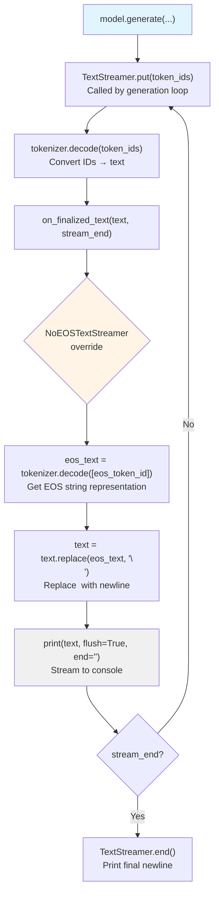

# NoEOSTextStreamer

## What It Is
`NoEOSTextStreamer` is a custom text streaming class that inherits from Hugging Face's `TextStreamer` and modifies the end-of-sequence token handling. Instead of the default behavior, it:

1. **Replaces EOS token with newline**: When `<eos>` is detected, replaces it with `"\n"` in the output
2. **Enables real-time streaming**: Prints generated text incrementally during generation (token-by-token or chunk-by-chunk)
3. **Zero compute cost**: Pure text postprocessing, no impact on model inference

This is used during DeepSeek-OCR's generation to provide clean output formatting when streaming predictions to console.

## Definition
```python
from transformers import TextStreamer

class NoEOSTextStreamer(TextStreamer):
    def on_finalized_text(self, text: str, stream_end: bool = False):
        """
        Override callback for finalized text chunks.

        Args:
            text: Finalized decoded text chunk
            stream_end: Whether this is the final chunk
        """
        eos_text = self.tokenizer.decode([self.tokenizer.eos_token_id], skip_special_tokens=False)
        text = text.replace(eos_text, "\n")
        print(text, flush=True, end="")
```

**Parent class** (`TextStreamer`):
```python
class TextStreamer:
    """Base class for streaming decoded text during generation."""

    def __init__(self, tokenizer, skip_prompt=False, **decode_kwargs):
        self.tokenizer = tokenizer
        self.skip_prompt = skip_prompt
        self.decode_kwargs = decode_kwargs

    def put(self, value):
        """Receive new generated token IDs."""
        # Decodes and calls on_finalized_text when chunk is ready

    def on_finalized_text(self, text: str, stream_end: bool = False):
        """Callback for finalized text. Override in subclasses."""
        print(text, flush=True, end="")

    def end(self):
        """Called when generation completes."""
        print("", flush=True)
```

## Constructor Information
**Location**: `models/deepseek-ocr/modeling_deepseekocr.py:343-348`

**Parameters**:
- Inherits from `TextStreamer`: `tokenizer`, `skip_prompt`, `decode_kwargs`
- No additional parameters in `NoEOSTextStreamer`

**Typical usage**:
```python
streamer = NoEOSTextStreamer(
    tokenizer=tokenizer,
    skip_prompt=True  # Don't print the input prompt tokens
)
```

**Initialization cost**: **Negligible** (just stores tokenizer reference)

## Module Internals (Mermaid)



## Pseudo Code

```python
class NoEOSTextStreamer(TextStreamer):
    """
    Custom streamer that replaces EOS tokens with newlines.

    Typical EOS representations:
    - GPT-style: "<|endoftext|>"
    - LLaMA-style: "</s>"
    - DeepSeek: "<eos>" (appears in output when skip_special_tokens=False)

    Without this override:
    - Default TextStreamer would print "<eos>" literally
    - Or skip it entirely with skip_special_tokens=True

    With this override:
    - "<eos>" → "\n" for cleaner multi-line output
    """

    def on_finalized_text(self, text: str, stream_end: bool = False):
        """
        Called whenever a chunk of text is finalized (ready to display).

        Finalization happens at:
        - Token boundaries that form complete words/phrases
        - End of generation

        Args:
            text: Decoded text chunk (may contain special tokens if skip_special_tokens=False)
            stream_end: True if this is the last chunk
        """
        # 1. Get the EOS token's string representation
        # tokenizer.eos_token_id: int (e.g., 2 for LLaMA)
        # tokenizer.decode([2], skip_special_tokens=False) → "<eos>" or "</s>"
        eos_text = self.tokenizer.decode(
            [self.tokenizer.eos_token_id],
            skip_special_tokens=False
        )

        # 2. Replace EOS with newline
        # Useful for multi-line outputs (e.g., OCR'd paragraphs)
        # Example: "Line 1<eos>Line 2<eos>" → "Line 1\nLine 2\n"
        text = text.replace(eos_text, "\n")

        # 3. Print immediately (streaming output)
        # flush=True: Force immediate display (don't buffer)
        # end="": Don't add newline after each chunk (we control formatting)
        print(text, flush=True, end="")

# Usage in generation:
def generate_with_streaming():
    streamer = NoEOSTextStreamer(tokenizer, skip_prompt=True)

    model.generate(
        input_ids=...,
        streamer=streamer,  # Pass streamer to generate()
        max_new_tokens=512,
        ...
    )
    # As tokens are generated:
    # 1. Generation loop calls streamer.put(new_token_ids)
    # 2. Streamer decodes tokens incrementally
    # 3. on_finalized_text() called with decoded chunks
    # 4. Text appears in console in real-time
```

## FLOP Count

**Per token/chunk**: **0 FLOPs**

**Why zero?**
1. **Text postprocessing only**: String replacement is CPU string ops, not arithmetic
2. **Outside model execution**: Runs after token generation, not during inference
3. **Negligible overhead**: String operations are ~microseconds per token

**Actual operations** (per chunk):
```
tokenizer.decode([eos_token_id]): Hash table lookup + string formatting (~1 μs)
text.replace(eos_text, "\n"): String search and replace (~0.1 μs per char)
print(text): Console I/O (10-100 μs depending on terminal)

Total per chunk: ~10-100 μs
Compare to token generation: 1-50 ms per token (100-5000× longer)
Overhead: <0.1% of generation time
```

## Memory Usage

**Parameters**: **0 bytes** (no learnable weights)

**Runtime state**:
```
self.tokenizer: Reference to tokenizer object (shared, not copied)
  Typical tokenizer memory: ~10-100 MB (vocab, merges, special tokens)
  Shared with model, so no additional cost

self.decode_kwargs: dict, ~1 KB
self.skip_prompt: bool, ~1 byte
self.token_cache: list[int], ~1 KB (internal buffering)

Total per streamer: ~1 KB (negligible)
```

**Temporary allocations** (per chunk):
```
eos_text: str, ~10 bytes (e.g., "<eos>")
text (input): str, ~50-500 bytes (typical chunk size)
text (output): str, same size (replace is often in-place or similar size)

Peak during callback: ~1 KB (ephemeral)
```

**Design note**: Streamers are **stateful** (maintain token cache between calls) but have minimal memory footprint.

## Related Modules
- **Inherits from**: `transformers.TextStreamer`
- **Used by**: `DeepseekOCRForCausalLM.infer()` - passed to `model.generate(streamer=...)`
- **Related**:
  - `TextIteratorStreamer` - Alternative streamer for threading/async use
  - `tokenizer.decode()` - Used internally to convert token IDs → text
- **Not related to**:
  - Model inference (`nn.Module.forward`) - streamer is a callback, not a model component
  - Gradient computation - no parameters, no backprop

## Usage Pattern

```python
# In DeepseekOCRForCausalLM.infer()
if verbose:
    # Verbose mode: stream output to console in real-time
    streamer = NoEOSTextStreamer(
        tokenizer=tokenizer,
        skip_prompt=True,  # Don't print the input image tokens
        skip_special_tokens=False  # Keep special tokens for replacement
    )
else:
    streamer = None  # No streaming, just return final output

# Generate with streaming
output_ids = model.generate(
    inputs_embeds=inputs_embeds,
    attention_mask=attention_mask,
    pad_token_id=tokenizer.pad_token_id,
    eos_token_id=tokenizer.eos_token_id,
    max_new_tokens=512,
    do_sample=False,
    use_cache=True,
    streamer=streamer,  # Pass our custom streamer
)

# If verbose=True, text appears incrementally during generation:
# "The image contains text: Hello World\n"
# (instead of: "The image contains text: Hello World<eos>")

# After generation completes, decode full output
text = tokenizer.decode(output_ids[0], skip_special_tokens=True)
```

**Example output** (without vs with NoEOSTextStreamer):

Default TextStreamer (skip_special_tokens=False):
```
The image contains:
<image>A document with multiple lines of text<eos>
Line 1: Header<eos>
Line 2: Body<eos>
```

NoEOSTextStreamer:
```
The image contains:
A document with multiple lines of text
Line 1: Header
Line 2: Body
```

**Why replace instead of skip?**
```python
# Option 1: skip_special_tokens=True (default TextStreamer)
# Problem: Loses structure information (where sequences end)

# Option 2: skip_special_tokens=False + NoEOSTextStreamer
# Benefit: Preserves structure as newlines
# Use case: OCR output often has natural line breaks at EOS positions

# Example: Multi-paragraph OCR
# Input image: [Paragraph 1] [Paragraph 2]
# Model generates: "Para 1<eos>Para 2<eos>"
# NoEOSTextStreamer: "Para 1\nPara 2\n"
# Result: Preserves paragraph structure in output
```

**Advanced usage** (custom replacement):
```python
class CustomStreamer(TextStreamer):
    def on_finalized_text(self, text: str, stream_end: bool = False):
        # Custom postprocessing
        text = text.replace("<eos>", " [END] ")
        text = text.replace("<sep>", " | ")
        print(text, flush=True, end="")

# Or log instead of print:
class LoggingStreamer(TextStreamer):
    def __init__(self, tokenizer, logger):
        super().__init__(tokenizer)
        self.logger = logger

    def on_finalized_text(self, text: str, stream_end: bool = False):
        self.logger.info(text)
```

## References
- `transformers.TextStreamer`: https://huggingface.co/docs/transformers/main/en/internal/generation_utils#transformers.TextStreamer
- Streaming generation: Allows real-time display of LLM outputs (UX improvement)
- EOS token handling: Different tokenizers use different EOS representations
- Design pattern: Callback pattern for extensible post-processing during generation
