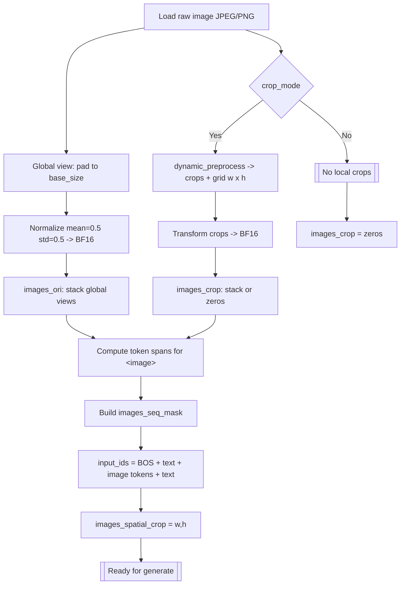
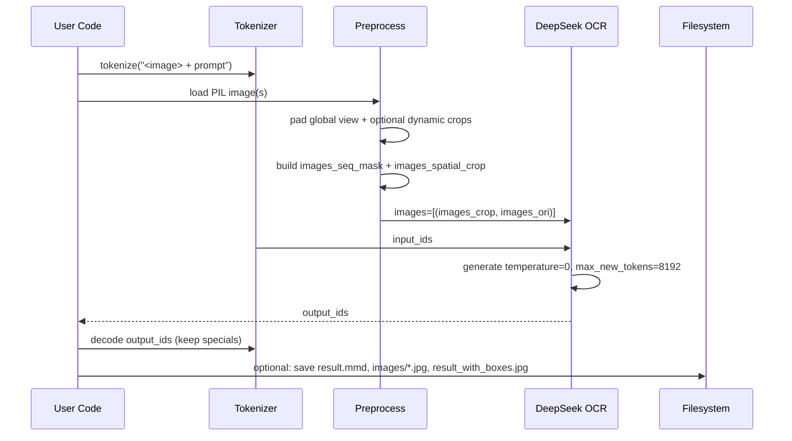
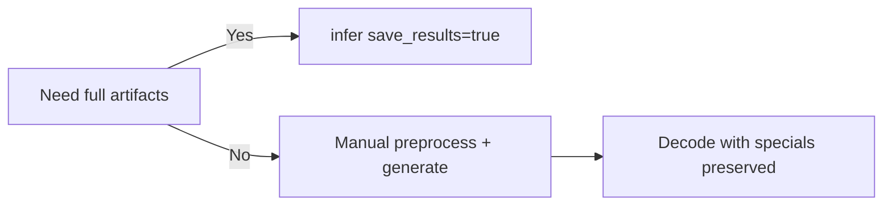
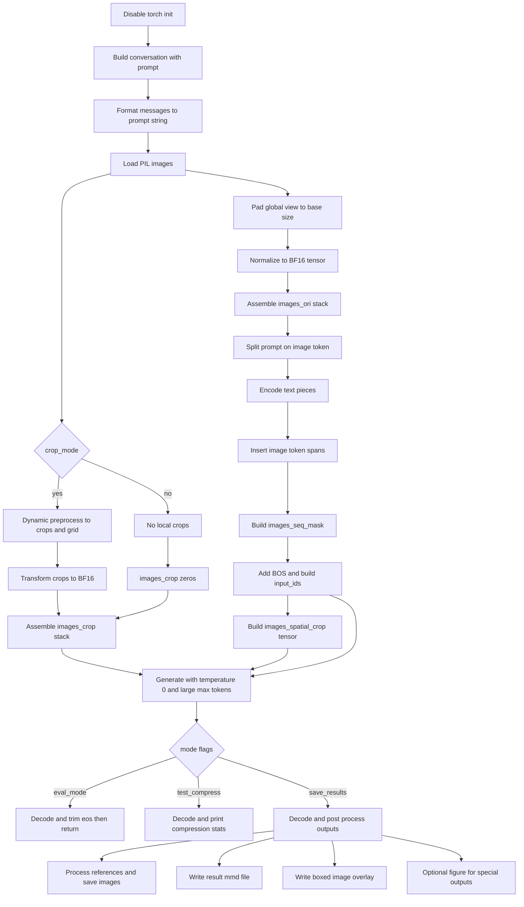
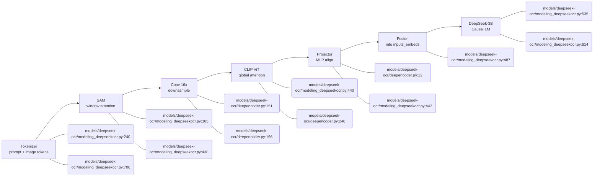

# How to Run DeepSeek‑OCR Inference (Inputs, Preprocessing, APIs)

This hint summarizes how DeepSeek‑OCR expects inputs, what it produces, and which model APIs provide the most complete OCR output, distilled from the upstream source in your repo link `models/deepseek-ocr -> /data2/huangzhe/code/DeepSeek-OCR`.

Sources and references:
- GitHub: https://github.com/deepseek-ai/DeepSeek-OCR
- Hugging Face card: https://huggingface.co/deepseek-ai/DeepSeek-OCR
- Local file (custom code): `models/deepseek-ocr/modeling_deepseekocr.py`

## 1) Model I/O and Required Preprocessing

DeepSeek‑OCR is an image→text model with layout‑aware outputs. Inference requires both text tokens (prompt with `<image>` placeholders) and preprocessed image tensors, plus auxiliary masks that align image token spans to the prompt sequence.

Inputs (logical):
- `input_ids: LongTensor[B, S]` — tokenized prompt, including a `<image>` token where the image content is expected to be inserted.
- `images` — a per‑request list of tuples `[(images_crop, images_ori)]`:
  - `images_ori: FloatTensor[N_global, 3, H_base, W_base]` — global view(s), normalized and padded to `base_size`.
  - `images_crop: FloatTensor[N_local, 3, H_base, W_base]` — optional local crops (for high‑res or wide docs) normalized/padded to `base_size`.
- `images_seq_mask: BoolTensor[1, S_total]` — marks token positions in the final input sequence that correspond to image tokens (vs normal text tokens).
- `images_spatial_crop: LongTensor[K, 2]` — spatial grid info `[width_crop_num, height_crop_num]` for local crops.

Outputs (logical):
- Autoregressive text sequence (OCR result), typically containing structural tokens for layout (tables/headings/lists). The model can produce Markdown/HTML‑like tags when prompted (e.g., `<table>`, `<tr>`, `<td>`…).
- When the built‑in `infer(...)` helper is used with `save_results=True`, it also produces processed files on disk (see below).

Expected raw image preprocessing (from `infer(...)`):
1. Load PIL image(s) from file path(s) in the user “conversation”.
2. If `crop_mode=True`, generate local crops via `dynamic_preprocess(image)` and obtain the crop grid ratio `[width_crop_num, height_crop_num]`.
3. Build a padded “global view” using `ImageOps.pad(image, (base_size, base_size), color=mean)`; normalize with `BasicImageTransform(mean=(0.5,...), std=(0.5,...), normalize=True)`. Cast to `bfloat16`.
4. For each `<image>` occurrence in the prompt, insert image tokens into the text stream. The number of inserted tokens depends on `image_size`, `base_size`, `patch_size=16`, and `downsample_ratio=4` (see code). Update `images_seq_mask` accordingly (True for image token positions, False for text tokens).
5. Concatenate text pieces + image token spans + final text piece; add a BOS token; create `input_ids`.
6. Create tensors:
   - `images_ori = stack(global_view_tensors)`
   - `images_crop = stack(crop_tensors)` or zeros if none
   - `images_spatial_crop = tensor([[width_crop_num, height_crop_num], ...])` (at least one row)
   - `images_seq_mask = BoolTensor[seq_len]` then unsqueeze to batch.
7. Call `generate(...)` with these tensors to obtain output tokens.

Common presets (from README):
- Tiny: `base_size=512, image_size=512, crop_mode=False`
- Small: `base_size=640, image_size=640, crop_mode=False`
- Base: `base_size=1024, image_size=1024, crop_mode=False`
- Large: `base_size=1280, image_size=1280, crop_mode=False`
- “Gundam”: `base_size=1024, image_size=640, crop_mode=True` (uses crops)

Prompt examples:
- Plain OCR: `"<image>\nFree OCR."`
- Structure/Markdown: `"<image>\n<|grounding|>Convert the document to markdown."`

Minimal preprocessing snippet (illustrative only):
```python
from PIL import Image, ImageOps
import torch

# 1) Load image
image = Image.open(image_path).convert("RGB")

# 2) Global view (pad to base_size)
base_size = 1024
mean = (0.5, 0.5, 0.5)
global_view = ImageOps.pad(image, (base_size, base_size), color=tuple(int(x*255) for x in mean))

# 3) Normalize and to tensor (match BasicImageTransform in repo)
def to_tensor_norm(im):
    x = torch.from_numpy(np.array(im)).permute(2, 0, 1).float() / 255.0
    x = (x - 0.5) / 0.5
    return x.to(torch.bfloat16)

images_ori = to_tensor_norm(global_view).unsqueeze(0)  # [1,3,H,W]
images_crop = torch.zeros((1,3,base_size,base_size), dtype=torch.bfloat16)
images_spatial_crop = torch.tensor([[1, 1]], dtype=torch.long)

# 4) Tokenize prompt that contains <image>, then construct images_seq_mask
# ... build input_ids (BOS + text + image tokens + text) and images_seq_mask

# 5) Generate
out_ids = model.generate(
    input_ids.unsqueeze(0).cuda(),
    images=[(images_crop.cuda(), images_ori.cuda())],
    images_seq_mask=images_seq_mask.unsqueeze(0).cuda(),
    images_spatial_crop=images_spatial_crop,
    temperature=0.0,
    max_new_tokens=8192,
)
```

## 2) Prediction APIs and “Most Complete” Output

There are two levels of APIs in the custom code (trust_remote_code path):

- Low‑level generation (most flexible, requires preprocessing):
  - `model.generate(...)` or `model(**inputs)` + `model.generate(...)`
  - Expects: `input_ids`, `images=[(images_crop, images_ori)]`, `images_seq_mask`, `images_spatial_crop` as described above.
  - Returns: token IDs; decode via `tokenizer.decode(...)` to obtain the text output (may include special tokens; keep them for structure unless you know what to strip).

- High‑level helper (most complete, batteries included):
  - `model.infer(tokenizer, prompt, image_file, output_path, base_size, image_size, crop_mode, test_compress, save_results)`
  - What it does:
    1) Builds the conversation with `<image>` in the prompt and loads the image.
    2) Applies the full preprocessing path (global view + optional dynamic crops) and constructs all auxiliary tensors/masks.
    3) Calls `generate(...)` with temperature=0 and large `max_new_tokens`.
    4) Decodes and optionally post‑processes the output:
       - If `save_results=True`, writes:
         - `result.mmd` — the generated text with some post‑processing (e.g., links to `images/*.jpg`).
         - `images/*.jpg` — extracted referenced visuals.
         - `result_with_boxes.jpg` — annotated original image with reference boxes (via `process_image_with_refs`).
         - Optional figures (e.g., `geo.jpg`) for specific structured outputs.
       - If `test_compress=True`, prints “compression” statistics (text token length vs estimated “valid image tokens”).
  - This helper is the shortest path to the “most complete” artifacts for human consumption and downstream evaluation.

Recommendation:
- If you need full OCR artifacts (structured text + visuals + boxes), use `model.infer(..., save_results=True)` and parse the resulting files.
- If you need tight integration with a profiling/benchmark loop while maintaining structure, reproduce the `infer(...)` preprocessing steps and call `generate(...)` directly, keeping special layout tokens in the decoded text.

### Example: Full “most complete” output flow
```python
from transformers import AutoModel, AutoTokenizer
import torch

model_path = "deepseek-ai/DeepSeek-OCR"  # or your local path
tok = AutoTokenizer.from_pretrained(model_path, trust_remote_code=True)
model = AutoModel.from_pretrained(
    model_path,
    _attn_implementation="flash_attention_2",
    trust_remote_code=True,
    use_safetensors=True,
).eval().cuda().to(torch.bfloat16)

prompt = "<image>\n<|grounding|>Convert the document to markdown."
image_file = "/abs/path/to/page.jpg"
output_dir = "/abs/path/to/run_outputs"

# Produces result.mmd, result_with_boxes.jpg, images/*.jpg
model.infer(tok, prompt=prompt, image_file=image_file, output_path=output_dir,
            base_size=1024, image_size=640, crop_mode=True,
            save_results=True, test_compress=False)
```

Notes:
- Keep `skip_special_tokens=False` when decoding if you want to preserve structure (e.g., table tags). Strip selectively only for presentation.
- Choose “Gundam” settings (1024/640 + crops) for complex/doc pages, or `base_size=image_size=1024` without crops for simpler pages.
- The helper inserts a special EOS token in outputs; you may need to trim a trailing `<｜end▁of▁sentence｜>` marker for display.

## Visual UML (Mermaid)

### Preprocessing Flow (from raw image to tensors)



### End-to-End Inference (high-level infer helper)



### API Choice



## model.infer() — Logical Stages (Mermaid)

Stages distilled from `modeling_deepseekocr.py::infer` in your local repo:



## Architecture Stages and Code References (for NVTX)

This section maps the paper’s blocks (Tokenizer, CLIP, DeepSeek‑3B) to concrete code in the local source, to guide NVTX range placement.

- Tokenizer and Prompt Assembly
  - Build text prompt with `<image>` token: `models/deepseek-ocr/modeling_deepseekocr.py:240`
  - Tokenize pieces and insert image token spans: `models/deepseek-ocr/modeling_deepseekocr.py:706`
  - Convert to `input_ids`; embeddings via `get_input_embeddings`: `models/deepseek-ocr/modeling_deepseekocr.py:403`

- DeepEncoder (Vision) — SAM → Conv downsample → CLIP → Projector
  - SAM backbone (local/window attention), both global view and crops:
    - `models/deepseek-ocr/modeling_deepseekocr.py:365` (init)
    - `models/deepseek-ocr/modeling_deepseekocr.py:438` (forward: `sam_model(patches)` / `sam_model(image_ori)`)
  - Conv downsample (16×) before CLIP (compress vision tokens):
    - Implemented in projector/downsample paths using `F.unfold` with stride equal to `downsample_ratio`:
      - `models/deepseek-ocr/deepencoder.py:151` and `models/deepseek-ocr/deepencoder.py:166`
  - CLIP ViT (global attention) using SAM features as patch embeds:
    - `models/deepseek-ocr/modeling_deepseekocr.py:440` and `models/deepseek-ocr/modeling_deepseekocr.py:452`
    - CLIP embeddings code: `models/deepseek-ocr/deepencoder.py:246`
  - Projector (MlpProjector) to align feature dim to LLM embedding space:
    - `models/deepseek-ocr/modeling_deepseekocr.py:442` and `models/deepseek-ocr/modeling_deepseekocr.py:455`
    - Projector module and downsample variants: `models/deepseek-ocr/deepencoder.py:12`
  - Fusion into token stream: concatenate local+global features and scatter into `inputs_embeds` at image mask positions:
    - `models/deepseek-ocr/modeling_deepseekocr.py:487` and `models/deepseek-ocr/modeling_deepseekocr.py:514`

- Decoder — DeepSeek‑3B (Causal LM)
  - The LLM backbone is `DeepseekV2Model` wrapped by `DeepseekOCRForCausalLM`:
    - `models/deepseek-ocr/modeling_deepseekocr.py:535`
  - Prefill path (first forward): `DeepseekOCRModel.forward(...)` delegates to super with `inputs_embeds`: `models/deepseek-ocr/modeling_deepseekocr.py:523`
  - Decode/generate path: `generate(...)` from the CausalLM head with temperature 0, large `max_new_tokens`: `models/deepseek-ocr/modeling_deepseekocr.py:814`

### Suggested NVTX Ranges

Place ranges around these blocks to mirror the paper and enable stage‑level attribution:
- `tokenizer` — prompt build + tokenization + image token span assembly
- `sam` — calls to `sam_model(...)` for crops and global view
- `clip` — calls to `vision_model(...)` that use SAM features (global attention)
- `projector` — MlpProjector forward (includes downsample variants when configured)
- `vision_fusion` — reshape, concat, masked_scatter into `inputs_embeds`
- `prefill` — LLM first forward with `inputs_embeds`
- `decode` — `generate(...)` loop (token-by-token or batched)

Example pseudocode markers:
```python
with nvtx.range('tokenizer'):
    # text_encode, build input_ids, images_seq_mask
with nvtx.range('sam'):
    local_features_1 = sam_model(patches)
    global_features_1 = sam_model(image_ori)
with nvtx.range('clip'):
    local_features_2 = vision_model(patches, local_features_1)
    global_features_2 = vision_model(image_ori, global_features_1)
with nvtx.range('projector'):
    local_features = projector(cat(local_features_2[:,1:], flatted(local_features_1)))
    global_features = projector(cat(global_features_2[:,1:], flatted(global_features_1)))
with nvtx.range('vision_fusion'):
    inputs_embeds[idx].masked_scatter_(images_seq_mask[idx].unsqueeze(-1).cuda(), global_local_features)
with nvtx.range('prefill'):
    _ = super().forward(inputs_embeds=inputs_embeds, ...)
with nvtx.range('decode'):
    output_ids = self.generate(input_ids.unsqueeze(0).cuda(), images=..., ...)
```

### Mermaid — Paper‑style Blocks vs Code



## Pseudocode — Fuse Local/Global Features and Insert into Text Stream

The following pseudocode mirrors the source implementation and shows where to place NVTX ranges for profiling.

```python
def fuse_and_insert_vision_tokens(
    image: PIL.Image,
    prompt_with_image_token: str,           # "... <image> ..."
    tokenizer,
    crop_mode: bool,
    base_size: int,                          # e.g., 1024
    image_size: int,                         # e.g., 640
    patch_size: int = 16,
    downsample_ratio: int = 4,
):
    # 1) Build prompt tokens and identify where image tokens go
    text_parts = split_on_token(prompt_with_image_token, token="<image>")
    tokenized_str = []
    images_seq_mask = []  # bool list aligned with tokenized_str

    for text_piece in text_parts[:-1]:       # interleave text + image-span
        toks = text_encode(tokenizer, text_piece, bos=False, eos=False)
        tokenized_str += toks
        images_seq_mask += [False] * len(toks)

        # Reserve the image token span (length depends on image_size/base_size)
        num_queries      = ceil((image_size // patch_size) / downsample_ratio)
        num_queries_base = ceil((base_size // patch_size) / downsample_ratio)
        image_span = ([IMAGE_TOKEN_ID] * num_queries_base + [IMAGE_TOKEN_ID]) * num_queries_base
        if crop_mode and need_crops(image):
            w_crop, h_crop = pick_crop_grid(image)  # dynamic_preprocess(...)
            image_span += ([IMAGE_TOKEN_ID] * (num_queries * w_crop) + [IMAGE_TOKEN_ID]) * (num_queries * h_crop)
        tokenized_str += image_span
        images_seq_mask += [True] * len(image_span)

    # Add final text piece and BOS at head
    toks_tail = text_encode(tokenizer, text_parts[-1], bos=False, eos=False)
    tokenized_str = [BOS_ID] + tokenized_str + toks_tail
    images_seq_mask = [False] + images_seq_mask + [False] * len(toks_tail)

    input_ids = LongTensor(tokenized_str)         # [S]
    images_seq_mask = BoolTensor(images_seq_mask) # [S]

    # 2) Build tensors for global view and (optional) local crops
    global_view = pad_to_square(image, size=base_size, fill=mean_0p5)  # ImageOps.pad
    X_global = normalize_to_bf16(global_view)      # [3, base, base]
    images_ori = X_global.unsqueeze(0)             # [Ng=1, 3, base, base]

    images_crop_list = []
    crop_grid = (1, 1)
    if crop_mode and need_crops(image):
        crops, crop_grid = dynamic_preprocess(image, image_size=image_size)
        for c in crops:
            images_crop_list.append(normalize_to_bf16(pad_or_resize(c, base_size)))
    images_crop = stack_or_zeros(images_crop_list, base_size)  # [Nl or 1, 3, base, base]
    images_spatial_crop = LongTensor([[crop_grid[0], crop_grid[1]]])  # [[w_crop, h_crop]]

    # 3) Vision encoders (SAM → CLIP) on local crops and global view
    with nvtx.range("sam"):
        local_sam  = SAM(images_crop)   # -> [Nl, T_sam_l, C_sam]
        global_sam = SAM(images_ori)    # -> [Ng, T_sam_g, C_sam]
    with nvtx.range("clip"):
        local_clip  = CLIP(images_crop, local_sam)   # -> [Nl, 1+T_vit_l, C_vit]
        global_clip = CLIP(images_ori,  global_sam)  # -> [Ng, 1+T_vit_g, C_vit]

    # 4) Project to LLM embedding dim; optionally 16× downsample tokens
    with nvtx.range("projector"):
        local_tokens = cat(local_clip[:, 1:], flatten_hw(local_sam), dim=-1)
        local_tokens = Projector(local_tokens)      # -> [Nl, T_l, D_llm]
        global_tokens = cat(global_clip[:, 1:], flatten_hw(global_sam), dim=-1)
        global_tokens = Projector(global_tokens)    # -> [Ng, T_g, D_llm]

    # 5) Line formatting: reshape to H×W grids; append learned newline token; flatten to 1D
    local_seq  = format_lines_with_newline(local_tokens, grid=crop_grid, image_newline=image_newline)
    global_seq = format_lines_with_newline(global_tokens, square_grid=True, image_newline=image_newline)

    # 6) Fuse local + global + view_separator into one vision token sequence
    fused_vision = concat([local_seq, global_seq, view_separator[None, :]], dim=0)  # [Tv, D_llm]

    # 7) Build text embeddings and insert fused tokens at mask positions
    text_embeds = Embedding(input_ids)  # get_input_embeddings()(input_ids)
    inputs_embeds = text_embeds.clone()
    with nvtx.range("vision_fusion"):
        inputs_embeds.masked_scatter_(images_seq_mask.unsqueeze(-1).cuda(), fused_vision)

    # 8) Prefill then decode
    with nvtx.range("prefill"):
        _ = DeepSeek3B.forward(inputs_embeds=inputs_embeds, ...)
    with nvtx.range("decode"):
        out_ids = DeepSeek3B.generate(input_ids.unsqueeze(0), images=[(images_crop, images_ori)],
                                      images_seq_mask=images_seq_mask.unsqueeze(0),
                                      images_spatial_crop=images_spatial_crop,
                                      temperature=0.0, max_new_tokens=8192, ...)
    return out_ids
```
