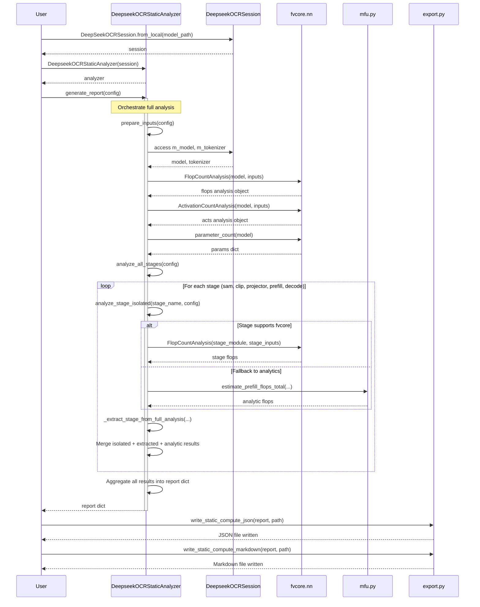
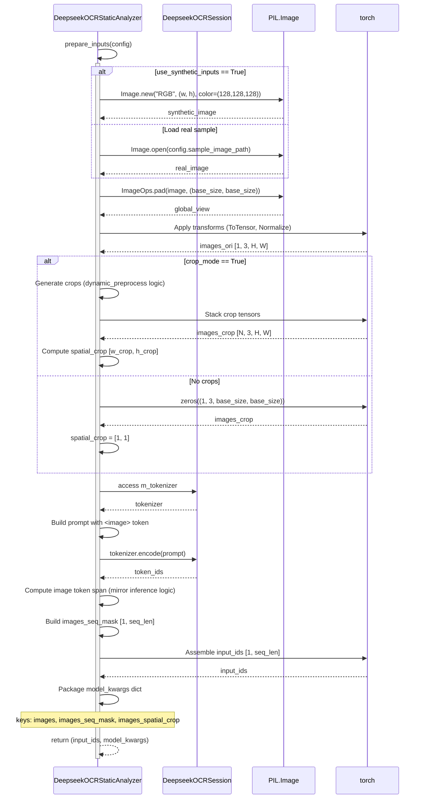
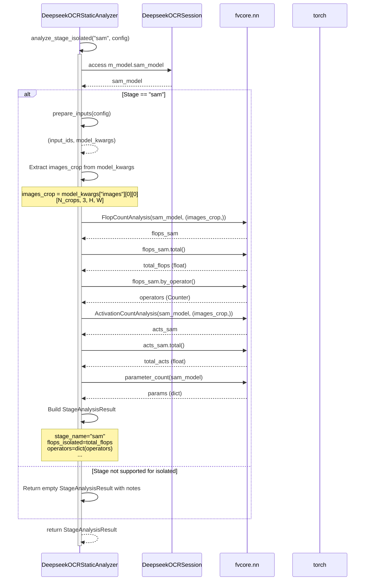
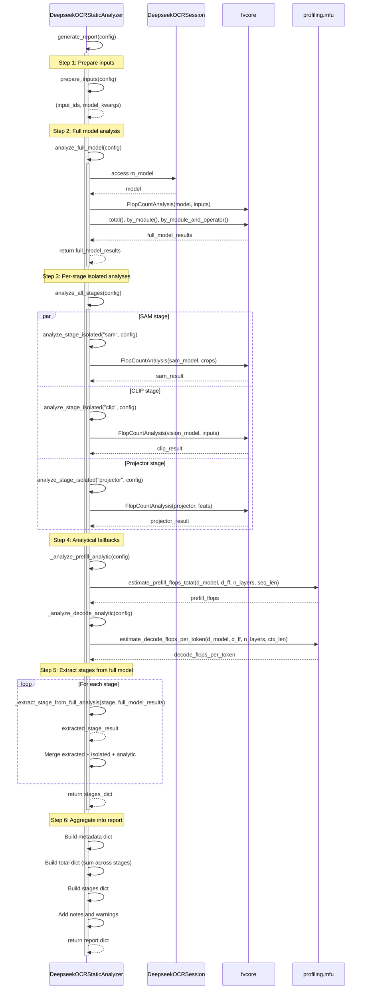

# Plan: Per-Stage Static Model Analysis with fvcore

## HEADER
- **Status**: Done
- **Completed**: 2026-01-19

**Feature**: Static computational resource usage analysis for DeepSeek-OCR
**Location**: `context/plans/done/plan-per-stage-static-analysis.md`
**Date**: 2025-10-29
**Related**: Phase 3 Revision (MFU Accuracy), `context/tasks/001-profile-deepseek-ocr/revision-phase-3-mfu-compute.md`

---

## Executive Summary

This plan details how to use `fvcore` to perform **per-stage static analysis** of the DeepSeek-OCR model, computing parameters and FLOPs for each architectural stage. This static analysis will complement the existing dynamic profiling (NVTX + PyTorch Profiler) and provide accurate FLOP counts for per-stage MFU computation.

**Goals**:
1. Implement comprehensive per-stage static analysis using `fvcore.nn.FlopCountAnalysis`
2. Generate detailed reports with parameters, FLOPs, and activations for each stage
3. Align fvcore analysis with existing NVTX stages (SAM, CLIP, projector, prefill, decode)
4. Provide both full-model and per-stage static compute reports
5. Handle custom modules and trust_remote_code components gracefully

---

## Background: What We Have Implemented

### Phase 1-3 Summary
- **Phase 1**: Basic infrastructure (contracts, NVTX harness, MFU utilities)
- **Phase 2**: `DeepSeekOCRSession` wrapper with NVTX segmentation
- **Phase 3**: Full profiling pipeline with Hydra configs, dynamic profiling, MFU computation

### Current NVTX Stages
From `src/llm_perf_opt/runners/dsocr_session.py:_install_nvtx_stage_hooks()`:
- `sam` - SAM vision encoder (window attention)
- `clip` - CLIP/ViT encoder (global attention)
- `projector` - MLP projection to LLM embedding space
- `prefill` - LLM first forward pass
- `decode` - LLM generation loop
- `tokenizer` - Text preprocessing (minimal compute)

### Existing fvcore Usage
From `src/llm_perf_opt/runners/dsocr_session.py:estimate_static_compute()`:
- Currently only analyzes `lm_head` as a proxy
- Returns placeholders for vision/prefill stages
- Needs comprehensive per-stage breakdown

---

## DeepSeek-OCR Architecture and Module Mapping

### Model Structure
```python
# From models/deepseek-ocr/modeling_deepseekocr.py
class DeepseekOCRModel(DeepseekV2Model):
    self.sam_model        # SAM ViT-B encoder
    self.vision_model     # CLIP-L encoder
    self.projector        # MlpProjector (vision→LLM alignment)
    self.image_newline    # Learned parameter
    self.view_seperator   # Learned parameter
    # Inherits from DeepseekV2Model:
    self.embed_tokens     # Text embedding
    self.layers           # Transformer decoder layers
    self.norm             # Final norm
    self.lm_head          # Output projection
```

### Stage-to-Module Mapping

| Stage | NVTX Name | Modules | Description |
|-------|-----------|---------|-------------|
| **Vision - SAM** | `sam` | `sam_model` | SAM ViT-B with window attention on crops & global view |
| **Vision - CLIP** | `clip` | `vision_model` | CLIP-L ViT with global attention using SAM features |
| **Vision - Projector** | `projector` | `projector` | MLP projection (2048→1280 for DeepSeek-OCR) |
| **Vision - Fusion** | _(combined with prefill)_ | `image_newline`, `view_seperator`, concat/scatter ops | Layout formatting and token insertion |
| **Text - Prefill** | `prefill` | `embed_tokens`, `layers`, `norm` | LLM first forward (full sequence) |
| **Text - Decode** | `decode` | `layers`, `norm`, `lm_head` | Autoregressive generation (per-token) |

### Data Flow (from hints file)
```
Input Image → SAM → Conv 16× downsample → CLIP → Projector →
  Vision Fusion (concat local+global+newlines) →
  Prefill (LLM forward with vision tokens) →
  Decode (LLM generation)
```

---

## fvcore Capabilities Review

### Core API
```python
from fvcore.nn import FlopCountAnalysis, ActivationCountAnalysis, parameter_count
from fvcore.nn import flop_count_table, flop_count_str

# 1. FlopCountAnalysis - Main FLOP analysis
flops = FlopCountAnalysis(model, input_tensors)
flops.total()                    # Total FLOPs
flops.by_module()                # Per-module FLOPs (Counter)
flops.by_operator()              # Per-operator FLOPs (Counter)
flops.by_module_and_operator()   # Combined: {module: Counter({op: flops})}

# 2. ActivationCountAnalysis - Activation/tensor element counts
acts = ActivationCountAnalysis(model, input_tensors)
acts.total()                     # Total activations
acts.by_module()                 # Per-module activations
acts.by_operator()               # Per-operator activations

# 3. parameter_count - Parameter counting
params = parameter_count(model)  # Dict[module_name, param_count]

# 4. Formatting utilities
table = flop_count_table(
    flops,
    max_depth=3,                 # Submodule depth
    activations=acts,            # Optional activation column
    show_param_shapes=True       # Show tensor shapes
)
hierarchy = flop_count_str(flops, activations=acts)
```

### Key Strengths
- **Module-level attribution**: Maps FLOPs to specific nn.Module instances
- **Operator-level breakdown**: Shows which ops (conv, matmul, addmm, etc.) dominate
- **Combined views**: `by_module_and_operator()` shows ops within each module
- **Automatic formatting**: Produces markdown tables and hierarchical text

### Known Limitations
1. **JIT tracing constraints**: Requires tensor inputs/outputs; control flow may be pruned
2. **Custom ops**: May need operator handlers for non-standard operations
3. **Dynamic shapes**: Requires representative input shapes; results are shape-dependent
4. **Trust remote code**: Custom modules may not have built-in handlers

---

## Proposed Approach: Per-Stage Static Analysis

### Strategy Overview
1. **Full model analysis**: Run fvcore on the entire `DeepseekOCRModel` with representative inputs
2. **Per-stage extraction**: Use `by_module()` to extract stage-specific FLOPs
3. **Isolated stage analysis**: For each stage, run separate fvcore analyses with stage-specific inputs
4. **Fallback to analytics**: For unsupported modules, use analytical formulas (already in `mfu.py`)
5. **Report generation**: Produce comprehensive static compute reports

### Implementation Architecture
```
DeepSeekOCRSession.estimate_static_compute_full()
  ├─ Prepare representative inputs (image tensors, prompt tokens)
  ├─ Full model analysis: FlopCountAnalysis(model, inputs)
  │   ├─ Total FLOPs, params, activations
  │   ├─ by_module() → extract per-stage totals
  │   └─ by_module_and_operator() → stage operator breakdown
  ├─ Per-stage isolated analysis:
  │   ├─ SAM: FlopCountAnalysis(sam_model, image_crops)
  │   ├─ CLIP: FlopCountAnalysis(vision_model, (image_ori, sam_feats))
  │   ├─ Projector: FlopCountAnalysis(projector, vision_feats)
  │   ├─ LLM layers: FlopCountAnalysis(layers, embeddings)
  │   └─ lm_head: FlopCountAnalysis(lm_head, hidden_states)
  ├─ Analytical fallbacks:
  │   ├─ Prefill FLOPs: estimate_prefill_flops_total(...)
  │   └─ Decode FLOPs: estimate_decode_flops_per_token(...)
  └─ Aggregate and format:
      ├─ JSON: static_compute.json
      └─ Markdown: static_compute.md (using flop_count_table)
```

---

## Architecture: DeepseekOCRStaticAnalyzer Class Design

### Design Rationale

To maintain **separation of concerns** and follow the **Single Responsibility Principle**, we separate static analysis logic from the inference session:

- **`DeepSeekOCRSession`**: Manages model loading, inference execution, and NVTX instrumentation
- **`DeepseekOCRStaticAnalyzer`**: Manages static computational analysis using fvcore

This design enables:
1. **Independent testing**: Test static analysis without running inference
2. **Reusability**: Use the analyzer with different session configurations
3. **Extensibility**: Add new analysis methods without modifying session
4. **Cleaner code**: Each class has a focused responsibility

### Class Interface

**Location**: `src/llm_perf_opt/runners/dsocr_analyzer.py`

```python
"""Static computational analysis for DeepSeek-OCR models.

This module provides comprehensive static analysis using fvcore to compute
parameters, FLOPs, and activations at both model-level and per-stage granularity.
"""

from __future__ import annotations
from typing import Any, Optional
from dataclasses import dataclass
from pathlib import Path
import logging

import torch
from fvcore.nn import FlopCountAnalysis, ActivationCountAnalysis, parameter_count

from llm_perf_opt.runners.dsocr_session import DeepSeekOCRSession


@dataclass
class AnalysisConfig:
    """Configuration for static analysis.

    Attributes
    ----------
    image_h : int
        Representative image height for vision analysis
    image_w : int
        Representative image width for vision analysis
    base_size : int
        Global view padding size (e.g., 1024)
    image_size : int
        Crop size for local views (e.g., 640)
    seq_len : int
        Representative sequence length for LLM analysis
    crop_mode : bool
        Whether to include local crops (affects vision FLOPs)
    use_analytic_fallback : bool
        Use analytical formulas where fvcore fails
    use_synthetic_inputs : bool
        Use synthetic tensors (True) or load real sample (False)
    sample_image_path : Optional[str]
        Path to real image sample if use_synthetic_inputs=False
    """
    image_h: int = 1024
    image_w: int = 1024
    base_size: int = 1024
    image_size: int = 640
    seq_len: int = 1024
    crop_mode: bool = True
    use_analytic_fallback: bool = True
    use_synthetic_inputs: bool = True
    sample_image_path: Optional[str] = None


@dataclass
class StageAnalysisResult:
    """Results for a single stage analysis.

    Attributes
    ----------
    stage_name : str
        Stage identifier (sam, clip, projector, prefill, decode)
    params : int
        Total parameters in this stage
    flops : float
        Total FLOPs for this stage
    activations : float
        Total activation elements for this stage
    operators : dict[str, float]
        Breakdown by operator type (conv, matmul, etc.)
    flops_isolated : Optional[float]
        FLOPs from isolated stage analysis (if available)
    flops_analytic : Optional[float]
        FLOPs from analytical formula (if available)
    notes : list[str]
        Analysis notes, warnings, or caveats
    """
    stage_name: str
    params: int = 0
    flops: float = 0.0
    activations: float = 0.0
    operators: dict[str, float] = None
    flops_isolated: Optional[float] = None
    flops_analytic: Optional[float] = None
    notes: list[str] = None

    def __post_init__(self):
        if self.operators is None:
            self.operators = {}
        if self.notes is None:
            self.notes = []


class DeepseekOCRStaticAnalyzer:
    """Static computational analysis for DeepSeek-OCR using fvcore.

    This class provides comprehensive static analysis of a DeepSeek-OCR model,
    computing parameters, FLOPs, and activations at both full-model and per-stage
    granularity. It uses fvcore for accurate FLOP counting and falls back to
    analytical formulas where needed.

    Usage
    -----
    >>> session = DeepSeekOCRSession.from_local("/path/to/model")
    >>> analyzer = DeepseekOCRStaticAnalyzer(session)
    >>> config = AnalysisConfig(base_size=1024, image_size=640, seq_len=512)
    >>> report = analyzer.generate_report(config)
    >>> print(report["total"]["flops"])

    Attributes
    ----------
    m_session : DeepSeekOCRSession
        Initialized session with loaded model and tokenizer
    m_logger : logging.Logger
        Logger instance for this analyzer
    m_stage_module_map : dict[str, list[str]]
        Mapping from stage names to module name prefixes
    """

    def __init__(self, session: DeepSeekOCRSession):
        """Initialize analyzer with a loaded session.

        Parameters
        ----------
        session : DeepSeekOCRSession
            Initialized session with model and tokenizer loaded

        Raises
        ------
        ValueError
            If session is not properly initialized
        """
        if session.m_model is None or session.m_tokenizer is None:
            raise ValueError("Session must be initialized with model and tokenizer")

        self.m_session = session
        self.m_logger = logging.getLogger(__name__)

        # Stage-to-module mapping for extraction from full model analysis
        self.m_stage_module_map = {
            "sam": ["sam_model"],
            "clip": ["vision_model"],
            "projector": ["projector"],
            "prefill": ["embed_tokens", "layers", "norm"],
            "decode": ["lm_head"],
        }

    def prepare_inputs(
        self,
        config: AnalysisConfig
    ) -> tuple[torch.Tensor, dict[str, Any]]:
        """Prepare representative inputs for static analysis.

        Builds input tensors matching the preprocessing used in inference,
        either from a real sample image or synthetic data.

        Parameters
        ----------
        config : AnalysisConfig
            Configuration specifying input shapes and modes

        Returns
        -------
        input_ids : torch.Tensor
            Tokenized prompt with image token spans [1, seq_len]
        model_kwargs : dict
            Dictionary with keys: images, images_seq_mask, images_spatial_crop
        """
        ...

    def analyze_full_model(
        self,
        config: AnalysisConfig
    ) -> dict[str, Any]:
        """Run full model static analysis using fvcore.

        Traces the entire model with representative inputs and computes
        total parameters, FLOPs, and activations. Extracts per-stage
        statistics from the full model analysis using module name mapping.

        Parameters
        ----------
        config : AnalysisConfig
            Configuration for input preparation and analysis

        Returns
        -------
        dict
            Full model analysis with keys:
            - total_params : int
            - total_flops : float
            - total_activations : float
            - by_module : dict[str, float] (module name -> FLOPs)
            - by_module_and_operator : dict[str, dict[str, float]]
            - by_operator : dict[str, float]

        Raises
        ------
        RuntimeError
            If fvcore analysis fails and no fallback is available
        """
        ...

    def analyze_stage_isolated(
        self,
        stage_name: str,
        config: AnalysisConfig
    ) -> StageAnalysisResult:
        """Analyze a specific stage in isolation.

        Runs fvcore analysis on a single stage (module) with appropriate
        inputs. This provides more accurate per-stage FLOPs compared to
        extracting from full model analysis, especially for stages with
        control flow or dynamic behavior.

        Parameters
        ----------
        stage_name : str
            Stage identifier (sam, clip, projector, prefill, decode)
        config : AnalysisConfig
            Configuration for input preparation

        Returns
        -------
        StageAnalysisResult
            Isolated analysis results for this stage

        Raises
        ------
        ValueError
            If stage_name is not recognized
        """
        ...

    def analyze_all_stages(
        self,
        config: AnalysisConfig
    ) -> dict[str, StageAnalysisResult]:
        """Analyze all stages (sam, clip, projector, prefill, decode).

        Runs both full model analysis (for extraction) and isolated stage
        analyses. Combines results and uses analytical fallbacks where needed.

        Parameters
        ----------
        config : AnalysisConfig
            Configuration for analysis

        Returns
        -------
        dict[str, StageAnalysisResult]
            Mapping from stage name to analysis results
        """
        ...

    def generate_report(
        self,
        config: AnalysisConfig
    ) -> dict[str, Any]:
        """Generate comprehensive static analysis report.

        This is the main entry point for static analysis. It orchestrates
        full model analysis, per-stage analyses, analytical fallbacks, and
        produces a structured report ready for serialization or formatting.

        Parameters
        ----------
        config : AnalysisConfig
            Configuration for analysis

        Returns
        -------
        dict
            Comprehensive report with structure:
            {
                "metadata": {
                    "image_h": int,
                    "image_w": int,
                    "base_size": int,
                    "image_size": int,
                    "seq_len": int,
                    "crop_mode": bool,
                    "fvcore_version": str,
                    ...
                },
                "total": {
                    "params": int,
                    "flops": float,
                    "activations": float
                },
                "stages": {
                    "sam": {
                        "params": int,
                        "flops": float,
                        "activations": float,
                        "operators": {"conv": float, "matmul": float, ...},
                        "flops_isolated": float,
                        "flops_analytic": float,
                        "notes": [str, ...]
                    },
                    ... (clip, projector, prefill, decode)
                },
                "notes": [str, ...]
            }
        """
        ...

    def _extract_stage_from_full_analysis(
        self,
        stage_name: str,
        by_module: dict[str, float],
        by_module_and_operator: dict[str, dict[str, float]],
        params: dict[str, int],
        acts_by_module: dict[str, float]
    ) -> StageAnalysisResult:
        """Extract per-stage statistics from full model analysis results.

        Uses m_stage_module_map to identify which modules belong to each stage
        and aggregates their FLOPs, parameters, activations, and operators.

        Parameters
        ----------
        stage_name : str
            Stage identifier
        by_module : dict[str, float]
            Full model by_module() results
        by_module_and_operator : dict[str, dict[str, float]]
            Full model by_module_and_operator() results
        params : dict[str, int]
            Full model parameter_count() results
        acts_by_module : dict[str, float]
            Full model activation by_module() results

        Returns
        -------
        StageAnalysisResult
            Aggregated stage results
        """
        ...

    def _analyze_sam_isolated(self, config: AnalysisConfig) -> StageAnalysisResult:
        """Isolated analysis of SAM encoder stage."""
        ...

    def _analyze_clip_isolated(self, config: AnalysisConfig) -> StageAnalysisResult:
        """Isolated analysis of CLIP encoder stage."""
        ...

    def _analyze_projector_isolated(self, config: AnalysisConfig) -> StageAnalysisResult:
        """Isolated analysis of projector stage."""
        ...

    def _analyze_prefill_analytic(self, config: AnalysisConfig) -> StageAnalysisResult:
        """Analytical FLOP estimation for prefill stage."""
        ...

    def _analyze_decode_analytic(self, config: AnalysisConfig) -> StageAnalysisResult:
        """Analytical FLOP estimation for decode stage (per-token)."""
        ...
```

---

### Sequence Diagrams

#### Overall Analysis Workflow



#### Detailed: prepare_inputs() Method



#### Detailed: analyze_stage_isolated() for SAM



#### Detailed: generate_report() Orchestration



---

### Usage Examples

#### Basic Usage

```python
from llm_perf_opt.runners.dsocr_session import DeepSeekOCRSession
from llm_perf_opt.runners.dsocr_analyzer import (
    DeepseekOCRStaticAnalyzer,
    AnalysisConfig,
)
from llm_perf_opt.profiling.export import (
    write_static_compute_json,
    write_static_compute_markdown,
)

# 1. Initialize session
session = DeepSeekOCRSession.from_local(
    model_path="/data2/huangzhe/code/llm-perf-opt/models/deepseek-ocr",
    device="cuda:0",
    use_flash_attn=True,
)

# 2. Create analyzer
analyzer = DeepseekOCRStaticAnalyzer(session)

# 3. Configure analysis
config = AnalysisConfig(
    image_h=1024,
    image_w=1024,
    base_size=1024,
    image_size=640,
    seq_len=1024,
    crop_mode=True,
    use_analytic_fallback=True,
    use_synthetic_inputs=True,
)

# 4. Generate report
report = analyzer.generate_report(config)

# 5. Access results
print(f"Total parameters: {report['total']['params'] / 1e6:.2f}M")
print(f"Total FLOPs: {report['total']['flops'] / 1e9:.2f}G")

for stage_name, stage_data in report["stages"].items():
    print(f"{stage_name}: {stage_data['flops'] / 1e9:.2f}G FLOPs")

# 6. Write outputs
from pathlib import Path
output_dir = Path("tmp/stage1/run_001")
output_dir.mkdir(parents=True, exist_ok=True)

write_static_compute_json(report, output_dir / "static_compute.json")
write_static_compute_markdown(report, output_dir / "static_compute.md")
```

#### Integration with Runner

```python
# In llm_profile_runner.py

@hydra.main(version_base=None, config_path="../../../conf", config_name="config")
def main(cfg: DictConfig) -> None:
    logger = logging.getLogger(__name__)

    # Initialize session
    session = DeepSeekOCRSession.from_local(
        model_path=cfg.model.path,
        device=cfg.device,
        use_flash_attn=cfg.use_flash_attn,
    )

    # Static analysis (if enabled)
    if cfg.static_analysis.get("enabled", True):
        logger.info("Running static compute analysis...")

        analyzer = DeepseekOCRStaticAnalyzer(session)

        config = AnalysisConfig(
            image_h=cfg.static_analysis.get("representative_image_h", 1024),
            image_w=cfg.static_analysis.get("representative_image_w", 1024),
            base_size=cfg.model.arch.preprocess.base_size,
            image_size=cfg.model.arch.preprocess.image_size,
            seq_len=cfg.static_analysis.get("representative_seq_len", 1024),
            crop_mode=cfg.model.arch.preprocess.crop_mode,
            use_analytic_fallback=cfg.static_analysis.get("use_analytic_fallback", True),
        )

        try:
            report = analyzer.generate_report(config)

            # Write outputs
            artifacts_dir = Path(cfg.output_dir)
            write_static_compute_json(report, artifacts_dir / "static_compute.json")
            write_static_compute_markdown(report, artifacts_dir / "static_compute.md")

            logger.info("Static analysis complete")

            # Store for MFU computation
            cfg["_static_report"] = report

        except Exception as e:
            logger.error(f"Static analysis failed: {e}", exc_info=True)

    # Continue with repeated profiling runs...
```

#### Per-Stage Analysis Only

```python
# Analyze only specific stages

analyzer = DeepseekOCRStaticAnalyzer(session)
config = AnalysisConfig(base_size=1024, image_size=640)

# Vision stages only
sam_result = analyzer.analyze_stage_isolated("sam", config)
clip_result = analyzer.analyze_stage_isolated("clip", config)
projector_result = analyzer.analyze_stage_isolated("projector", config)

print(f"SAM FLOPs: {sam_result.flops / 1e9:.2f}G")
print(f"CLIP FLOPs: {clip_result.flops / 1e9:.2f}G")
print(f"Projector FLOPs: {projector_result.flops / 1e9:.2f}G")

total_vision_flops = sam_result.flops + clip_result.flops + projector_result.flops
print(f"Total vision FLOPs: {total_vision_flops / 1e9:.2f}G")
```

---

### Design Benefits

1. **Separation of Concerns**
   - Session handles inference, analyzer handles static analysis
   - Each class has a single, well-defined responsibility

2. **Testability**
   - Can mock DeepSeekOCRSession for unit testing analyzer
   - Can test analyzer without loading real models (use dummy models)

3. **Reusability**
   - Same analyzer can be used with different session configurations
   - Can create multiple analyzers with different configs

4. **Extensibility**
   - Easy to add new analysis methods (e.g., memory analysis, latency estimation)
   - Can subclass for custom analysis strategies

5. **Composability**
   - Analyzer takes session as input, follows composition pattern
   - Can chain with other analysis tools (profilers, optimizers)

6. **Error Handling**
   - Isolated failures in analyzer don't affect session
   - Graceful fallbacks to analytical estimates

---

## Detailed Implementation Plan

**Note**: With the introduction of the `DeepseekOCRStaticAnalyzer` class (see [Architecture section](#architecture-deepseekocrstaticanal yzer-class-design) above), the implementation approach has changed from enhancing the session class to creating a separate analyzer class. The detailed class interface, methods, and sequence diagrams are documented above.

### Implementation Order

The recommended implementation order follows the task breakdown (T100-T107):

1. **T101**: Implement core analyzer class and methods
   - Start with `AnalysisConfig` and `StageAnalysisResult` dataclasses
   - Implement `__init__()` with stage-module mapping
   - Implement `prepare_inputs()` for input preparation
   - Implement analytical methods first (_analyze_prefill_analytic, _analyze_decode_analytic)
   - Implement fvcore-based methods (analyze_full_model, isolated analyses)
   - Implement orchestration methods (analyze_all_stages, generate_report)

2. **T102**: Implement report generation utilities
   - JSON export (simple)
   - Markdown export with tables (mdutils)
   - fvcore built-in table format

3. **T103**: Runner integration
   - Import analyzer classes
   - Create analyzer from session
   - Call generate_report and write outputs

4. **T104**: Configuration
   - Create static_analysis config group
   - Wire into runner

5. **T105-T107**: Enhancement, testing, documentation

### Key Implementation Details

For specific implementation examples of each method, refer to the **Usage Examples** section above. Key points:

- **Input preparation**: Mirror the preprocessing logic in `DeepSeekOCRSession.run_inference()` for consistency
- **Error handling**: Wrap fvcore calls in try-except, provide graceful fallbacks
- **Module extraction**: Use `m_stage_module_map` to identify stage modules by name prefixes
- **Result merging**: Combine extracted, isolated, and analytical results; prefer isolated > extracted > analytical
- **Logging**: Use `self.m_logger` to log progress, warnings, and errors

### 1. Core Analyzer Implementation (`dsocr_analyzer.py`)

See the [Class Interface](#class-interface) section above for complete signatures and docstrings.

Refer to the [Sequence Diagrams](#sequence-diagrams) section for detailed workflow visualization.

Refer to the [Usage Examples](#usage-examples) section for concrete code examples.

---

### 2. Report Generation Utilities (`profiling/export.py`)

Implement three report writing functions as detailed in the task breakdown.

---

### 3. Runner Integration

See [Usage Examples: Integration with Runner](#integration-with-runner) section above.

---

### 4. Configuration

See task breakdown T104 for configuration details.

---

### 5. MFU Enhancement (Optional)

See task breakdown T105 for optional MFU enhancements.

---

## Testing and Validation

### Unit Tests
```python
# tests/test_dsocr_analyzer.py
def test_analyzer_initialization():
    session = DeepSeekOCRSession.from_local("/path/to/model")
    analyzer = DeepseekOCRStaticAnalyzer(session)
    assert analyzer.m_session == session
    assert "sam" in analyzer.m_stage_module_map

def test_analyze_full_model():
    session = DeepSeekOCRSession.from_local("/path/to/model")
    analyzer = DeepseekOCRStaticAnalyzer(session)
    config = AnalysisConfig(base_size=1024, image_size=640, seq_len=512)

    report = analyzer.generate_report(config)

    # Assertions
    assert "total" in report
    assert "stages" in report
    assert report["total"]["params"] > 0
    assert report["total"]["flops"] > 0

    # Per-stage checks
    for stage in ["sam", "clip", "projector", "prefill", "decode"]:
        assert stage in report["stages"]
        assert report["stages"][stage]["params"] >= 0
        assert report["stages"][stage]["flops"] >= 0

def test_static_report_generation():
    report = {...}  # Mock report
    write_static_compute_json(report, Path("/tmp/static.json"))
    write_static_compute_markdown(report, Path("/tmp/static.md"))

    assert Path("/tmp/static.json").exists()
    assert Path("/tmp/static.md").exists()
```
```python
def write_static_compute_markdown(report: dict, output_path: Path) -> None:
    """Write static compute report as formatted markdown table.

    Produces a table with columns:
    - Stage
    - Parameters (M)
    - FLOPs (G)
    - Activations (M)
    - Top operators
    """
    from mdutils.mdutils import MdUtils

    md = MdUtils(file_name=str(output_path.with_suffix("")))
    md.new_header(level=1, title="Static Compute Analysis Report")

    # Metadata
    md.new_header(level=2, title="Configuration")
    metadata = report["metadata"]
    for k, v in metadata.items():
        md.new_line(f"- **{k}**: {v}")

    # Total
    md.new_header(level=2, title="Total Model")
    total = report["total"]
    md.new_line(f"- **Parameters**: {total['params'] / 1e6:.2f}M")
    md.new_line(f"- **FLOPs**: {total['flops'] / 1e9:.2f}G")
    md.new_line(f"- **Activations**: {total['activations'] / 1e6:.2f}M")

    # Per-stage table
    md.new_header(level=2, title="Per-Stage Breakdown")
    table_data = ["Stage", "Params (M)", "FLOPs (G)", "Acts (M)", "Top Ops"]
    stages = report["stages"]
    for stage_name, stage_data in stages.items():
        params_m = stage_data.get("params", 0) / 1e6
        flops_g = stage_data.get("flops", 0) / 1e9
        acts_m = stage_data.get("activations", 0) / 1e6

        # Top 3 operators
        ops = stage_data.get("operators", {})
        top_ops = sorted(ops.items(), key=lambda x: x[1], reverse=True)[:3]
        top_ops_str = ", ".join(f"{op}" for op, _ in top_ops) if top_ops else "N/A"

        table_data.extend([
            stage_name,
            f"{params_m:.2f}",
            f"{flops_g:.2f}",
            f"{acts_m:.2f}",
            top_ops_str,
        ])

    md.new_table(columns=5, rows=len(stages) + 1, text=table_data, text_align="left")

    # Notes
    md.new_header(level=2, title="Notes")
    for note in report.get("notes", []):
        md.new_line(f"- {note}")

    md.create_md_file()
```

#### Using fvcore's Built-in Formatters
```python
def write_static_compute_fvcore_table(
    model: Any,
    inputs: tuple,
    output_path: Path,
    max_depth: int = 3,
) -> None:
    """Use fvcore's built-in table formatter."""
    from fvcore.nn import FlopCountAnalysis, ActivationCountAnalysis, flop_count_table

    flops = FlopCountAnalysis(model, inputs)
    acts = ActivationCountAnalysis(model, inputs)

    table_str = flop_count_table(
        flops,
        max_depth=max_depth,
        activations=acts,
        show_param_shapes=True,
    )

    with open(output_path, "w", encoding="utf-8") as f:
        f.write("# Static Compute Analysis (fvcore)\n\n")
        f.write("```\n")
        f.write(table_str)
        f.write("\n```\n")
```

---

### 3. Integration with Runner

**Update `src/llm_perf_opt/runners/llm_profile_runner.py`**

Add static analysis step before repeated profiling runs:

```python
@hydra.main(version_base=None, config_path="../../../conf", config_name="config")
def main(cfg: DictConfig) -> None:
    logger = logging.getLogger(__name__)

    # ... existing session setup ...
    session = DeepSeekOCRSession.from_local(...)

    # NEW: Static compute analysis
    if cfg.get("static_analysis", {}).get("enabled", True):
        logger.info("Running static compute analysis...")
        try:
            static_report = session.estimate_static_compute_full(
                image_h=cfg.dataset.get("representative_image_h", 1024),
                image_w=cfg.dataset.get("representative_image_w", 1024),
                base_size=cfg.model.arch.preprocess.base_size,
                image_size=cfg.model.arch.preprocess.image_size,
                seq_len=cfg.infer.get("representative_seq_len", 1024),
                crop_mode=cfg.model.arch.preprocess.crop_mode,
            )

            # Write outputs
            artifacts_dir = Path(cfg.output_dir)
            write_static_compute_json(static_report, artifacts_dir / "static_compute.json")
            write_static_compute_markdown(static_report, artifacts_dir / "static_compute.md")

            logger.info("Static analysis complete. See static_compute.{json,md}")

            # Store for MFU computation
            cfg["_static_report"] = static_report

        except Exception as e:
            logger.error(f"Static analysis failed: {e}", exc_info=True)

    # ... existing repeated profiling runs ...
```

---

### 4. Configuration Additions

**Add to `conf/config.yaml`** (or create `conf/static_analysis/default.yaml`):

```yaml
# conf/static_analysis/default.yaml
enabled: true
representative_image_h: 1024
representative_image_w: 1024
representative_seq_len: 1024  # For LLM analysis
use_analytic_fallback: true   # Use analytical formulas where fvcore fails
max_table_depth: 3            # Module hierarchy depth in reports
include_operator_breakdown: true
```

---

### 5. Enhanced MFU Computation with Static FLOPs

**Update `src/llm_perf_opt/profiling/mfu.py`**

Enhance `compute_stage_mfu()` to accept static FLOPs from fvcore:

```python
def compute_stage_mfu_with_static(
    prefill_ms: float,
    decode_ms: float,
    vision_ms: float,
    prefill_len: int,
    new_tokens: int,
    peak_tflops: float,
    static_report: dict | None = None,  # NEW: static analysis results
    # ... existing params ...
) -> StageMFU:
    """Compute per-stage MFU using static FLOPs from fvcore when available."""

    # Vision FLOPs from static analysis
    if static_report and "stages" in static_report:
        stages = static_report["stages"]
        vision_flops_static = (
            stages.get("sam", {}).get("flops", 0) +
            stages.get("clip", {}).get("flops", 0) +
            stages.get("projector", {}).get("flops", 0)
        )
        # Prefer static over analytical
        flops_vision = float(vision_flops_static) if vision_flops_static > 0 else (vision_flops or 0.0)
    else:
        flops_vision = float(vision_flops or 0.0)

    # Prefill FLOPs: prefer static analytic
    if static_report and "stages" in static_report:
        prefill_flops_static = static_report["stages"].get("prefill", {}).get("flops_analytic", 0)
        flops_prefill = float(prefill_flops_static) if prefill_flops_static > 0 else estimate_prefill_flops_total(...)
    else:
        flops_prefill = estimate_prefill_flops_total(d_model, d_ff, n_layers, int(prefill_len))

    # Decode FLOPs: per-token from static * new_tokens
    Lctx = select_decode_context_len(ctx_len_mode, ctx_len_fixed, int(prefill_len), int(new_tokens), model_window)
    if static_report and "stages" in static_report:
        decode_fpt_static = static_report["stages"].get("decode", {}).get("flops_per_token_analytic", 0)
        fpt_decode = float(decode_fpt_static) if decode_fpt_static > 0 else estimate_decode_flops_per_token(...)
    else:
        fpt_decode = estimate_decode_flops_per_token(d_model, d_ff, n_layers, Lctx)

    flops_decode = float(max(new_tokens, 0)) * fpt_decode

    # ... rest of MFU computation unchanged ...
```

---

## Testing and Validation

### Unit Tests
```python
# tests/test_static_analysis.py
def test_estimate_static_compute_full():
    session = DeepSeekOCRSession.from_local("/path/to/model")
    report = session.estimate_static_compute_full(
        image_h=1024, image_w=1024, seq_len=512
    )

    # Assertions
    assert "total" in report
    assert "stages" in report
    assert report["total"]["params"] > 0
    assert report["total"]["flops"] > 0

    # Per-stage checks
    for stage in ["sam", "clip", "projector", "prefill", "decode"]:
        assert stage in report["stages"]
        assert report["stages"][stage]["params"] >= 0
        assert report["stages"][stage]["flops"] >= 0

def test_static_report_generation():
    report = {...}  # Mock report
    write_static_compute_json(report, Path("/tmp/static.json"))
    write_static_compute_markdown(report, Path("/tmp/static.md"))

    assert Path("/tmp/static.json").exists()
    assert Path("/tmp/static.md").exists()
```

### Integration Test
```bash
# Run full profiling with static analysis
pixi run python -m llm_perf_opt.runners.llm_profile_runner \
  static_analysis.enabled=true \
  repeats=1 \
  dataset.subset_filelist=subsets/test-1.txt

# Check outputs
ls -lh tmp/stage1/<run_id>/static_compute.*
cat tmp/stage1/<run_id>/static_compute.md
```

### Validation Checklist
- [ ] Static compute reports generated without errors
- [ ] Parameters sum roughly to expected model size (~1.5B for DeepSeek-OCR)
- [ ] Vision FLOPs are non-zero and reasonable (check SAM, CLIP, projector)
- [ ] Prefill FLOPs scale quadratically with seq_len
- [ ] Decode FLOPs per token align with analytical estimates
- [ ] Operator breakdown shows expected ops (matmul, conv, etc.)
- [ ] Markdown tables are properly formatted
- [ ] MFU computation uses static FLOPs and produces reasonable values

---

## Handling Edge Cases

### 1. Custom Modules Not Supported by fvcore
**Problem**: `trust_remote_code=True` modules may not have fvcore handlers
**Solution**:
- Wrap in try-except with graceful fallback to analytics
- Log warnings with module names that failed
- Document assumptions in report notes

### 2. Dynamic Control Flow
**Problem**: JIT tracing may prune branches or loops
**Solution**:
- Use representative inputs that exercise main paths
- Add notes about conditional branches (e.g., crop_mode=True vs False)
- Compare isolated vs full-model results to detect issues

### 3. Shape-Dependent FLOPs
**Problem**: FLOPs vary with input shapes (image size, seq_len)
**Solution**:
- Document input shapes clearly in metadata
- Provide parameter sweeps for common configs (base_size=1024 vs 640)
- Store shape info alongside FLOP counts

### 4. Attention Context Length Variability
**Problem**: Decode context grows with each token
**Solution**:
- Use average context length for decode MFU (already in `select_decode_context_len`)
- Report both per-token FLOPs and total decode FLOPs
- Consider reporting context length distributions in dynamic profiling

---

## Deliverables

### New/Modified Files
1. **`src/llm_perf_opt/runners/dsocr_analyzer.py`** (NEW)
   - `DeepseekOCRStaticAnalyzer` class
   - `AnalysisConfig` dataclass
   - `StageAnalysisResult` dataclass
   - All analysis methods (full model, per-stage, isolated, analytical)

2. **`src/llm_perf_opt/profiling/export.py`**
   - `write_static_compute_json()`
   - `write_static_compute_markdown()`
   - `write_static_compute_fvcore_table()`

3. **`src/llm_perf_opt/profiling/mfu.py`**
   - `compute_stage_mfu_with_static()` (optional enhancement)

4. **`src/llm_perf_opt/runners/llm_profile_runner.py`**
   - Integration of static analysis step using analyzer

5. **`conf/static_analysis/default.yaml`** (NEW)
   - New config group for static analysis

### Output Artifacts (per run)
- `tmp/stage1/<run_id>/static_compute.json` - Machine-readable report
- `tmp/stage1/<run_id>/static_compute.md` - Human-readable report with tables
- `tmp/stage1/<run_id>/static_compute_fvcore_table.md` - fvcore built-in table format

### Documentation Updates
- **`docs/configuration.md`**: Document `static_analysis` config group
- **`docs/static_analysis.md`** (new): Explain fvcore integration, stage mapping, interpretation
- **`context/tasks/001-profile-deepseek-ocr/revision-phase-3-mfu-compute.md`**: Link to this plan

---

## Task Breakdown

### T100: Research and prototype fvcore integration ✓
- [x] Study fvcore API and examples
- [x] Test on simple models
- [x] Identify DeepSeek-OCR module structure
- [x] Map NVTX stages to modules
- [x] Design DeepseekOCRStaticAnalyzer class architecture
- [x] Create sequence diagrams for analysis workflow

### T101: Implement `DeepseekOCRStaticAnalyzer` in `dsocr_analyzer.py`
- [ ] Create new module `src/llm_perf_opt/runners/dsocr_analyzer.py`
- [ ] Implement `AnalysisConfig` dataclass with defaults
- [ ] Implement `StageAnalysisResult` dataclass
- [ ] Implement `DeepseekOCRStaticAnalyzer.__init__()` with stage-module mapping
- [ ] Implement `prepare_inputs()` - synthetic and real image support
- [ ] Implement `analyze_full_model()` - fvcore full model analysis
- [ ] Implement `_extract_stage_from_full_analysis()` - extraction helper
- [ ] Implement `_analyze_sam_isolated()` - SAM stage analysis
- [ ] Implement `_analyze_clip_isolated()` - CLIP stage analysis
- [ ] Implement `_analyze_projector_isolated()` - Projector stage analysis
- [ ] Implement `_analyze_prefill_analytic()` - Prefill analytical fallback
- [ ] Implement `_analyze_decode_analytic()` - Decode analytical fallback
- [ ] Implement `analyze_stage_isolated()` - dispatcher for stage analyses
- [ ] Implement `analyze_all_stages()` - orchestrate all stage analyses
- [ ] Implement `generate_report()` - main entry point with aggregation

### T102: Implement report generation utilities in `profiling/export.py`
- [ ] `write_static_compute_json()` - JSON export
- [ ] `write_static_compute_markdown()` - Custom markdown table using mdutils
- [ ] `write_static_compute_fvcore_table()` - Built-in fvcore table format

### T103: Integrate static analysis into `llm_profile_runner.py`
- [ ] Import `DeepseekOCRStaticAnalyzer` and `AnalysisConfig`
- [ ] Create analyzer instance from session
- [ ] Build `AnalysisConfig` from Hydra config
- [ ] Call `analyzer.generate_report(config)` before repeated runs
- [ ] Write static compute artifacts to output directory
- [ ] Store results in cfg for MFU computation

### T104: Add configuration for static analysis
- [ ] Create `conf/static_analysis/default.yaml`
- [ ] Add keys: enabled, representative_*, use_analytic_fallback, max_table_depth
- [ ] Update top-level `conf/config.yaml` defaults

### T105: Enhance MFU computation to use static FLOPs (optional)
- [ ] Modify `compute_stage_mfu()` to accept `static_report` parameter
- [ ] Prefer static FLOPs over analytical where available
- [ ] Update runner to pass static report to MFU computation

### T106: Testing and validation
- [ ] Unit tests for `estimate_static_compute_full()`
- [ ] Unit tests for report writers
- [ ] Integration test: run full pipeline with static analysis
- [ ] Validate parameter counts match model size
- [ ] Validate FLOP counts are reasonable (compare to analytical)
- [ ] Check operator breakdowns (matmul, conv dominant in vision)

### T107: Documentation
- [ ] Update `docs/configuration.md` with `static_analysis` config
- [ ] Create `docs/static_analysis.md` explaining fvcore usage, stage mapping, limitations
- [ ] Add usage examples to quickstart/README
- [ ] Update revision plan with completion status

---

## Success Criteria

- [ ] Static compute reports generated without errors for representative inputs
- [ ] Parameters sum to ~1.5B for DeepSeek-OCR (within 10%)
- [ ] Vision FLOPs (SAM + CLIP + projector) are non-zero and consistent with expectations
- [ ] Prefill FLOPs scale appropriately with sequence length (quadratic growth)
- [ ] Decode FLOPs per token align with analytical estimates (within 20%)
- [ ] Operator breakdowns show expected dominant ops (matmul, conv, addmm)
- [ ] Markdown reports are properly formatted and readable
- [ ] MFU computation uses static FLOPs when available
- [ ] All tests pass (unit + integration)
- [ ] Documentation is complete and accurate

---

## References

### External Documentation
- fvcore FLOP count docs: https://github.com/facebookresearch/fvcore/blob/main/docs/flop_count.md
- fvcore API reference: https://detectron2.readthedocs.io/en/latest/modules/fvcore.html

### Internal Documentation
- Phase 3 implementation: `context/tasks/001-profile-deepseek-ocr/impl-phase-3-us1-report.md`
- Revision plan: `context/tasks/001-profile-deepseek-ocr/revision-phase-3-mfu-compute.md`
- DeepSeek-OCR architecture: `context/hints/howto-deepseek-ocr-inference.md`
- Existing MFU code: `src/llm_perf_opt/profiling/mfu.py`
- Existing session: `src/llm_perf_opt/runners/dsocr_session.py`

### Code References
- DeepSeek-OCR model: `models/deepseek-ocr/modeling_deepseekocr.py:354` (DeepseekOCRModel)
- SAM encoder: `models/deepseek-ocr/deepencoder.py:606` (ImageEncoderViT)
- CLIP encoder: `models/deepseek-ocr/deepencoder.py:446` (VitModel)
- NVTX hooks: `src/llm_perf_opt/runners/dsocr_session.py:105` (_install_nvtx_stage_hooks)

---

## Timeline Estimate

| Task | Estimated Time | Dependencies |
|------|---------------|--------------|
| T100 Research | ✓ Complete | - |
| T101 Session method | 4-6 hours | T100 |
| T102 Report utils | 2-3 hours | T101 |
| T103 Runner integration | 1-2 hours | T101, T102 |
| T104 Config | 30 mins | - |
| T105 MFU enhancement | 1-2 hours | T101, T103 |
| T106 Testing | 2-3 hours | T101-T105 |
| T107 Documentation | 2-3 hours | All |
| **Total** | **12-19 hours** | |

---

## Notes

- **fvcore limitations**: Some custom ops may not have handlers; fallback to analytics is essential
- **Shape dependence**: Static analysis is shape-dependent; document input shapes clearly
- **MFU accuracy**: Using static FLOPs from fvcore will improve MFU accuracy compared to pure analytics
- **Performance**: Static analysis is one-time per run; minimal overhead compared to repeated profiling
- **Extensibility**: Design allows adding more detailed per-operator analysis in future phases
