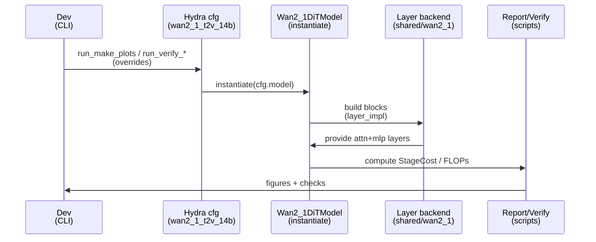

# Plan: Wan2.1 layer implementation switch (shared vs per-model)

## HEADER
- **Purpose**: Add a safe, config-driven switch for Wan2.1 analytic sublayer implementations so the model can use maintained shared primitives in `extern/modelmeter/layers/` by default while preserving the existing per-model wrappers as an option.
- **Status**: Done
- **Date**: 2026-01-19
- **Last updated**: 2026-01-19
- **Completed**: 2026-01-19
- **Dependencies**:
  - extern/modelmeter/models/wan2_1/layers/transformer/wan2_1_attention.py
  - extern/modelmeter/models/wan2_1/layers/transformer/wan2_1_mlp.py
  - extern/modelmeter/models/wan2_1/layers/transformer/wan2_1_transformer_block.py
  - extern/modelmeter/models/wan2_1/layers/core/wan2_1_dit_model.py
  - extern/modelmeter/layers/self_attn.py
  - extern/modelmeter/layers/mlp.py
  - extern/modelmeter/models/wan2_1/configs/transformer/wan2_1_dit.yaml
  - extern/modelmeter/models/wan2_1/configs/model/wan2_1_root.yaml
  - extern/modelmeter/models/wan2_1/scripts/verify/run_verify_layers.py
  - extern/modelmeter/models/wan2_1/scripts/verify/run_verify_end2end.py
  - extern/modelmeter/models/wan2_1/scripts/reporting/run_make_plots.py
- **Target**: ModelMeter maintainers and Wan2.1 analytic model contributors

---

## 1. Purpose and Outcome

The Wan2.1 analytic model currently has per-model transformer wrappers (attention/MLP/block/core) that wrap shared primitives like `SelfAttention` and `Mlp`.

Success means:

- The Wan2.1 analytic model can be configured to use either:
  - **Per-model wrappers** (status quo): `Wan2_1Attention` / `Wan2_1MLP` inside `Wan2_1TransformerBlock`.
  - **Shared primitives**: `modelmeter.layers.SelfAttention` / `modelmeter.layers.Mlp` (plus minimal Wan2.1-specific glue for diffusion-step scaling and the `need_cache_kv=False` semantics).
- Switching backends is a single Hydra config override (no code changes).
- Both backends produce equivalent metrics within tolerance for:
  - Per-layer FLOPs (attn, MLP, block).
  - End-to-end FLOPs (num_layers × num_inference_steps).
  - StageCost fields (FLOPs, I/O, weights, activations, KV cache).
- Verification and plotting scripts can be run for either backend and produce the same plots/numbers (up to floating-point formatting).

## 2. Implementation Approach

### 2.0 Inventory: Wan2.1 wrappers that have shared equivalents

Based on the current Wan2.1 source, the following Wan2.1 model-specific layers are thin wrappers over shared primitives in `extern/modelmeter/layers/` and can switch to shared implementations.

- Wan2.1 layers that can use a shared layer implementation directly:
  - `models/wan2_1/layers/transformer/wan2_1_attention.py::Wan2_1Attention` → `layers/self_attn.py::SelfAttention`
    - Wan2.1 already constructs `SelfAttention` with `attention_type="mha"`, `num_kv_heads=num_heads`, `qk_norm=False`, and `need_cache_kv=False`.
    - The shared backend must keep these settings, and keep the same diffusion-step scaling semantics (FLOPs + I/O scaled by `num_inference_steps`; memory footprints are per-step peak).
  - `models/wan2_1/layers/transformer/wan2_1_mlp.py::Wan2_1MLP` → `layers/mlp.py::Mlp`
    - Wan2.1 already constructs `Mlp` with `act_fn="GELUExact"` and the same `useBias` / `bits`.
    - The shared backend must keep the same diffusion-step scaling semantics (FLOPs + I/O scaled by `num_inference_steps`; memory footprints are per-step peak).

- Wan2.1 layers without a single shared equivalent (remain model-specific, but can be composed from shared primitives):
  - `models/wan2_1/layers/transformer/wan2_1_transformer_block.py::Wan2_1TransformerBlock` has no shared “TransformerBlock” in `extern/modelmeter/layers/`; the shared backend is a composition of shared `SelfAttention` + shared `Mlp` plus an aggregation wrapper.
  - `models/wan2_1/layers/core/wan2_1_dit_model.py::Wan2_1DiTModel` has no shared “DiT core”; the diffusion-core stack remains model-specific; only its internal block/leaf layers can switch.
  - `models/wan2_1/layers/geometry.py` is token-geometry math (not an analytic NN layer), so it stays model-specific.

### 2.1 High-level flow

1. Inventory Wan2.1 sublayers and identify maintained shared equivalents in `extern/modelmeter/layers/` (expected: `SelfAttention`, `Mlp`, `Linear`, activation layers).
2. Add a **backend selector** to config (e.g., `transformer.layer_impl: shared|wan2_1`) and thread it through `Wan2_1DiTModel.from_config → Wan2_1TransformerBlock.from_config`.
3. Implement a small, generic adapter for diffusion-step scaling (multiply FLOPs and I/O by `num_inference_steps` while keeping memory footprints “per-step peak” semantics).
4. In `shared` mode, instantiate `SelfAttention` and `Mlp` directly (configured to match Wan2.1 semantics, especially `need_cache_kv=False`) and wrap them in the scaling adapter.
5. In `wan2_1` mode, keep the current behavior using `Wan2_1Attention` / `Wan2_1MLP`.
6. Add tests/verification hooks to ensure both backends remain equivalent and safe to switch.

### 2.2 Sequence diagram (steady-state usage)

## 3. Files to Modify or Add

- **extern/modelmeter/models/wan2_1/configs/transformer/wan2_1_dit.yaml**: Add `layer_impl` (or similar) with default (decision pending).
- **extern/modelmeter/models/wan2_1/configs/model/wan2_1_root.yaml**: Thread `layer_impl` into `_target_` factory args.
- **extern/modelmeter/models/wan2_1/layers/transformer/wan2_1_transformer_block.py**: Choose between per-model and shared sublayers based on `layer_impl`.
- **extern/modelmeter/models/wan2_1/layers/core/wan2_1_dit_model.py**: Pass `layer_impl` to blocks (and optionally expose it for reporting).
- **extern/modelmeter/models/wan2_1/layers/transformer/wan2_1_attention.py** and **extern/modelmeter/models/wan2_1/layers/transformer/wan2_1_mlp.py**: Keep as the per-model backend; potentially refactor to share adapter logic if needed.
- **extern/modelmeter/models/wan2_1/layers/transformer/<new_adapter>.py** or **extern/modelmeter/models/common/<new_adapter>.py**: Add a small “repeat-steps scaling adapter” that wraps any `BaseLayer`-like object.
- **extern/modelmeter/models/wan2_1/scripts/verify/*.py**: Add `--layer-impl` CLI flag (or accept Hydra override) to run verification against either backend.
- **extern/modelmeter/models/wan2_1/scripts/reporting/run_make_plots.py**: Add a knob to generate plots for either backend (and optionally generate both sets for side-by-side comparison).
- **tests/** (repo root) or **extern/modelmeter/models/wan2_1/scripts/verify/**: Add regression coverage that ensures the two backends match on representative workloads.

## 4. TODOs (Implementation Steps)

- [ ] **Confirm scope + default** Decide whether `shared` becomes the default backend or whether we keep `wan2_1` as default and recommend `shared` explicitly; document rationale in configs.
- [ ] **Add config selector** Add `transformer.layer_impl: shared|wan2_1` and plumb it into `Wan2_1DiTModel.from_config` and `Wan2_1TransformerBlock.from_config`.
- [ ] **Implement scaling adapter** Create a small wrapper that scales FLOPs and I/O by `num_inference_steps` while leaving memory footprints unchanged (weights/activations/KV are “per-step peak” semantics).
- [ ] **Wire shared backend** Implement `shared` mode in the transformer block using `SelfAttention` + `Mlp` (with `need_cache_kv=False`) wrapped by the scaling adapter.
- [ ] **Preserve per-model backend** Keep existing Wan2.1 wrappers as `wan2_1` mode; ensure behavior remains unchanged.
- [ ] **Verification coverage** Update verification scripts (and/or add unit/integration tests) to run both backends on `wan2-1-ci-tiny` and one larger workload, enforcing a small relative error between backends.
- [ ] **Plot/report support** Update the plot generator to accept `--layer-impl` (or Hydra override) and record which backend produced each figure set.
- [ ] **Docs** Update Wan2.1 reports/docs to mention the backend switch and how to select it via overrides.
