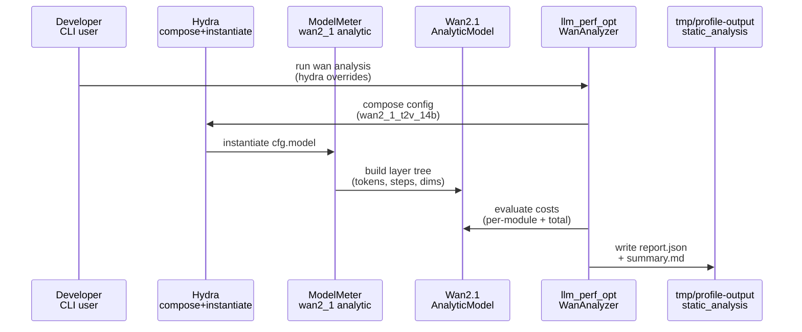

# Plan: Wan2.1 Analytic Model (ModelMeter-style)

## HEADER
- **Purpose**: Implement a DeepSeek-OCR-style analytic model for Wan2.1 (starting with Wan2.1-T2V-14B) using ModelMeter `BaseLayer` + `StageCostMixin`, with Hydra configs and reusable analytic report data models.
- **Status**: Draft
- **Date**: 2026-01-16
- **Dependencies**:
  - extern/modelmeter/models/deepseek_ocr/layers/core/deepseek_ocr_model.py
  - extern/modelmeter/models/deepseek_ocr/configs/deepseek_ocr.yaml
  - extern/modelmeter/models/common/stage_cost.py
  - src/llm_perf_opt/runners/dsocr_analyzer.py
  - src/llm_perf_opt/data/deepseek_ocr_analytic.py
  - models/wan2.1-t2v-14b/source-data/config.json
- **Target**: Developers implementing analytic performance models and Stage-1/Stage-2 profiling integrations.

---

## 1. Purpose and Outcome

Implement a first-class analytic model for Wan2.1 that mirrors the DeepSeek-OCR analytic approach: composable `BaseLayer` modules, Hydra-driven configs, and structured report artifacts. Success looks like:

- A `modelmeter.models.wan2_1` package that can instantiate an analytic Wan2.1-T2V-14B model via Hydra and return consistent FLOPs/I/O/memory estimates for representative workloads.
- Shared analytic report data structures that are reusable across DeepSeek-OCR and Wan2.1, minimizing duplicate schema code while allowing model-specific extensions.
- A lightweight “analysis runner” (initially analogous to `DeepseekOCRStaticAnalyzer`, but Wan-focused) that produces a `*.json` report and optional Markdown summaries under `tmp/profile-output/<run_id>/static_analysis/`.
- A verification strategy that checks internal invariants (shape math, scaling with resolution/frames/steps) and (optionally) compares selected submodule FLOPs against a PyTorch reference when feasible.

Assumptions (explicit, revise as needed):

- v1 targets Wan2.1-T2V-14B “diffusion transformer” core (DiT-like blocks) as the primary cost driver, with optional modeling of text encoder and VAE encode/decode as coarse-grained layers.
- Workload knobs we support in v1: `num_frames`, `height`, `width`, `num_inference_steps`, `text_len` (default 512 from `config.json`), and batch size.
- Wan diffusion does not use KV-cache in the LLM sense; any attention caching is either absent or not modeled (KV memory should be 0 for the diffusion blocks in the analytic model).

## 2. Implementation Approach

### 2.1 High-level flow

1. Introduce a new ModelMeter analytic package `extern/modelmeter/models/wan2_1/` that mirrors the DeepSeek-OCR structure: `layers/`, `configs/`, and `scripts/verify/`.
2. Create a small set of analytic layers that capture Wan2.1 compute structure with existing ModelMeter layer primitives wherever possible (e.g., `Linear`, `SelfAttention`, `RMSNorm`), adding Wan-specific layers only when necessary to model missing behaviors (e.g., modulation/AdaLN variants, video tokenization geometry).
3. Define Hydra configs under `extern/modelmeter/models/wan2_1/configs/` with groups similar to DeepSeek-OCR: `hf/` (architecture metadata), `runtime/` (workload knobs), `transformer/` (block prototype + depth), `text_encoder/`, `vae/`, and `model/` (root aggregator).
4. Refactor analytic report data models into shared modules so both DeepSeek-OCR and Wan2.1 reuse the same `AnalyticModuleNode`, `OperatorCategory`, `ModuleMetricsSnapshot`, `OperatorMetrics`, and `TargetOperatorList` types; keep model-specific `ModelSpec` and `WorkloadProfile` types separate.
5. Add a Wan-focused analyzer entrypoint in `src/llm_perf_opt/runners/` that instantiates the Wan analytic model, traverses its module tree, emits a structured report, and optionally writes a short Markdown summary (mirroring the output conventions of DeepSeek-OCR static analysis).

### 2.2 Sequence diagram (steady-state usage)

## 3. Files to Modify or Add

- **extern/modelmeter/models/wan2_1/__init__.py** add package exports and config-root helpers (mirrors deepseek_ocr).
- **extern/modelmeter/models/wan2_1/layers/** new analytic layers for Wan components (root aggregator, transformer block, optional text encoder and VAE coarse layers).
- **extern/modelmeter/models/wan2_1/configs/** Hydra config root for Wan2.1 analytic model composition (entry config + config groups).
- **extern/modelmeter/models/__init__.py** export Wan model(s) if we want them importable from `modelmeter.models` (optional, consistent with other models).
- **src/llm_perf_opt/data/analytic_common.py** new shared analytic data models extracted from `deepseek_ocr_analytic.py`.
- **src/llm_perf_opt/data/deepseek_ocr_analytic.py** refactor to import shared types from `analytic_common.py` (API-compatible re-exports as needed).
- **src/llm_perf_opt/data/wan2_1_analytic.py** Wan-specific `ModelSpec` and `WorkloadProfile` plus `AnalyticModelReport` specialization using shared node/metric types.
- **src/llm_perf_opt/runners/wan2_1_analyzer.py** new runner that instantiates Wan analytic model and writes artifacts under `static_analysis/`.
- **tests/unit/** add unit tests for Wan analytic geometry and scaling behavior, plus tests covering shared analytic data models migration.
- **docs/** (optional) short how-to for running Wan analytic analysis (similar to DeepSeek-OCR docs/hints).

## 4. TODOs (Implementation Steps)

- [ ] **Define Wan2.1 scope v1** decide which submodules are modeled explicitly (DiT only vs DiT+T5+VAE), and pick 1–2 representative workloads (e.g., 480p 16 frames, 720p 16 frames).
- [ ] **Add shared analytic data models** create `src/llm_perf_opt/data/analytic_common.py` containing reusable classes currently in `deepseek_ocr_analytic.py` (nodes, categories, metrics, operator lists) and refactor DeepSeek-OCR code to use it.
- [ ] **Create Wan model spec/workload models** add `src/llm_perf_opt/data/wan2_1_analytic.py` with `Wan2_1ModelSpec` and `Wan2_1WorkloadProfile`, reusing shared report types.
- [ ] **Implement Wan token geometry helper** implement a single “video token count” helper (frames, H, W, patch/latent downsample assumptions) with documented defaults and unit tests for correctness and monotonicity.
- [ ] **Implement Wan analytic layers (minimal set)** create `extern/modelmeter/models/wan2_1/layers/`:
  - Root aggregator layer (`Wan2_1T2VModel`) using `StageCostMixin` and composing sublayers.
  - Transformer block prototype layer(s) modeling per-layer attention and FFN using existing primitives (`SelfAttention`, `Linear`, `RMSNorm`, optional modulation layer).
  - Step-scaling wrapper for diffusion iterations (total cost = per-step cost × `num_inference_steps`; memory should not scale with steps).
- [ ] **Hydra configs for Wan2.1** add `extern/modelmeter/models/wan2_1/configs/wan2_1_t2v_14b.yaml` and group files (`hf/`, `runtime/`, `transformer/`, `model/`), mirroring DeepSeek-OCR config style.
- [ ] **Wan analyzer runner** add `src/llm_perf_opt/runners/wan2_1_analyzer.py` to instantiate the analytic model via Hydra, traverse submodules, and write `report.json` + (optional) `summary.md` under `tmp/profile-output/<run_id>/static_analysis/wan2_1/`.
- [ ] **Verification hooks (v1)** implement internal checks:
  - Costs are non-negative and finite.
  - FLOPs and I/O scale linearly with `num_inference_steps`.
  - FLOPs scale with token count and layer count as expected.
  - KV-cache memory is 0 (or explicitly justified) for diffusion blocks.
- [ ] **Optional reference verification** if the local Wan codebase provides an importable PyTorch module for the DiT block, add a small verify script under `extern/modelmeter/models/wan2_1/scripts/verify/` that compares analytic FLOPs against `torch.utils.flop_counter` on a tiny shape (guarded/skipped when unavailable).
- [ ] **Unit tests** add deterministic tests under `tests/unit/` for geometry helpers, scaling invariants, and report serialization.
- [ ] **Docs** add a brief usage note (where to set `LLM_MODELS_ROOT`, how to run the Wan analyzer, where outputs land).

