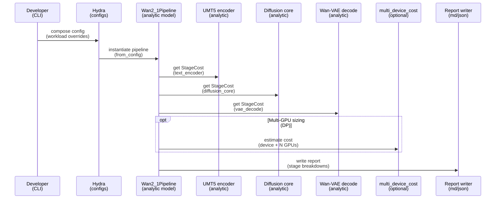

# Plan: Wan2.1 full pipeline analytic model (UMT5 + DiT + Wan-VAE)

## HEADER
- **Purpose**: Extend the existing Wan2.1 analytic model from “diffusion transformer core only” to an end-to-end T2V pipeline that also accounts for the UMT5‑XXL text encoder and the Wan‑VAE decode path, with config knobs, verification, and reports for hardware sizing.
- **Status**: Draft
- **Date**: 2026-01-22
- **Dependencies**:
  - extern/modelmeter/models/wan2_1/layers/core/wan2_1_dit_model.py
  - extern/modelmeter/models/wan2_1/layers/geometry.py
  - extern/modelmeter/models/wan2_1/configs/wan2_1_t2v_14b.yaml
  - extern/modelmeter/models/wan2_1/docs/wan2-1-architecture-and-ops.md
  - extern/modelmeter/models/multi_device_cost.py
  - models/wan2.1-t2v-14b/source-data/config.json
  - models/wan2.1-t2v-14b/source-data/Wan2.1_VAE.pth
  - models/wan2.1-t2v-14b/source-data/models_t5_umt5-xxl-enc-bf16.pth
  - models/wan2.1-t2v-14b/source-data/google/umt5-xxl/
- **Target**: ModelMeter maintainers, Wan2.1 analytic model contributors, and llm-perf-opt users doing hardware sizing.

---

## 1. Purpose and Outcome
Today the Wan2.1 analytic model (`modelmeter.models.wan2_1`) estimates only the diffusion transformer core (DiT stack) and uses simplified assumptions (global self-attention, no cross-attention, no VAE/text encoder).
This plan expands the scope to include the two major non-core components used by the official weights in `models/wan2.1-t2v-14b/source-data`: the UMT5‑XXL text encoder and the Wan‑VAE decode stage.

Success looks like:
- A new end-to-end pipeline analytic layer that can output per-stage and total `StageCost` for: `text_encoder`, `diffusion_core`, and `vae_decode` (and optionally `vae_encode` for I2V scenarios).
- Hydra configs that let users pick workloads beyond presets (e.g., 1080p/4k, >16 frames, different step counts) while clearly warning about extrapolation risks when model assumptions differ (e.g., windowed/factorized attention).
- Verification scripts that validate FLOP conventions (GEMM/matmul counted like `FlopCounterMode`) for the text encoder and VAE submodules using small reference shapes, plus internal invariants that stage totals sum correctly.
- Updated reporting/plot scripts and docs to make full-pipeline hardware sizing straightforward, including DP multi-GPU estimates via `multi_device_cost(...)`.

Non-goals for v1 (explicitly deferred unless needed):
- Exact modeling of Wan2.1 cross-attention in the diffusion blocks (requires a cross-attention analytic primitive that handles `query_len != kv_len` projections correctly).
- Exact modeling of vendor-specific fused kernels or runtime scheduling/overlap; the cost model remains a first-order bottleneck estimator.

## 2. Implementation Approach

### 2.1 High-level flow
1. Extract architecture metadata for UMT5‑XXL encoder and Wan‑VAE from local weight files and/or trusted configs without committing any large artifacts.
2. Implement an analytic UMT5 encoder layer (encoder-only) using existing shared primitives (`SelfAttention`, `Mlp`, `RMSNorm`, `Embedding`) and a block-repetition wrapper.
3. Implement an analytic Wan‑VAE decode layer using existing conv primitives (`Conv3d`/`Conv2d`) and lightweight wrappers for residual blocks/upsample/downsample patterns as needed.
4. Add a Wan2.1 pipeline root analytic layer that composes: `text_encoder + diffusion_core + vae_decode`, exposes per-stage breakdowns, and aggregates totals.
5. Add Hydra config groups for `text_encoder` and `vae`, and introduce a new pipeline config entrypoint that does not break the existing diffusion-core-only verification scripts.
6. Add verification scripts (small meta-tensor references) and unit tests for invariants (stage-sum consistency, monotonic scaling with resolution/frames/steps).
7. Extend reporting scripts to plot stage-wise contributions and expose a “hardware sizing” workflow (single GPU + DP multi-GPU).

### 2.2 Sequence diagram (steady-state usage)

## 3. Files to Modify or Add
- **extern/modelmeter/models/wan2_1/layers/text_encoder/** add UMT5 encoder analytic layers (embedding, encoder block, encoder model wrapper).
- **extern/modelmeter/models/wan2_1/layers/vae/** add Wan‑VAE analytic layers (decode-only v1; optional encode later).
- **extern/modelmeter/models/wan2_1/layers/core/wan2_1_pipeline_model.py** add pipeline aggregator (per-stage + total).
- **extern/modelmeter/models/wan2_1/layers/core/__init__.py** export pipeline model.
- **extern/modelmeter/models/wan2_1/configs/text_encoder/** new Hydra group (UMT5‑XXL encoder params + bits).
- **extern/modelmeter/models/wan2_1/configs/vae/** new Hydra group (Wan‑VAE params, spatial/temporal factors, bits).
- **extern/modelmeter/models/wan2_1/configs/model/** add a new root config for pipeline instantiation (keep existing `wan2_1_root.yaml` for diffusion-core-only).
- **extern/modelmeter/models/wan2_1/scripts/verify/** add `run_verify_text_encoder.py`, `run_verify_vae_decode.py`, `run_verify_pipeline_invariants.py`.
- **extern/modelmeter/models/wan2_1/scripts/reporting/** extend plots to include stage breakdown curves (text vs diffusion vs VAE).
- **extern/modelmeter/models/wan2_1/docs/** update architecture doc to include explicit “modeled vs unmodeled” sections for text encoder and VAE.
- **extern/modelmeter/models/wan2_1/docs/hints/** update hardware sizing hint to reference the new full-pipeline entrypoint and warn about extrapolation.
- **tests/unit/wan2_1/** add unit tests for geometry and stage aggregation invariants for a few representative workloads (including 1080p/4k shapes as “formula only”, not torch reference).
- **src/llm_perf_opt/runners/wan2_1_analyzer.py** (optional) include text encoder + VAE nodes in the static analysis report tree when pipeline mode is enabled.

## 4. TODOs (Implementation Steps)
- [ ] **Confirm scope and stage boundaries** decide what “full pipeline” includes for T2V (text encoder once, diffusion core across steps, VAE decode once) and which components remain out-of-scope (scheduler, prompt extension, cross-attn).
- [ ] **Extract UMT5 encoder hyperparameters** add a small inspection script that reads `models_t5_umt5-xxl-enc-bf16.pth` state dict shapes (no commit) and writes a minimal local config summary (d_model, layers, heads, d_ff, vocab) for use in Hydra.
- [ ] **Extract Wan‑VAE hyperparameters** add a small inspection script that reads `Wan2.1_VAE.pth` state dict keys/shapes (no commit) to infer spatial/temporal downsample factors and major conv/resblock structure used in decode.
- [ ] **Implement `Wan2_1TextEncoder` analytic layer** compose shared primitives into an encoder-only transformer stack parameterized by `text_len`, with FLOP conventions aligned to `FlopCounterMode`.
- [ ] **Implement `Wan2_1VaeDecode` analytic layer** model the decode path as a sequence of conv blocks (3D/2D as appropriate) and upsampling stages that map `(B, F_lat, C_lat, H_lat, W_lat)` to `(B, F_out, 3, H_px, W_px)`.
- [ ] **Implement pipeline aggregator layer** create `Wan2_1PipelineModel` that holds child layers, exposes per-stage `StageCost`, and provides total forward metrics via sums/maxes consistent with existing conventions.
- [ ] **Add Hydra config groups** introduce `configs/text_encoder/*` and `configs/vae/*`, plus a new pipeline entry config that instantiates the pipeline without breaking the existing `wan2_1_t2v_14b` verification flow.
- [ ] **Add verification scripts** add torch-meta verification for text encoder FLOPs on small shapes; add VAE decode sanity checks (torch conv reference if feasible, otherwise formula cross-checks); add pipeline invariants (sum of stages equals total).
- [ ] **Add unit tests** cover stage aggregation, monotonic scaling with resolution/frames/steps, and stable behavior for arbitrary workloads (no torch-heavy runs for 4k).
- [ ] **Update reporting/plots** extend the plot report to include stage-wise curves and an end-to-end total curve (and optionally DP multi-GPU “time” estimates using `multi_device_cost`).
- [ ] **Update docs and hints** document the new pipeline model, how to run verification, and the limitations (especially cross-attn and attention pattern assumptions).
