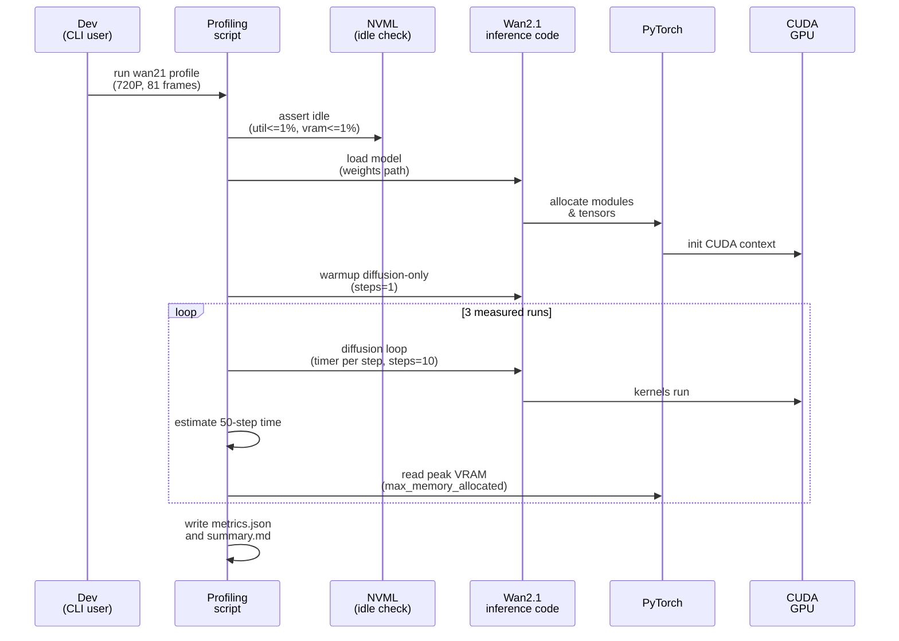

# Plan: Wan2.1 Runtime Profiling Harness

## HEADER
- Purpose: Implement a reproducible runtime profiling harness for Wan2.1-T2V-14B (FP16) that profiles diffusion-only performance for 10 steps, and extrapolates an estimated 50-step diffusion time per the requirements in `context/tasks/working/task-wan21-profiling-requirements.md`.
- Status: In progress (diffusion-only timing + extrapolation implemented; extending FLOP-derived TFLOP/s and stage coverage)
- Date: 2026-01-29
- Dependencies:
  - `context/tasks/working/task-wan21-profiling-requirements.md`
  - `models/wan2.1-t2v-14b/source-data/README.md`
  - `.env`
  - `extern/github/README.md`
  - `src/llm_perf_opt/profiling/hw.py` (NVML helpers pattern)
  - `docs/running.md` (general profiling outputs conventions)
- Target: Developers and agents implementing and running Wan2.1 profiling runs on a multi-GPU machine.

---

## 1. Purpose and Outcome
This plan implements an in-repo way to profile Wan2.1-T2V-14B runtime performance for the specific workload constraints defined in `context/tasks/working/task-wan21-profiling-requirements.md` (1280x720, 81 frames, prompt >= 200 words) by running diffusion-only for 10 steps (FP16), timing each step, and extrapolating an estimated 50-step diffusion time.
Success looks like a single command that creates a timestamped experiment directory under `tmp/wan21-profiling-<time>-fp16/` and produces machine-readable metrics (JSON) plus a short human summary (Markdown) without including disk IO in the timed regions.
Additionally, we capture stage-level FLOP-derived throughput (TFLOP/s) for text encoder, diffusion, VAE decode, and end-to-end (reporting TFLOP/s only, not raw FLOP counts).

Key outputs:
- `tmp/wan21-profiling-<time>-fp16/reports/metrics.json` (per-run and aggregated metrics, including extrapolated 50-step estimate)
- `tmp/wan21-profiling-<time>-fp16/reports/summary.md` (one-page summary of the run)
- `tmp/wan21-profiling-<time>-fp16/reports/run_args.json` (argv + key env vars for reproducibility)
- Optional: `tmp/wan21-profiling-<time>-fp16/outputs/` artifacts written after timing stops (if we later add a post-profile decode/save)

Target entrypoint (FP16 diffusion-only):
- `pixi run python scripts/wan2_1/wan21_profile.py --cuda-visible-devices 6,7 --wait-idle-s 600 --steps 10 --estimate-steps 50 --warmup-steps 1 --runs 3 --out-dir tmp/wan21-profiling-<time>-fp16/`

## 2. Implementation Approach

### 2.1 High-level flow
1. Ensure the Wan2.1 inference source code is available locally under `extern/github/wan2.1/` (currently expected as a machine-local clone; decide later if it should be a submodule vs symlink).
2. Create an experiment directory `tmp/wan21-profiling-<time>-fp16/` with `scripts/`, `inputs/`, `outputs/`, `reports/`.
3. Pre-run GPU idleness check for the target GPUs (utilization and VRAM usage <= 1%) and wait/fail fast if not idle (implemented via NVML; only runs when `CUDA_VISIBLE_DEVICES` is a comma-separated list of integer physical GPU indices).
4. Configure FP16 execution (set autocast dtype to FP16; record any upstream mixed-precision overrides).
5. Load the model once, pinning devices via `.env` (`CUDA_VISIBLE_DEVICES=6,7`) and selecting the correct runtime device(s).
6. Run warmup: diffusion-only with steps=1 (no timing recorded).
7. Run 3 measured diffusion-only runs with steps=10, recording:
   - Per-diffusion-step timings (ms) and 10-step diffusion total (ms)
   - Extrapolated 50-step diffusion estimate (ms) computed from the 10-step data
   - Peak VRAM used during diffusion-only execution
8. Persist results to `reports/metrics.json` and `reports/summary.md`.

### 2.2 Measurement and instrumentation details
- Timing: use CUDA events to time each diffusion step; ensure timers stop before any output serialization or file writes.
- Per-step diffusion timing: instrument the diffusion loop so each step is timed independently and stored as an array, plus a computed 10-step diffusion total.
- Extrapolation: estimate 50-step diffusion time using a documented formula (current implementation: `sum(step_ms) * (estimate_steps / profile_steps)`); optionally also record alternative estimates (e.g., mean of steps 3..10 to reduce warmup effects).
- Peak VRAM: reset and read `torch.cuda.reset_peak_memory_stats()` / `torch.cuda.max_memory_allocated()` per run; also record per-device peaks if multiple visible devices are used.
- FLOPs / TFLOP/s: collect FLOP estimates via `torch.utils.flop_counter.FlopCounterMode` and compute TFLOP/s as `FLOPs / seconds / 1e12` for text encoder, diffusion (1 step, cond+uncond forward only), VAE decode, and end-to-end (scaled to estimate_steps for diffusion).
- Optional timeline profiling: add NVTX ranges for stages and diffusion steps so Nsight Systems can capture stage ranges consistently (even if stage timings are also recorded in-process).

### 2.3 Sequence diagram (steady-state usage)

## 3. Files to Modify or Add
- `context/tasks/working/task-wan21-profiling-requirements.md` add any missing measurement clarifications discovered during implementation (only when needed).
- `context/plans/plan-wan21-profiling.md` this plan.
- `extern/github/wan2.1/` upstream Wan2.1 inference code (currently a local clone; decide submodule vs symlink; do not commit weights into git).
- `scripts/wan2_1/wan21_profile.py` main entrypoint that creates `tmp/wan21-profiling-<time>-fp16/` (recommended via `--out-dir`) and runs warmup + measured diffusion-only runs + extrapolation.
- `scripts/wan2_1/gpu_idle_check.py` NVML-based idleness check helper (called by `wan21_profile.py` via `--wait-idle-s`).
- `scripts/wan2_1/metrics_schema.py` small helper for the JSON schema (dataclasses + JSON serialization) to keep output stable.
- `docs/running.md` add a short Wan2.1 runtime profiling snippet once the script exists and is validated.
- `pyproject.toml` add a `pixi` task (e.g., `wan21-profile`) if it improves repeatability.

## 4. TODOs (Implementation Steps)
- [x] **Confirm upstream inference entrypoint** `scripts/wan2_1/wan21_profile.py` imports `wan.WanT2V` from `extern/github/wan2.1/` and reuses upstream configs/schedulers to generate 1280x720, 81-frame videos.
- [ ] **Decide upstream code integration mode** Convert `extern/github/wan2.1/` into a submodule or a documented symlink; ensure it stays out of normal `ruff/mypy` scope and no large artifacts are committed.
- [x] **Define a canonical prompt input** Default prompt is >=200 words; supports `--prompt-file`; enforces `>=200` words and writes `inputs/prompt.txt` for the run record.
- [x] **Implement experiment dir creation** Creates `tmp/wan21-profiling-<time>/{scripts,inputs,outputs,reports}/` by default; use `--out-dir tmp/wan21-profiling-<time>-fp16/` for the FP16 diffusion-only runs; writes `reports/run_args.json`.
- [x] **Implement GPU idle precheck** NVML-based check (util<=1%, mem<=1%) before importing torch/CUDA; supports waiting via `--wait-idle-s`; skips if no integer GPU ids are resolvable from `CUDA_VISIBLE_DEVICES`.
- [x] **Switch to diffusion-only profiling** Skip VAE decode in the profiled path; keep diffusion loop intact.
- [x] **Implement per-step diffusion timing** Record per-step CUDA event timings (ms) for 10 steps and a 10-step total.
- [x] **Implement 50-step extrapolation** Compute an estimated 50-step diffusion time from the 10-step timings and record the formula/inputs.
- [x] **Implement peak VRAM recording** Resets peak stats per run and records per-visible-device allocated/reserved peaks.
- [x] **Persist results** Writes `reports/metrics.json` and `reports/summary.md`.
- [x] **Run diffusion-only profile** Run the FP16 diffusion-only profiling command and validate outputs and extrapolated estimate fields.
- [ ] **Add stage FLOP collection** Collect FLOPs for text encoder, diffusion (1 step cond+uncond forward only), and VAE decode; compute TFLOP/s per stage and end-to-end in the report.
- [ ] **Optional output artifact** Save one generated video to `outputs/` after timing stops for sanity (keep saving fully outside timed regions).
- [ ] **Optional NVTX ranges** Add NVTX ranges for stage boundaries and diffusion steps to support Nsight Systems correlation.
- [ ] **Doc + Pixi task** Add a `pixi` task (e.g., `wan21-profile`) and a short `docs/running.md` snippet showing the canonical command + expected outputs.
