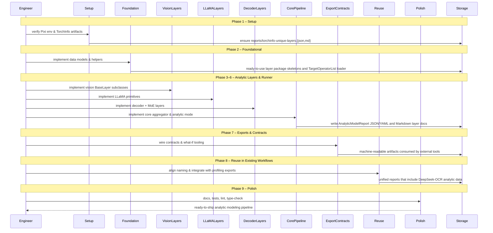
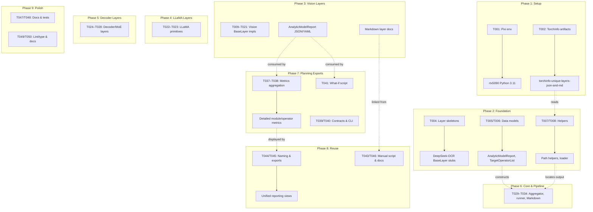

# Phase Integration Guide: DeepSeek-OCR Analytic Modeling in ModelMeter

**Feature**: `001-deepseek-ocr-modelmeter` | **Phases**: 9

## Overview

This feature adds a theoretical analytic modeling pipeline for DeepSeek-OCR on top of existing profiling workflows. Phases 1–2 establish environment, artifacts, and core data models; Phases 3–6 implement analytic layers and a runner by module (vision, LLaMA, decoder, core) and emit JSON/YAML plus Markdown docs; Phase 7 exposes machine-readable exports and contracts for capacity planning; Phase 8 aligns abstractions with existing profiling pipelines; and Phase 9 hardens quality via documentation, tests, and tooling.

## Phase Flow

## Artifact Flow Between Phases

## References

- Phase guides:
  - `context/tasks/001-deepseek-ocr-modelmeter/impl-phase-1-setup.md`
  - `context/tasks/001-deepseek-ocr-modelmeter/impl-phase-2-foundational.md`
  - `context/tasks/001-deepseek-ocr-modelmeter/impl-phase-3-vision.md`
  - `context/tasks/001-deepseek-ocr-modelmeter/impl-phase-4-llama.md`
  - `context/tasks/001-deepseek-ocr-modelmeter/impl-phase-5-decoder.md`
  - `context/tasks/001-deepseek-ocr-modelmeter/impl-phase-6-core.md`
  - `context/tasks/001-deepseek-ocr-modelmeter/impl-phase-7-us2.md`
  - `context/tasks/001-deepseek-ocr-modelmeter/impl-phase-8-us3.md`
  - `context/tasks/001-deepseek-ocr-modelmeter/impl-phase-9-polish.md`
- Spec: `specs/001-deepseek-ocr-modelmeter/spec.md`
- Data model: `specs/001-deepseek-ocr-modelmeter/data-model.md`
- Contracts: `specs/001-deepseek-ocr-modelmeter/contracts/`
