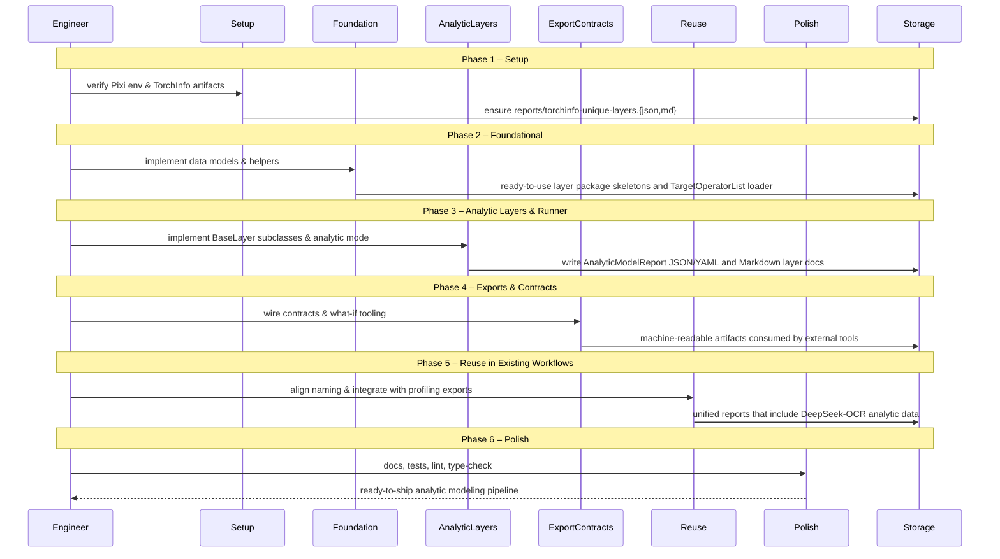

# Phase Integration Guide: DeepSeek-OCR Analytic Modeling in ModelMeter

**Feature**: `001-deepseek-ocr-modelmeter` | **Phases**: 6

## Overview

This feature adds a theoretical analytic modeling pipeline for DeepSeek-OCR on top of existing profiling workflows. Phases 1–2 establish environment, artifacts, and core data models; Phase 3 implements analytic layers and a runner that emit JSON/YAML plus Markdown docs; Phase 4 exposes machine-readable exports and contracts for capacity planning; Phase 5 aligns abstractions with existing profiling pipelines; and Phase 6 hardens quality via documentation, tests, and tooling.

## Phase Flow



## Artifact Flow Between Phases

```mermaid
graph TD
    subgraph Phase1["Phase 1: Setup"]
        P1T1[T001: Pixi env] --> P1A1[rtx5090 Python 3.11]
        P1T2[T002: TorchInfo artifacts] --> P1A2[torchinfo-unique-layers.{json,md}]
    end

    subgraph Phase2["Phase 2: Foundation"]
        P2T1[T004: Layer skeletons] --> P2A1[DeepSeek-OCR BaseLayer stubs]
        P2T2[T005/T006: Data models] --> P2A2[AnalyticModelReport, TargetOperatorList]
        P2T3[T007/T008: Helpers] --> P2A3[Path helpers, loader]
    end

    subgraph Phase3["Phase 3: Analytic Layers"]
        P3T1[T011/T012: Analytic formulas]
        P3T2[T013/T014: Aggregator & runner]
        P3T3[T015: Markdown docs]
        P3A1[AnalyticModelReport JSON/YAML]
        P3A2[Markdown layer docs]
    end

    subgraph Phase4["Phase 4: Planning Exports"]
        P4T1[T019/T020: Metrics aggregation] --> P4A1[Detailed module/operator metrics]
        P4T2[T021/T022: Contracts & CLI]
        P4T3[T023: What-if script]
    end

    subgraph Phase5["Phase 5: Reuse"]
        P5T1[T026/T027: Naming & exports] --> P5A1[Unified reporting views]
        P5T2[T025/T028: Manual script & docs]
    end

    subgraph Phase6["Phase 6: Polish"]
        P6T1[T029/T030: Docs & tests]
        P6T2[T031/T032: Lint/type & docs]
    end

    P1A2 -.->|reads| P2T3
    P2A2 -.->|constructs| P3T2
    P2A3 -.->|locates output| P3T2
    P3A1 -.->|consumed by| P4T1
    P3A1 -.->|consumed by| P4T3
    P3A2 -.->|linked from| P5T2
    P4A1 -.->|displayed by| P5T1
```

## References

- Phase guides:
  - `context/tasks/001-deepseek-ocr-modelmeter/impl-phase-1-setup.md`
  - `context/tasks/001-deepseek-ocr-modelmeter/impl-phase-2-foundational.md`
  - `context/tasks/001-deepseek-ocr-modelmeter/impl-phase-3-us1.md`
  - `context/tasks/001-deepseek-ocr-modelmeter/impl-phase-4-us2.md`
  - `context/tasks/001-deepseek-ocr-modelmeter/impl-phase-5-us3.md`
  - `context/tasks/001-deepseek-ocr-modelmeter/impl-phase-6-polish.md`
- Spec: `specs/001-deepseek-ocr-modelmeter/spec.md`
- Data model: `specs/001-deepseek-ocr-modelmeter/data-model.md`
- Contracts: `specs/001-deepseek-ocr-modelmeter/contracts/`

