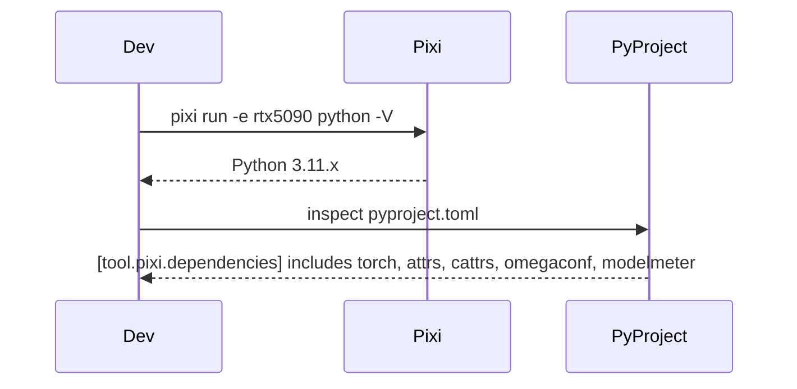
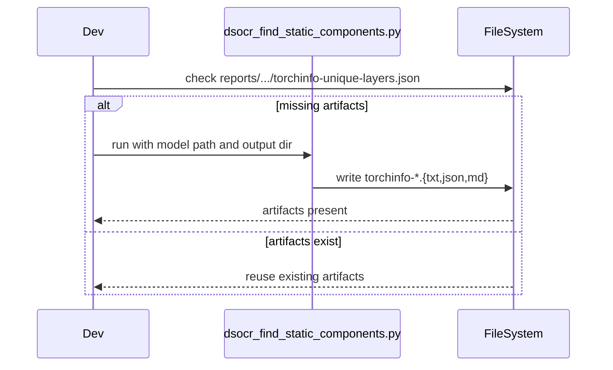
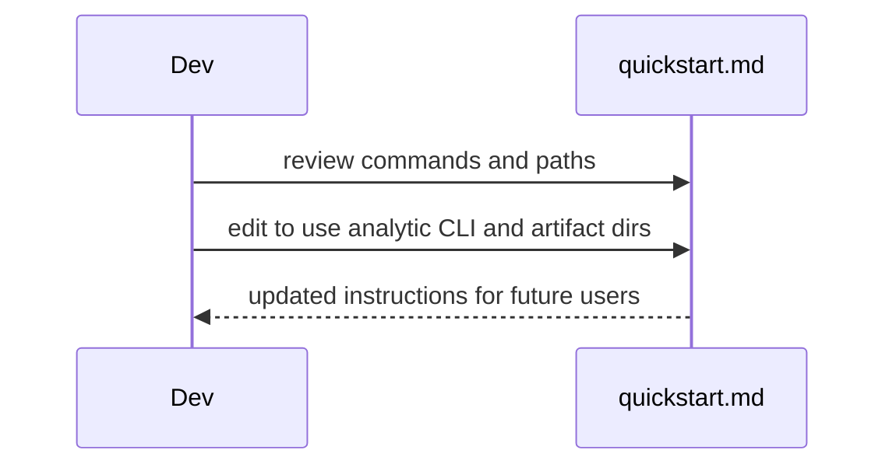
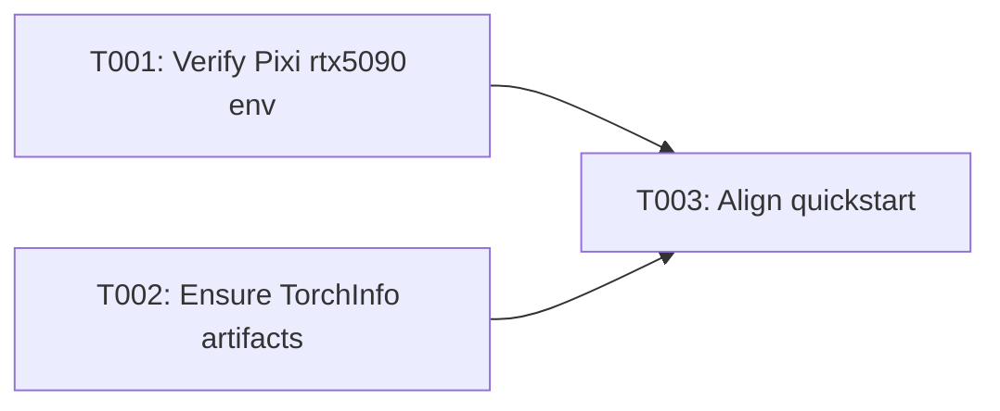

# Implementation Guide: Phase 1 – Setup (Shared Infrastructure)

**Phase**: 1 | **Feature**: DeepSeek-OCR Analytic Modeling in ModelMeter (`001-deepseek-ocr-modelmeter`) | **Tasks**: T001–T003

## Goal

Establish a reproducible local environment and static TorchInfo artifacts so that all later phases can run analytic modeling for DeepSeek-OCR using a consistent Pixi environment and file layout.

## Public APIs

Phase 1 is primarily orchestration; it does not introduce new Python APIs but standardizes how commands are executed.

### T001: Verify Pixi `rtx5090` environment and dependencies in `pyproject.toml`

Ensure the `rtx5090` environment is available and that analytic dependencies are declared so later phases can import them.

**Usage Flow**:



**Pseudocode**:

```bash
cd /workspace/code/llm-perf-opt
pixi run -e rtx5090 python -V  # confirm Python 3.11

# If dependencies are missing from pyproject.toml, add them under [tool.pixi.dependencies]
```

### T002: Confirm or regenerate DeepSeek-OCR TorchInfo static artifacts

Guarantee that TorchInfo static analysis artifacts exist at the expected location for later parsing.

**Usage Flow**:



**Pseudocode**:

```bash
ARTIF_DIR="reports/20211117-dsorc-op-analysis/static-20251118-130533"
if [ ! -f "$ARTIF_DIR/torchinfo-unique-layers.json" ]; then
  pixi run -e rtx5090 python scripts/analytical/dsocr_find_static_components.py \
    --model /workspace/code/llm-perf-opt/models/deepseek-ocr \
    --device cuda:0 \
    --base-size 1024 \
    --image-size 640 \
    --seq-len 512 \
    --crop-mode 1 \
    --output "/workspace/code/llm-perf-opt/$ARTIF_DIR"
fi
```

### T003: Align quickstart with analytic mode and artifact paths

Update `specs/001-deepseek-ocr-modelmeter/quickstart.md` so all examples reference `--mode analytic` and the artifact layout under `tmp/profile-output/<run_id>/static_analysis/analytic_model/`.

**Usage Flow**:



**Pseudocode**:

```bash
# Edit specs/001-deepseek-ocr-modelmeter/quickstart.md
# - Ensure CLI examples use: python -m llm_perf_opt.runners.dsocr_analyzer --mode analytic
# - Ensure output paths reference tmp/profile-output/<run_id>/static_analysis/analytic_model/
```

---

## Phase Integration



Phase 1 does not produce domain objects but establishes:

- A working `rtx5090` environment for running future Python code.
- Stable TorchInfo artifacts at `reports/20211117-dsorc-op-analysis/static-20251118-130533/`.
- Documentation that future developers can follow to reproduce the setup.

---

## Testing

### Test Input

- Repository root: `/workspace/code/llm-perf-opt`
- Pixi environment named `rtx5090` configured with Python 3.11.
- Local DeepSeek-OCR weights under `models/deepseek-ocr` (for regenerating TorchInfo artifacts if needed).

### Test Procedure

```bash
cd /workspace/code/llm-perf-opt

# 1. Verify Pixi env
pixi run -e rtx5090 python -V

# 2. Check TorchInfo artifacts
ls reports/20211117-dsorc-op-analysis/static-20251118-130533/torchinfo-unique-layers.json

# 3. Open quickstart and confirm analytic CLI and artifact paths are documented
$EDITOR specs/001-deepseek-ocr-modelmeter/quickstart.md
```

### Test Output

- `pixi run -e rtx5090 python -V` prints a Python 3.11 version.
- `torchinfo-unique-layers.json` and `torchinfo-unique-layers.md` exist at the expected path.
- `quickstart.md` shows:
  - Correct analytic CLI invocation with `--mode analytic`.
  - Output directories under `tmp/profile-output/<run_id>/static_analysis/analytic_model/`.

---

## References

- Spec: `specs/001-deepseek-ocr-modelmeter/spec.md`
- Data model: `specs/001-deepseek-ocr-modelmeter/data-model.md`
- Contracts: `specs/001-deepseek-ocr-modelmeter/contracts/`

---

## Implementation Summary

### What has been implemented

- Verified `pixi run -e rtx5090 python -V` succeeds (Python >=3.11, currently 3.12.12) and confirmed the `rtx5090` environment is usable for DeepSeek‑OCR analytic work.
- Confirmed analytic dependencies `torch`, `attrs`, `cattrs`, and `omegaconf` are declared in `pyproject.toml` (via `[project].dependencies` and the default CUDA feature); `modelmeter` is provided via the vendored `extern/modelmeter` package rather than a separate PyPI dependency.
- Verified TorchInfo static artifacts already exist under `reports/20211117-dsorc-op-analysis/static-20251118-130533/` (`torchinfo-unique-layers.json` and `torchinfo-unique-layers.md`), so regeneration is not required for this phase.
- Reviewed `specs/001-deepseek-ocr-modelmeter/quickstart.md` and confirmed that the CLI example uses `--mode analytic` and that artifact paths point to `tmp/profile-output/<run_id>/static_analysis/analytic_model/` as required.

### How to verify

- Run `pixi run -e rtx5090 python -V` from the repo root and confirm a Python 3.11–3.12 version is printed without errors.
- Check that `pyproject.toml` lists analytic dependencies (`torch`, `attrs`, `cattrs`, `omegaconf`) and that `extern/modelmeter` is available under the `extern/` package namespace.
- Ensure `reports/20211117-dsorc-op-analysis/static-20251118-130533/torchinfo-unique-layers.{json,md}` exist; if not, regenerate them using the command in T002.
- Open `specs/001-deepseek-ocr-modelmeter/quickstart.md` and confirm that the analytic CLI and output paths match the expected `--mode analytic` and `tmp/profile-output/<run_id>/static_analysis/analytic_model/` layout.
