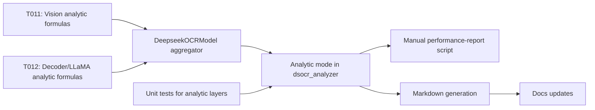

# Implementation Guide: Phase 3 – User Story 1 (P1) – Performance Profile MVP

**Phase**: 3 | **Feature**: DeepSeek-OCR Analytic Modeling in ModelMeter (`001-deepseek-ocr-modelmeter`) | **Tasks**: T009–T016

## Goal

Implement analytic layers and runner integration so a performance engineer can run an analytic pass for DeepSeek-OCR and obtain JSON/YAML artifacts plus Markdown documentation describing analytic time, FLOPs, I/O, and memory across major components.

## Public APIs

### T011/T012: DeepSeek-OCR analytic layers (vision, decoder, LLaMA)

Each target DeepSeek-OCR module gets a `BaseLayer` subclass capturing theoretical FLOPs/IO/memory for the configured shapes.

```python
# extern/modelmeter/models/deepseek_ocr/layers/decoder/deepseek_v2_decoder_layer.py

from __future__ import annotations

from extern.modelmeter.layers.base import BaseLayer
from extern.modelmeter.layers.utils import flops2tflops


class DeepseekV2DecoderLayer(BaseLayer):
    """Analytic model for a single DeepSeek-V2 decoder layer.

    Responsibilities:
    - Compute per-layer FLOPs for attention + MLP (forward/backward).
    - Estimate IO and memory footprints based on hidden size and seq_len.
    """

    def __init__(
        self,
        *,
        hidden_size: int,
        num_heads: int,
        seq_len: int,
        intermediate_size: int,
    ) -> None:
        super().__init__()
        self.m_hidden_size = hidden_size
        self.m_num_heads = num_heads
        self.m_seq_len = seq_len
        self.m_intermediate_size = intermediate_size

    def forward_tensor_core_flops(self) -> float:
        # Pseudocode: attention + MLP matmuls
        qkv_flops = 3 * 2 * self.m_seq_len * self.m_hidden_size * self.m_hidden_size
        o_flops = 2 * self.m_seq_len * self.m_hidden_size * self.m_hidden_size
        mlp_flops = 2 * self.m_seq_len * self.m_hidden_size * self.m_intermediate_size
        total = qkv_flops + o_flops + mlp_flops
        return flops2tflops(total)
```

Similar subclasses live under:

- `extern/modelmeter/models/deepseek_ocr/layers/vision/*.py`
- `extern/modelmeter/models/deepseek_ocr/layers/decoder/*.py`
- `extern/modelmeter/models/deepseek_ocr/layers/llama/*.py`

### T013: Root `DeepseekOCRModel` aggregator

Orchestrates per-layer metrics into model-level estimates.

```python
# extern/modelmeter/models/deepseek_ocr/layers/core/deepseek_ocr_model.py

from __future__ import annotations

from extern.modelmeter.layers.base import BaseLayer


class DeepseekOCRModel(BaseLayer):
    """Aggregate analytic model across DeepSeek-OCR components."""

    def __init__(
        self,
        *,
        vision: BaseLayer,
        decoder_blocks: list[BaseLayer],
        head: BaseLayer | None = None,
    ) -> None:
        super().__init__()
        self.m_vision = vision
        self.m_decoder_blocks = decoder_blocks
        self.m_head = head

    def forward_tensor_core_flops(self) -> float:
        total = self.m_vision.forward_tensor_core_flops() or 0.0
        for block in self.m_decoder_blocks:
            total += block.forward_tensor_core_flops() or 0.0
        if self.m_head is not None:
            total += self.m_head.forward_tensor_core_flops() or 0.0
        return total
```

### T014: Analytic mode in `DeepseekOCRStaticAnalyzer`

Extend the analyzer to construct analytic layers from configuration and assemble an `AnalyticModelReport`.

```python
# src/llm_perf_opt/runners/dsocr_analyzer.py

from llm_perf_opt.data.deepseek_ocr_analytic import AnalyticModelReport
from llm_perf_opt.utils.paths import analytic_model_dir, analytic_layer_docs_dir


class DeepseekOCRStaticAnalyzer:
    ...

    def run_analytic(self, config: AnalysisConfig) -> AnalyticModelReport:
        """Build analytic model report for DeepSeek-OCR."""

        # 1) Build ModelMeter analytic layers (vision, decoder, etc.)
        # 2) Aggregate into DeepseekOCRModel(BaseLayer).
        # 3) Populate AnalyticModelReport with module nodes and metrics.
        # 4) Serialize JSON/YAML to analytic_model_dir(run_id).
        ...
```

### T015: Markdown generation utilities

Generate Markdown docs describing each analytic layer and formulas.

```python
# src/llm_perf_opt/visualize/analytic_layers.py

from __future__ import annotations
from pathlib import Path
from llm_perf_opt.data.deepseek_ocr_analytic import AnalyticModelReport


def write_layer_docs(report: AnalyticModelReport, output_dir: str) -> None:
    """Render per-layer/operator Markdown docs from an analytic report."""

    out = Path(output_dir)
    out.mkdir(parents=True, exist_ok=True)

    for module in report.modules:
        filepath = out / f"{module.module_id.replace('/', '_')}.md"
        with filepath.open("w", encoding="utf-8") as f:
            f.write(f"# {module.name}\n\n")
            f.write(f"Qualified class: `{module.qualified_class_name}`\n\n")
            # Add sections for formulas and assumptions using report.module_metrics/operator_categories.
```

### T009/T010/T016: Manual and unit tests + docs updates

- Manual script `tests/manual/deepseek_ocr/manual_deepseek_ocr_performance_report.py` runs the analytic CLI and validates artifact presence.
- Unit tests in `tests/unit/deepseek_ocr/test_analytic_layers_scaling.py` assert monotonic FLOPs/IO scaling.
- `extern/modelmeter/models/deepseek_ocr/README.md` and `quickstart.md` document the flow.

---

## Phase Integration



---

## Testing

### Test Input

- Environment and TorchInfo artifacts from Phases 1–2.
- DeepSeek-OCR model weights under `models/deepseek-ocr`.

### Test Procedure

```bash
cd /workspace/code/llm-perf-opt

# 1. Run manual analytic performance report
pixi run -e rtx5090 python tests/manual/deepseek_ocr/manual_deepseek_ocr_performance_report.py

# 2. Run unit tests for analytic layers
pixi run -e rtx5090 pytest tests/unit/deepseek_ocr/test_analytic_layers_scaling.py
```

Manual script should:

- Invoke `python -m llm_perf_opt.runners.dsocr_analyzer --mode analytic ...`.
- Locate artifacts under `tmp/profile-output/<run_id>/static_analysis/analytic_model/`.

### Test Output

- JSON/YAML files under `tmp/profile-output/<run_id>/static_analysis/analytic_model/` containing an `AnalyticModelReport`.
- Markdown layer docs under the `layers/` subdirectory referenced by `AnalyticModelReport.layer_docs_dir`.
- Unit tests passing with `N passed, 0 failed`.

---

## References

- Spec: `specs/001-deepseek-ocr-modelmeter/spec.md`
- Data model: `specs/001-deepseek-ocr-modelmeter/data-model.md`
- Contracts: `specs/001-deepseek-ocr-modelmeter/contracts/`

---

## Implementation Summary

*(to be filled after implementation)*

### What has been implemented

- (after implementation) Note which analytic layers and Markdown generators are in place.

### How to verify

- (after implementation) Link to concrete example outputs and how to inspect them.

