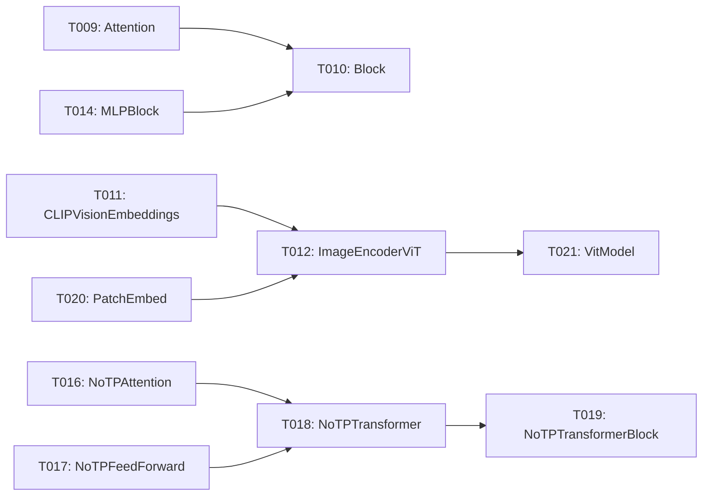

# Implementation Guide: Phase 3 – Vision Analytic Layers (US1, Part 1)

**Phase**: 3 | **Feature**: DeepSeek-OCR Analytic Modeling in ModelMeter (`001-deepseek-ocr-modelmeter`) | **Tasks**: T009–T021

## Goal

Implement analytic `BaseLayer` subclasses for all DeepSeek-OCR vision encoder/projector modules under `extern/modelmeter/models/deepseek_ocr/layers/vision/` so we can compute theoretical FLOPs, I/O, and memory for the vision stack and reuse it in the core DeepSeek-OCR analytic model.

## Public APIs

Each task creates a `BaseLayer` subclass with constructor parameters sufficient to derive FLOPs/IO/memory from shapes and call counts.

### T009: `Attention(BaseLayer)` – `vision/attention.py`

Layer docs: `context/hints/dsocr-kb/ops/op-Attention.md`

```python
# extern/modelmeter/models/deepseek_ocr/layers/vision/attention.py

from __future__ import annotations

from extern.modelmeter.layers.base import BaseLayer
from extern.modelmeter.layers.utils import flops2tflops


class Attention(BaseLayer):
    """Analytic model for vision attention block in DeepSeek-OCR."""

    def __init__(self, *, seq_len: int, hidden_size: int, num_heads: int) -> None:
        super().__init__()
        self.m_seq_len = seq_len
        self.m_hidden_size = hidden_size
        self.m_num_heads = num_heads

    def forward_tensor_core_flops(self) -> float:
        # Pseudocode based on QKV/O projections and attention matmuls
        ...
```

### T010: `Block(BaseLayer)` – `vision/block.py`

Layer docs: `context/hints/dsocr-kb/ops/op-Block.md`

Wraps `Attention` + `MLPBlock` + norms into a single analytic layer.

```python
class Block(BaseLayer):
    """Vision transformer block."""

    def __init__(self, *, attn: Attention, mlp: BaseLayer, norm_flops: float) -> None:
        ...
```

### T011–T021: Remaining vision modules

- `T011` – `CLIPVisionEmbeddings(BaseLayer)` in `clip_vision_embeddings.py`  
  Layer docs: `context/hints/dsocr-kb/ops/op-CLIPVisionEmbeddings.md`
- `T012` – `ImageEncoderViT(BaseLayer)` in `image_encoder_vit.py`  
  Layer docs: `context/hints/dsocr-kb/ops/op-ImageEncoderViT.md`
- `T013` – `LayerNorm2d(BaseLayer)` in `layer_norm2d.py`  
  Layer docs: `context/hints/dsocr-kb/ops/op-LayerNorm2d.md`
- `T014` – `MLPBlock(BaseLayer)` in `mlp_block.py`  
  Layer docs: `context/hints/dsocr-kb/ops/op-MLPBlock.md`
- `T015` – `MlpProjector(BaseLayer)` in `mlp_projector.py`  
  Layer docs: `context/hints/dsocr-kb/ops/op-MlpProjector.md`
- `T016` – `NoTPAttention(BaseLayer)` in `notp_attention.py`  
  Layer docs: `context/hints/dsocr-kb/ops/op-NoTPAttention.md`
- `T017` – `NoTPFeedForward(BaseLayer)` in `notp_feedforward.py`  
  Layer docs: `context/hints/dsocr-kb/ops/op-NoTPFeedForward.md`
- `T018` – `NoTPTransformer(BaseLayer)` in `notp_transformer.py`  
  Layer docs: `context/hints/dsocr-kb/ops/op-NoTPTransformer.md`
- `T019` – `NoTPTransformerBlock(BaseLayer)` in `notp_transformer_block.py`  
  Layer docs: `context/hints/dsocr-kb/ops/op-NoTPTransformerBlock.md`
- `T020` – `PatchEmbed(BaseLayer)` in `patch_embed.py`  
  Layer docs: `context/hints/dsocr-kb/ops/op-PatchEmbed.md`
- `T021` – `VitModel(BaseLayer)` in `vit_model.py`  
  Layer docs: `context/hints/dsocr-kb/ops/op-VitModel.md`

These classes should follow the same pattern: accept the minimal set of shape/config parameters (channels, patch size, sequence length, etc.) and implement all `BaseLayer` methods using closed-form formulas.

---

## Phase Integration



Phase 3 produces a complete analytic description of the vision backbone and associated projector modules, which later phases (decoder and core aggregator) compose into the full DeepSeek-OCR analytic model.

---

## Testing

### Test Input

- TorchInfo artifacts from Phase 1–2 at `reports/20211117-dsorc-op-analysis/static-20251118-130533/torchinfo-unique-layers.json`.
- Synthetic workload parameters for `dsocr-standard-v1` (image size, base size, crop mode).

### Test Procedure

```bash
cd /workspace/code/llm-perf-opt

pixi run -e rtx5090 python - << 'EOF'
from extern.modelmeter.models.deepseek_ocr.layers.vision.attention import Attention

layer = Attention(seq_len=512, hidden_size=1024, num_heads=16)
print("FLOPs (TC, forward):", layer.forward_tensor_core_flops())
EOF
```

Optionally add small unit tests under `tests/unit/deepseek_ocr/test_vision_layers_sanity.py` to check:

- FLOPs scale linearly with `seq_len`.
- Memory usage scales with `hidden_size` and number of heads.

### Test Output

- No exceptions when instantiating vision analytic layers with realistic shapes.
- FLOPs and memory estimates are non-negative and monotonic with respect to key shape parameters.

---

## References

- Tasks: `specs/001-deepseek-ocr-modelmeter/tasks.md` (Phase 3, T009–T021)
- Plan: `specs/001-deepseek-ocr-modelmeter/plan.md` (vision layer list and directory structure)
- Data model: `specs/001-deepseek-ocr-modelmeter/data-model.md`

---

## Implementation Summary

*(to be filled after implementation)*

### What has been implemented

- (after implementation) List concrete vision analytic layer classes and any shared helpers.

### How to verify

- (after implementation) Document the scripts or tests used to validate FLOPs/IO/memory formulas for the vision stack.
