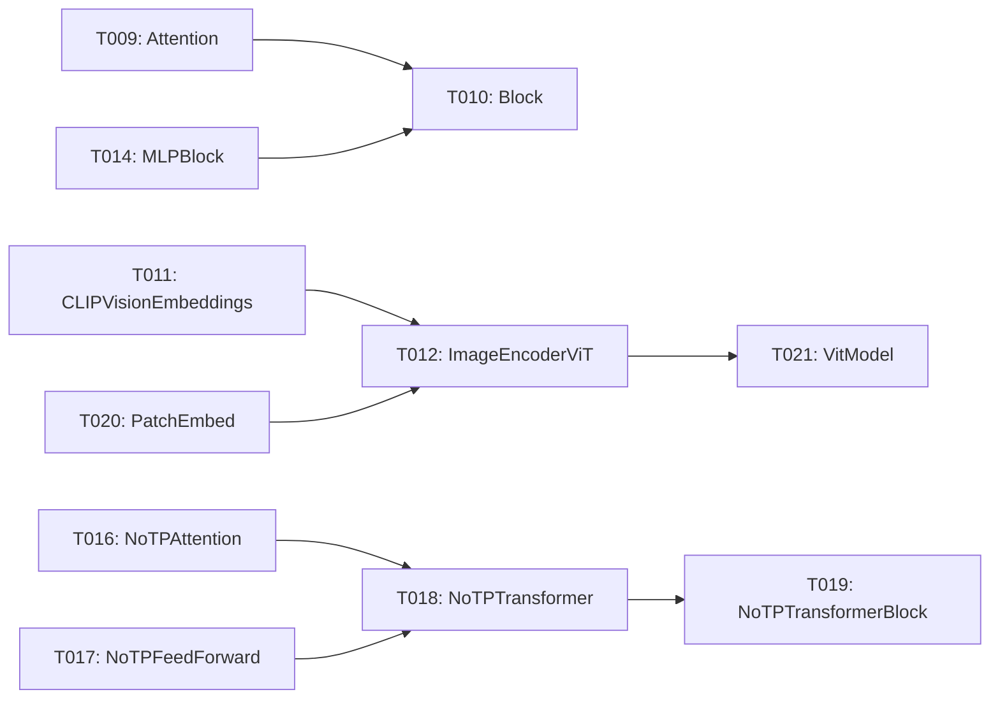

# Implementation Guide: Phase 3 – Vision Analytic Layers (US1, Part 1)

**Phase**: 3 | **Feature**: DeepSeek-OCR Analytic Modeling in ModelMeter (`001-deepseek-ocr-modelmeter`) | **Tasks**: T009–T021

## Goal

Implement analytic `BaseLayer` subclasses for all DeepSeek-OCR vision encoder/projector modules under `extern/modelmeter/models/deepseek_ocr/layers/vision/` so we can compute theoretical FLOPs, I/O, and memory for the vision stack and reuse it in the core DeepSeek-OCR analytic model.

## Public APIs

Each task creates a `BaseLayer` subclass with constructor parameters sufficient to derive FLOPs/IO/memory from shapes and call counts.

### T009: `Attention(BaseLayer)` – `vision/attention.py`

Layer docs: `context/hints/dsocr-kb/ops/op-Attention.md`

```python
# extern/modelmeter/models/deepseek_ocr/layers/vision/attention.py

from __future__ import annotations

from extern.modelmeter.layers.base import BaseLayer
from extern.modelmeter.layers.utils import flops2tflops


class Attention(BaseLayer):
    """Analytic model for vision attention block in DeepSeek-OCR."""

    def __init__(self, *, seq_len: int, hidden_size: int, num_heads: int) -> None:
        super().__init__()
        self.m_seq_len = seq_len
        self.m_hidden_size = hidden_size
        self.m_num_heads = num_heads

    def forward_tensor_core_flops(self) -> float:
        # Pseudocode based on QKV/O projections and attention matmuls
        ...
```

### T010: `Block(BaseLayer)` – `vision/block.py`

Layer docs: `context/hints/dsocr-kb/ops/op-Block.md`

Wraps `Attention` + `MLPBlock` + norms into a single analytic layer.

```python
class Block(BaseLayer):
    """Vision transformer block."""

    def __init__(self, *, attn: Attention, mlp: BaseLayer, norm_flops: float) -> None:
        ...
```

### T011–T021: Remaining vision modules

- `T011` – `CLIPVisionEmbeddings(BaseLayer)` in `clip_vision_embeddings.py`  
  Layer docs: `context/hints/dsocr-kb/ops/op-CLIPVisionEmbeddings.md`
- `T012` – `ImageEncoderViT(BaseLayer)` in `image_encoder_vit.py`  
  Layer docs: `context/hints/dsocr-kb/ops/op-ImageEncoderViT.md`
- `T013` – `LayerNorm2d(BaseLayer)` in `layer_norm2d.py`  
  Layer docs: `context/hints/dsocr-kb/ops/op-LayerNorm2d.md`
- `T014` – `MLPBlock(BaseLayer)` in `mlp_block.py`  
  Layer docs: `context/hints/dsocr-kb/ops/op-MLPBlock.md`
- `T015` – `MlpProjector(BaseLayer)` in `mlp_projector.py`  
  Layer docs: `context/hints/dsocr-kb/ops/op-MlpProjector.md`
- `T016` – `NoTPAttention(BaseLayer)` in `notp_attention.py`  
  Layer docs: `context/hints/dsocr-kb/ops/op-NoTPAttention.md`
- `T017` – `NoTPFeedForward(BaseLayer)` in `notp_feedforward.py`  
  Layer docs: `context/hints/dsocr-kb/ops/op-NoTPFeedForward.md`
- `T018` – `NoTPTransformer(BaseLayer)` in `notp_transformer.py`  
  Layer docs: `context/hints/dsocr-kb/ops/op-NoTPTransformer.md`
- `T019` – `NoTPTransformerBlock(BaseLayer)` in `notp_transformer_block.py`  
  Layer docs: `context/hints/dsocr-kb/ops/op-NoTPTransformerBlock.md`
- `T020` – `PatchEmbed(BaseLayer)` in `patch_embed.py`  
  Layer docs: `context/hints/dsocr-kb/ops/op-PatchEmbed.md`
- `T021` – `VitModel(BaseLayer)` in `vit_model.py`  
  Layer docs: `context/hints/dsocr-kb/ops/op-VitModel.md`

These classes should follow the same pattern: accept the minimal set of shape/config parameters (channels, patch size, sequence length, etc.) and implement all `BaseLayer` methods using closed-form formulas.

---

## Phase Integration



Phase 3 produces a complete analytic description of the vision backbone and associated projector modules, which later phases (decoder and core aggregator) compose into the full DeepSeek-OCR analytic model.

---

## Testing

### Test Input

- TorchInfo artifacts from Phase 1–2 at `reports/20211117-dsorc-op-analysis/static-20251118-130533/torchinfo-unique-layers.json`.
- Synthetic workload parameters for `dsocr-standard-v1` (image size, base size, crop mode).

### Test Procedure

```bash
cd /workspace/code/llm-perf-opt

pixi run -e rtx5090 python - << 'EOF'
from extern.modelmeter.models.deepseek_ocr.layers.vision.attention import Attention

layer = Attention(seq_len=512, hidden_size=1024, num_heads=16)
print("FLOPs (TC, forward):", layer.forward_tensor_core_flops())
EOF
```

Optionally add small unit tests under `tests/unit/deepseek_ocr/test_vision_layers_sanity.py` to check:

- FLOPs scale linearly with `seq_len`.
- Memory usage scales with `hidden_size` and number of heads.

### Test Output

- No exceptions when instantiating vision analytic layers with realistic shapes.
- FLOPs and memory estimates are non-negative and monotonic with respect to key shape parameters.

---

## References

- Tasks: `specs/001-deepseek-ocr-modelmeter/tasks.md` (Phase 3, T009–T021)
- Plan: `specs/001-deepseek-ocr-modelmeter/plan.md` (vision layer list and directory structure)
- Data model: `specs/001-deepseek-ocr-modelmeter/data-model.md`

---

## Implementation Summary

### What has been implemented

- All Phase 3 vision analytic layers (`BaseLayer` subclasses) are implemented under `extern/modelmeter/models/deepseek_ocr/layers/vision/`:
  - SAM / vision encoder path: `Attention`, `Block`, `MLPBlock`, `LayerNorm2d`, `PatchEmbed`, `ImageEncoderViT`.
  - CLIP vision tower: `CLIPVisionEmbeddings`, `NoTPAttention`, `NoTPFeedForward`, `NoTPTransformerBlock`, `NoTPTransformer`, `VitModel`.
  - Vision→decoder bridge: `MlpProjector`.
- Each class follows `extern/modelmeter/models/deepseek_ocr/LAYER_IMPL_GUIDE.md`:
  - Module-level docstring with architecture context and references into `context/hints/dsocr-kb/ops/op-*.md`.
  - Keyword-only constructors with validated, shape-derived parameters and `m_`-prefixed fields.
  - `@override` implementations for FLOPs, I/O, arithmetic intensity, and memory methods using the counting conventions from the hint docs (2 FLOPs per MAC, fp16/bf16 for memory/IO).
- Composite layers aggregate primitives consistently:
  - `Block` composes `Attention` + `MLPBlock` (plus optional norm overhead).
  - `NoTPTransformerBlock` composes `NoTPAttention` + `NoTPFeedForward`.
  - `NoTPTransformer` sums metrics across an ordered sequence of `NoTPTransformerBlock` instances.
  - `ImageEncoderViT` wraps `PatchEmbed`, the 12-block SAM stack (window + global attention pattern), and the convolutional neck (`LayerNorm2d` + convs) with per-conv FLOP/IO/memory formulas.
  - `VitModel` wraps `CLIPVisionEmbeddings` + `NoTPTransformer` and adds a final LayerNorm contribution.
- Phase 3 tasks T010–T021 are marked complete in `specs/001-deepseek-ocr-modelmeter/tasks.md`, unblocking Phase 4–6 work.

### How to verify

- Syntax and import sanity:
  - Run `pixi run -e rtx5090 python -m compileall extern/modelmeter/models/deepseek_ocr/layers/vision` to ensure all modules type-check and import cleanly.
- Quick interactive sanity checks for representative shapes:

  ```bash
  cd /workspace/code/llm-perf-opt

  pixi run -e rtx5090 python - << 'EOF'
  from extern.modelmeter.models.deepseek_ocr.layers.vision.attention import Attention
  from extern.modelmeter.models.deepseek_ocr.layers.vision.block import Block
  from extern.modelmeter.models.deepseek_ocr.layers.vision.clip_vision_embeddings import CLIPVisionEmbeddings
  from extern.modelmeter.models.deepseek_ocr.layers.vision.image_encoder_vit import ImageEncoderViT
  from extern.modelmeter.models.deepseek_ocr.layers.vision.mlp_block import MLPBlock
  from extern.modelmeter.models.deepseek_ocr.layers.vision.mlp_projector import MlpProjector
  from extern.modelmeter.models.deepseek_ocr.layers.vision.notp_attention import NoTPAttention
  from extern.modelmeter.models.deepseek_ocr.layers.vision.notp_feedforward import NoTPFeedForward
  from extern.modelmeter.models.deepseek_ocr.layers.vision.notp_transformer import NoTPTransformer
  from extern.modelmeter.models.deepseek_ocr.layers.vision.notp_transformer_block import NoTPTransformerBlock
  from extern.modelmeter.models.deepseek_ocr.layers.vision.patch_embed import PatchEmbed
  from extern.modelmeter.models.deepseek_ocr.layers.vision.vit_model import VitModel

  # SAM-style attention + block
  attn = Attention(dim=768, num_heads=12, window_area=14*14, num_windows=25)
  print("Attention forward TFLOPs:", attn.forward_tensor_core_flops())

  mlp = MLPBlock(embedding_dim=768, mlp_dim=3072, batch_size=1, seq_len=64*64)
  blk = Block(
      dim=768,
      num_heads=12,
      mlp_ratio=4.0,
      window_area=14*14,
      num_windows=25,
      seq_len=64*64,
      batch_size=1,
  )
  print("Block forward TFLOPs:", blk.forward_tensor_core_flops())

  # SAM image encoder
  image_encoder = ImageEncoderViT()
  print("ImageEncoderViT forward TFLOPs:", image_encoder.forward_tensor_core_flops())

  # CLIP tower + projector
  clip_emb = CLIPVisionEmbeddings(
      hidden_size=1024,
      image_size=224,
      patch_size=14,
      num_channels=3,
      batch_size=1,
      use_precomputed_patch_embeds=True,
  )
  notp_attn = NoTPAttention(hidden_size=1024, num_heads=16, seq_len=257, batch_size=1)
  notp_ff = NoTPFeedForward(dim=1024, hidden_dim=4096, batch_size=1, seq_len=257)
  notp_blk = NoTPTransformerBlock(attention=notp_attn, mlp=notp_ff)
  notp_stack = NoTPTransformer(blocks=[notp_blk] * 24)
  vit = VitModel(embeddings=clip_emb, transformer=notp_stack, hidden_size=1024, seq_len=257, batch_size=1)
  projector = MlpProjector(input_dim=2048, output_dim=1280, num_tokens=577, batch_size=1, depth=2)

  print("VitModel forward TFLOPs:", vit.forward_tensor_core_flops())
  print("MlpProjector forward TFLOPs:", projector.forward_tensor_core_flops())
  EOF
  ```

- Expected results:
  - All layers instantiate without exceptions for realistic SAM/CLIP configs.
  - `forward_tensor_core_flops`, `forward_cal_io`, and memory methods return non-negative values that increase with:
    - Larger `seq_len`, `num_heads`, and `hidden_size` for attention layers.
    - Larger `mlp_dim` and `seq_len` for MLP layers.
    - Larger `image_size` and `patch_size`-compatible grids for `PatchEmbed` and `ImageEncoderViT`.
- Optional unit tests:
  - Add `tests/unit/deepseek_ocr/test_vision_layers_sanity.py` to assert basic monotonicity and non-negativity for a subset of layers (e.g., `Attention`, `Block`, `ImageEncoderViT`, `VitModel`, `MlpProjector`) using small synthetic shape sweeps.
