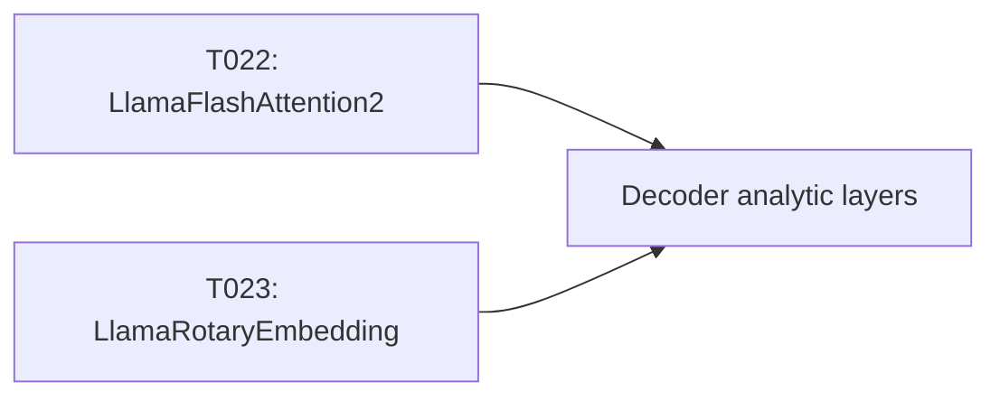

# Implementation Guide: Phase 4 – LLaMA Analytic Layers (US1, Part 2)

**Phase**: 4 | **Feature**: DeepSeek-OCR Analytic Modeling in ModelMeter (`001-deepseek-ocr-modelmeter`) | **Tasks**: T022–T023

## Goal

Implement analytic `BaseLayer` subclasses for LLaMA attention primitives used in DeepSeek-OCR so decoder and core analytic layers can reuse accurate FLOPs/I/O/memory models for attention and rotary embeddings.

## Public APIs

### T022: `LlamaFlashAttention2(BaseLayer)` – `llama/llama_flash_attention2.py`

Layer docs: `context/hints/dsocr-kb/ops/op-LlamaFlashAttention2.md`

```python
# extern/modelmeter/models/deepseek_ocr/layers/llama/llama_flash_attention2.py

from __future__ import annotations

from extern.modelmeter.layers.base import BaseLayer
from extern.modelmeter.layers.utils import flops2tflops


class LlamaFlashAttention2(BaseLayer):
    """Analytic model for LLaMA FlashAttention2 in DeepSeek-OCR."""

    def __init__(self, *, seq_len: int, hidden_size: int, num_heads: int) -> None:
        super().__init__()
        self.m_seq_len = seq_len
        self.m_hidden_size = hidden_size
        self.m_num_heads = num_heads

    def forward_tensor_core_flops(self) -> float:
        # Pseudocode: use standard attention FLOPs with FlashAttention specifics
        ...
```

### T023: `LlamaRotaryEmbedding(BaseLayer)` – `llama/llama_rotary_embedding.py`

Layer docs: `context/hints/dsocr-kb/ops/op-LlamaRotaryEmbedding.md`

```python
# extern/modelmeter/models/deepseek_ocr/layers/llama/llama_rotary_embedding.py

from __future__ import annotations

from extern.modelmeter.layers.base import BaseLayer


class LlamaRotaryEmbedding(BaseLayer):
    """Analytic model for rotary positional embeddings used by LLaMA blocks."""

    def __init__(self, *, seq_len: int, dim: int) -> None:
        super().__init__()
        self.m_seq_len = seq_len
        self.m_dim = dim

    def forward_tensor_core_flops(self) -> float:
        # Pseudocode: small elementwise cost; may be negligible vs attention
        ...
```

---

## Phase Integration



These LLaMA primitives are consumed by the decoder analytic layers (Phase 5) and referenced in the core model aggregator (Phase 6).

---

## Testing

### Test Input

- Representative LLaMA configuration from DeepSeek-OCR (hidden size, number of heads, sequence length).

### Test Procedure

```bash
cd /workspace/code/llm-perf-opt

pixi run -e rtx5090 python - << 'EOF'
from extern.modelmeter.models.deepseek_ocr.layers.llama.llama_flash_attention2 import LlamaFlashAttention2

layer = LlamaFlashAttention2(seq_len=512, hidden_size=4096, num_heads=32)
print("FLOPs (TC, forward):", layer.forward_tensor_core_flops())
EOF
```

### Test Output

- Instantiation succeeds with realistic DeepSeek-OCR LLaMA parameters.
- FLOPs/IO/memory metrics are non-negative and roughly consistent with intuition (e.g., attention cost grows with `seq_len^2` and `hidden_size`).

---

## References

- Tasks: `specs/001-deepseek-ocr-modelmeter/tasks.md` (Phase 4, T022–T023)
- Plan: `specs/001-deepseek-ocr-modelmeter/plan.md` (LLaMA layer list and directory structure)

---

## Implementation Summary

### What has been implemented

- Implemented `LlamaFlashAttention2(BaseLayer)` in
  `extern/modelmeter/models/deepseek_ocr/layers/llama/llama_flash_attention2.py`
  with a keyword-only constructor
  (`seq_len`, `hidden_size`, `num_heads`,
  optional `num_key_value_heads`, `batch_size`,
  `use_flash_attention`) and closed-form implementations for all
  `BaseLayer` metrics (forward/backward FLOPs, I/O, arithmetic
  intensity, and weight/activation/KV-cache memory) following the
  conventions in `LAYER_IMPL_GUIDE.md` and the vision attention layer.
- Implemented `LlamaRotaryEmbedding(BaseLayer)` in
  `extern/modelmeter/models/deepseek_ocr/layers/llama/llama_rotary_embedding.py`
  with a keyword-only constructor (`seq_len`, `dim`, optional
  `batch_size`) and a lightweight CUDA-core FLOP / I/O / memory model
  for RoPE frequency computation and cosine/sine activations.
- Updated Phase 4 tasks `T022` and `T023` in
  `specs/001-deepseek-ocr-modelmeter/tasks.md` to `[X]`, marking the
  LLaMA analytic primitives as complete and ready to be consumed by
  decoder and core aggregation layers in later phases.

### How to verify

- Run a small smoke check in the Pixi `rtx5090` environment to confirm
  that both layers instantiate successfully for representative DeepSeek-OCR
  LLaMA shapes and return non-negative metrics:

  ```bash
  cd /workspace/code/llm-perf-opt

  pixi run -e rtx5090 python - << 'EOF'
  from extern.modelmeter.models.deepseek_ocr.layers.llama.llama_flash_attention2 import (
      LlamaFlashAttention2,
  )
  from extern.modelmeter.models.deepseek_ocr.layers.llama.llama_rotary_embedding import (
      LlamaRotaryEmbedding,
  )

  flash = LlamaFlashAttention2(seq_len=512, hidden_size=4096, num_heads=32)
  rotary = LlamaRotaryEmbedding(seq_len=512, dim=128)

  print("FlashAttention2 TFLOPs (forward, TC):", flash.forward_tensor_core_flops())
  print("FlashAttention2 KV cache GB:", flash.forward_memory_kvcache())
  print("RoPE TFLOPs (forward, CUDA):", rotary.forward_cuda_core_flops())
  print("RoPE activation memory GB:", rotary.forward_memory_activation())
  EOF
  ```

- Sanity-check that:
  - FLOPs/IO/memory metrics are non-negative.
  - Attention FLOPs grow with `seq_len`, `hidden_size`, and `num_heads`.
  - RoPE FLOPs and activation memory grow with `seq_len` and `dim`.
