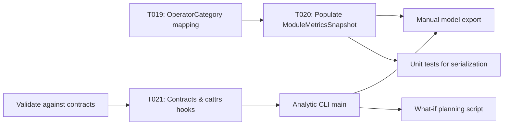

# Implementation Guide: Phase 4 – User Story 2 (P2) – Analytic Models for Planning

**Phase**: 4 | **Feature**: DeepSeek-OCR Analytic Modeling in ModelMeter (`001-deepseek-ocr-modelmeter`) | **Tasks**: T017–T024

## Goal

Expose a machine-readable analytic model of DeepSeek-OCR (module hierarchy, operator categories, call counts, and memory estimates) that capacity-planning engineers can consume directly in external tools to run what-if scenarios.

## Public APIs

### T019/T020: Operator categories and metrics aggregation

Extend the domain model and analytic pipeline to populate per-module and per-operator metrics.

```python
# src/llm_perf_opt/data/deepseek_ocr_analytic.py

from attrs import define, field
from attrs.validators import instance_of


@define(kw_only=True)
class OperatorCategory:
    category_id: str = field(validator=[instance_of(str)])
    display_name: str = field(validator=[instance_of(str)])
    description: str = field(validator=[instance_of(str)])
    match_classes: list[str] = field(factory=list)


@define(kw_only=True)
class OperatorMetrics:
    category_id: str = field(validator=[instance_of(str)])
    calls: int = field(validator=[instance_of(int)])
    flops_tflops: float = field(validator=[instance_of(float)])
    io_tb: float = field(validator=[instance_of(float)])
    share_of_module_flops: float = field(validator=[instance_of(float)])
```

In `dsocr_analyzer`, use the `TargetOperatorList` to classify operators and aggregate into `ModuleMetricsSnapshot`.

```python
# src/llm_perf_opt/runners/dsocr_analyzer.py

from llm_perf_opt.data.deepseek_ocr_analytic import ModuleMetricsSnapshot, OperatorMetrics

def _build_module_metrics(...):
    # Pseudocode that walks the module tree and accumulates per-category metrics
    ...
```

### T021: DeepSeek-OCR analytic contracts and cattrs hooks

Add contract models to `src/llm_perf_opt/contracts/models.py` and register conversion hooks.

```python
# src/llm_perf_opt/contracts/models.py

from attrs import define, field


@define(kw_only=True)
class DeepSeekOCRAnalyticRequest:
    model_id: str = field()
    model_variant: str = field()
    workload_profile_id: str = field()
    profile_run_id: str | None = field(default=None)
    force_rebuild: bool = field(default=False)


@define(kw_only=True)
class DeepSeekOCRAnalyticReportSummary:
    report_id: str = field()
    model_variant: str = field()
    workload_profile_id: str = field()
    predicted_total_time_ms: float = field()
    measured_total_time_ms: float | None = field(default=None)
    predicted_vs_measured_ratio: float | None = field(default=None)
    notes: str = field(default="")
```

```python
# src/llm_perf_opt/contracts/convert.py

from llm_perf_opt.contracts.models import DeepSeekOCRAnalyticReportSummary
from llm_perf_opt.data.deepseek_ocr_analytic import AnalyticModelReport


def register_deepseek_ocr_hooks(converter: Converter) -> None:
    """Register AnalyticModelReport <-> DeepSeekOCRAnalyticReportSummary hooks."""
    ...
```

### T022: CLI entry for analytic modeling

Provide a `__main__` handler or dedicated entry that accepts contract-style arguments and triggers analytic model generation.

```python
# src/llm_perf_opt/runners/dsocr_analyzer_main.py

from __future__ import annotations
import argparse
from llm_perf_opt.runners.dsocr_analyzer import DeepseekOCRStaticAnalyzer, AnalysisConfig


def main() -> None:
    parser = argparse.ArgumentParser()
    parser.add_argument("--mode", required=True, choices=["analytic"])
    parser.add_argument("--model", required=True)
    parser.add_argument("--device", default="cuda:0")
    parser.add_argument("--workload-profile-id", default="dsocr-standard-v1")
    args = parser.parse_args()

    # Construct session, analyzer, config, run analytic pipeline, write artifacts.


if __name__ == "__main__":
    main()
```

### T017/T018/T023/T024: Export tests and what-if script

- Manual export script `tests/manual/deepseek_ocr/manual_deepseek_ocr_model_export.py` calls CLI and verifies `AnalyticModelReport` serialization.
- Unit tests in `tests/unit/deepseek_ocr/test_analytic_model_report_io.py` ensure JSON/YAML load/dump correctness.
- `scripts/analytical/dsocr_analytic_what_if.py` reads an `AnalyticModelReport` artifact and recomputes metrics under modified parameters.
- Validate alignment with `contracts/openapi.yaml` and `MAPPING.md`.

---

## Phase Integration



---

## Testing

### Test Input

- Completed Phase 3 (analytic pipeline already outputs basic `AnalyticModelReport`).
- Artifact directory `tmp/profile-output/<run_id>/static_analysis/analytic_model/` populated by an analytic run.

### Test Procedure

```bash
cd /workspace/code/llm-perf-opt

# 1. Run export manual script
pixi run -e rtx5090 python tests/manual/deepseek_ocr/manual_deepseek_ocr_model_export.py

# 2. Run serialization unit tests
pixi run -e rtx5090 pytest tests/unit/deepseek_ocr/test_analytic_model_report_io.py

# 3. Run what-if planning example
pixi run -e rtx5090 python scripts/analytical/dsocr_analytic_what_if.py \
  --report /workspace/code/llm-perf-opt/tmp/profile-output/<run_id>/static_analysis/analytic_model/report.json
```

### Test Output

- Export script writes `AnalyticModelReport` JSON/YAML without errors.
- Unit tests pass; load/dump round-trips preserve key fields.
- What-if script prints projected metrics for alternative workload parameters, demonstrating that the artifact is consumable in external tools.

---

## References

- Spec: `specs/001-deepseek-ocr-modelmeter/spec.md`
- Data model: `specs/001-deepseek-ocr-modelmeter/data-model.md`
- Contracts: `specs/001-deepseek-ocr-modelmeter/contracts/`

---

## Implementation Summary

*(to be filled after implementation)*

### What has been implemented

- (after implementation) Describe the mapping from `AnalyticModelReport` to contract models and the CLI entry behavior.

### How to verify

- (after implementation) Provide concrete JSON/YAML samples and show how external tools can consume them.

