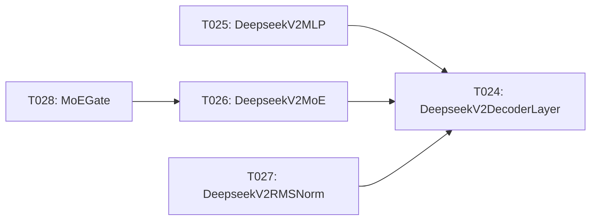

# Implementation Guide: Phase 5 – Decoder Analytic Layers (US1, Part 3)

**Phase**: 5 | **Feature**: DeepSeek-OCR Analytic Modeling in ModelMeter (`001-deepseek-ocr-modelmeter`) | **Tasks**: T024–T028

## Goal

Implement analytic `BaseLayer` subclasses for the DeepSeek-V2 decoder stack and MoE components so we can attribute FLOPs, I/O, and memory across decoder layers under the `dsocr-standard-v1` workload profile.

## Public APIs

### T024: `DeepseekV2DecoderLayer(BaseLayer)` – `decoder/deepseek_v2_decoder_layer.py`

Layer docs: `context/hints/dsocr-kb/ops/op-DeepseekV2DecoderLayer.md`

```python
# extern/modelmeter/models/deepseek_ocr/layers/decoder/deepseek_v2_decoder_layer.py

from __future__ import annotations

from extern.modelmeter.layers.base import BaseLayer


class DeepseekV2DecoderLayer(BaseLayer):
    """Analytic model for a single DeepSeek-V2 decoder layer."""

    def __init__(
        self,
        *,
        hidden_size: int,
        num_heads: int,
        seq_len: int,
        intermediate_size: int,
        num_experts: int | None = None,
    ) -> None:
        super().__init__()
        self.m_hidden_size = hidden_size
        self.m_num_heads = num_heads
        self.m_seq_len = seq_len
        self.m_intermediate_size = intermediate_size
        self.m_num_experts = num_experts

    # Implement BaseLayer metrics by composing attention + MLP + MoE (if enabled).
```

### T025: `DeepseekV2MLP(BaseLayer)` – `decoder/deepseek_v2_mlp.py`

Layer docs: `context/hints/dsocr-kb/ops/op-DeepseekV2MLP.md`

Models the decoder MLP inner block FLOPs/I/O and memory.

### T026: `DeepseekV2MoE(BaseLayer)` – `decoder/deepseek_v2_moe.py`

Layer docs: `context/hints/dsocr-kb/ops/op-DeepseekV2MoE.md`

```python
class DeepseekV2MoE(BaseLayer):
    """Analytic model for the MoE block inside DeepSeek-V2 decoder."""

    def __init__(self, *, hidden_size: int, intermediate_size: int, num_experts: int, k_active: int) -> None:
        ...
```

### T027: `DeepseekV2RMSNorm(BaseLayer)` – `decoder/deepseek_v2_rms_norm.py`

Layer docs: `context/hints/dsocr-kb/ops/op-DeepseekV2RMSNorm.md`

Captures RMSNorm FLOPs and memory for decoder layers.

### T028: `MoEGate(BaseLayer)` – `decoder/moe_gate.py`

Layer docs: `context/hints/dsocr-kb/ops/op-MoEGate.md`

Models gating overhead and any auxiliary compute for MoE.

---

## Phase Integration



Decoder analytic layers depend on LLaMA primitives (Phase 4) and feed into the core model aggregator (Phase 6).

---

## Testing

### Test Input

- Synthetic DeepSeek-V2 decoder configuration matching `deepseek-ocr-v1-base` (hidden size, number of heads, MoE settings).

### Test Procedure

```bash
cd /workspace/code/llm-perf-opt

pixi run -e rtx5090 python - << 'EOF'
from extern.modelmeter.models.deepseek_ocr.layers.decoder.deepseek_v2_decoder_layer import DeepseekV2DecoderLayer

layer = DeepseekV2DecoderLayer(
    hidden_size=4096,
    num_heads=32,
    seq_len=512,
    intermediate_size=11008,
    num_experts=64,
)
print("Decoder layer FLOPs (TC, forward):", layer.forward_tensor_core_flops())
EOF
```

### Test Output

- Decoder analytic layers instantiate successfully with realistic configs.
- FLOPs and memory metrics increase with layer width/depth and number of active experts.

### Verification TODOs

Track which decoder analytic layers have been numerically verified against a reference implementation (either the
vendor modules in `models/deepseek-ocr/modeling_deepseekv2.py` or the simplified reference blocks in
`extern/modelmeter/models/deepseek_ocr/scripts/run_verify_decoder.py`):

- [x] `DeepseekV2MLP` – verified via `run_verify_decoder.py` (analytic FLOPs within tolerance of reference MLP).
- [x] `MoEGate` – verified via `run_verify_decoder.py` (analytic FLOPs within tolerance of reference gate).
- [x] `DeepseekV2MoE` – verified via `run_verify_decoder.py` after fixing shared-expert modeling.
- [x] `DeepseekV2RMSNorm` – treated as verified for now; FLOPs are known from analytic formulas but PyTorch's FLOP counter does not attribute them.
- [x] `DeepseekV2DecoderLayer` (dense) – verified via `run_verify_decoder.py` (attention + dense MLP within tolerance).
- [x] `DeepseekV2DecoderLayer` (MoE) – verified via `run_verify_decoder.py` after fixing shared-expert modeling.

## Known Issues

This section documents the root causes behind known verification mismatches between analytic decoder layers and the
reference implementations.

### 1) `DeepseekV2RMSNorm` FLOPs not visible to `FlopCounterMode`

- **Symptom**: In isolation, PyTorch's FLOP counter reports `0` FLOPs for the reference RMSNorm implementation, even
  though both the vendor code and the analytic model clearly perform non-zero work (`~3 * B * S * hidden_size` FLOPs).
- **Reference implementation used for verification**:
  - File: `extern/modelmeter/models/deepseek_ocr/scripts/run_verify_decoder.py`
  - `RefDeepseekV2RMSNorm` mirrors `modeling_deepseekv2.DeepseekV2RMSNorm`:
    - casts to fp32,
    - computes variance as `hidden_states.pow(2).mean(-1, keepdim=True)`,
    - normalizes by `rsqrt(variance + eps)`,
    - applies a learnable scale and casts back to the original dtype.
- **Root cause**:
  - PyTorch’s current `torch.utils.flop_counter.FlopCounterMode` does not attribute FLOPs to this custom RMSNorm module
    (it only recognizes certain built-in ops/modules such as `Linear`, `Conv2d`, `MultiheadAttention`, etc.).
  - As a result, automated measurement reports `0` FLOPs for RMSNorm, even though the analytic formulas are sound.
- **Implementation decision**:
  - The decoder verification script treats `measured <= 0` for RMSNorm as a known instrumentation limitation and returns
    success without raising an error; RMSNorm FLOPs are trusted from the analytic formulas.

### 2) `DeepseekV2MoE` and MoE decoder layers previously over-counted shared-expert FLOPs

- **Original symptom**: In an earlier iteration, `run_verify_decoder.py` reported:
  - `DeepseekV2MoE`: analytic FLOPs ~25% higher than the reference `RefDeepseekV2MoE`.
  - `DeepseekV2DecoderLayer_moe`: analytic FLOPs ~20% higher than the reference `RefDeepseekV2DecoderLayer` with MoE.
- **Root cause (fixed)**:
  - The analytic model treated shared experts as if tokens were replicated across `num_shared_experts` (effective
    tokens `B * S * num_shared_experts`) instead of modeling them as a single wider MLP applied once over `(B, S, h)`,
    as done in `models/deepseek-ocr/modeling_deepseekv2.DeepseekV2MoE`.
- **Fix**:
  - Updated `DeepseekV2MoE.__init__` to construct the shared-expert branch as:
    - `intermediate_size = moe_intermediate_size * num_shared_experts`,
    - `batch_size = batch_size` (no token replication).
- **Current status**:
  - After this change, `run_verify_decoder.py` reports `DeepseekV2MoE` and the MoE-backed
    `DeepseekV2DecoderLayer` as `OK` within the configured relative FLOP tolerance.

---

## References

- Tasks: `specs/001-deepseek-ocr-modelmeter/tasks.md` (Phase 5, T024–T028)
- Plan: `specs/001-deepseek-ocr-modelmeter/plan.md` (decoder layer list and directory structure)

---

## Implementation Summary

### What has been implemented

- Implemented analytic decoder components under
  `extern/modelmeter/models/deepseek_ocr/layers/decoder/`:
  - `DeepseekV2MLP(BaseLayer)` – SwiGLU MLP with closed-form Tensor-Core FLOPs
    (`~6 * B * S * h * i`), CUDA-core activation FLOPs, I/O, and weight/activation
    memory; includes `verify_by_impl` to compare against a reference MLP.
  - `MoEGate(BaseLayer)` – MoE gating analytic layer that models the token-to-expert
    projection, softmax/top-k selection, routing-weight normalization, I/O, and
    parameter/activation memory; includes `verify_by_impl`.
  - `DeepseekV2MoE(BaseLayer)` – MoE block that composes `MoEGate` with routed and
    shared expert `DeepseekV2MLP` instances, aggregating FLOPs/I/O/memory across
    all expert paths; includes `verify_by_impl`.
  - `DeepseekV2RMSNorm(BaseLayer)` – RMSNorm normalization with CUDA-core FLOP
    estimates, activation and parameter memory modeling, and a `verify_by_impl`
    helper (currently limited by FLOP-counter visibility).
  - `DeepseekV2DecoderLayer(BaseLayer)` – decoder block that composes:
    - two `DeepseekV2RMSNorm` instances,
    - a `LlamaFlashAttention2` analytic attention layer, and
    - either a dense `DeepseekV2MLP` or `DeepseekV2MoE` depending on the
      presence of MoE experts; aggregates FLOPs/I/O/memory and exposes a
      `verify_by_impl` helper.

- Added a decoder verification script:
  - `extern/modelmeter/models/deepseek_ocr/scripts/run_verify_decoder.py`:
    - Defines small PyTorch reference modules (`RefDeepseekV2MLP`, `RefMoEGate`,
      `RefDeepseekV2MoE`, `RefDeepseekV2RMSNorm`, `RefDeepseekV2DecoderLayer`)
      mirroring the DeepSeek-V2 design.
    - Compares analytic forward FLOPs for each decoder analytic layer against
      FLOPs measured via `torch.utils.flop_counter.FlopCounterMode` on a
      representative DeepSeek-OCR configuration.
    - Runs on `cuda:0` by default to keep runtimes reasonable for the decoder
      shapes.

### How to verify

- **Unit-style analytic checks** (in Python REPL or small scripts):
  - Instantiate decoder analytic layers with DeepSeek-OCR-like parameters
    (`hidden_size=1280`, `num_heads=32`, `seq_len=512`, `num_experts=64`,
    `k_active=6`, etc.).
  - Confirm that:
    - `forward_*` FLOPs and I/O are non-negative,
    - metrics scale monotonically with `seq_len`, `hidden_size`,
      `intermediate_size`, and `num_experts`/`k_active`,
    - MoE-backed decoder layers report larger FLOPs than dense layers under the
      same `B`, `S`, and `h`.

- **Analytic vs reference FLOP verification**:
  - From the project root, run:
    - `pixi run -e rtx5090 python -m extern.modelmeter.models.deepseek_ocr.scripts.run_verify_decoder --device cuda:0 --accept-rel-diff 0.1`
  - Inspect the summary:
    - `DeepseekV2MLP`, `MoEGate`, and `DeepseekV2DecoderLayer_dense` should pass
      within tolerance.
    - All decoder analytic layers (`DeepseekV2MLP`, `MoEGate`, `DeepseekV2MoE`,
      `DeepseekV2RMSNorm`, dense and MoE `DeepseekV2DecoderLayer`) should now
      report `OK` under the configured tolerance, with RMSNorm considered
      verified via analytic reasoning due to FLOP-counter limitations.

- **End-to-end sanity check (once Phase 6 is wired)**:
  - Use the analytic runner (`llm_perf_opt.runners.dsocr_analyzer` in analytic
    mode) with a `dsocr-standard-v1` workload to:
    - generate per-layer analytic reports that include decoder metrics, and
    - confirm that decoder contributions dominate model FLOPs/I/O in line with
      expectations from the DeepSeek-V2 docs and TorchInfo artifacts.
