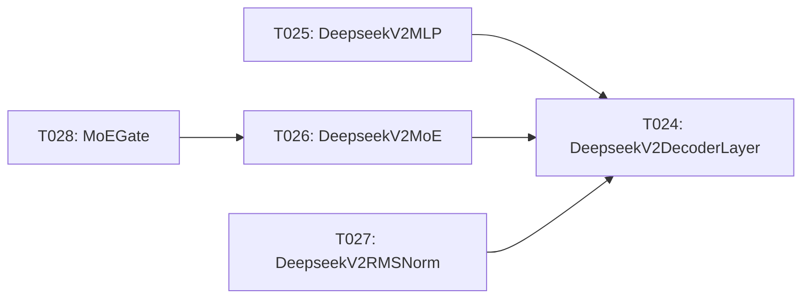

# Implementation Guide: Phase 5 – Decoder Analytic Layers (US1, Part 3)

**Phase**: 5 | **Feature**: DeepSeek-OCR Analytic Modeling in ModelMeter (`001-deepseek-ocr-modelmeter`) | **Tasks**: T024–T028

## Goal

Implement analytic `BaseLayer` subclasses for the DeepSeek-V2 decoder stack and MoE components so we can attribute FLOPs, I/O, and memory across decoder layers under the `dsocr-standard-v1` workload profile.

## Public APIs

### T024: `DeepseekV2DecoderLayer(BaseLayer)` – `decoder/deepseek_v2_decoder_layer.py`

Layer docs: `context/hints/dsocr-kb/ops/op-DeepseekV2DecoderLayer.md`

```python
# extern/modelmeter/models/deepseek_ocr/layers/decoder/deepseek_v2_decoder_layer.py

from __future__ import annotations

from extern.modelmeter.layers.base import BaseLayer


class DeepseekV2DecoderLayer(BaseLayer):
    """Analytic model for a single DeepSeek-V2 decoder layer."""

    def __init__(
        self,
        *,
        hidden_size: int,
        num_heads: int,
        seq_len: int,
        intermediate_size: int,
        num_experts: int | None = None,
    ) -> None:
        super().__init__()
        self.m_hidden_size = hidden_size
        self.m_num_heads = num_heads
        self.m_seq_len = seq_len
        self.m_intermediate_size = intermediate_size
        self.m_num_experts = num_experts

    # Implement BaseLayer metrics by composing attention + MLP + MoE (if enabled).
```

### T025: `DeepseekV2MLP(BaseLayer)` – `decoder/deepseek_v2_mlp.py`

Layer docs: `context/hints/dsocr-kb/ops/op-DeepseekV2MLP.md`

Models the decoder MLP inner block FLOPs/I/O and memory.

### T026: `DeepseekV2MoE(BaseLayer)` – `decoder/deepseek_v2_moe.py`

Layer docs: `context/hints/dsocr-kb/ops/op-DeepseekV2MoE.md`

```python
class DeepseekV2MoE(BaseLayer):
    """Analytic model for the MoE block inside DeepSeek-V2 decoder."""

    def __init__(self, *, hidden_size: int, intermediate_size: int, num_experts: int, k_active: int) -> None:
        ...
```

### T027: `DeepseekV2RMSNorm(BaseLayer)` – `decoder/deepseek_v2_rms_norm.py`

Layer docs: `context/hints/dsocr-kb/ops/op-DeepseekV2RMSNorm.md`

Captures RMSNorm FLOPs and memory for decoder layers.

### T028: `MoEGate(BaseLayer)` – `decoder/moe_gate.py`

Layer docs: `context/hints/dsocr-kb/ops/op-MoEGate.md`

Models gating overhead and any auxiliary compute for MoE.

---

## Phase Integration



Decoder analytic layers depend on LLaMA primitives (Phase 4) and feed into the core model aggregator (Phase 6).

---

## Testing

### Test Input

- Synthetic DeepSeek-V2 decoder configuration matching `deepseek-ocr-v1-base` (hidden size, number of heads, MoE settings).

### Test Procedure

```bash
cd /workspace/code/llm-perf-opt

pixi run -e rtx5090 python - << 'EOF'
from extern.modelmeter.models.deepseek_ocr.layers.decoder.deepseek_v2_decoder_layer import DeepseekV2DecoderLayer

layer = DeepseekV2DecoderLayer(
    hidden_size=4096,
    num_heads=32,
    seq_len=512,
    intermediate_size=11008,
    num_experts=64,
)
print("Decoder layer FLOPs (TC, forward):", layer.forward_tensor_core_flops())
EOF
```

### Test Output

- Decoder analytic layers instantiate successfully with realistic configs.
- FLOPs and memory metrics increase with layer width/depth and number of active experts.

---

## References

- Tasks: `specs/001-deepseek-ocr-modelmeter/tasks.md` (Phase 5, T024–T028)
- Plan: `specs/001-deepseek-ocr-modelmeter/plan.md` (decoder layer list and directory structure)

---

## Implementation Summary

*(to be filled after implementation)*

### What has been implemented

- (after implementation) Summarize decoder analytic layers and how they compose attention, MLP, and MoE.

### How to verify

- (after implementation) Document tests/experiments used to sanity-check decoder FLOPs/IO/memory estimates.
