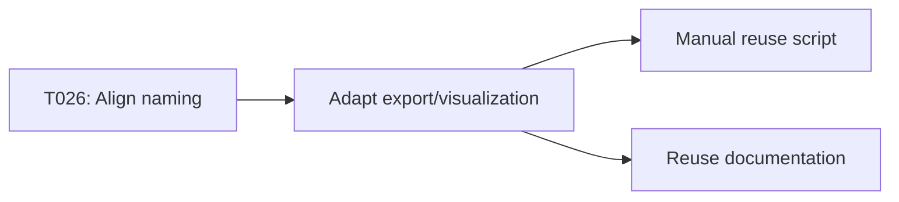

# Implementation Guide: Phase 5 – User Story 3 (P3) – Reuse DeepSeek-OCR Definitions

**Phase**: 5 | **Feature**: DeepSeek-OCR Analytic Modeling in ModelMeter (`001-deepseek-ocr-modelmeter`) | **Tasks**: T025–T028

## Goal

Align DeepSeek-OCR analytic abstractions with existing measurement concepts so that existing comparison and reporting workflows can incorporate DeepSeek-OCR without DeepSeek-specific branching.

## Public APIs

### T026: Align stage and operator naming with existing profiling concepts

Ensure `AnalyticModelReport` uses stage/operator names compatible with Stage 1 profiling.

```python
# src/llm_perf_opt/data/deepseek_ocr_analytic.py

STAGE_VISION = "vision"
STAGE_PROJECTOR = "projector"
STAGE_PREFILL = "prefill"
STAGE_DECODE = "decode"

# Use these constants consistently in AnalyticModuleNode.stage and related code.
```

### T027: Adapt existing summary/report utilities

Allow profiling exports and visualizations to accept analytic models as input.

```python
# src/llm_perf_opt/profiling/export.py

from llm_perf_opt.data.deepseek_ocr_analytic import AnalyticModelReport


def export_analytic_summary(report: AnalyticModelReport, output_path: str) -> None:
    """Render a DeepSeek-OCR analytic summary that mirrors profiling summaries."""
    ...
```

### T025/T028: Manual reuse script and docs

- `tests/manual/deepseek_ocr/manual_deepseek_ocr_reuse_workflows.py` loads both profiling and analytic summaries, confirming they share naming and shape conventions.
- `docs/deepseek_ocr_analytic_reuse.md` documents how to plug DeepSeek-OCR analytic models into existing tools.

---

## Phase Integration



---

## Testing

### Test Input

- At least one profiling run for DeepSeek-OCR (optional but helpful).
- At least one analytic report for DeepSeek-OCR from Phase 4.

### Test Procedure

```bash
cd /workspace/code/llm-perf-opt

pixi run -e rtx5090 python tests/manual/deepseek_ocr/manual_deepseek_ocr_reuse_workflows.py
```

The script should:

- Load a profiling summary (if available) using existing contracts or domain models.
- Load an `AnalyticModelReport` and derived `DeepSeekOCRAnalyticReportSummary`.
- Call shared export/visualization functions to produce comparable views.

### Test Output

- Manual script completes without DeepSeek-specific `if` branches in export code.
- Produced reports/plots show DeepSeek-OCR alongside other models.

---

## References

- Spec: `specs/001-deepseek-ocr-modelmeter/spec.md`
- Data model: `specs/001-deepseek-ocr-modelmeter/data-model.md`
- Contracts: `specs/001-deepseek-ocr-modelmeter/contracts/`

---

## Implementation Summary

*(to be filled after implementation)*

### What has been implemented

- (after implementation) Explain which existing utilities now accept analytic models.

### How to verify

- (after implementation) Describe how to run comparison workflows that include DeepSeek-OCR analytic data.

