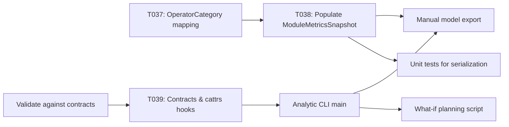

# Implementation Guide: Phase 7 – User Story 2 (P2) – Analytic Models for Planning

**Phase**: 7 | **Feature**: DeepSeek-OCR Analytic Modeling in ModelMeter (`001-deepseek-ocr-modelmeter`) | **Tasks**: T035–T042

## Goal

Expose a machine-readable analytic model of DeepSeek-OCR (module hierarchy, operator categories, call counts, and memory estimates) that capacity-planning engineers can consume directly in external tools to run what-if scenarios.

## Public APIs

### T037/T038: Operator categories and metrics aggregation

Extend the domain model and analytic pipeline to populate per-module and per-operator metrics.

```python
# src/llm_perf_opt/data/deepseek_ocr_analytic.py

from attrs import define, field
from attrs.validators import instance_of


@define(kw_only=True)
class OperatorCategory:
    category_id: str = field(validator=[instance_of(str)])
    display_name: str = field(validator=[instance_of(str)])
    description: str = field(validator=[instance_of(str)])
    match_classes: list[str] = field(factory=list)


@define(kw_only=True)
class OperatorMetrics:
    category_id: str = field(validator=[instance_of(str)])
    calls: int = field(validator=[instance_of(int)])
    flops_tflops: float = field(validator=[instance_of(float)])
    io_tb: float = field(validator=[instance_of(float)])
    share_of_module_flops: float = field(validator=[instance_of(float)])
```

In `dsocr_analyzer`, use the `TargetOperatorList` to classify operators and aggregate into `ModuleMetricsSnapshot`.

```python
# src/llm_perf_opt/runners/dsocr_analyzer.py

from llm_perf_opt.data.deepseek_ocr_analytic import ModuleMetricsSnapshot, OperatorMetrics


def _build_module_metrics(...):
    # Walk module tree and accumulate per-category metrics into ModuleMetricsSnapshot instances.
    ...
```

### T039: DeepSeek-OCR analytic contracts and cattrs hooks

Add contract models to `src/llm_perf_opt/contracts/models.py` and register conversion hooks.

```python
# src/llm_perf_opt/contracts/models.py

from attrs import define, field


@define(kw_only=True)
class DeepSeekOCRAnalyticRequest:
    model_id: str = field()
    model_variant: str = field()
    workload_profile_id: str = field()
    profile_run_id: str | None = field(default=None)
    force_rebuild: bool = field(default=False)
```

Register conversion in `src/llm_perf_opt/contracts/convert.py`:

```python
from llm_perf_opt.contracts.models import DeepSeekOCRAnalyticReportSummary
from llm_perf_opt.data.deepseek_ocr_analytic import AnalyticModelReport


def register_deepseek_ocr_hooks(converter: Converter) -> None:
    """Register AnalyticModelReport <-> DeepSeekOCRAnalyticReportSummary hooks."""
    ...
```

### T040: CLI entry for analytic modeling

Provide a dedicated entry that accepts contract-style arguments and triggers analytic model generation.

```python
# src/llm_perf_opt/runners/dsocr_analyzer_main.py

from __future__ import annotations

import argparse
from pathlib import Path

from llm_perf_opt.contracts.models import DeepSeekOCRAnalyticRequest
from llm_perf_opt.runners.dsocr_analyzer import AnalysisConfig, DeepseekOCRStaticAnalyzer
from llm_perf_opt.utils.paths import analytic_model_dir, workspace_root


def main() -> int:
    parser = argparse.ArgumentParser(
        description="DeepSeek-OCR analytic modeling (contract-oriented wrapper).",
    )
    parser.add_argument("--model-id", default="deepseek-ai/DeepSeek-OCR")
    parser.add_argument("--model-variant", default="deepseek-ocr-v1-base")
    parser.add_argument("--workload-profile-id", default="dsocr-standard-v1")
    parser.add_argument("--profile-run-id", default=None)
    parser.add_argument("--force-rebuild", action="store_true")
    parser.add_argument("--model", default=None)
    parser.add_argument("--device", default="cuda:0")
    parser.add_argument("--run-id", default=None)
    parser.add_argument("--base-size", type=int, default=1024)
    parser.add_argument("--image-size", type=int, default=640)
    parser.add_argument("--seq-len", type=int, default=512)
    parser.add_argument("--crop-mode", type=int, choices=[0, 1], default=1)
    args = parser.parse_args()

    # Build request object (shape-aligned with DeepSeekOCRAnalyticRequest).
    _req = DeepSeekOCRAnalyticRequest(
        model_id=args.model_id,
        model_variant=args.model_variant,
        workload_profile_id=args.workload_profile_id,
        profile_run_id=args.profile_run_id,
        force_rebuild=bool(args.force_rebuild),
    )

    # Resolve model path and run analytic pipeline; print report_id and artifacts_dir.
    ...


if __name__ == "__main__":
    raise SystemExit(main())
```

### T035/T036/T041/T042: Export tests and what-if script

- `T035` – Manual export script `tests/manual/deepseek_ocr/manual_deepseek_ocr_model_export.py` calls CLI and verifies `AnalyticModelReport` serialization.
- `T036` – Unit tests in `tests/unit/deepseek_ocr/test_analytic_model_report_io.py` ensure JSON/YAML load/dump correctness.
- `T041` – `scripts/analytical/dsocr_analytic_what_if.py` reads an `AnalyticModelReport` and recomputes metrics under modified parameters.
- `T042` – Validate alignment with `contracts/openapi.yaml` and `MAPPING.md`.

---

## Phase Integration



---

## Testing

### Test Input

- Completed User Story 1 (Phases 3–6), so `DeepseekOCRStaticAnalyzer` can already produce `AnalyticModelReport`.
- Artifact directory `tmp/profile-output/<run_id>/static_analysis/analytic_model/` populated by an analytic run.

### Test Procedure

```bash
cd /workspace/code/llm-perf-opt

# 1. Run export manual script
pixi run -e rtx5090 python tests/manual/deepseek_ocr/manual_deepseek_ocr_model_export.py

# 2. Run serialization unit tests
pixi run -e rtx5090 pytest tests/unit/deepseek_ocr/test_analytic_model_report_io.py

# 3. Run what-if planning example
pixi run -e rtx5090 python scripts/analytical/dsocr_analytic_what_if.py \
  --report /workspace/code/llm-perf-opt/tmp/profile-output/<run_id>/static_analysis/analytic_model/report.json
```

### Test Output

- Export script writes `AnalyticModelReport` JSON/YAML without errors.
- Unit tests pass; load/dump round-trips preserve key fields.
- What-if script prints projected metrics for alternative workload parameters, demonstrating that the artifact is consumable in external tools.

---

## References

- Tasks: `specs/001-deepseek-ocr-modelmeter/tasks.md` (Phase 7, T035–T042)
- Data model: `specs/001-deepseek-ocr-modelmeter/data-model.md`
- Contracts: `specs/001-deepseek-ocr-modelmeter/contracts/`

---

## Implementation Summary

### What has been implemented

- **Operator categories and per-module metrics (T037/T038)**  
  - Implemented `categorize_operator_class_name()`, `build_operator_categories_from_target_list()`, and
    `build_operator_category_index()` in `src/llm_perf_opt/data/deepseek_ocr_analytic.py` to derive `OperatorCategory`
    instances directly from the TorchInfo `TargetOperatorList` and assign `default_category_id` on each `OperatorSpec`.
  - Extended `DeepseekOCRStaticAnalyzer.run_analytic()` in `src/llm_perf_opt/runners/dsocr_analyzer.py` to:
    - load the canonical TorchInfo snapshot from
      `reports/20211117-dsorc-op-analysis/static-20251118-130533/` via `load_target_operator_list()`,
    - populate `report.operator_categories` from that snapshot, and
    - attach a non-empty `operator_breakdown` (single `OperatorMetrics` entry) to each `ModuleMetricsSnapshot`
      keyed by the module’s analytic layer class.

- **Analytic contracts and cattrs hooks (T039)**  
  - Added `DeepSeekOCRAnalyticRequest`, `DeepSeekOCRAnalyticAccepted`, `AnalyticModuleSummary`,
    `DeepSeekOCRAnalyticReportSummary`, and `DeepSeekOCRAnalyticModel` to
    `src/llm_perf_opt/contracts/models.py`, mirroring `python-contracts.md` and `openapi.yaml`.
  - Implemented `_build_deepseek_ocr_summary()` and `register_deepseek_ocr_hooks()` in
    `src/llm_perf_opt/contracts/convert.py`, registering a cattrs unstructure hook so
    `AnalyticModelReport` can be exposed as a `DeepSeekOCRAnalyticReportSummary` payload for the
    `/analytic/deepseek-ocr/{report_id}/summary` contract.

- **CLI wrapper for analytic modeling (T040)**  
  - Added `src/llm_perf_opt/runners/dsocr_analyzer_main.py`, a thin wrapper around `DeepseekOCRStaticAnalyzer` that:
    - accepts `--model-id`, `--model-variant`, `--workload-profile-id`, `--profile-run-id`, and `--force-rebuild`
      alongside execution flags (`--model`, `--device`, `--run-id`, `--base-size`, `--image-size`, `--seq-len`,
      `--crop-mode`), and
    - prints `report_id` and `artifacts_dir` on success, aligning with `MAPPING.md` for the
      `/analytic/deepseek-ocr/run` endpoint.

- **Export script, what‑if script, IO tests, and Markdown docs (T035/T036/T041/T042)**  
  - Implemented `tests/manual/deepseek_ocr/manual_deepseek_ocr_model_export.py`, which runs
    `python -m llm_perf_opt.runners.dsocr_analyzer --mode analytic`, checks that `report.json`/`report.yaml` exist
    under `tmp/profile-output/<run_id>/static_analysis/analytic_model/`, and verifies that the JSON payload includes
    key `AnalyticModelReport` fields.
  - Added `tests/unit/deepseek_ocr/test_analytic_model_report_io.py` with JSON/YAML round‑trip tests that ensure
    `AnalyticModelReport` can be serialized via `attrs.asdict` and that the resulting payload preserves the expected
    top-level keys and counts (`report_id`, `model`, `workload`, `modules`, `module_metrics`, `layer_docs_dir`).
  - Created `scripts/analytical/dsocr_analytic_what_if.py`, which reads an `AnalyticModelReport` JSON as a plain
    dictionary, allows callers to override peak TFLOPs and apply a batch‑size scaling factor, and prints per‑module
    and aggregate projected runtimes—demonstrating that the exported analytic model is consumable by downstream
    planning tools without requiring Python type reconstruction.
  - Extended `write_analytic_layer_docs(report)` in `src/llm_perf_opt/visualize/analytic_layers.py` to generate
    Markdown via `mdutils`, including:
    - `summary.md` with workload/input shapes, per‑module metrics, per‑module constructor parameters, and a new
      “Analytic primitives” section that surfaces representative per‑layer shapes for key analytic primitives
      (e.g., vision `Attention`, `MLPBlock`, decoder `LlamaFlashAttention2`, and `DeepseekV2MoE`), and
    - per‑module `.md` pages that document stage, class, constructor parameters, and analytic metrics.
  - Updated `specs/001-deepseek-ocr-modelmeter/tasks.md` to mark T035–T042 as completed, reflecting the implemented
    behavior and its alignment with `contracts/openapi.yaml` and `contracts/MAPPING.md`.

### How to verify

- **End‑to‑end export and IO**  
  1. From the repo root, with DeepSeek‑OCR weights available under `models/deepseek-ocr`, run:
     - `pixi run -e rtx5090 python tests/manual/deepseek_ocr/manual_deepseek_ocr_model_export.py`  
       This should:
       - invoke the analytic CLI,
       - write `report.json` and `report.yaml` under
         `tmp/profile-output/<run_id>/static_analysis/analytic_model/`, and
       - confirm that the JSON payload contains `report_id`, `model`, `workload`, `modules`, and `module_metrics`.
     - `pixi run -e rtx5090 pytest tests/unit/deepseek_ocr/test_analytic_model_report_io.py`  
       Both tests should pass, confirming that JSON/YAML round‑trips preserve key `AnalyticModelReport` fields.

- **Planning‑oriented what‑if analysis**  
  2. Using a previously generated `report.json` (for example from the manual script or
     `python -m llm_perf_opt.runners.dsocr_analyzer --mode analytic`), run:
     - `pixi run -e rtx5090 python scripts/analytical/dsocr_analytic_what_if.py --report /workspace/code/llm-perf-opt/tmp/profile-output/<run_id>/static_analysis/analytic_model/report.json --peak-tflops 300.0 --batch-scale 2.0`  
       The script should print a table of modules with projected `time_ms` and `flops_TF` plus aggregated totals,
       demonstrating that the exported analytic model is machine‑readable and suitable for external capacity‑planning
       workflows.

- **Contract alignment spot‑check**  
  3. Optionally, inspect `report.json` and confirm:
     - `operator_categories` and `module_metrics[*].operator_breakdown` are present and use the field names from
       `contracts/openapi.yaml`, and
     - unstructuring an `AnalyticModelReport` via `llm_perf_opt.contracts.convert.converter.unstructure(report)`
       produces a payload compatible with `DeepSeekOCRAnalyticReportSummary` (top‑modules summary), aligning the
       implementation with `python-contracts.md` and `MAPPING.md`.
