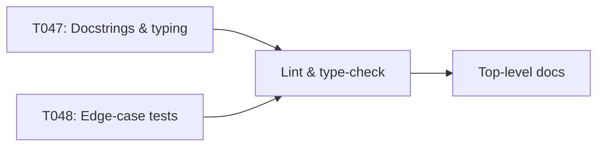

# Implementation Guide: Phase 9 – Polish & Cross-Cutting Concerns

**Phase**: 9 | **Feature**: DeepSeek-OCR Analytic Modeling in ModelMeter (`001-deepseek-ocr-modelmeter`) | **Tasks**: T047–T050

## Goal

Raise overall quality by adding rich docstrings and type hints, extending test coverage to edge cases, ensuring lint/type cleanliness, and updating top-level docs to surface the new analytic modeling capabilities.

## Public APIs

### T047: Docstrings and type hints

Ensure all new public classes and functions introduced in previous phases provide NumPy-style docstrings and type hints.

```python
class DeepseekOCRModel(BaseLayer):
    """Aggregate analytic model for DeepSeek-OCR.

    Parameters
    ----------
    vision : BaseLayer
        Analytic layer modeling the vision backbone.
    decoder_blocks : list[BaseLayer]
        Analytic layers modeling each decoder block.
    head : BaseLayer, optional
        Optional output head analytic model.
    """
```

### T048: Edge-case unit tests

Extend tests to cover extreme workloads and model configurations.

```python
# tests/unit/deepseek_ocr/test_analytic_edge_cases.py

def test_decoder_flops_scale_with_seq_len_extreme():
    ...
```

### T049: Run `ruff` and `mypy`

Use Pixi to run linting and type-checking across updated modules.

```bash
cd /workspace/code/llm-perf-opt
pixi run -e rtx5090 ruff check extern/modelmeter src tests
pixi run -e rtx5090 mypy src
```

### T050: Top-level documentation updates

Update `docs/index.md` or `README.md` to link to `specs/001-deepseek-ocr-modelmeter/quickstart.md` and the generated Markdown layer docs.

---

## Phase Integration



---

## Testing

### Test Input

- All previous phases implemented.

### Test Procedure

```bash
cd /workspace/code/llm-perf-opt

pixi run -e rtx5090 pytest tests/unit/deepseek_ocr
pixi run -e rtx5090 ruff check extern/modelmeter src tests
pixi run -e rtx5090 mypy src
```

### Test Output

- All DeepSeek-OCR analytic tests passing.
- `ruff` and `mypy` exit cleanly with no errors for updated modules.
- README or docs index includes references to DeepSeek-OCR analytic modeling and Markdown layer docs.

---

## References

- Tasks: `specs/001-deepseek-ocr-modelmeter/tasks.md` (Phase 9, T047–T050)
- Spec: `specs/001-deepseek-ocr-modelmeter/spec.md`
- Data model: `specs/001-deepseek-ocr-modelmeter/data-model.md`
- Contracts: `specs/001-deepseek-ocr-modelmeter/contracts/`

---

## Implementation Summary

*(to be filled after implementation)*

### What has been implemented

- (after implementation) Summarize docstring/typing improvements, new tests, and documentation updates.

### How to verify

- (after implementation) Provide final validation checklist before merging.

