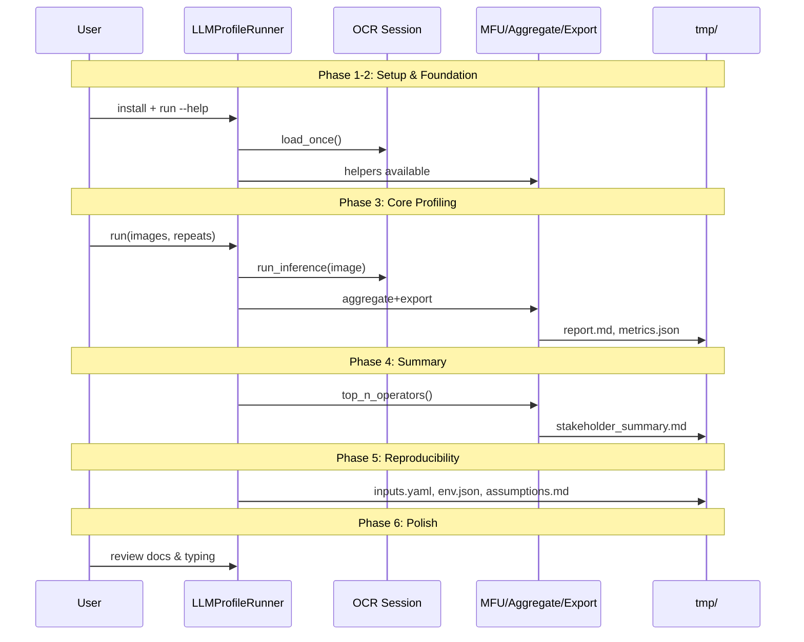
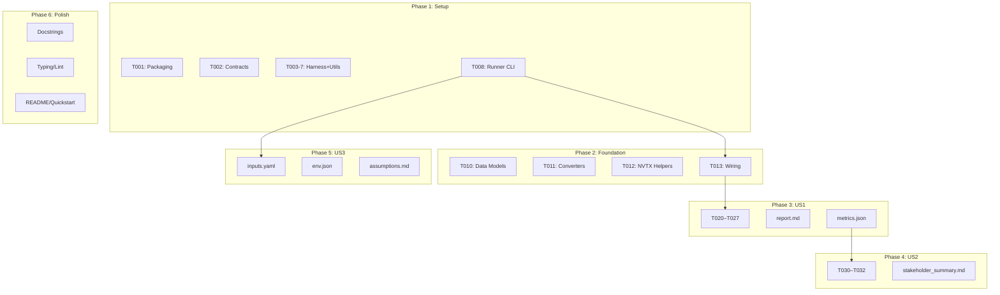
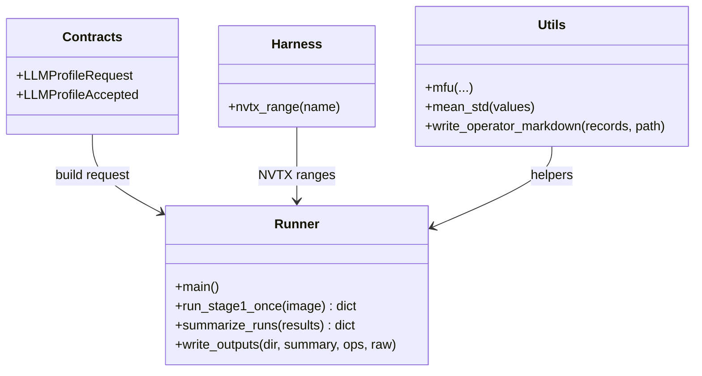
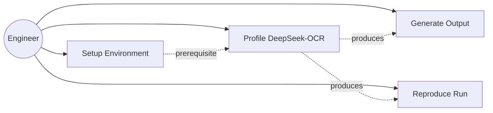

# Phase Integration Guide: Basic Profiling for DeepSeek‑OCR (Stage 1)

**Feature**: `001-profile-deepseek-ocr` | **Phases**: 6

## Overview

Phase 1 establishes the packaging, contracts, and profiling scaffolding. Phase 2 wires foundational data models and NVTX helpers into the runner. Phase 3 completes US1 by producing stage segmentation, operator summary, and MFU with aggregated metrics. Phase 4 produces a stakeholder-friendly summary. Phase 5 captures reproducibility metadata, and Phase 6 polishes APIs, typing, and docs to meet constitution gates.

## Phase Flow

## Artifact Flow Between Phases

## System Architecture

## Use Cases

