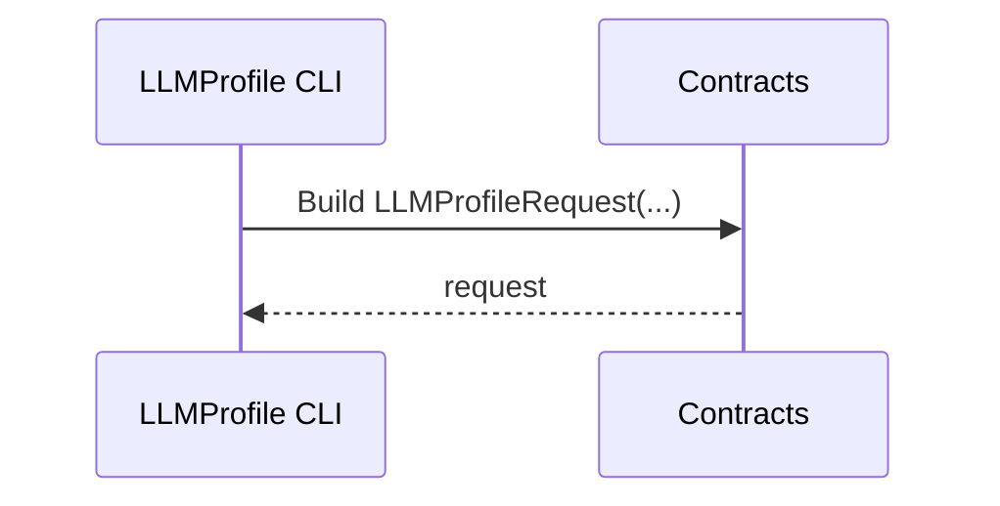
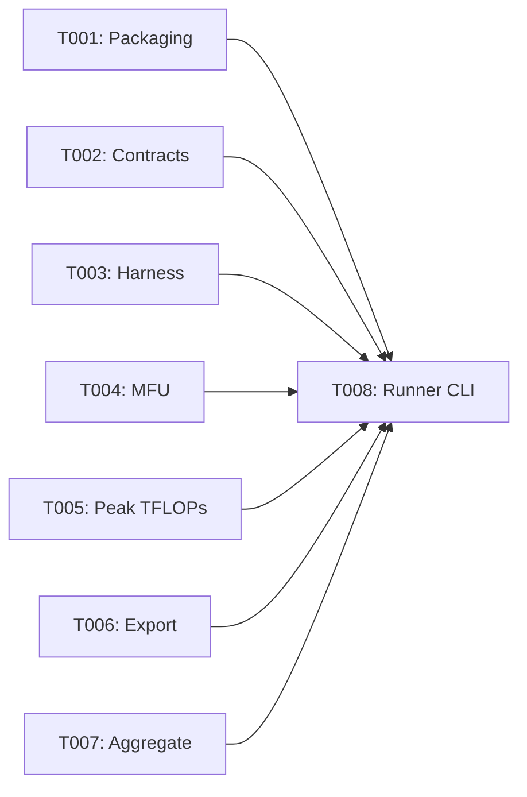

# Implementation Guide: Setup

**Phase**: 1 | **Feature**: Basic Profiling for DeepSeek‑OCR (Stage 1) | **Tasks**: T001–T009

## Summary

- Implemented packaging to export only `src/llm_perf_opt` (T001)
- Added attrs-based contracts: `LLMProfileRequest`, `LLMProfileAccepted`, `OperatorSummary`, `Stats`, `LLMProfileReportSummary` (T002)
  - File: `/data2/huangzhe/code/llm-perf-opt/src/llm_perf_opt/contracts/models.py`
- Added profiling utilities: NVTX harness, MFU estimators, HW info, operator export, aggregation (T003–T007)
  - Files: `/data2/huangzhe/code/llm-perf-opt/src/llm_perf_opt/profiling/{harness.py,mfu.py,hw.py,export.py,aggregate.py}`
- Scaffolded `LLMProfileRunner` CLI (args only; wiring in Phase 2) (T008)
  - File: `/data2/huangzhe/code/llm-perf-opt/src/llm_perf_opt/runners/llm_profile_runner.py`
- Updated quickstart examples to use `llm_perf_opt.runners.llm_profile_runner` (T009)
  - File: `/data2/huangzhe/code/llm-perf-opt/specs/001-profile-deepseek-ocr/quickstart.md`

## Files

### Created
- `/data2/huangzhe/code/llm-perf-opt/src/llm_perf_opt/contracts/models.py`
- `/data2/huangzhe/code/llm-perf-opt/src/llm_perf_opt/profiling/harness.py`
- `/data2/huangzhe/code/llm-perf-opt/src/llm_perf_opt/profiling/mfu.py`
- `/data2/huangzhe/code/llm-perf-opt/src/llm_perf_opt/profiling/hw.py`
- `/data2/huangzhe/code/llm-perf-opt/src/llm_perf_opt/profiling/export.py`
- `/data2/huangzhe/code/llm-perf-opt/src/llm_perf_opt/profiling/aggregate.py`
- `/data2/huangzhe/code/llm-perf-opt/src/llm_perf_opt/runners/llm_profile_runner.py`

### Modified
- `/data2/huangzhe/code/llm-perf-opt/pyproject.toml` (T001 ensure single package)
- `/data2/huangzhe/code/llm-perf-opt/specs/001-profile-deepseek-ocr/quickstart.md` (T009 update examples)

## Public APIs

### T002: Contracts module (attrs)

Python models for profiling requests/responses (attrs). See OpenAPI mirror.

```python
# /data2/huangzhe/code/llm-perf-opt/src/llm_perf_opt/contracts/models.py
from __future__ import annotations
from typing import Dict, Literal
from attrs import define, field
from attrs.validators import instance_of
import os

def _abs_path(_: object, attr, value: str) -> None:
    if not os.path.isabs(value):
        raise ValueError(f"{attr.name} must be absolute")

@define(kw_only=True)
class LLMProfileRequest:
    """Inputs for a profiling run.

    Examples
    --------
    >>> LLMProfileRequest(model_path="/abs/models/dsocr", input_dir="/abs/data/samples")
    """
    model_path: str = field(validator=[instance_of(str), _abs_path])
    input_dir: str = field(validator=[instance_of(str), _abs_path])
    repeats: int = field(default=3)
    use_flash_attn: bool = field(default=True)
    device: str = field(default="cuda:0")
    max_new_tokens: int = field(default=64)

@define(kw_only=True)
class LLMProfileAccepted:
    run_id: str = field(validator=[instance_of(str)])
    status: Literal["queued", "running"] = field(validator=[instance_of(str)])
    artifacts_dir: str = field(validator=[instance_of(str), _abs_path])
```

**Usage Flow**:



### T003: Profiling harness skeleton

Context managers for NVTX ranges and PyTorch profiler wiring.

```python
# /data2/huangzhe/code/llm-perf-opt/src/llm_perf_opt/profiling/harness.py
from __future__ import annotations
from contextlib import contextmanager
import nvtx

@contextmanager
def nvtx_range(name: str):
    """Push/pop an NVTX range.

    Example
    -------
    >>> with nvtx_range("prefill"):
    ...     pass
    """
    nvtx.push_range(name)
    try:
        yield
    finally:
        nvtx.pop_range()
```

### T004: MFU estimation utilities

Decode/prefill FLOPs and MFU from throughput and peak TFLOPs.

```python
# /data2/huangzhe/code/llm-perf-opt/src/llm_perf_opt/profiling/mfu.py
from __future__ import annotations

def estimate_decode_flops_per_token(d_model: int, d_ff: int, n_layers: int, ctx_len: int) -> float:
    """Return approximate FLOPs/token for decode."""
    return float(n_layers) * (4*d_model*d_ff + 2*d_model*d_model + 2*d_model*ctx_len)

def mfu(tokens_per_s: float, flops_per_token: float, peak_tflops: float) -> float:
    return (tokens_per_s * flops_per_token) / (peak_tflops * 1e12)
```

### T005: Hardware peak TFLOPs lookup

```python
# /data2/huangzhe/code/llm-perf-opt/src/llm_perf_opt/profiling/hw.py
from __future__ import annotations
import torch

def get_device_name(index: int = 0) -> str:
    return torch.cuda.get_device_name(index) if torch.cuda.is_available() else "cpu"

def get_peak_tflops(device_name: str, precision: str = "bf16") -> float:
    table = {"NVIDIA H100": 990.0, "NVIDIA A100": 312.0, "NVIDIA GeForce RTX 4090": 330.0}
    for k, v in table.items():
        if k in device_name:
            return v
    return float(int(os.environ.get("MFU_PEAK_TFLOPS", "100")))
```

### T006: Operator summary export

```python
# /data2/huangzhe/code/llm-perf-opt/src/llm_perf_opt/profiling/export.py
from __future__ import annotations
from typing import Iterable

def write_operator_markdown(records: Iterable[dict], path: str, top_k: int = 20) -> None:
    """Write a top‑K operator summary in Markdown."""
    ...
```

### T007: Aggregation helpers

```python
# /data2/huangzhe/code/llm-perf-opt/src/llm_perf_opt/profiling/aggregate.py
from __future__ import annotations
from statistics import mean, pstdev

def mean_std(values: list[float]) -> tuple[float, float]:
    return mean(values), (pstdev(values) if len(values) > 1 else 0.0)
```

### T008: LLMProfileRunner CLI skeleton

```python
# /data2/huangzhe/code/llm-perf-opt/src/llm_perf_opt/runners/llm_profile_runner.py
from __future__ import annotations
import argparse

def main() -> None:
    parser = argparse.ArgumentParser()
    parser.add_argument("--model-path", required=True)
    parser.add_argument("--input-dir", required=True)
    parser.add_argument("--repeats", type=int, default=3)
    parser.add_argument("--device", default="cuda:0")
    args = parser.parse_args()
    # TODO: wire to harness in Phase 2

if __name__ == "__main__":  # pragma: no cover
    main()
```

**Pseudocode**:

```python
def run_llm_profile(req):
    # 1. Load model/tokenizer
    # 2. Prefill: NVTX range, measure time
    # 3. Decode loop: NVTX range, measure time and tokens
    # 4. Profile ops, export summaries
    # 5. Compute MFU (model-level + per-stage)
    # 6. Aggregate over repeats; write report & metrics
```

## Phase Integration



## Testing

```bash
pixi run python -m llm_perf_opt.runners.llm_profile_runner --help
```

## References
- Spec: `/data2/huangzhe/code/llm-perf-opt/specs/001-profile-deepseek-ocr/spec.md`
- Plan: `/data2/huangzhe/code/llm-perf-opt/specs/001-profile-deepseek-ocr/plan.md`
- Contracts: `/data2/huangzhe/code/llm-perf-opt/specs/001-profile-deepseek-ocr/contracts/`
