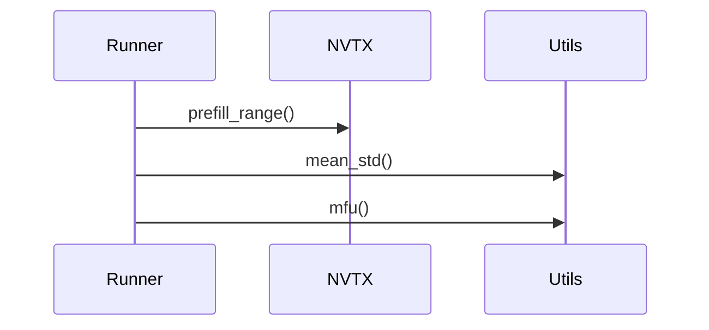
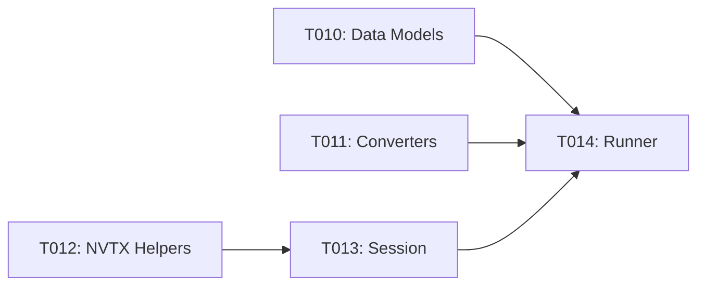

# Implementation Guide: Foundational

**Phase**: 2 | **Feature**: Basic Profiling for DeepSeek‑OCR (Stage 1) | **Tasks**: T010–T014

## Summary

- Implemented domain data models (attrs) in `/data2/huangzhe/code/llm-perf-opt/src/llm_perf_opt/data/models.py` (T010)
- Added `cattrs` converter scaffold in `/data2/huangzhe/code/llm-perf-opt/src/llm_perf_opt/contracts/convert.py` (T011)
- Added NVTX helpers `prefill_range` and `decode_range` in `/data2/huangzhe/code/llm-perf-opt/src/llm_perf_opt/profiling/nvtx_utils.py` (T012)
- Implemented `DeepSeekOCRSession` (load-once wrapper; NVTX in `run_inference`) in `/data2/huangzhe/code/llm-perf-opt/src/llm_perf_opt/runners/dsocr_session.py` (T013)
- Wired session into `LLMProfileRunner` CLI to validate construction in `/data2/huangzhe/code/llm-perf-opt/src/llm_perf_opt/runners/llm_profile_runner.py` (T014)


## Files

### Created
- `/data2/huangzhe/code/llm-perf-opt/src/llm_perf_opt/data/models.py`
- `/data2/huangzhe/code/llm-perf-opt/src/llm_perf_opt/contracts/convert.py`
- `/data2/huangzhe/code/llm-perf-opt/src/llm_perf_opt/profiling/nvtx_utils.py`
- `/data2/huangzhe/code/llm-perf-opt/src/llm_perf_opt/runners/dsocr_session.py`

### Modified
- `/data2/huangzhe/code/llm-perf-opt/src/llm_perf_opt/runners/llm_profile_runner.py` (wire harness + helpers)

## Public APIs

### T010: Domain data models (attrs)

```python
# /data2/huangzhe/code/llm-perf-opt/src/llm_perf_opt/data/models.py
from __future__ import annotations
from attrs import define, field
from typing import Literal

@define(kw_only=True)
class StageTiming:
    stage: Literal["prefill", "decode"] = field()
    elapsed_ms: float = field()
    tokens: int = field(default=0)
    throughput_toks_per_s: float = field(default=0.0)
```

### T011: cattrs converters

```python
# /data2/huangzhe/code/llm-perf-opt/src/llm_perf_opt/contracts/convert.py
from __future__ import annotations
from cattrs import Converter

converter = Converter()
# register hooks here if needed
```

### T012: NVTX helpers

```python
# /data2/huangzhe/code/llm-perf-opt/src/llm_perf_opt/profiling/nvtx_utils.py
from __future__ import annotations
from contextlib import contextmanager
import nvtx

@contextmanager
def prefill_range():
    nvtx.push_range("prefill")
    try:
        yield
    finally:
        nvtx.pop_range()

@contextmanager
def decode_range():
    nvtx.push_range("decode")
    try:
        yield
    finally:
        nvtx.pop_range()
```

### T013: DeepSeekOCRSession (load-once wrapper)

Wrapper that loads and holds the tokenizer/model once, exposes `run_inference(image_path: str)` with NVTX segmentation. Prefer composition over inheritance (do not modify third-party code).

```python
# /data2/huangzhe/code/llm-perf-opt/src/llm_perf_opt/runners/dsocr_session.py
from __future__ import annotations
from typing import Any
from attrs import define, field
from pathlib import Path
import torch
from transformers import AutoModel, AutoTokenizer  # type: ignore[import-untyped]
from llm_perf_opt.profiling.nvtx_utils import prefill_range, decode_range

@define(kw_only=True)
class DeepSeekOCRSession:
    m_model: Any = field()
    m_tokenizer: Any = field()
    m_device: torch.device = field()
    m_dtype: torch.dtype = field(default=torch.bfloat16)

    @classmethod
    def from_local(
        cls, model_path: str, device: str = "cuda:0", use_flash_attn: bool = True
    ) -> "DeepSeekOCRSession":
        tok = AutoTokenizer.from_pretrained(model_path, trust_remote_code=True, local_files_only=True)
        attn_impl = "flash_attention_2" if use_flash_attn else "eager"
        try:
            mdl = AutoModel.from_pretrained(
                model_path, _attn_implementation=attn_impl, trust_remote_code=True,
                use_safetensors=True, local_files_only=True,
            )
        except Exception:
            mdl = AutoModel.from_pretrained(
                model_path, _attn_implementation="eager", trust_remote_code=True,
                use_safetensors=True, local_files_only=True,
            )
        dev = torch.device(device) if device else (torch.device("cuda") if torch.cuda.is_available() else torch.device("cpu"))
        mdl = mdl.eval().to(dev)
        try:
            mdl = mdl.to(dtype=torch.bfloat16)
        except Exception:
            pass
        return cls(m_model=mdl, m_tokenizer=tok, m_device=dev)

    @torch.inference_mode()
    def run_inference(self, image_path: str, prompt: str, max_new_tokens: int = 64) -> dict:
        """Run NVTX‑segmented inference on a single image.

        Strategy:
        - Insert NVTX ranges around prefill and decode without altering third‑party code.
        - Prefer manual prefill+decode loop (e.g., greedy `generate`) for segmentation visibility.
        - Fallbacks may be coarser when APIs limit stepwise control.
        """
        img = str(Path(image_path).resolve())
        # Prefill: prepare inputs and execute first forward pass
        with prefill_range():
            inputs = self.m_tokenizer(prompt, return_tensors="pt").to(self.m_device)
            _ = self.m_model(**inputs)

        # Decode: greedy generation for segmentation
        tokens = 0
        with decode_range():
            out = self.m_model.generate(**inputs, max_new_tokens=max_new_tokens)
            tokens = int(out.shape[-1] - inputs["input_ids"].shape[-1])
        return {"tokens": tokens}
```

### T014: Wire session + harness into runner

```python
# /data2/huangzhe/code/llm-perf-opt/src/llm_perf_opt/runners/llm_profile_runner.py
from llm_perf_opt.runners.dsocr_session import DeepSeekOCRSession
from llm_perf_opt.profiling.aggregate import mean_std
from llm_perf_opt.profiling.mfu import mfu

def run_once(session: DeepSeekOCRSession, image_path: str) -> dict:
    return session.run_inference(image_path=image_path, prompt="<image>\n<|grounding|>Convert the document to markdown.")
```

**Usage Flow**:



## Phase Integration



## Testing

```bash
pixi run python - <<'PY'
from llm_perf_opt.profiling.nvtx_utils import prefill_range, decode_range
with prefill_range():
    pass
with decode_range():
    pass
print('ok')
PY
```

## References
- Data model: `/data2/huangzhe/code/llm-perf-opt/specs/001-profile-deepseek-ocr/data-model.md`
- Plan: `/data2/huangzhe/code/llm-perf-opt/specs/001-profile-deepseek-ocr/plan.md`
