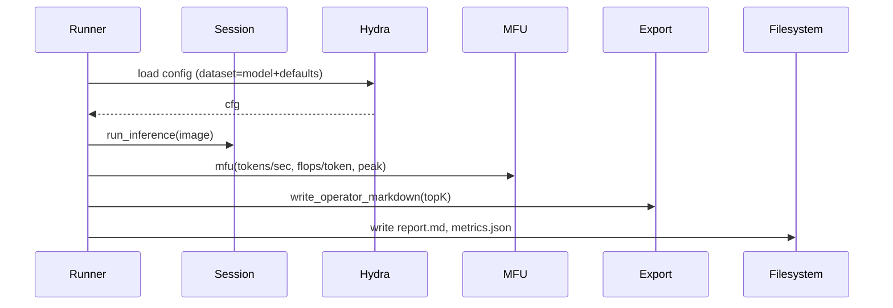
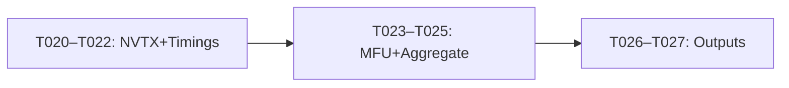

# Implementation Guide: User Story 1 — Stage 1 Profiling Report

**Phase**: 3 | **Feature**: Basic Profiling for DeepSeek‑OCR (Stage 1) | **Tasks**: T020–T027

## Files

### Modified
- `/data2/huangzhe/code/llm-perf-opt/src/llm_perf_opt/runners/llm_profile_runner.py` (implement NVTX, profiler, timings, MFU, outputs; switch to Hydra entry)
- `/data2/huangzhe/code/llm-perf-opt/src/llm_perf_opt/profiling/{mfu.py,export.py,aggregate.py}` (used by runner)

### Created (Hydra configuration)
- `/data2/huangzhe/code/llm-perf-opt/conf/config.yaml` (top‑level defaults)
- `/data2/huangzhe/code/llm-perf-opt/conf/dataset/omnidocbench.yaml` (dataset config)
- `/data2/huangzhe/code/llm-perf-opt/conf/model/deepseek_ocr.yaml` (model config)

### Created (runtime artifacts)
- `/data2/huangzhe/code/llm-perf-opt/tmp/stage1/<run_id>/report.md`
- `/data2/huangzhe/code/llm-perf-opt/tmp/stage1/<run_id>/metrics.json`

## Public APIs

### T020/T021/T022: Runner execution with NVTX + profiler (via DeepSeekOCRSession + Hydra)

Introduce Hydra for configuration management with a minimal schema. Define configs for the dataset and model, then compose in the runner. Use a subset file list for the dataset when provided; otherwise, fall back to a simple filename pattern. Control how many rounds (repeats) to run via config.

Hydra configs to add:

```yaml
# /data2/huangzhe/code/llm-perf-opt/conf/config.yaml
defaults:
  - dataset: omnidocbench
  - model: deepseek_ocr
  - _self_

experiment: stage1
repeats: 3               # total rounds to run (global)
device: cuda:0           # target device
use_flash_attn: true     # enable flash attention if available
max_new_tokens: 64       # fallback generate cap
```

```yaml
# /data2/huangzhe/code/llm-perf-opt/conf/dataset/omnidocbench.yaml
name: OmniDocBench
root: ${hydra:runtime.cwd}/datasets/omnidocbench/source-data
subset_filelist: null                 # relative to `root`; set to 'subsets/dev-20.txt' to use a subset
# Fallback glob patterns used only when subset_filelist is null. Each entry is a
# glob relative to `root`. Combined matches form the file list (de-dup left to caller).
fallback_patterns:
  - "images/*.png"
  - "images/*.jpg"
```

```yaml
# /data2/huangzhe/code/llm-perf-opt/conf/model/deepseek_ocr.yaml
name: deepseek_ocr
path: ${hydra:runtime.cwd}/models/deepseek-ocr
dtype: bf16
```

```python
# /data2/huangzhe/code/llm-perf-opt/src/llm_perf_opt/runners/llm_profile_runner.py
from __future__ import annotations
from pathlib import Path
from typing import Iterable

import hydra
from omegaconf import DictConfig

from llm_perf_opt.runners.dsocr_session import DeepSeekOCRSession

def _read_filelist(root: str, filelist: str) -> list[Path]:
    fp = Path(filelist)
    if not fp.is_absolute():
        fp = Path(root) / filelist
    lines = [ln.strip() for ln in fp.read_text(encoding="utf-8").splitlines() if ln.strip()]
    out: list[Path] = []
    for ln in lines:
        p = Path(ln)
        out.append(p if p.is_absolute() else (Path(root) / ln))
    return [pp.resolve() for pp in out]

def _iter_images(root: str, fallback_patterns: list[str], subset_filelist: str | None) -> Iterable[Path]:
    if subset_filelist:
        return _read_filelist(root, subset_filelist)
    rp = Path(root)
    out: list[Path] = []
    for pat in fallback_patterns:
        out.extend(sorted(rp.glob(pat)))
    return out

def run_llm_profile_once(session: DeepSeekOCRSession, image_path: str) -> dict:
    """Run a single image through prefill+decode via session; collect timings/tokens."""
    return session.run_inference(image_path=image_path, prompt="<image>\n<|grounding|>Convert the document to markdown.")

@hydra.main(version_base=None, config_path="../../../conf", config_name="config")
def main(cfg: DictConfig) -> None:
    session = DeepSeekOCRSession.from_local(
        model_path=cfg.model.path,
        device=cfg.device,
        use_flash_attn=bool(cfg.use_flash_attn),
    )
    images = list(_iter_images(cfg.dataset.root, cfg.dataset.fallback_patterns, cfg.dataset.get("subset_filelist")))
    # TODO: loop cfg.repeats over images, collect timings, aggregate, export
    assert images, "No images found in dataset root"
```

### T023/T024/T025: MFU + top‑K export + aggregation

```python
def summarize_runs(results: list[dict]) -> dict:
    # compute per-stage throughput and MFU using mfu.py
    # export operator summary via export.py
    # aggregate mean/std using aggregate.py
    return {"mfu_model": 0.0, "mfu_stage": {"prefill": 0.0, "decode": 0.0}}
```

### T026/T027: Emit report and metrics

```python
def write_outputs(artifacts_dir: str, summary: dict, operators_md: str, raw_metrics: dict) -> None:
    # write report.md and metrics.json
    ...
```

**Usage Flow**:



**Pseudocode**:

```python
def main():
    # parse args, build request
    # loop repeats over dataset
    # collect per-image timings/tokens
    # aggregate, compute MFU (model-level and per-stage)
    # write outputs
```

## Phase Integration



## Testing

```bash
cd /data2/huangzhe/code/llm-perf-opt
pixi run python -m llm_perf_opt.runners.llm_profile_runner \
  dataset=omnidocbench model=deepseek_ocr repeats=2 device=cuda:0
```

Dataset note: OmniDocBench images are under `/data2/huangzhe/code/llm-perf-opt/datasets/omnidocbench/source-data/images`.

## References
- Research: `/data2/huangzhe/code/llm-perf-opt/specs/001-profile-deepseek-ocr/research.md`
- Spec (US1): `/data2/huangzhe/code/llm-perf-opt/specs/001-profile-deepseek-ocr/spec.md`
