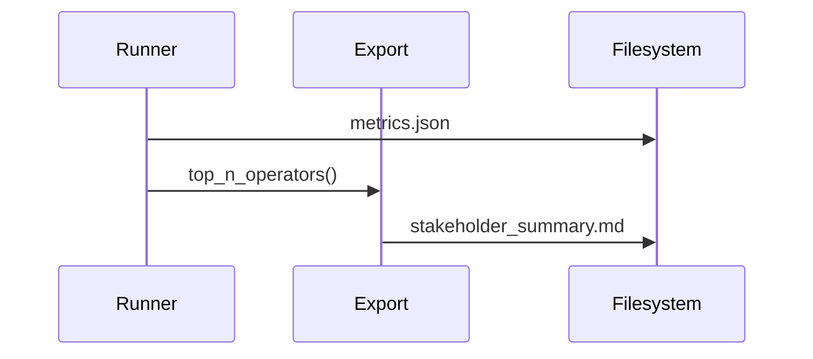

# Implementation Guide: User Story 2 — Stakeholder Summary

**Phase**: 4 | **Feature**: Basic Profiling for DeepSeek‑OCR (Stage 1) | **Tasks**: T030–T032

## Files

### Modified
- `/data2/huangzhe/code/llm-perf-opt/src/llm_perf_opt/profiling/export.py` (top‑N extraction helpers)

### Created (runtime artifacts)
- `/data2/huangzhe/code/llm-perf-opt/tmp/stage1/<run_id>/stakeholder_summary.md`

## Public APIs

### T031: Top‑N operator extraction and stage attribution

```python
# /data2/huangzhe/code/llm-perf-opt/src/llm_perf_opt/profiling/export.py
from __future__ import annotations
from typing import Iterable

def top_n_operators(records: Iterable[dict], n: int = 10) -> list[dict]:
    """Return top‑N ops by total time with optional stage hints."""
    ...

def write_stakeholder_summary(path: str, top_ops: list[dict], stage_takeaways: dict[str, str]) -> None:
    """Write a concise stakeholder summary in Markdown."""
    ...
```

### T030/T032: Generate stakeholder_summary.md

```python
def build_summary(metrics_path: str, out_md: str) -> None:
    # 1) Load metrics.json
    # 2) Derive top‑N operators and stage attribution
    # 3) Write stakeholder_summary.md with recommendations
    ...
```

**Usage Flow**:



## Phase Integration


## Testing

```bash
pixi run python - <<'PY'
from llm_perf_opt.profiling.export import write_stakeholder_summary
write_stakeholder_summary('/tmp/tmp.md', [], {"decode": "Decode dominated by attention"})
print('ok')
PY
```

## References
- Spec (US2): `/data2/huangzhe/code/llm-perf-opt/specs/001-profile-deepseek-ocr/spec.md`
